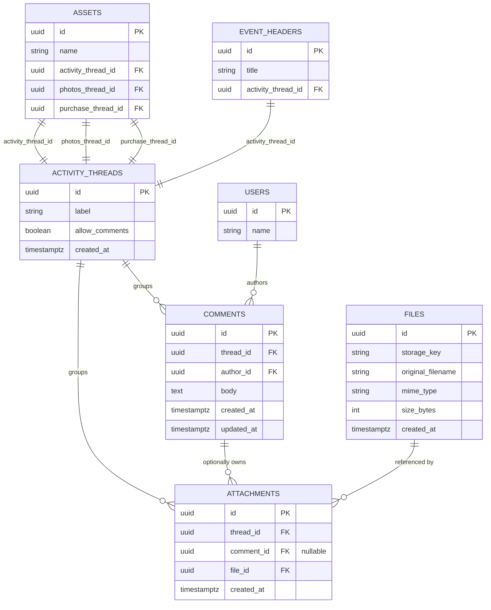

# ActivityThread Design Document
## Maintenance Configuration & Inventory Application

---

## Overview

The `ActivityThread` is a lightweight anchor entity that provides any domain object with the ability to accumulate comments and file attachments. Rather than building comment and attachment tables for each domain object individually, any table can gain this capability by holding a foreign key to an `activity_thread`. The thread itself carries almost no data — it is a grouping key and a set of behavioral flags.

---

## Core Concepts

**The thread as a capability, not a feature.** An activity thread does not belong to comments or attachments — it is the other way around. Comments and attachments belong to a thread. The thread is what you hand to a domain object so that object can accumulate evidence, notes, and files over time.

**Dual-purpose use.** The same thread concept serves two distinct UI modes. In its full form it is an activity feed — a chronological mix of comments and attachments, used on work orders, events, and maintenance records. In its constrained form it is a pure file container — a named bucket for photos or purchasing documents where comments are intentionally suppressed. The schema is identical in both cases; only the `allow_comments` flag and the UI layer differ.

**Attachments are always thread-owned, optionally comment-associated.** An attachment carries two references: a mandatory `thread_id` and an optional `comment_id`. This means attachments exist independently of comments — a technician can upload a photo without writing a note. When a comment is deleted, its attachments are not lost; they fall back to the thread level. This is the correct behavior for a maintenance audit trail where files must be preserved even if the accompanying note is removed.

**Comment suppression is a schema-level flag, not just a UI decision.** Storing `allow_comments` on the thread means the API layer can enforce the rule server-side. A photos thread on an asset cannot receive comments regardless of what client is making the request.

---

## Key Design Decisions

**Why a thread instead of polymorphic foreign keys.** The alternative pattern — giving comments and attachments a `parent_type` + `parent_id` column pair — avoids the extra table but loses referential integrity and makes joins harder to reason about. The thread pattern keeps FKs concrete and indexed, and the cost (one extra row per thread) is negligible.

**Threads are created eagerly, not lazily.** When an asset is created, its photo thread and purchase thread are created at the same time. This eliminates a class of race conditions where two processes try to create the same thread simultaneously, and simplifies queries — you always have a valid thread ID to hand to the UI even when no content exists yet.

**Multiple threads per entity are explicit columns, not a join table.** An asset has `photos_thread_id` and `purchase_thread_id` as named columns rather than a many-to-many relationship between assets and threads. This is intentional — named columns make the purpose of each thread self-documenting and make it impossible to accidentally attach the wrong thread to the wrong slot. The number of threads per entity type is expected to be small and stable.

**Fetch-and-assemble in the application layer, not in SQL.** Comments and attachments are fetched in two separate indexed queries and joined in memory. With a maximum of around 20 comments per thread this is computationally trivial and results in simpler, more maintainable queries. A single complex JOIN with nested aggregation would be harder to read and offers no meaningful performance advantage at this data volume.

**Cross-thread integrity is enforced in the application layer.** The database cannot easily enforce in a CHECK constraint that an attachment's `comment_id` belongs to a comment on the same thread. Rather than using a trigger, this invariant is validated in the service layer before any insert. At the expected scale this is the right tradeoff — triggers are harder to discover, test, and reason about during onboarding.

**`ON DELETE SET NULL` on attachment → comment.** If a comment is deleted its attachments are demoted to thread-level rather than cascade-deleted. This preserves the file record and its audit trail while cleanly severing the association.

---

## Entity Relationships

---

## Thread Behavioral Modes

| Mode | `allow_comments` | Typical consumer | UI behavior |
|---|---|---|---|
| Activity feed | true | Event headers, work orders | Comments + attachments intermixed chronologically |
| File container | false | Asset photos, purchasing docs | Grid or list of files only, no comment input |

---

## Fetch and Assembly Pattern

When loading a thread the application makes two queries — one for comments, one for attachments — both indexed on `thread_id`. Attachments are then partitioned in memory: those with a `comment_id` are nested under their comment, and those without become standalone thread-level attachments displayed above or below the comment list depending on the UI context.

The two query results are assembled into a single response structure before returning to the client. No complex JOIN or subquery is needed. This pattern works cleanly for any thread with up to several hundred comments and should require no revision for the foreseeable scale of a maintenance application.

---

## Invariants to Enforce in the Service Layer

- Comments may not be written to a thread where `allow_comments = false`
- An attachment's `comment_id`, when set, must reference a comment whose `thread_id` matches the attachment's own `thread_id`
- Thread creation is the responsibility of the entity creation service — threads are never created on demand at attachment or comment time
- A domain entity must not share a thread with another entity — threads are never reused across rows