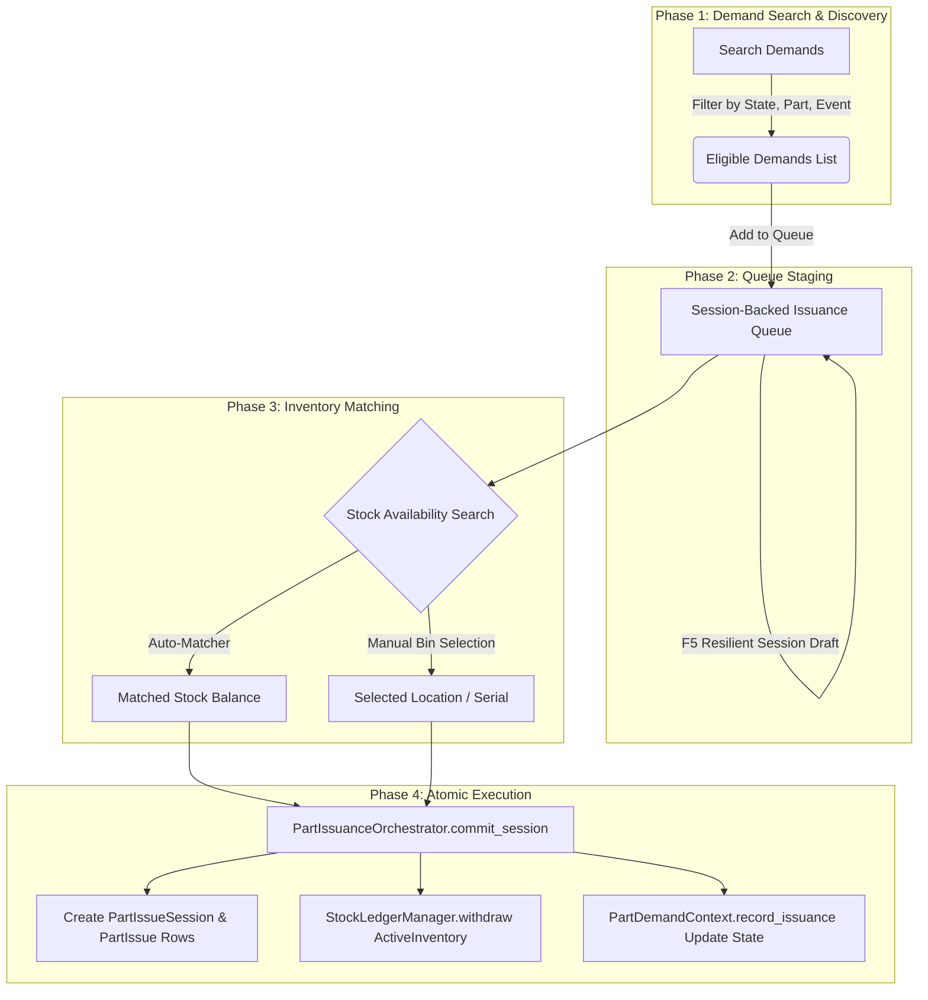

# Part Demands Queueing & Inventory Issuance Workflow Proposal

## 1. Executive Summary & Purpose

This document outlines the operational and technical design for the **Part Demands Queueing & Inventory Issuance Workflow** in EBAMS-2. 

The primary objective is to streamline the fulfillment process connecting **procurement/maintenance part demands** with **physical warehouse stock**. The workflow enables inventory managers to:
1. Search and filter part demands requiring inventory fulfillment.
2. Stage selected demands into an active, session-backed **Issuance Queue**.
3. Search and match physical `ActiveInventory` across authorized warehouses and storerooms.
4. Execute single-click or batch commitment that updates inventory stock ledgers, records `PartIssue` provenance, and updates demand states in a single atomic transaction.

---

## 2. Target Demand Scope & Categories

The workflow targets two distinct categories of part demands:

### Category A: Demands Not in Issued State
- **States Included**: `DemandState.REQUIRED`, `DemandState.APPROVED`, and `IssuanceState.UNISSUED`, `IssuanceState.PARTIALLY_ISSUED`, `IssuanceState.ISSUED_PENDING_RECONCILIATION`.
- **Description**: Standard part demands generated by maintenance work events or procurement requests that require physical material from stock to satisfy field requirements.

### Category B: Demands Issued Without Inventory Movement
- **States Included**: `IssuanceState.ISSUED_WITHOUT_STOCK_ADJUSTMENT`.
- **Description**: Demands where material was handed out or consumed in urgent field operations before stock could be formally decremented in the inventory system.
- **Goal**: Reconcile these items post-facto by assigning physical stock location provenance (`from_room`, `from_storage_location`, `unit_cost_at_issue`), deducting `ActiveInventory`, creating `PartIssue` rows, and transitioning the demand's `IssuanceState` to `ISSUED`.

---

## 3. Workflow Architecture & Phased Execution



---

## 4. Detailed Phase Specifications

### Phase 1: Demand Search & Discovery

- **Route / Interface**: `/inventory/issues/demands-queue/` (or integrated tab in Issuance Portal).
- **Search & Filtering Parameters**:
  - **Part Criteria**: Part Number, Common Name, Category.
  - **Demand Category**: 
    - `unissued` (Required/Approved demands with zero or partial issue).
    - `pending_reconciliation` (`ISSUED_WITHOUT_STOCK_ADJUSTMENT`).
    - `all_eligible` (Default).
  - **Origin / Context**: Maintenance Event #, Work Order #, Target Asset ID, Requesting User.
  - **Priority**: `CRITICAL`, `HIGH`, `ROUTINE`.
  - **Domain Scoping**: Filtered via `accessible_domain_ids(request)` to enforce multi-tenant authorization boundaries.

### Phase 2: Session-Backed Queue Staging

- **Draft Storage**: Saved in `request.session["issuance_queue_<user_id>"]` to comply with the F5 rule (no client-only state).
- **Queue Line Data Structure**:
  ```python
  {
      "demand_id": 1042,
      "part_id": 85,
      "part_number": "PN-5582",
      "quantity_demanded": "2.000",
      "quantity_to_issue": "2.000",
      "issuance_category": "UNISSUED", # or "ISSUED_WITHOUT_STOCK_ADJUSTMENT"
      "issued_to_id": 12,
      "issued_to_asset_id": 4,
      "active_inventory_id": 501, # Matched stock balance ID (if paired)
      "notes": "Staged for Work Event #88",
  }
  ```
- **Queue Operations**:
  - `add_demand`: Appends demand to session queue.
  - `remove_line`: Removes line by index.
  - `update_quantity`: Adjusts issue quantity for partial disbursements.
  - `clear_queue`: Empties staged session draft.

### Phase 3: Inventory Search & Bin-Level Matching

- **Stock Search Engine**:
  - Queries `ActiveInventory` for parts matching `part_id` where `quantity_on_hand > 0` within `domain_visible_room_ids(domain_ids)`.
  - Displays warehouse, room, bin coordinate (`display_code`), serialized unit availability, and unit cost.
- **Matching Modes**:
  1. **Automated Auto-Matcher**:
     - Iterates queued lines without a selected stock ID.
     - Performs FIFO or highest-balance pairing against available `ActiveInventory` in accessible rooms.
  2. **Manual Bin Picker**:
     - Allows inventory managers to select specific storerooms, SVG layout bins, or serialized units.

### Phase 4: Atomic Execution & Stock Movement

- **Seam Entry Point**: `PartIssuanceOrchestrator.commit_session()`
- **Execution Steps inside `transaction.atomic()`**:
  1. Generate unique session number (`ISS-YYYYMMDD-XXXXXX`) and insert `PartIssueSession`.
  2. Iterate through queued lines:
     - Execute `StockLedgerManager.withdraw()` against selected `ActiveInventory` balance row (updates quantity, logs movement audit).
     - Snapshot `unit_cost_at_issue` and `serial_number`.
     - Insert `PartIssue` record linked to `PartIssueSession`, `from_room`, `from_storage_location`, and target `issued_to` / `issued_to_asset`.
     - Call `PartDemandContext(demand_id).record_issuance()`.
  3. **Demand State Transitions**:
     - For `UNISSUED` / `REQUIRED` demands: Updates `issued_qty` and transitions `IssuanceState` to `ISSUED` or `PARTIALLY_ISSUED`.
     - For `ISSUED_WITHOUT_STOCK_ADJUSTMENT` demands: Maintains/verifies `issued_qty` while transitioning `IssuanceState` to `ISSUED` (resolving the pending stock adjustment).

---

## 5. UI Layout & HTMX Component Specification

### Page Layout (`/inventory/issues/demands-queue/`)

```
+-----------------------------------------------------------------------------------+
| PAGE HERO: Part Demand Fulfillment Queue & Stock Issuance Portal                 |
+-----------------------------------------------------------------------------------+
| CARD 1: Demand Finder & Filter Controls                                          |
| [ Search Part / WO ] [ Demand Category Dropdown v ] [ Priority v ] [ Filter ]     |
| +-------------------------------------------------------------------------------+ |
| | Results: Demand #1042 | PN-5582 | Qty: 2.000 | Maintenance Event #88 | [Stage] | |
| | Results: Demand #1045 | PN-9910 | Qty: 1.000 | Unadjusted Issue     | [Stage] | |
| +-------------------------------------------------------------------------------+ |
+-----------------------------------------------------------------------------------+
| CARD 2: Active Issuance Queue (Session Draft: 2 lines)                           |
| [ Auto-Match Stock ] [ Clear Queue ]                                              |
| +-------------------------------------------------------------------------------+ |
| | Item 1: Demand #1042 | PN-5582 | Issue Qty: [ 2.000 ] | Stock: WH1-Bin A4 | [x] | |
| | Item 2: Demand #1045 | PN-9910 | Issue Qty: [ 1.000 ] | Stock: WH2-Bin B1 | [x] | |
| +-------------------------------------------------------------------------------+ |
| [ Recipient User v ] [ Target Asset v ] [ Notes Input                           ] |
| BUTTON: [ Commit Issuance Session & Withdraw Inventory (2 Items) ]                |
+-----------------------------------------------------------------------------------+
```

### HTMX Interactions & Fragment Swaps
- **Demand Search**: `hx-get="?format=htmx-demand-results"` updates `#demand-results-table`.
- **Queue Line Add/Remove**: `hx-post="?format=htmx-queue-card"` re-renders `#issuance-queue-card` with updated count and totals.
- **Stock Selection Modal/Drawer**: `hx-get="?format=htmx-stock-picker&demand_id=X"` opens in-page bin drawer for selecting stock provenance.

---

## 6. Business Rules & Guardrails

1. **Permission Gate**: Requires `can_issue(request)` permission check at presentation layer entrypoints.
2. **Domain Isolation**: Both demand query and active inventory query MUST enforce domain filtering via `accessible_domain_ids()`.
3. **Serialized Stock Rule**: Serialized inventory lines must be issued 1-to-1 with exact serial number selection.
4. **Zero-Quantity Prevention**: Non-zero check constraint (`quantity != 0`) enforced by model level and orchestrator.
5. **No Direct Table Writes**: Writes to `PartIssue` or `ActiveInventory` must strictly route through `PartIssuanceOrchestrator` to prevent data drift between procurement and inventory ledgers.

---

## 7. Next Steps for Implementation

1. **View Entrypoint**: Extend `app/inventory/presentation_layer/entrypoints/issues.py` to support `issuance_demand_queue_portal`.
2. **Search Adapters**: Add `unadjusted_stock_issues` filter helper in `app/inventory/presentation_layer/search/issue_search.py` and `app/procurement/`.
3. **Template Components**: Create `app/inventory/templates/inventory/issues/demands_queue.html` and HTMX partial fragments.
4. **Test Coverage**: Add comprehensive unit and integration tests under `app/inventory/tests/`.
