# Maintenance events: data model and the work portal

Reference for the maintenance event and everything that hangs off it — the
event header, its action steps, the parts and tools those steps consume, and
the two interruption records (blockers and capability limitations). The second
half walks the work portal (`/maintenance/event/<pk>/work`), which is where
almost all of this is read and written.

Companion docs: [docs/core_domain.md](docs/core_domain.md) for the entity graph
at large, [docs/events.md](docs/events.md) for the event/thread substrate,
[harness/Architecture/layer_rules.md](harness/Architecture/layer_rules.md) for
why writes go where they go.

---

## 1. The shape of it

A maintenance event is one row in three tables at once, an ordered list of
steps, and two independent side-records for when things go wrong.

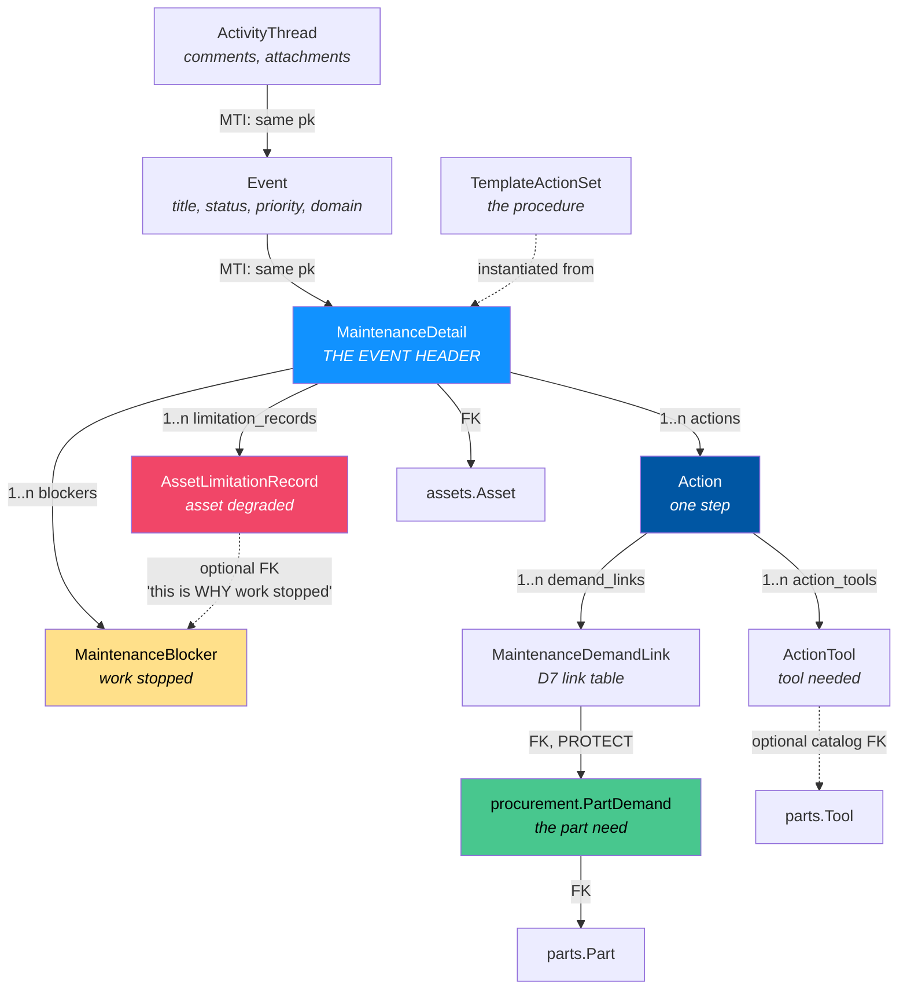

### The three-table header

`MaintenanceDetail` is **multi-table inheritance** over `Event` over
`ActivityThread`, all sharing one primary key. There is no separate "event id"
and "maintenance id" — `MaintenanceDetail.pk == Event.pk == ActivityThread.pk`.

This matters constantly in practice:

- Comments and attachments are *thread* rows, so `MaintenanceContext.add_comment()`
  is a thin pass-through to `EventContext` rather than a parallel comment system.
- `status`, `priority`, `title`, `description`, `event_start`/`event_end`, and
  `domain` all live on `Event`, not on `MaintenanceDetail`.
- Row-level authorization scopes on `Event.domain`.

| Layer | Carries |
| :--- | :--- |
| `ActivityThread` | `thread_type`, `allow_comments`, `allow_direct_attachments`, `narrate_file_changes` |
| `Event` | `domain`, `title`, `description`, `event_type`, `status`, `priority`, `event_start`, `event_end` |
| `MaintenanceDetail` | `maintenance_type`, `work_order_reference`, `template_action_set`, `maintenance_plan`, `asset`, `assigned_user`/`assigned_by`/`completed_by`, `actual_billable_hours`, `completion_notes`, `blocker_notes`, `meter_reading` |

Every table also carries the project's audit columns (`created_at`,
`updated_at`, `created_by`, `updated_by`) and soft-delete (`deleted_at`).

---

## 2. Actions — the steps

An `Action` is one step of work. It is created by `ActionFactory`, usually by
copying a `TemplateActionItem` from the event's source template, and it keeps a
nullable FK back to that template step.

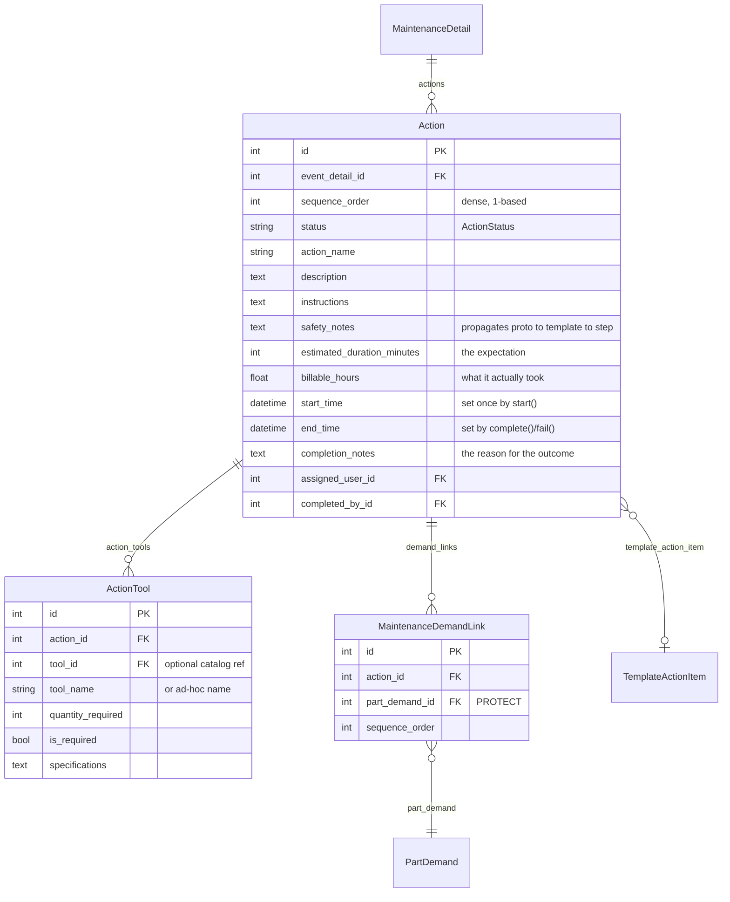

### Two clocks, deliberately unlinked

`start_time`/`end_time` answer *how long did this take*. `billable_hours`
answers *how much of that gets billed*. Nothing derives one from the other, and
they are expected to diverge — 6 hours elapsed against 4 billable is a normal
record, not an error to reconcile. `estimated_duration_minutes` is the
expectation copied down from the template, never enforced.

### Action status lifecycle

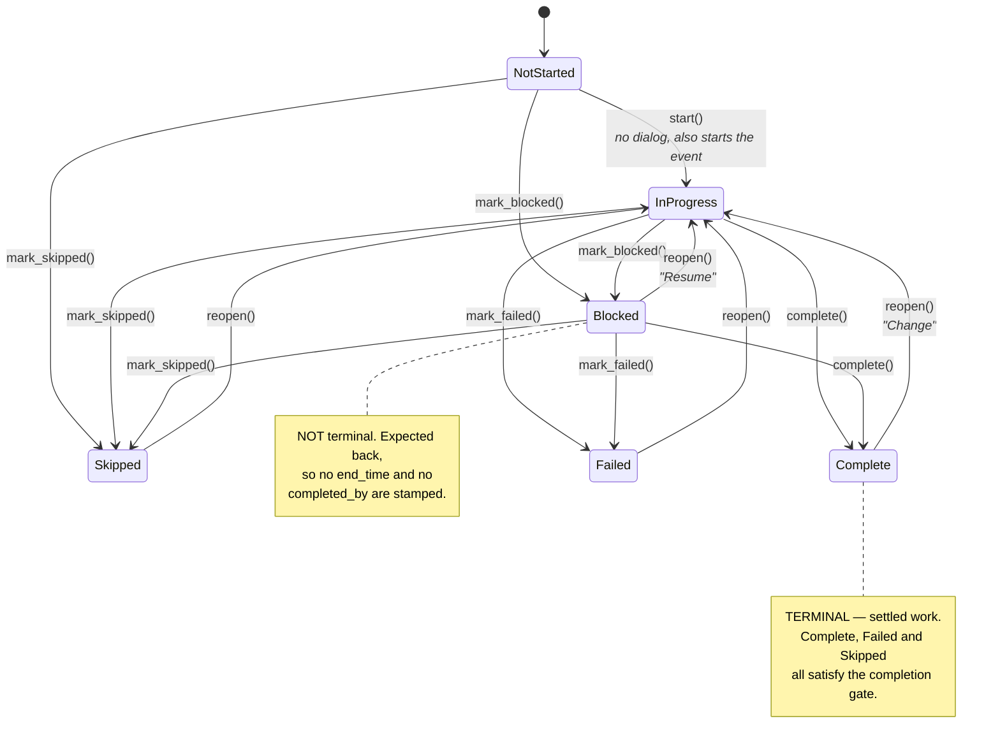

`ActionContext.TERMINAL_STATUSES = {Complete, Failed, Skipped}` is the single
source of truth and the completion guard re-exports it.

**A failed step is finished work.** This is worth stating because it was wrong
once: the completion guard used to count only `{Complete, Skipped}`, which made
a genuinely failed step impossible to clear — no verb moves an action out of
Failed except an explicit reopen, so the event was stuck forever unless the
technician lied about the outcome. "Every step reached an outcome" is the rule,
not "every step succeeded".

Every transition except `start()` requires a note. The note is the only part of
the record a technician can supply and nobody else can reconstruct later.

---

## 3. Parts — reaching into procurement

Maintenance never owns a part need. `procurement.PartDemand` is the hub row, and
maintenance points *inward* at it through `MaintenanceDemandLink` (decision D7).
`PartDemand` has **zero** outward references back to maintenance.

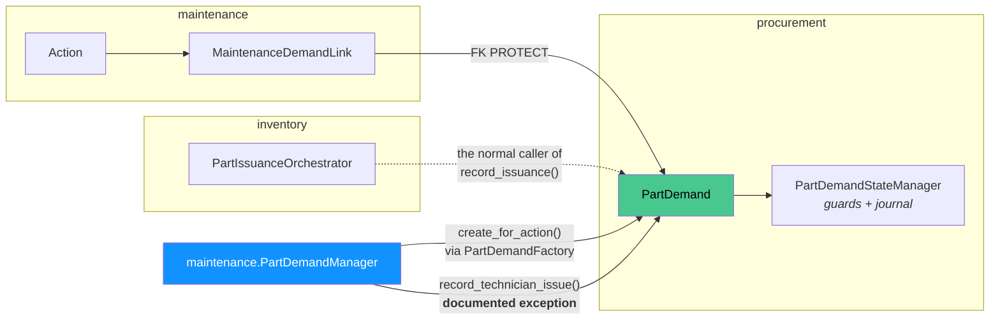

`PartDemandManager` is the only place in this app that creates a `PartDemand`,
and it always goes through procurement's own `PartDemandFactory` so the four
state axes and the origin graph node initialize correctly.

### Four independent axes, not one status

A `PartDemand` does not have "a status". It has four, each answering a
different question, and none derived from the others:

| Axis | Question | Values the work portal touches |
| :--- | :--- | :--- |
| `demand_state` | Is this need real and authorized? | `projected` → `required` → `approved` / `rejected` / `cancelled` |
| `purchasing_state` | Has money been authorized? | not touched here |
| `shipment_state` | Where is the material? | not touched here |
| `issuance_state` | Has it been handed over? | `not_issued` → `issued_without_stock_adjustment` |

Quantities are equally separate: `quantity_requested`, `purchased_qty`,
`issued_qty`. Issuance state **never** auto-derives from comparing them — a
demand can legitimately reach Issued at 4 units against 10 purchased, because
the job only needed 4.

### The one sanctioned convention break

`PartDemandContext.record_issuance()` is documented as the inward seam from
`app/inventory/`, because inventory is where a `PartIssue` row would be created.
The work portal's **Issue** button calls it anyway, wrapped in
`PartDemandManager.record_technician_issue()` so the exception has a name and a
stated reason: `ISSUED_WITHOUT_STOCK_ADJUSTMENT` means precisely "no stock
movement was recorded", so there is no `PartIssue` to create.

The alternative — `set_issuance_state()` — deliberately never touches
`issued_qty`, and using it here silently discarded the quantity the technician
typed. Every issued demand read `issued_qty = 0`.

**Terminal on this axis.** `issued_without_stock_adjustment` has no outgoing
transitions, and `demand_state = cancelled` is terminal too. Neither can be
undone in this build; legacy's "Undo" button has no equivalent verb.

---

## 4. Tools

`ActionTool` is the lightest of the child records: a quantity, an optional FK to
a `parts.Tool` catalog row, and a free-text `tool_name` for the ad-hoc case
where the tool is not catalogued. Nothing reserves or checks out a tool — the
row is a *requirement*, telling the technician what to bring, not an allocation.

---

## 5. The two interruptions

This is the distinction most worth getting right, because the words overlap and
the records do not.

```mermaid
graph TB
    subgraph one["Action.status = Blocked — ordinary working condition"]
        A1["ONE step cannot proceed"]
        A2["Technician moves to the next step"]
        A3["No MaintenanceBlocker row"]
        A4["MaintenanceDetail.status UNCHANGED"]
        A1 --> A2 --> A3 --> A4
    end

    subgraph two["MaintenanceBlocker — an escalation"]
        B1["The WHOLE JOB has stopped"]
        B2["Event flips to Blocked"]
        B3["Records billable hours lost"]
        B4["Can re-prioritise the event"]
        B5["Holds completion open"]
        B1 --> B2 --> B3 --> B4 --> B5
    end

    subgraph three["AssetLimitationRecord — about the ASSET"]
        C1["The asset is degraded"]
        C2["Outlives this event"]
        C3["Drives Asset.capability_status"]
        C4["Holds completion open"]
        C1 --> C2 --> C3 --> C4
    end

    style one fill:#e8f4ff
    style two fill:#fff8e1
    style three fill:#ffebee
```

> A step being blocked is an ordinary working condition. An event being blocked
> is an escalation someone has to answer for. If `ActionContext.mark_blocked()`
> ever starts creating `MaintenanceBlocker` rows, that distinction is gone and
> every "waiting on a torque wrench" becomes a reportable work stoppage.
> Three tests exist purely to prevent that merge.

### A blocker stops the WORK

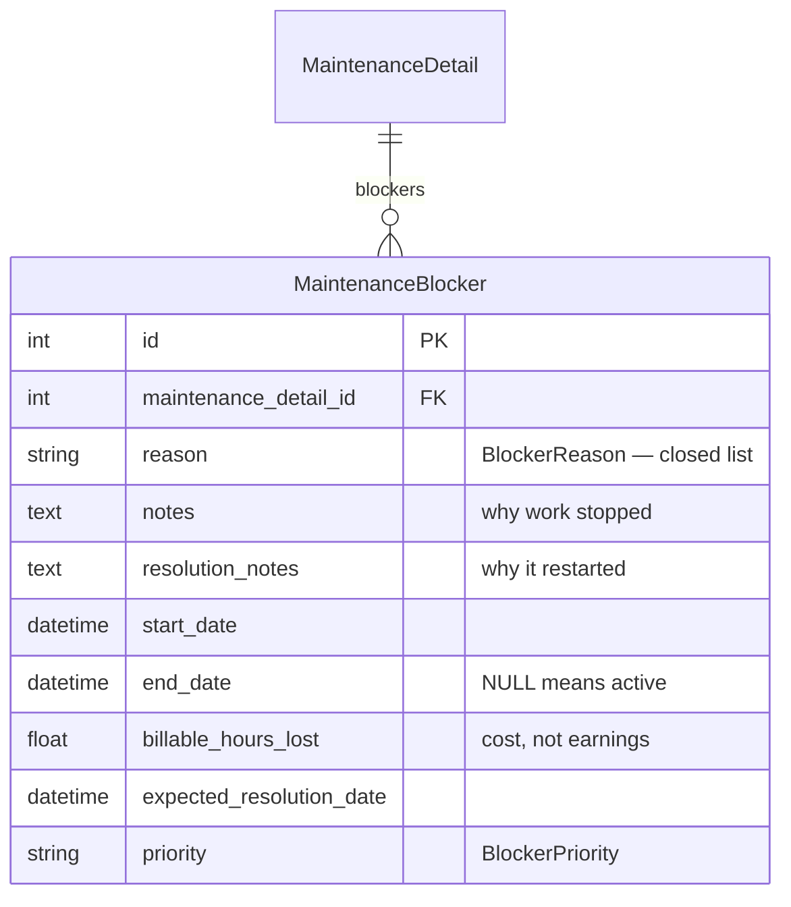

`reason` is a **closed list** (`BlockerReason`), not free text, because these
are what a manager reports on — "how much of last quarter did we lose to
parts?" is unanswerable against free text. `OTHER` is the escape hatch and is
expected to be paired with `notes`.

> Parts Not Available · Equipment Unavailable · Staff Not Available ·
> Facility Not Available · Safety Concerns · Major Issues Discovered · Other

`billable_hours_lost` is named in full deliberately: `billable_hours` on an
`Action` means hours *earned*. The same short name on both models, meaning
hours in and hours out, is how a reporting query ends up silently summing them.

**Only one active blocker per event.** A second cannot be opened while the
first is unresolved.

### A limitation degrades the ASSET

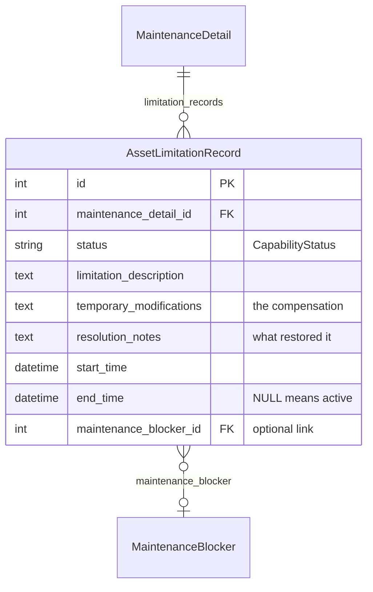

Four capability statuses, ranked worst-to-best:

| Status | Degraded? | `temporary_modifications` |
| :--- | :--- | :--- |
| Non Capable | yes | **forbidden** |
| Partially Capable — Functional Limitations | yes | **forbidden** |
| Partially Capable — Temporary Compensation | no | **required** |
| Fully Capable — Temporary Compensation | no | **required** |

Compensation statuses *require* a description of the compensation; degraded
statuses *forbid* one. A caller cannot claim a workaround exists for a status
that says the asset simply cannot do the job.

Closing a limitation recomputes `Asset.capability_status` as the **worst active
limitation across every maintenance event for that asset** — not just this one.
A degradation opened from a different event still shows up.

The optional FK to a blocker is what distinguishes *"the asset is degraded AND
that is why work stopped"* from *"the asset is degraded, and separately work
stopped for some other reason"*. Those are different situations and the FK is
the only thing that tells them apart.

### Completion gate

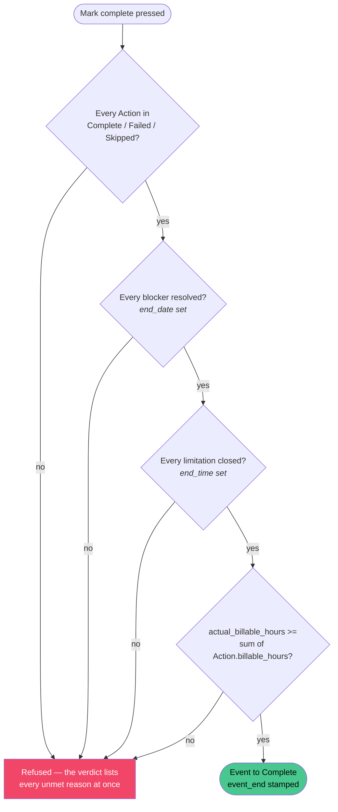

All four must pass; there is no partial-completion path. The hours check is a
**floor, not an equality** — a manual override is expected to run ahead of the
calculated sum, it just can never complete while short of it.

`completion_verdict()` is exposed read-only so the UI can show what is left
*before* the technician tries.

---

## 6. The work portal

`/maintenance/event/<pk>/work` — the technician's main screen, and the busiest
page in the module. One canonical URL; every mutation POSTs back to it with a
distinct `action` value; `?format=htmx-actions` re-renders the step list.

### Layout

```
┌──────────────────────────────────────────────────────────────────┐
│ page hero — task name, asset link, "Back to view"                │
├──────────────────────────────────────────────────────────────────┤
│ ⚠ BLOCKED BANNER  (full width, above the fold, when active)      │
│ ⚠ LIMITATION BANNER                                              │
├──────────────────────────────────────────────────────────────────┤
│ MAINTENANCE STATUS — stacked progress bar + the three verbs      │
├───────────────────────────────────┬──────────────────────────────┤
│ Event details            (is-8)   │ Quick actions        (is-4)  │
│ Maintenance actions (N)           │ Event information            │
│   └ per step:                     │ Template attachments         │
│      identity + status            │ Summary                      │
│      safety callout               │ Part demand approval         │
│      ▸ Parts required  (nested)   │ Blockers (N active)          │
│      ▸ Tools required  (nested)   │ Capability limitations (N)   │
│      verb stack (right gutter)    │                              │
├───────────────────────────────────┴──────────────────────────────┤
│ EVENT ACTIVITY — comments / attachments / metadata (full width)  │
└──────────────────────────────────────────────────────────────────┘
```

The banners sit **above** the body grid, not inside it — `body-grid` is a CSS
grid, so anything within it becomes a cell and gets squeezed into one column.

### The progress bar measures settled work

Three colours in one bar: **green** complete, **red** failed, **grey** skipped,
with the track showing as the unfinished remainder. `<progress>` carries only
one colour, so this is a stacked flex bar.

It answers *"how much of this job still needs a decision from me"*, which is
the question a technician standing at the asset actually has — not *"how much
succeeded"*. A failed step is finished work; leaving its slice empty would read
as "still to do" and understate how far the job has got. The per-outcome
counters below the bar keep *which* outcome visible.

### Interaction model

Every verb except **Start** opens a shared `<dialog>`. There is one dialog per
*kind of decision*, never one per row — the action list is swapped wholesale by
htmx after every mutation, so a dialog living inside that fragment would be
destroyed mid-interaction. Trigger buttons carry their row's values in `data-*`
attributes; `app/static/js/maintenance_work.js` copies them in. Opening is
native (`commandfor` / `command`); the JS only fills fields.

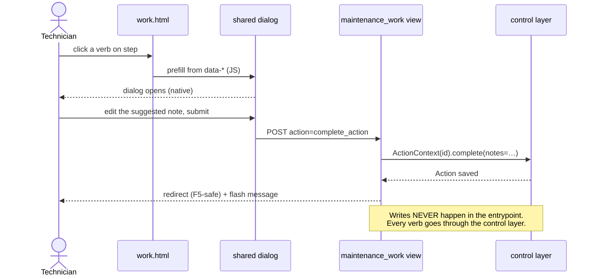

**Start is the one exception** — no dialog, no notes. Picking up a step is not a
decision worth interrupting for, and starting any step also starts the *event*,
so the technician never presses "start" twice for one act of beginning. There
is deliberately no separate "Start event" button.

### Every action on the page

| Control | POST `action` | Control-layer verb | Notes required |
| :--- | :--- | :--- | :--- |
| Step **Start** | `start_action` | `ActionContext.start()` + `MaintenanceContext.start()` | — (fires immediately) |
| Step **Complete** | `complete_action` | `ActionContext.complete()` | yes, + billable hours |
| Step **Failed** | `fail_action` | `ActionContext.mark_failed()` | yes, + billable hours |
| Step **Blocked** | `block_action` | `ActionContext.mark_blocked()` | yes |
| Step **Skip** | `skip_action` | `ActionContext.mark_skipped()` | yes |
| Step **Resume** / **Change** | `reopen_action` | `ActionContext.reopen()` | yes |
| Step **Edit** | `edit_action` | `ActionContext.edit()` | — |
| Step **Add part** | `add_part_demand` | `PartDemandManager.create_for_action()` | — |
| Part **Issue** | `issue_part_demand` | `PartDemandManager.record_technician_issue()` | qty required |
| Part **edit** (pencil) | `update_part_demand` | `PartDemandContext.update_fields()` / `set_issuance_state()` | — |
| Part **Cancel** | `cancel_part_demand` | `PartDemandContext.cancel()` | yes |
| Approval **✓** | `approve_part_demand` | `PartDemandContext.approve()` | — |
| Approval **✕** | `reject_part_demand` | `PartDemandContext.reject()` | yes |
| **Mark complete** | `complete_event` | `MaintenanceContext.complete()` | + final billable hours |
| **Place in blocked status** | `add_blocker` | `blocker_manager.add_blocker()` | reason required |
| Blocker **Resolve** | `end_blocker` | `blocker_manager.end_blocker()` | yes, + close-out fields |
| **Add capability limitation** | `add_limitation` | `limitation_manager.create_record()` | status required |
| Limitation **Close** | `close_limitation` | `limitation_manager.close_record()` | yes, + close-out fields |
| **Add comment** | `add_comment` | `MaintenanceContext.add_comment()` | — |

### Open and close are different forms

An interruption is opened when it is discovered and closed when the facts are
actually known, so the close-out form is not just a status flip — it is where
the record gets corrected.

```mermaid
flowchart LR
    subgraph OPEN["Open — a first estimate"]
        O1["reason / status"]
        O2["notes"]
        O3["start time"]
        O4["hours lost (guess)"]
        O5["update event priority"]
        O6["link to active blocker"]
        O7["event comment"]
    end

    subgraph CLOSE["Close — the measurement"]
        C1["start time — correctable"]
        C2["end time — often not 'now'"]
        C3["hours lost — the real figure,<br/>overwrites the estimate"]
        C4["amended notes"]
        C5["resolution notes — REQUIRED"]
        C6["event comment"]
    end

    OPEN ==>|"time passes"| CLOSE

    style OPEN fill:#fff8e1
    style CLOSE fill:#e8f5e9
```

Why the start time is editable on the way out: a limitation is routinely
recorded after the fact — the asset was degraded from Tuesday morning, but
somebody opened the record on Wednesday.

Why `resolution_notes` is mandatory: both records open with a stated cause and
were closing in silence, which leaves half a record — the log said work stopped
and then said nothing about why it started again. The refusal lives in the
manager, not just the form, so a plain POST cannot skip it.

### Activity-log narration

Every interruption open and close writes to the event's activity log. Caller
text is recorded as a human comment; when the field is left blank a
machine-written sentence is generated instead, so the log never has a silent
gap where work stopped.

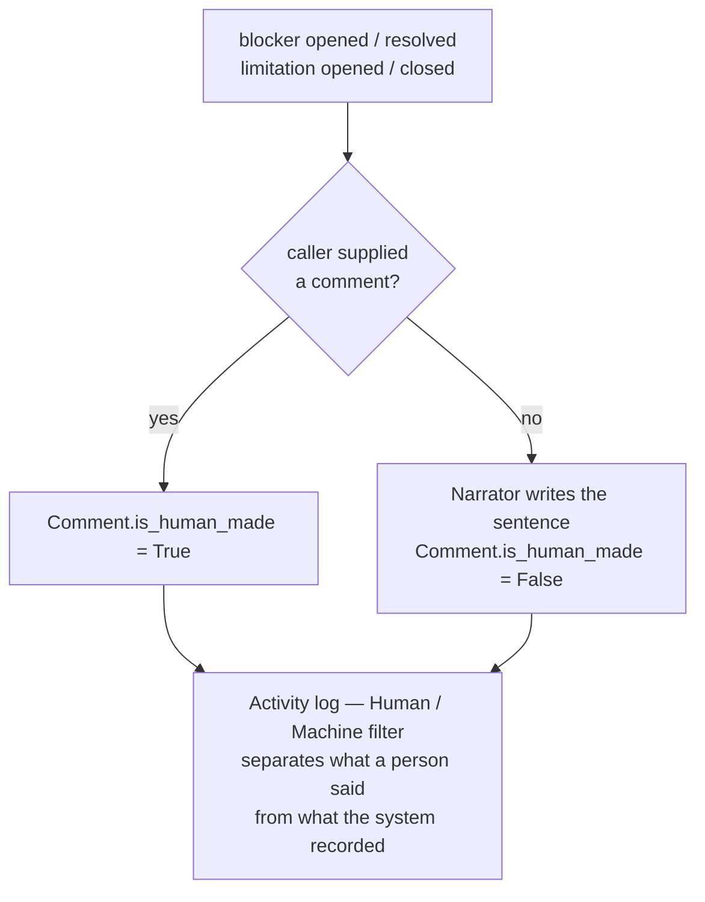

Narration happens **outside** the surrounding transaction on purpose: a comment
failing to save must not roll back the blocker. The blocker is the record that
matters; the narration is commentary on it.

### Timezones

The project runs `TIME_ZONE = "UTC"` with `USE_TZ = True`, so every datetime
rendered into the page is a UTC wall clock and the view parses
`datetime-local` inputs back as UTC.

This is a live trap. Stamping *browser*-local time as the default "now" put it
hours away from the values already in the form — a technician in UTC−7 opening
the resolve form got an end time seven hours **before** the start time in the
field, and the manager correctly refused it. `nowLocal()` in
`maintenance_work.js` uses UTC getters, and `_datetime()` in the view makes
parsed values timezone-aware rather than leaving the interpretation implicit.

---

## 7. Where the code lives

| Concern | File |
| :--- | :--- |
| Event header model | `app/events/models/details/maintenance.py` |
| Event / thread substrate | `app/events/models/event.py` |
| Action + statuses | `app/maintenance/models/action.py` |
| Tools | `app/maintenance/models/action_tool.py` |
| Part link table | `app/maintenance/models/demand_link.py` |
| Blockers | `app/maintenance/models/blocker.py` |
| Limitations | `app/maintenance/models/asset_limitation.py` |
| Step verbs | `app/maintenance/control_layer/action_context.py` |
| Event verbs | `app/maintenance/control_layer/maintenance_context.py` |
| Blocker verbs + narrator | `app/maintenance/control_layer/maintenance_blocker_manager.py` |
| Limitation verbs + narrator | `app/maintenance/control_layer/asset_limitation_manager.py` |
| Part demand creation / issue | `app/maintenance/control_layer/part_demand_manager.py` |
| Completion gate | `app/maintenance/control_layer/guards/maintenance_completion_guard.py` |
| Work / edit / assign entrypoints | `app/maintenance/presentation_layer/entrypoints/work_views.py` |
| Page + dialogs | `app/maintenance/templates/maintenance/work/work.html` |
| Step list fragment | `app/maintenance/templates/maintenance/work/_action_list.html` |
| Dialog prefill | `app/static/js/maintenance_work.js` |
| Page styling | `app/static/css/maintenance_event.css` |

### Invariants worth not breaking

1. `TERMINAL_STATUSES` has one definition. The completion guard re-exports it
   rather than keeping its own.
2. `ActionContext.mark_blocked()` writes only `Action.status`. It creates no
   `MaintenanceBlocker` and never touches the event.
3. Maintenance creates `PartDemand` rows only through `PartDemandManager`, which
   goes through procurement's `PartDemandFactory`.
4. `record_technician_issue()` is the *only* place this app calls
   procurement's inventory seam, and it says why in its docstring.
5. Dialogs live outside `#work-action-region` so htmx swaps cannot destroy an
   open one.
6. Every state-settling verb takes a note, enforced in the control layer as
   well as the form.
