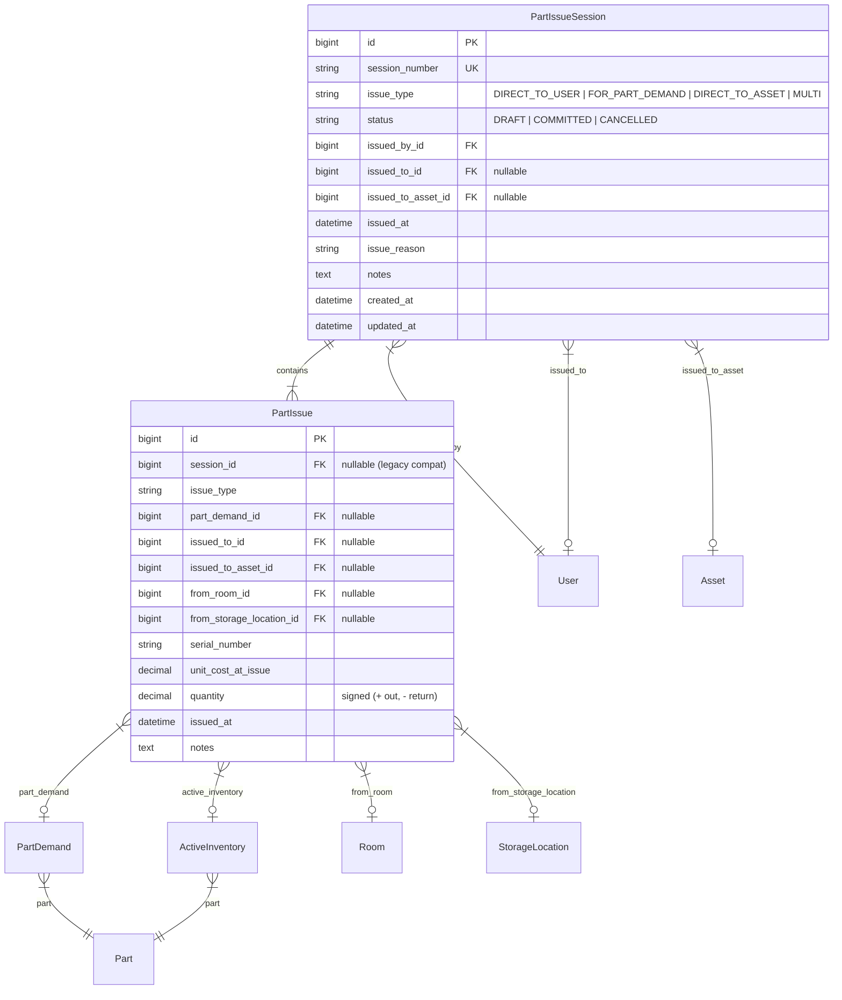
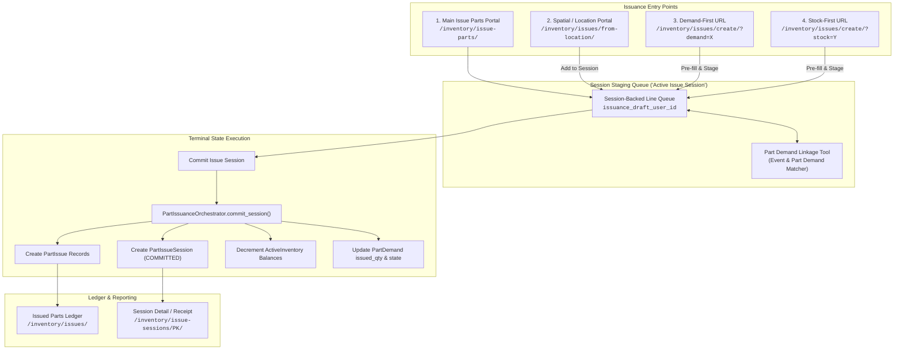
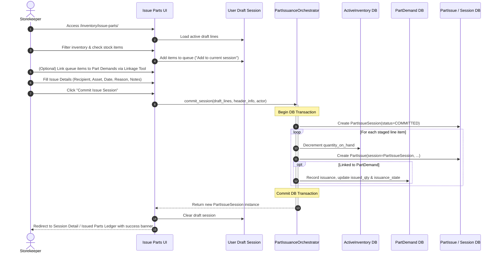

# Part Issue Paths & Tracking Specification

## 1. Executive Summary & Core Objectives

This document specifies the technical design, domain data model, user experience, and lifecycle process flows for **Part Issuance & Tracking** within `ebams2`.

### Core Goals
1. **Restoration of Legacy Capability**: Re-implement the full multi-card, interactive **Issue Parts** workspace (`/inventory/issues/create/` or `/inventory/issue-parts/`) modeled after the legacy application (`/inventory/issue-parts`), updated for ebams2's layered Django + HTMX + Bulma architecture.
2. **Ledger Clarity ("Issued Parts")**: Clarify the historical transaction ledger at `/inventory/issues/` as **Issued Parts Ledger**, displaying completed issue sessions and line-item history.
3. **Session-Based Terminal State (`PartIssueSession`)**: Introduce a first-class `PartIssueSession` entity to group multiple part issues executed during the same transaction. This provides a formal terminal state (`STAGED` → `COMMITTED` / `CANCELLED`) for all issuance workflows across the system.
4. **Unified Staging & Entrypoints**: Ensure all entrypoints (Location-based issuance, Demand-first issuance, Stock-first issuance, and Maintenance Event linkage) feed seamlessly into a shared "Active Issue Session" draft queue.

---

## 2. Domain Data Model Architecture

The data architecture introduces `PartIssueSession` as the parent transaction header for one or more `PartIssue` line items.

### Key Field Specifications

#### `PartIssueSession`
- `session_number`: Unique human-readable reference code generated at creation (e.g., `ISS-20260817-8A2F`).
- `status`: Choices `DRAFT` (staged session), `COMMITTED` (terminal active state), `CANCELLED`.
- `issued_by`: FK to `administration.User` (the storekeeper/actor authorizing the issuance).
- `issued_to`: FK to `administration.User` (default recipient for lines in the session, overrideable per line).
- `issued_to_asset`: FK to `assets.Asset` (optional target asset).
- `issue_reason`: String categorization (e.g. `PM Maintenance`, `Emergency Repair`, `Direct Take`).

#### `PartIssue` Updates
- `session`: FK to `PartIssueSession` (related_name `"issues"`).

---

## 3. Comprehensive User Experience & Route Map

The system supports four converging issuance entrypoints that all feed into the **Active Issue Session**, culminating in a single terminal commit action.

---

## 4. Workflows & State Machine Sequence

---

## 5. UI Layout & Component Specifications

### 5.1 Main Issue Parts Page (`/inventory/issue-parts/` or `/inventory/issues/create/`)
Mirroring the legacy application with Bulma styling:
1. **Header Bar**:
   - Title: **Issue Parts** (Sub: *Select inventory items, link to demands/events, and issue to users or assets*)
   - Actions: Buttons for **Issued Parts Ledger** and **Active Inventory**.
2. **Filters Card**:
   - Fields: Part Number, Part Name, Location (Warehouse), Room, Search query.
3. **Available Inventory Matrix**:
   - Selectable rows with quantity available, warehouse, room, storage location bin.
   - Action: "Add to Current Session" button / checkbox picker.
4. **Active Issue Session Queue Card**:
   - Live queue counter.
   - Line items with adjustable issue quantities, serial number inputs, and demand linkage status.
   - Action: Remove line, Clear session draft.
5. **Part Demand Linkage Tool (Tabbed Card)**:
   - **Tab 1: By Maintenance Event ID**: Filters for Asset, Assigned User, Warehouse, Asset Class, Make/Model, Created Date, Approval status. Displays Maintenance Events list on left, associated Part Demands on right.
   - **Tab 2: By Part ID**: Shows all unlinked demands matching selected queue item's part.
6. **Issue Details & Session Commit Form**:
   - Issue Type (`DirectToUser`, `ForPartDemand`, `DirectToAsset`).
   - Primary Issued To User (Required).
   - Target Asset (Optional).
   - Date Issued (default timezone.now).
   - Issue Reason & Notes.
   - **Primary Action**: **"Commit Issue Session"** (`btn-success`).

### 5.2 Issued Parts Ledger (`/inventory/issues/`)
- Page Title: **Issued Parts Ledger** (sub-heading: *Historical log of committed issue sessions and stock disbursements*).
- Tabs/Views:
  - **By Sessions**: List of `PartIssueSession` headers (Session #, Date, Issued By, Issued To, Line Count, Total Qty, Status).
  - **By Line Items**: Granular list of `PartIssue` rows with search filters by Part, Demand #, Recipient, Serial #, and Return action.

---

## 6. Verification Plan

1. **Schema Integrity**:
   - Execute `./refresh_project.py` to rebuild database with `PartIssueSession` and migration strategy.
2. **Draft Session Persistence**:
   - Add lines to issuance session → reload browser (F5 rule) → verify lines remain staged.
3. **Multi-Source Line Staging**:
   - Stage stock from location portal (`/inventory/issues/from-location/`), main portal, and direct demand link. Verify all coalesce into the active session.
4. **Session Commit Transaction**:
   - Submit session → verify `PartIssueSession` created with `COMMITTED` status, `PartIssue` rows created with valid `session_id`, `ActiveInventory` balances updated, and `PartDemand` issuance states correctly transitioned.
5. **Ledger Verification**:
   - Access `/inventory/issues/` → verify page title is "Issued Parts Ledger" and new session appears in the session index.
