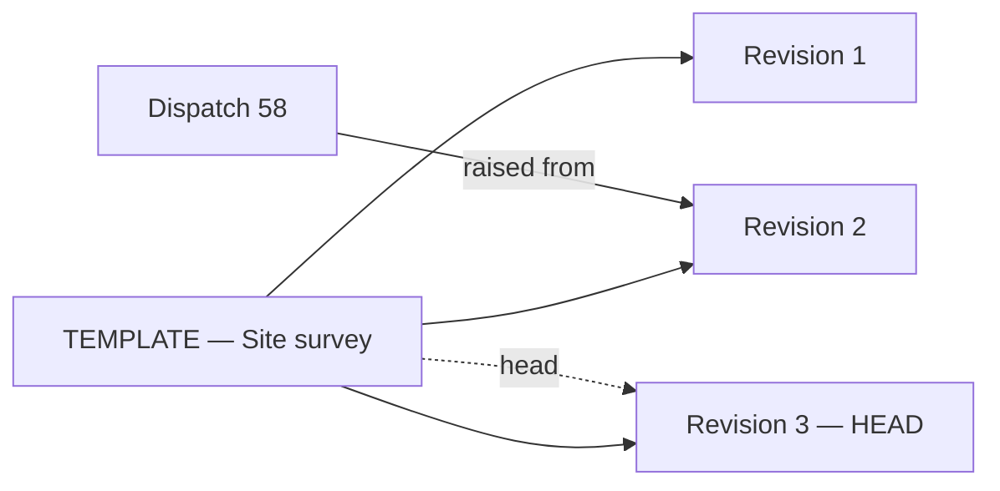
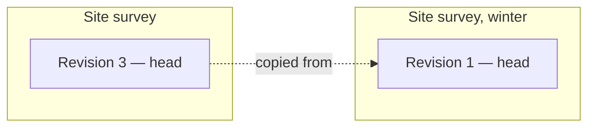
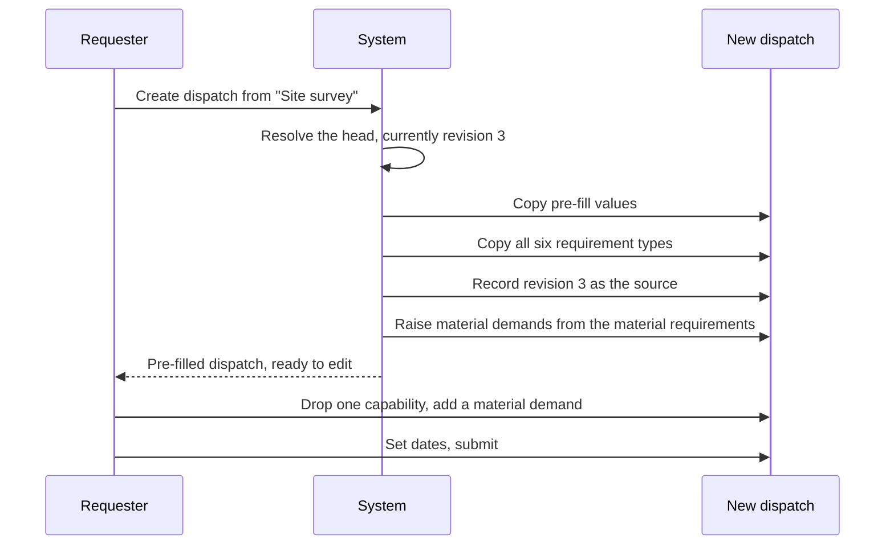

# Dispatch Templates

**A template is a saved answer to "we run this trip every month".** It pre-fills a new dispatch
and then gets out of the way.

This document is mostly about **revisioning**, because that is where the previous system was
weakest. Revisioning was bolted on: a template could be edited freely until someone used it, at
which point it froze forever, and "make a new version" was a bare action with no workflow behind
it. The result was single-use templates and a growing pile of near-duplicates.

---

## 1. The goals a template serves

| Actor | Goal | Success state |
| :--- | :--- | :--- |
| **Requester** | File the trip I file every month without re-deriving its requirements | A new dispatch appears pre-filled; I change the dates and submit |
| **Dispatch manager** | Standardise what a given kind of job requires | Everyone filing that job asks for the same things |
| **Dispatch manager** | Improve the standard when we learn something | The next dispatch picks up the improvement; past ones are untouched |
| **Dispatch manager** | Make several edits and publish **one** version | Not four versions because I added four items |
| **Auditor** | Know what the standard said on the day a dispatch was raised | Readable from the dispatch, and from the revision it names |
| **Dispatch manager** | Retire a workflow we no longer run | It stops appearing to requesters; history stays intact |

Goals three through six are the ones the old design served badly.

---

## 2. The shape: a lineage, and its revisions

Two things, not one.

| | **Template** — the lineage | **Revision** — one version of it |
| :--- | :--- | :--- |
| Represents | "The site survey template" — a standing identity | What that template said, at one point in time |
| Lifespan | Permanent | Permanent, and **immutable** once it exists |
| Carries | Which domain owns it, whether it is retired, which revision is current | Title, pre-fill values, the whole requirement manifest, a change note |
| Changes | Rarely — retirement, and the head pointer moving | **Never** |

A dispatch points at a **revision**, never at the lineage. That is what makes its reference
permanent: revision 3 will say what it says forever.



**Why two records rather than one self-referencing chain:** the lineage needs things that are
not versioned — who owns it, whether it is retired, which revision is current. Putting those on
a revision row means either duplicating them across every revision or mutating a row that is
supposed to be immutable. Separating them keeps the promise in §3.1 absolute.

---

## 3. How revisioning should work

### 3.1 The principle

> **A revision, once it exists, never changes. Improving a template means publishing a new
> revision beside it.**

That one rule earns everything else:

- **A dispatch's reference never needs updating.** It names revision 3; revision 3 still says
  what it said.
- **The revision is the audit record.** "What did the standard say in March" is answered by
  opening the revision the dispatch names.
- **Editing is safe.** Nobody can retroactively change what a past dispatch was raised against.
- **No locking.** The old lock existed to prevent retroactive edits. Immutability does that
  properly, without making a template single-use.

### 3.2 Editing happens in a working draft, not in the database

> **A revision is created once, at commit. Not while you are still working.**

Opening the editor loads the current head into a **working draft** held in the session. Every
change — a pre-fill field, adding a capability, removing a part, adjusting a quantity — updates
that draft. **Nothing is written to the database until you commit.**

```mermaid
sequenceDiagram
    participant M as Dispatch manager
    participant S as Working draft, in session
    participant DB as Database

    M->>S: Open editor — head revision 3 loaded
    M->>S: Change asset class
    M->>S: Add two capability requirements
    M->>S: Remove a part requirement
    M->>S: Adjust a quantity
    Note over DB: still nothing written
    M->>DB: Commit, with a change note
    DB->>DB: One transaction — revision 4 plus its whole manifest
    DB->>DB: Head moves to 4; revision 3 becomes superseded
```

**This is the point of the design.** Four edits produce **one** revision, not four. The version
history reads as a list of deliberate improvements, each with a change note, rather than a
transaction log of individual field changes.

It also means:

| | |
| :--- | :--- |
| **No draft rows** | There is no half-finished revision in the database, no draft state to filter out of lists, and no "one draft per lineage" rule to enforce |
| **Discarding is free** | Abandoning a draft clears the session. Nothing to clean up |
| **The revision list is meaningful** | Every row in it was deliberately published |

The project already uses session-backed drafts for exactly this kind of multi-card editing —
follow the established pattern rather than inventing one.

### 3.3 What a working draft costs

Two honest downsides, both acceptable:

| Risk | Response |
| :--- | :--- |
| **Losing the session loses the work** | The draft is a scratchpad. The editor should say so plainly, and committing should be easy to reach at any point — a manager who has made two good changes should not feel they must finish everything first |
| **Two people cannot share a draft** | Each has their own. Genuinely collaborative template authoring is not a real need; two people improving the same standard at the same moment is rare and better solved by talking |

**Concurrency, however, must be handled.** Two managers both open the editor on revision 3;
both commit. Without a check, the second silently discards the first's work.

> **On commit, the head must still be the revision the draft was based on.** If it moved, the
> commit is refused with *"this template was revised while you were editing — review revision 4
> and reapply your changes."* Refusing is right; silently branching or silently overwriting are
> both worse.

### 3.4 What committing should require

Committing is a business event, not a save. It asks for:

- **A change note** — one line on what changed and why. This is what a manager reads when
  comparing revision 3 to revision 4, and the thing most version histories lack.
- **Confirmation of scope** — "this becomes the standard for everyone in *domain* from now on."

And it records who committed it, and when.

### 3.5 The head

**The head is the revision a lineage currently offers.** It is the only one a requester sees.

Committing moves the head and supersedes the previous one, in one action. Superseded revisions
remain readable forever — dispatches point at them.

**A new draft always starts from the head.** Editing from an older revision would produce a
branch, and a branch means two competing "current" versions with no rule for choosing between
them. Someone who genuinely wants to diverge is doing §4, not §3.

---

## 4. Copying to a new template

Starting a genuinely different standard from an existing one.

**Produces:** a new lineage, whose first revision is committed from a working draft seeded with
everything from the source revision. The new lineage records which revision it was copied from
— provenance, not dependency.

The two are then unrelated. Improving the original never touches the copy.



### 4.1 The distinction that matters

| | **New revision** | **Copy to new template** |
| :--- | :--- | :--- |
| Intent | "This standard has improved" | "Here is a different standard that starts from this one" |
| Result | Same template, revision 4 | A separate template, revision 1 |
| Effect on requesters | The picker offers revision 4 instead of 3 | The picker now offers two templates |
| Use when | The job is the same job, done better | The job is genuinely a different job |

The old system had neither as a proper workflow, so people made near-duplicates by hand and the
picker filled with noise. **Both need to be explicit buttons on the template page.**

---

## 5. Retiring a template

Withdrawing a workflow the organisation no longer runs.

**Retirement belongs to the lineage, not to a revision.** "Retire this template" means the whole
thing stops being offered — head and history together.

| | |
| :--- | :--- |
| **Who** | A dispatch manager in the owning domain |
| **Requires** | A reason. "Why did this stop?" is the question asked six months later |
| **Effect** | Disappears from the requester's picker; still readable, still linked from past dispatches |
| **Reversible** | Yes |
| **Deletion** | Never, once any dispatch names one of its revisions |

A retired template none of whose revisions was ever used is the one case where deletion is
reasonable — that is clutter, not history.

---

## 6. What each record holds

### 6.1 The lineage

| Holds | Note |
| :--- | :--- |
| Owning domain | Who can see and use it. Moving a template between domains is not a content change |
| Head revision | Which revision is current. A pointer, so "what does this template say" is one lookup |
| Retired, with reason, who, and when | §5 |
| Copied from | The revision this lineage was seeded from, if any |

### 6.2 A revision

| Holds | Note |
| :--- | :--- |
| Which lineage it belongs to, and its revision number | |
| **Title** | Versioned deliberately — renaming a standard is a change worth recording, and a past dispatch should show the name the template had at the time |
| Pre-fill values | Asset class, asset subclass text, dispatch scope, activity location, estimated meter usage, headcount, notes. **All optional** |
| The full requirement manifest | §6.4 |
| Change note, committed by, committed at | §3.4 |
| Previous revision | Explicit lineage |

**Every pre-fill field is optional.** A template that supplies only a requirement manifest is
legitimate — partial templates are the common case, not a degenerate one.

### 6.3 Deliberately not stored

| Not stored | Why |
| :--- | :--- |
| Who it is for | Always the person raising the dispatch, or their nominee |
| Start and end dates | The point of a new dispatch is that it happens at a new time |
| Specific assets | A named unit is a per-dispatch decision, never a reusable one |

A template that pins a date is wrong on its second use.

### 6.4 The requirement manifest

Five requirement types, mirroring the dispatch's own manifest
([2_dispatch.md](2_dispatch.md) §6): capabilities, skills, models, modifications, and **material
requirements**.

**The manifest belongs to a revision, not to the lineage.** That is precisely what makes a
revision immutable — its requirements cannot be edited out from under it.

**Configuration template is not its own requirement kind — it is an optional attribute of a
model requirement row.** `ConfigurationTemplate.model` is itself a mandatory FK, so a
configuration means nothing without a model as its subject; requesting one standalone was
rejected as a feature (an earlier revision of this document listed it as a sixth kind, mirroring
legacy's separate `requested_configuration_templates` table — that was a mistake, corrected once
the UI made it concrete). A model requirement row may now name a configuration template that
belongs to the same model; two rows for the same model are allowed when they differ only by
configuration ("1 F350 moving-truck configuration" and "1 F350 towing configuration" are two
rows, not a model row plus an unrelated configuration-template row). Uniqueness on the
requirement table is therefore `(revision, model, configuration_template)`, with a second,
conditional constraint guaranteeing at most one *unconfigured* row per model (SQL's `NULL != NULL`
means the composite constraint alone would not catch two unconfigured duplicates). This applies
identically to the dispatch-header manifest in [2_dispatch.md](2_dispatch.md) §6.

> Requested *parts* are requested **material**, in line with [2_dispatch.md](2_dispatch.md) §7.
> A template saying "this job consumes 100 ft of wire" produces a real, issuable demand when
> instantiated — not a note someone must re-enter.

---

## 7. Instantiating a dispatch

**Copy, and allow deviation.**



**Rules:**

- **The dispatch's requirements are its own** from the moment it is created. Editing the
  template afterwards has no effect on it, ever.
- **Deviation is ordinary editing.** No "overridden from template" flag, no reconciliation
  screen, no drift warnings. The template was a starting point with no ongoing authority.
- **The dispatch records the exact revision.** That reference is permanent and never needs
  updating, because that revision will never change.
- **Only head revisions can be instantiated.** Superseded and retired revisions are readable but
  not usable.
- **All or nothing.** A half-copied manifest is worse than no template.

### 7.1 What the reference is for

| Question | Answered by |
| :--- | :--- |
| "What did we ask for on this job?" | The dispatch's own requirements |
| "What was the standard at the time?" | The named revision — still intact |
| "Did this job deviate from standard?" | Comparing the two, on demand |
| "How many jobs used revision 3?" | Counting dispatches that name it |
| "Is our standard being followed?" | Deviation rate across dispatches naming the head |

That last row is the reporting capability the old design could not support, because a template
that froze on first use meant every job effectively had its own template.

---

## 8. Business rules

| # | Rule |
| :--- | :--- |
| R1 | A revision is immutable from the moment it exists. No exceptions, no admin override |
| R2 | Improving a template means committing a new revision, never editing an existing one |
| R3 | Editing happens in a session-held working draft; **nothing is written until commit** |
| R4 | A commit produces exactly one revision, however many changes it contains |
| R5 | A working draft always starts from the head |
| R6 | A commit is refused if the head moved while the draft was open |
| R7 | Committing requires a change note and records who and when |
| R8 | Only the head revision is offered to requesters |
| R9 | The requirement manifest belongs to a revision, never to the lineage |
| R10 | Retirement is lineage-wide, requires a reason, and is reversible |
| R11 | A revision named by any dispatch is never deleted |
| R12 | Instantiation copies; the dispatch is independent immediately |
| R13 | A dispatch's revision reference is permanent and never updated |

---

## 9. Open questions

1. **Who may commit a revision?** Editing a draft affects nobody; committing changes what
   everyone in the domain is offered from that moment. Same permission, or two?
   → [5_roles_and_permissions.md](5_roles_and_permissions.md) currently splits them.
2. **Should requesters see that a newer revision exists?** A dispatch raised from revision 3
   just before revision 4 is committed is not wrong, but a "raised from a superseded standard"
   marker may help in review.
3. **How long should a working draft survive?** It lives as long as the session. Whether that is
   long enough for a manager who starts an edit on Friday is worth checking against real
   session lifetimes.
4. **Cross-domain templates.** A lineage belongs to one domain. Organisation-wide standards
   would need either a global scope or explicit sharing.
5. **Personal templates.** "My usual run" for one requester is a different thing from a domain
   standard. Worth a visibility flag, or out of scope?
