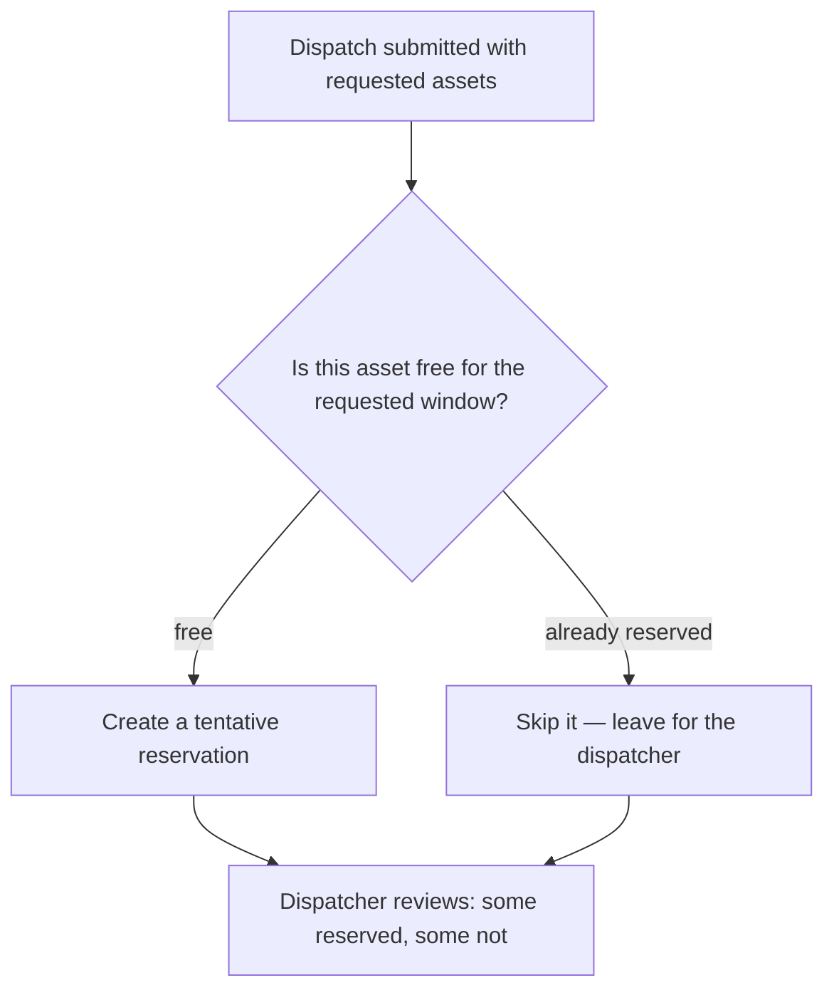
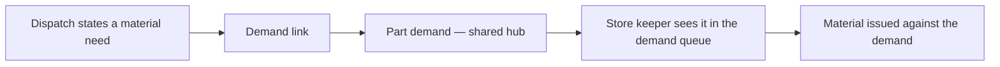
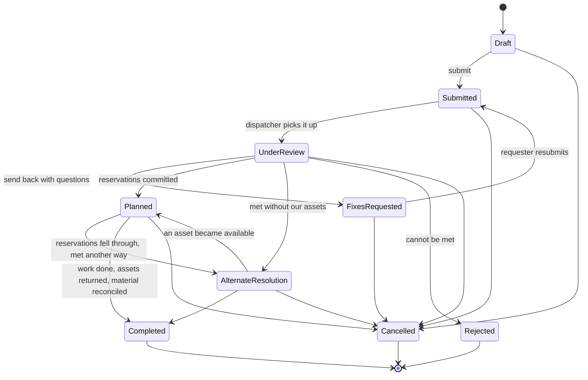

# The Dispatch

**One entity. One record. One working life.** A dispatch is a stated need for transport or
equipment, everything that need requires, and the record of how it was met.

There is no separate "request" object. "Request" and "dispatch" named the same record at two
points in its life — which is a status, not a different kind of thing.

---

## 1. The goals a dispatch serves

| Actor | Goal | Success state |
| :--- | :--- | :--- |
| **Requester** | Get the vehicle, equipment and people I need, when I need them | Assets reserved, crew assigned, materials waiting |
| **Requester** | State what I need without knowing what is available | Requirements stated; a dispatcher matches them |
| **Dispatcher** | See every open need in one queue, with enough detail to act | Nothing sits unassessed |
| **Dispatcher** | Meet the need whichever way is cheapest and fastest | Reserve internally, contract out, or reimburse |
| **Dispatcher** | Refuse a need I cannot meet, and say why | Requester knows where they stand and whether to resubmit |
| **Fleet manager** | Know what our assets are committed to, and why | Every reservation traces back to a stated need |
| **Store keeper** | Know what materials to have ready | Real, issuable demands raised at request time |

---

## 2. What a dispatch is

Three layers, all on one record:

| Layer | Content |
| :--- | :--- |
| **Intent** | Who needs it, for whom, when, what kind of asset, where, why |
| **Requirements** | What the need demands — capabilities, skills, models (optionally to a named configuration), modifications, and **material demands** |
| **Resolution** | The reservations that satisfy it, and any expenses incurred meeting it another way |

Requirements are **requirements**, never assignments. *"Something with a towing package, and
someone with a CDL"* is a requirement. *"Truck 12, driven by Sam, Tuesday 09:00–17:00"* is a
reservation — [3_asset_reservations.md](3_asset_reservations.md).

### 2.1 Every dispatch is an event

A dispatch **is** an event in the system's shared activity record. Not "has one" — is one.

That gives it, without anything being built for dispatching specifically: a comment thread,
file attachments, a timeline, ownership scoping, priority, and a place in the same feeds where
maintenance and inventory activity appear.

**Its reservations get their own events too.** A dispatch's event carries the conversation about
the job; each reservation's event carries the conversation about that asset — its condition,
its handover, its return. They are separate because they have separate audiences and separate
lifespans. See [3_asset_reservations.md](3_asset_reservations.md) §2.

**Consequence:** there is no separate location record. Ownership scoping answers "whose, which
part of the organisation", and activity location is free text for "where exactly".

---

## 3. Intent

| Field | Purpose |
| :--- | :--- |
| Requested by / requested for | Who filed it; who needs it. Often different |
| Desired start / desired end | The window that was **asked for** — never changes after resolution |
| Headcount, names free text | Who is travelling, including non-system people |
| Asset class, asset subclass text | The kind of thing needed |
| **Requested assets** | Informational — §4 |
| Dispatch scope | How far the job goes — §5 |
| Estimated meter usage | Expected mileage or hours, for planning |
| Activity location | Free text — where the work happens |
| Submitted at | When it left draft |
| Previous dispatch | Supersession lineage — §10 |
| Source template revision | Points at the **revision** it was raised from, not the lineage. Permanent, never updated — that revision is immutable. [1_dispatch_templates.md](1_dispatch_templates.md) §7 |

**Desired window vs actual window.** Desired start/end is what was asked for. The event's own
start/end is what was actually scheduled. Keeping both is what makes *"we asked for Tuesday and
got Wednesday"* answerable — and that gap is the most useful service-quality measure the module
can produce.

---

## 4. Requested assets — informational, never authoritative

**Requested assets is a free-form list, not a set of references.** A requester naming
"Truck 12, or Truck 14 if 12 is out" is expressing a preference, and that preference is worth
keeping — but it is not, and must never become, the record of what was actually committed.

> **The reservations are the only authority on what asset is committed to what dispatch.**

### 4.1 The rule

**Requested assets is written once, at request time, and never updated again.** Not when a
reservation is made, not when one is cancelled, not when an asset is swapped. It is a
**historical record of what was asked for** — an input to the dispatcher's decision and, later,
evidence in a "did we give people what they asked for" review.

This is the field's whole purpose, and it is the kind of thing that gets "helpfully" synced by
someone six months from now. **The stored field must carry an explicit warning to that effect
in the code**, in the terms above: informational, historical, written once, never synced,
reservations are authoritative.

### 4.2 The convenience it buys

When a dispatch is submitted, the system attempts to reserve the named assets — but only the
ones actually free for the requested window:

**Contested assets are never auto-committed.** A conflict is a decision — priority, urgency,
who asked first — and decisions belong to the dispatcher. The system takes the easy wins and
presents the rest as work to do.

**What the requester sees:** *"3 of your 4 requested assets have been held. Truck 14 is already
committed on Tuesday; your dispatcher will find an alternative."* That is a better experience
than silent success or blanket failure, and it is honest about what was and was not achieved.

Everything after that moment — cancelling a held reservation, swapping an asset, adding one the
requester never mentioned — happens on the reservations. Requested assets does not move.

---

## 5. Dispatch scope

How far the job goes. Shapes cost expectations, which assets are plausible candidates, and what
paperwork a trip implies.

| Scope | Meaning |
| :--- | :--- |
| **On-site** | Does not leave the facility |
| **Local** | Within the immediate area — day trip, returns same day |
| **Regional** | Beyond local, within the region — may be overnight |
| **National** | Within the country, extended duration |
| **International** | Crosses a border — documentation, insurance, and clearance implications |

Scope is stated by the requester and may be corrected by the dispatcher during review. It is
**intent**, and freezes with the rest of intent at resolution (§10).

---

## 6. Requirements

Requirement types, each stating one thing the need demands:

| Requirement | Says |
| :--- | :--- |
| **Capability** | "Must be able to do X" |
| **Skill** | "Need N people certified in X, at level ≥ L" |
| **Model** | "Need N units of this model" — optionally, built to a named configuration template (see below) |
| **Modification** | "Must have X fitted" |
| **Material demand** | "This job will consume 100 ft of wire" — §7 |

**Configuration template is not a requirement kind of its own — it is an optional attribute of a
model requirement row**, not a standalone reference. `ConfigurationTemplate.model` is itself a
mandatory FK, so a configuration means nothing without a model as its subject; the two-rows
alternative (a model row plus an unrelated configuration-template row) was rejected. Two rows for
the same model are allowed when they differ only by configuration ("1 F350 moving-truck
configuration" and "1 F350 towing configuration" are two rows, not one model row plus one
configuration row). See [1_dispatch_templates.md](1_dispatch_templates.md) §6.4 for the full
rationale — it applies identically here.

### 6.1 Required vs preferred

Every requirement is marked required or preferred.

**Both are informational.** Neither filters nor blocks anything automatically. They tell a
dispatcher what matters and how much, in a form that is scannable rather than buried in prose.
A dispatcher who assigns an asset missing a required capability is making a judgement call,
possibly a correct one, and the system records rather than prevents it.

This is a deliberate choice against automated matching. Matching engines that hard-filter on
stated requirements return nothing on any realistically-specified job, and the dispatcher ends
up working around the tool. Show the requirements, show which candidates meet them, let a human
decide.

**No requirement may be stated twice** on one dispatch. A repeat is a data-entry slip; quantity
is a field where quantity applies.

### 6.2 Skills

Skills are a dispatching-owned catalogue of **operating** qualifications — CDL class, radio
operator, site access level. Distinct from maintenance competence, which the system does not
catalogue.

A person's skill record carries certification level, certification and expiry dates, and a
certificate number. One record per person per skill.

---

## 7. Material — real demands, not wish lists

**A dispatch raises material demands directly.** "This job consumes 100 ft of wire" becomes a
genuine, issuable demand at the moment it is stated — the same kind of demand maintenance work
raises, in the same queue, visible to the same store keeper.

> **Change from the earlier draft:** there is no dispatch-specific "requested parts" list. That
> was a wish list nobody could act on, requiring someone to re-enter it as a real demand later.
> The dispatch links to demands in the shared procurement hub instead.

**What this buys:**

| Goal | Before | Now |
| :--- | :--- | :--- |
| Store keeper knows what to prepare | Only if someone re-keyed it | Visible the moment the dispatch is filed |
| Material can be issued | Needed a separate demand | Issuable directly |
| Demand is aggregated with other needs | No | Yes — pooled with maintenance and other demand |
| Consumption traces to the job | Manually | Through the demand link |

The demand belongs to the shared hub; the dispatch holds a link to it. That mirrors how
maintenance actions attach to demands, so a store keeper sees one queue, not one per module.

**Issuing rule:** stock movements always go through the shared issuance path, never written
directly by dispatching. Quantities that move outside it drift silently and cannot be
reconciled.

---

## 8. Lifecycle

| State | Meaning | Intent editable? |
| :--- | :--- | :--- |
| **Draft** | Being written. Not in the dispatcher queue | Yes |
| **Submitted** | Waiting for a dispatcher | Yes |
| **Under review** | A dispatcher owns it | Yes |
| **Fixes requested** | Sent back with questions | Yes |
| **Planned** | At least one asset reservation is committed. **The normal path** | **No** |
| **Alternate resolution** | Met **without** our assets — contracted out, or the requester used their own vehicle and will be reimbursed | **No** |
| **Rejected** | Cannot be met. Reason recorded on the dispatch — §9 | No |
| **Completed** | Terminal. Work done, assets back, material reconciled | No |
| **Cancelled** | Abandoned. Available from any non-terminal state | No |

### 8.1 Planned vs Alternate Resolution

**One rule:** if the dispatch has at least one live asset reservation, it is **Planned**.
If it is resolved and has none, it is **Alternate Resolution**.

Alternate resolution is the honest name for what it describes: *we did not send our own assets;
the need was met another way.* A dispatch that is partly reserved and partly contracted is still
**Planned** — our assets are committed, and that is the fact the fleet needs to know.

Movement between the two states in either direction is normal and expected. A reservation falls
through and the job gets contracted; an asset frees up and a contract is cancelled. Neither is
an error path.

### 8.2 Completed, not closed

The terminal state is **Completed**. It means the work happened and everything is reconciled —
assets returned, meters read, material accounted for.

Distinct from Planned because real work happens between "assets are committed" and "everything
is back and accounted for", and the fleet needs to distinguish a truck that is out from a truck
that is back.

---

## 9. Rejection lives on the dispatch

**A rejection is not a resolution.** It is the dispatch's own outcome, and it belongs on the
dispatch record itself.

| Recorded | Purpose |
| :--- | :--- |
| Rejection reason | Why. Required — a rejection with no reason is an unanswered question |
| Rejection category | Resource unavailable, policy violation, timing conflict, other |
| Rejected by / rejected at | Accountability |
| Alternative suggestion | "Try next week", "book through facilities instead" |
| Can resubmit / resubmit after | Whether and when the requester should try again |

**Why on the dispatch and not a separate record:** a rejection has no independent life. It does
not get cancelled, does not accrue cost, and never coexists with another rejection. Making it a
child record implied all three.

**Rejection is terminal.** A requester who wants to try again raises a new dispatch, linked to
the rejected one via previous dispatch. That keeps the appeal history readable and stops a
single record accumulating contradictory rejection reasons.

---

## 10. The intent lock

**Once a dispatch reaches Planned, Alternate Resolution, or Rejected, its intent freezes.**

Frozen: desired dates, asset class and subclass, dispatch scope, who it is for, estimated meter
usage, requested assets, and every requirement.

**Why:** a dispatcher committed real capacity, real money, or a formal refusal against what the
request said. Letting it change afterwards silently invalidates the decision and leaves no
record that it happened.

**When intent genuinely needs to change:** raise a new dispatch pointing at the old one. The
old one is cancelled or completed; the chain is readable both ways.

**Always editable:** title, description, priority, activity location, names free text, comments,
and attachments. None of those change what was decided against.

---

## 11. The dispatching portal

The dispatch experience is a **multi-page portal**, not a single form or a single-page wizard.

> **The presentation layer stays close to the old application.** The data layer changes
> substantially — demands instead of part wish-lists, standalone reservations, expenses instead
> of outcome subclasses — but the screens, their sequence, and the dispatcher's habits should
> carry over largely intact. The old UI is the specification; screen-by-screen fidelity is the
> goal.

Roughly, the surfaces the portal needs:

| Surface | Audience | Purpose |
| :--- | :--- | :--- |
| Requester dashboard | Requester | My dispatches, their states, what needs my attention |
| Create / edit | Requester | Intent and requirements, template-seeded |
| Dispatcher queue | Dispatcher | Everything submitted, filterable, prioritised |
| Review and plan | Dispatcher | One dispatch in full — requirements against candidates |
| Assignment | Dispatcher | Make reservations, assign crew |
| Calendars | Dispatcher, fleet | Asset and personnel commitments over time |
| Checkout / return | Dispatcher, requester | Handover, condition, meters |
| Template management | Dispatch manager | Lineages, revisions, publication |
| Skills registry | Dispatch manager | Catalogue and per-person certification |

**Two constraints inherited from house rules, worth stating because this portal will test both:**

- **Attaching things from a pool is never a modal.** Picking capabilities, skills, models, or
  assets is most of this interface. In-page assignment panels, not pop-ups.
- **Every screen must survive a plain page reload.** Interactivity is a layer on top of pages
  that work without it.

---

## 12. Business rules

| # | Rule |
| :--- | :--- |
| R1 | A dispatch is an event; each of its reservations is a separate event |
| R2 | Requested assets is informational, written once, never synced from reservations |
| R3 | Requested assets are auto-reserved on submission **only** where free for the window |
| R4 | A contested asset is never auto-committed — the dispatcher decides |
| R5 | Material needs raise real demands in the shared hub, not private wish lists |
| R6 | Stock never moves except through the shared issuance path |
| R7 | Required vs preferred is informational; nothing is auto-filtered |
| R8 | At least one live reservation means **Planned**; resolved with none means **Alternate Resolution** |
| R9 | Rejection is recorded on the dispatch, requires a reason, and is terminal |
| R10 | Intent freezes at Planned, Alternate Resolution, or Rejected |
| R11 | Changed intent means a new dispatch linked to the old one |
| R12 | Completed is the terminal success state — returned and reconciled |
| R13 | Cancelling a dispatch cancels its unissued material demands; already-issued material is left alone |

---

## 13. Cancelling a dispatch

Cancelling a dispatch **cancels the material demands it raised**, provided nothing has been
issued against them yet.

**Dispatching does not decide what cancelling a demand means.** It asks the demand side to
cancel and lets it apply its own rules — partial issue, stock already reserved, an open purchase
order, whatever else it knows about. Dispatching raised the demand; it does not own the demand's
lifecycle.

| Situation | What happens |
| :--- | :--- |
| Demand raised, nothing issued | Cancelled |
| Demand partly or fully issued | **Left alone.** Material has physically moved; that is a return or a write-off, not a cancellation |
| Cancellation refused for a reason dispatching cannot see | The refusal stands. Dispatching reports it, never overrides it |

The store keeper needs no separate notification — the demand leaving their queue *is* the
notification.

Live reservations on a cancelled dispatch are cancelled too, carrying the dispatch's
cancellation reason onto each.

---

## 14. Open questions

1. **Does Completed need automatic entry?** It could follow from all reservations being returned
   and all demands reconciled, or stay a deliberate act. Leaning deliberate — someone should
   confirm the job is actually finished.
2. **Requester visibility of the auto-reserve outcome.** §4.2 proposes telling them what was and
   was not held. Confirm that is the desired tone rather than silent partial success.

*Who may submit, plan, or reject is settled in
[5_roles_and_permissions.md](5_roles_and_permissions.md).*
*Approval thresholds are out of scope — see [4_dispatch_line_items.md](4_dispatch_line_items.md) §1.1.*
