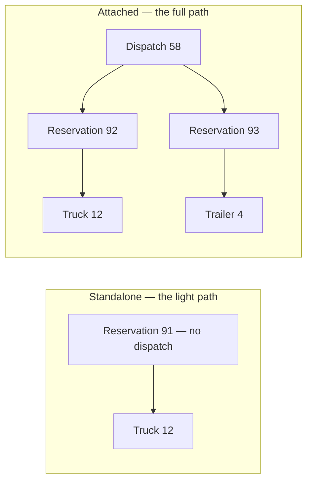
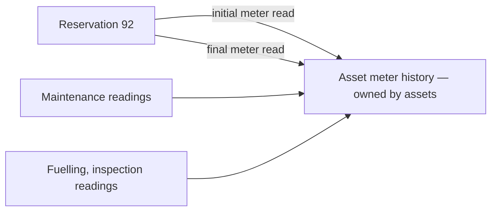
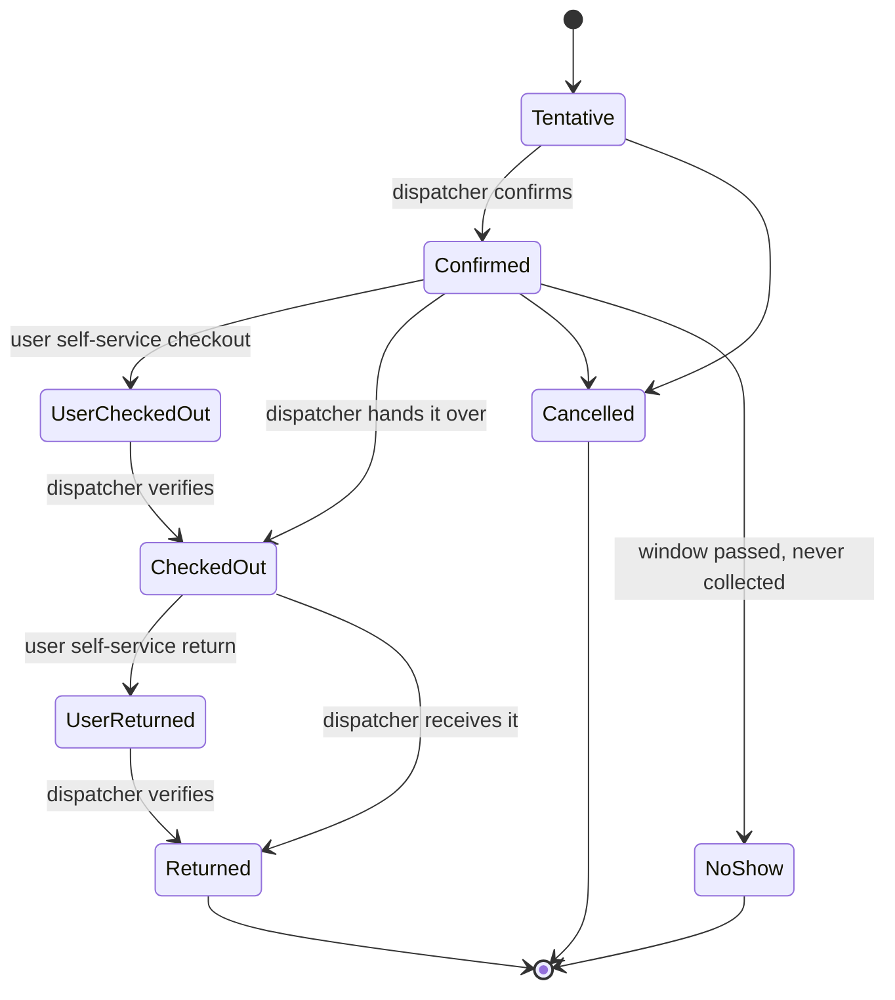
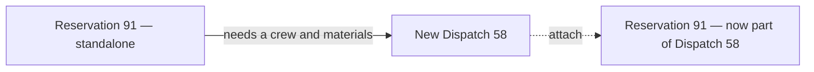

# Asset Reservations

**A reservation is a first-class object.** One asset, one window of time, one accountable
person. It stands on its own, and it can belong to a dispatch.

---

## 1. The goals a reservation serves

| Actor | Goal | Success state |
| :--- | :--- | :--- |
| **Anyone** | Book a vehicle for Tuesday without filing paperwork | A held booking, in seconds |
| **Dispatcher** | Know what every asset is committed to, and when | One calendar, one source of truth |
| **Dispatcher** | Stop two people being promised the same truck | Conflicts surfaced before they are committed |
| **Shop lead** | Take an asset out of service for maintenance | The asset shows as unavailable, for a stated reason |
| **Fleet manager** | Know condition and meter readings at handover and return | Recorded on the booking, both sides |
| **Fleet manager** | Know why an asset was out — work, customer, rental, repair | Reservation type, on every booking |

---

## 2. The core claim

> Booking a truck for Tuesday should not require filing a dispatch, stating capability
> requirements, and recording a resolution.

A reservation is a claim on **one asset's capacity** for **one window of time**. That is the
whole concept. Why it was booked, what else was needed, who paid — all context that may or may
not exist.

**The link to a dispatch is optional.** That single fact is the entire independence story;
everything else follows from it, because a reservation that can exist without a dispatch cannot
inherit anything from one.

### 2.1 Every reservation is its own event

**A dispatch is an event. Each of its reservations is a separate event.** Not a shared one, not
a section of the dispatch's.

| The dispatch's event carries | Each reservation's event carries |
| :--- | :--- |
| The conversation about the **job** — scope, timing, approvals, cost | The conversation about **that asset** — condition, damage, handover, return |
| Attachments about the job — authorisations, site paperwork | Attachments about the asset — condition photos, signed handover slips |
| One timeline for the whole need | One timeline per physical thing that moved |

Separate audiences, separate lifespans. A trailer that comes back damaged generates a
conversation nobody planning next month's job needs to read — and a photo of that damage must
attach to the trailer's booking, not to a job with four other assets on it.

It also means a **standalone reservation has a full activity record** — comments, attachments,
timeline — without a dispatch existing. The light path is not a degraded path.

---

## 3. What independence requires

Each of these exists *because* the reservation must work with nothing above it.

| Requirement | Consequence |
| :--- | :--- |
| Scoping | Its **own** ownership scope. Cannot inherit from a dispatch that may not exist |
| Lifecycle | Its **own** status, not a dispatch's |
| Schedule | Its **own** start and end, both required |
| Accountability | **Exactly one** accountable person — §5 |
| Purpose | Its **own** reservation type — §6 |
| Activity record | Its **own** event — §2.1 |
| Addressability | Its own page, reachable from the asset, the calendar, and the dispatch |
| Conflict detection | A reservation-level question, never a dispatch-level one |
| Change history | Its own update log — §8 |

**Scope is defaulted, never derived.** Created from a dispatch, it copies the dispatch's scope
at that moment. A default value, independent thereafter.

---

## 4. One reservation, one asset

The reservation **is** the per-asset record. There is no intermediate "asset line" between a
dispatch and an asset — that was two records describing one fact.

A job needing a truck and a trailer produces **two reservations**, both pointing at the same
dispatch. Each has its own status, condition record, meter readings, and handover timeline,
because in reality those diverge: the truck comes back Tuesday and the trailer stays out until
Friday.

**No sub-reservations.** A trailer towed behind a truck is two independent reservations. There
is no parent-child relationship between bookings, and no "these move together" grouping.

> **If two assets genuinely need to be managed as one unit of work, that is a dispatch.**
> A dispatch is exactly the thing that groups reservations, adds crew, and carries material.
> Building a second, weaker grouping mechanism inside reservations would duplicate it badly.

---

## 5. One accountable person

**Exactly one person is accountable for a reservation. Required, never blank, never a list.**

This is the person answerable for the asset while it is out — who signs for it, who is chased
if it is late, whose name appears on the calendar entry.

**Why exactly one:** shared accountability is no accountability. A booking with three names on
it has nobody to call when the truck is not back. If several people are involved, one of them
is still the person who signed for it.

**Crew is not accountability.** A dispatch carries the crew roster — three people on one trip
with two vehicles belong to neither vehicle. The reservation records who is answerable for
*this asset*.

Who *made* the booking is a separate and lesser fact, already captured in the record's audit
trail. It does not need a field of its own, and conflating "booked it" with "responsible for
it" is how accountability gets lost.

---

## 6. Reservation type

**Why is this asset out?** Every reservation states its type.

| Type | Meaning |
| :--- | :--- |
| **Work** | Internal operational use — our people, our job |
| **Customer** | Committed to a customer engagement |
| **Rental** | Hired out to a third party |
| **Maintenance** | Held by a shop for service, repair, or inspection |
| **Transfer** | Being relocated between sites |
| **Other** | Anything else — reason in the purpose field |

**Type is a rough label for who is consuming the asset, nothing more.** It does not record a
counterparty. A rental does not name the renter; a customer booking does not name the customer.
If who-exactly matters, that belongs in the purpose text or on a dispatch — the type exists so a
fleet manager can answer *"how much of our capacity went to rentals last quarter"*, and that
question needs a category, not a party.

### 6.1 Maintenance reservations

**A shop taking an asset out of service books it like anyone else.** Same record, same
calendar, same conflict detection — the type is `Maintenance` and the accountable person is the
shop lead.

This solves a real gap: an asset in the workshop was previously invisible to availability, so
dispatchers promised trucks that were on a lift.

**Deliberately loose coupling to maintenance work:**

> **The maintenance module enforces nothing here.** No check that a maintenance reservation has
> a corresponding work record, no check that maintenance work has a reservation, no blocking of
> either without the other.

Maintenance happens in the field and gets recorded afterwards. It happens opportunistically
while an asset is already out. It happens on assets nobody thought to book. A hard link would
be wrong more often than right, and would push people into filing fake bookings to satisfy a
rule.

The reservation says *"this asset is unavailable, because a shop has it."* That is all it
claims, and it is enough.

---

## 7. Schedule, condition, and meters

### 7.1 The window

Scheduled start and end, both required — that is the claim on capacity. Actual start and end
record what really happened. Origin and destination are free text; the system does not model
places.

### 7.2 The handover record

Two parallel tracks, deliberately not merged. The **dispatcher** track is authoritative. The
**user** track is what the person actually reported.

| Dispatcher-recorded (authoritative) | User-reported (self-service) |
| :--- | :--- |
| Condition out / condition in | Condition as the user reported it, both ends |
| Real-world times the asset **physically** left and returned | Timestamps of when the user submitted their form |
| Handover notes, both ends | The user's own notes, both ends |
| Who verified, and when the paperwork was done | Who submitted the self-service form |

**Keeping both is the point.** Merging them means the second entry silently overwrites the
first, and a discrepancy between what the user said and what the dispatcher found — the thing
worth knowing — disappears.

The distinction easiest to lose: *when the asset physically left* is not *when the paperwork was
completed*. Operational questions read the first; audit reads the second.

### 7.3 Meters — two readings, pointing outward

**Meter history belongs to the asset, not to dispatching.** It is an independent record, written
by anything that reads a meter — maintenance, inspection, fuelling, or a dispatch handover.

A reservation records **two references**: the **initial meter read** taken at handover and the
**final meter read** taken at return. Both point into the asset's own meter history. Both are
optional — plenty of reservations never involve a meter.

**Why references and not stored numbers:** usage during a booking is the difference between two
readings that already exist in the asset's history. Copying them into the reservation creates
two versions of one fact, and they drift the first time a reading is corrected.

Dispatching does not own meter data. It points at the two readings that bracket its booking.

---

## 8. Change log

A typed, queryable record of what changed on a reservation — reschedules, asset swaps, status
transitions, cancellations, extensions.

**Deliberately separate from comments.** Comments are prose for people. A reschedule is a fact:
old window, new window, who, when, why. Stored as prose it cannot be reported on, and *"how
often do bookings move, and why"* is a question a fleet manager will ask.

Both channels coexist: the change log for the machine-readable record, the reservation's event
thread for the conversation.

The log's exact fields are settled during build — likely change type, what changed, before and
after, and reason. The existing part-demand update record in procurement is the pattern to
follow.

---

## 9. Lifecycle

**Tentative versus Confirmed is what makes the light path safe.** Anyone may place a tentative
claim; only a dispatcher promotes it to confirmed. Tentative bookings appear on the calendar and
warn about conflicts, but never block.

This is also what the dispatch auto-reservation in [2_dispatch.md](2_dispatch.md) §4.2 produces:
tentative holds on the assets that were free, left for a dispatcher to confirm.

**Deletion** is allowed only before any handover has occurred, on either track. After that the
booking is history — cancel it, never delete it.

---

## 10. Conflicts

Double-booking is a clean question, because reservations are the only thing that claims asset
capacity: *does this asset have another confirmed or checked-out booking overlapping this
window?*

No dispatch involvement, no dependence on whether one exists.

**The rule:** confirming a booking that overlaps another confirmed one is blocked unless the
dispatcher explicitly acknowledges the conflict. Tentative bookings warn but never block.
Dispatchers do deliberately double-book — an asset back at noon can go out again at two — so
the answer is a recorded override, not a prohibition.

**Maintenance is included automatically**, because maintenance is a reservation type (§6.1). An
asset in the shop is booked, and the same overlap question covers it. No special case, no
cross-module check.

---

## 11. What lives here, and what does not

| Concern | Belongs to | Why |
| :--- | :--- | :--- |
| Meter readings at handover and return | **Reservation** — as two references into the asset's meter history | Per asset, per booking |
| Condition and handover record | **Reservation** | Per asset |
| The one accountable person | **Reservation** | Per asset |
| Reservation type | **Reservation** | Per asset |
| **Crew roster** | **Dispatch** | Three people and two vehicles belong to neither vehicle |
| **Material and consumables** | **Dispatch** | Raised as real demands — [2_dispatch.md](2_dispatch.md) §7 |
| **Contracts and reimbursements** | **Dispatch** | [4_dispatch_line_items.md](4_dispatch_line_items.md) |

### 11.1 The promotion boundary

This produces the most useful rule in the kit:

> **Just need the asset?** → a reservation. Light path.
> **Need a crew, material, or money spent?** → a dispatch. Full path.

**Promotion is one action, not a rebuild.** A standalone booking that turns out to need parts
and a crew gets attached to a new dispatch — the booking keeps its identity, its event, its
history, its handover record. Nothing is copied or recreated.

That reversibility is the strongest argument for the optional link: choosing the light path
wrongly costs one action to correct.

---

## 12. Business rules

| # | Rule |
| :--- | :--- |
| R1 | One reservation covers exactly one asset and one window |
| R2 | The dispatch link is optional; a reservation is fully functional without one |
| R3 | Every reservation is its own event, with its own comments and attachments |
| R4 | Exactly one accountable person, required |
| R5 | Every reservation states a type; maintenance is one of them |
| R6 | Maintenance reservations are never enforced against maintenance records, in either direction |
| R7 | Meter readings are referenced from the asset's meter history, never copied |
| R8 | Dispatcher and user handover tracks are both kept; neither overwrites the other |
| R9 | Tentative bookings warn; confirmed bookings block unless the conflict is acknowledged |
| R10 | No crew, no material, no expenses on a reservation — that is a dispatch |
| R11 | No sub-reservations. Assets moving together as one unit of work is a dispatch |
| R12 | Deletion only before handover; afterwards, cancel |

---

## 13. Deliberately not built

| Not built | Reason |
| :--- | :--- |
| **Overdue return handling** | A booking past its end date with no return does nothing — no escalation, no flag, no automatic state change. It simply stays checked out until someone acts on it |
| **Counterparty on rentals and customer bookings** | Reservation type is a rough consumer label, not a party record — §6 |
| **Recurring bookings** | A standing weekly booking is N bookings. Revisit once the base path is in real use |
| **Sub-reservations** | §4 |
| **Crew, material, expenses** | §11 — that is a dispatch |

---

## 14. Open questions

1. **No-show handling.** Automatic once the window passes, or a dispatcher's judgement? It
   affects utilisation reporting either way.

*Who may place, confirm, or cancel a booking is settled in
[5_roles_and_permissions.md](5_roles_and_permissions.md).*
