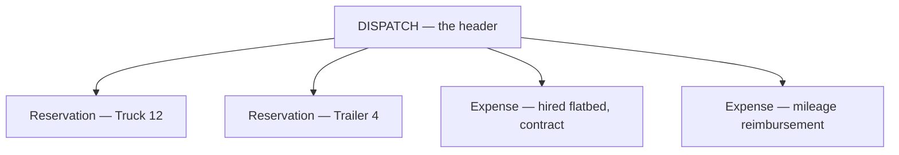
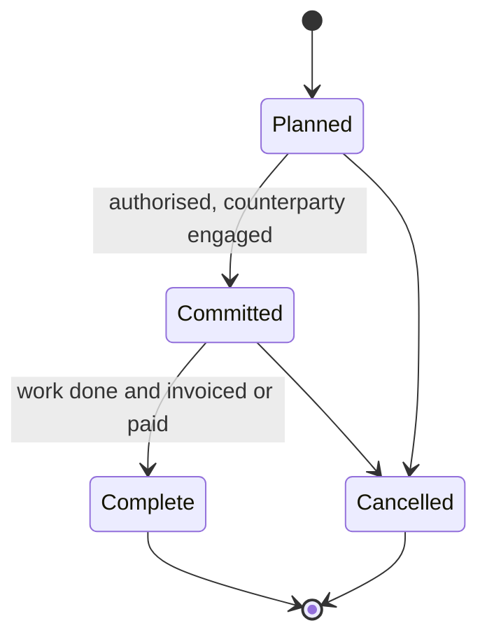
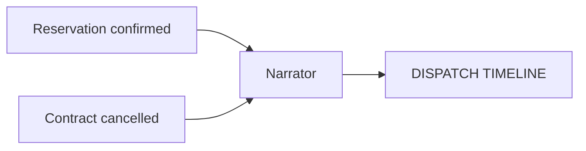

# Dispatch Line Items

**A dispatch is a header with line items.** Reservations are the expected line item. Expenses —
contracts and reimbursements — are the ones you attach when our own assets are not the answer.

*Supersedes the outcomes brainstorm. The "outcome" concept is retired; §2 explains why.*

---

## 1. The goals these serve

| Actor | Goal | Success state |
| :--- | :--- | :--- |
| **Dispatcher** | Meet a need when we have no asset free | Hire it out or authorise a private vehicle, recorded against the job |
| **Dispatcher** | Meet a need partly ours, partly bought | Both on the same dispatch, neither hidden |
| **Finance** | Know what a job cost, and to whom | Every expense is a line on a job, with a counterparty and an amount |
| **Dispatcher** | Withdraw a line without erasing it | Cancelled, with a reason, still readable |
| **Anyone reading the job** | See what happened in order, in one place | Every line item narrates itself onto the dispatch's timeline |
| **Finance** | Keep the paperwork with the record | Invoices and claim forms attached to the expense itself |

### 1.1 What these are not

> **An expense is a record of what happened, not a request for permission.**

There is **no approval workflow**. No thresholds, no sign-off chain, no pending-approval state,
no delegation rules. A dispatcher who hires a flatbed records that they hired a flatbed.
Whatever authorisation happened, happened elsewhere — in a conversation, an email, or a finance
system this module does not touch.

This is deliberate and it is a scope boundary, not an omission. Building approval infrastructure
here would mean modelling limits, delegations, escalations, and out-of-office cover — a
substantial system in its own right, and one that duplicates whatever the organisation already
uses. If evidence of authorisation matters, it attaches to the expense as a file or a comment
(§5).

---

## 2. The reframe — line items, not outcomes

The old model had four **outcomes**: reservation, contract, reimbursement, reject. One of them
was chosen, and it *was* the answer.

That framing was wrong in three ways:

| Old framing | What actually happens |
| :--- | :--- |
| One outcome is chosen | A job can be two trucks of ours **and** a hired flatbed |
| A reservation is a kind of outcome | A reservation is a booking. It exists with or without a dispatch, and it is the **normal** case, not one option among four |
| A rejection is an outcome | A rejection is the *absence* of a resolution. It never coexists with anything and never accrues cost |

**The correct shape is a header with children.** A dispatch is the header. Its children are
things committed to meet the need:

Every child is a **line item**: it has a status, it can be cancelled with a reason, and it
narrates itself onto the dispatch's timeline. Nothing "selects" an outcome. There is no
pointer to a chosen resolution, no discriminator naming which of four tables holds the answer.

**Default expectation: reservations.** A dispatch normally gets its need met with our assets.
Expenses are attached when it cannot be, in whole or in part.

### 2.1 What happened to the four outcome types

| Was | Now | Where |
| :--- | :--- | :--- |
| **Reservation outcome** | Not an outcome at all. A first-class booking, optionally attached | [3_asset_reservations.md](3_asset_reservations.md) |
| **Contract outcome** | An **expense** line item, type *contract* | §3 |
| **Reimbursement outcome** | An **expense** line item, type *reimbursement* | §3 |
| **Reject outcome** | Fields on the dispatch header. Terminal, no child record | [2_dispatch.md](2_dispatch.md) §9 |

---

## 3. Expenses — contract and reimbursement, one thing

**Contracts and reimbursements are one kind of line item.** Both record: *money went to
somebody, against a reference, because we could not do this ourselves.* The only real
difference is **who was paid**.

| | Contract | Reimbursement |
| :--- | :--- | :--- |
| Paid to | An outside company | The requester, or another person |
| Typical trigger | No suitable asset, or specialist capability needed | Someone used their own vehicle |
| Reference | Contract or purchase reference | Policy or claim reference |

Everything else — an amount, a reason, a status, a cancellation record, a counterparty — is
identical.

### 3.1 Why one record and not two

Two parallel records for near-identical things **drift**, and the previous system proves it: the
contract record carried a currency and the reimbursement record did not. Nothing justified that.
It is what happens when two hand-maintained tables describe the same concept.

One record makes that class of inconsistency impossible, and makes *"what did this job cost"* a
single question rather than an assembly job.

### 3.2 What an expense records

| Fact | Notes |
| :--- | :--- |
| The dispatch it belongs to | Required. An expense with no job is not an expense |
| Type | Contract or reimbursement |
| Status | §4 |
| Counterparty | A known supplier where one applies; otherwise a name. A supplier registry already exists — a contract should use it rather than a typed company name |
| Payee | For a reimbursement, the person being paid back |
| Amount | A single organisational currency. Multi-currency is **not built** — §3.3 |
| External reference | Contract number, policy reference, claim number |
| Reason | Why this was needed instead of our own assets. **Required** — the most useful field for reviewing how often we cannot serve ourselves |
| Notes | Free text |
| Account codes | Free text. There is no ledger or account record to point at |

**Money is money, not an approximation.** Amounts are exact decimal values.

### 3.3 One currency

**There is no currency field.** Everything is recorded in the organisation's own currency.

The old system had a currency on contracts and none on reimbursements — an inconsistency that
looked like a bug to fix by adding the missing field. It is better read the other way round:
the contract record was over-built. Nothing in operation converts, reports on, or reconciles a
second currency, so the field was decoration that invited people to enter numbers the rest of
the system could not use.

If genuinely foreign spend appears, it is converted before recording, and the original figure
goes in the notes or on an attached invoice.

---

### 3.4 Expenses carry their own paperwork

**Every expense has its own activity thread** — file uploads and comments, like any other
record in the system with a story worth keeping.

| What goes on it | Examples |
| :--- | :--- |
| **Files** | Supplier invoice, signed contract, mileage claim form, receipt, quote |
| **Comments** | Why this supplier, what was negotiated, why the amount changed, evidence of authorisation |

**History is tracked through comments, not a structured change log.** This is a deliberate
difference from reservations, which keep a typed update log
([3_asset_reservations.md](3_asset_reservations.md) §8) — and the difference is about what gets
reported on:

| | Reservations | Expenses |
| :--- | :--- | :--- |
| History via | A typed change log | Comments |
| Because | *"How often do bookings move, and why"* is a fleet metric someone will query | *"Why did this cost change"* is read once, by a person, in context |

An expense is a record of something that happened. Its history is narrative, and narrative
belongs in comments where a person can read it — not in a structured log built for a query
nobody is going to write.

---

## 4. Line item status

Every line item — reservation and expense alike — carries its own status, and **cancellation is
a status, not a deletion**.

**Expense statuses:**

| Status | Meaning |
| :--- | :--- |
| **Planned** | Intended. Nothing committed, nothing owed |
| **Committed** | Authorised. The counterparty is engaged and we are liable |
| **Complete** | Delivered and settled |
| **Cancelled** | Withdrawn. Reason, who and when recorded |

**Cancellation always requires a reason.** A cancelled line that does not say why is an
unanswered question — usually the exact question asked when the same situation recurs.

**Cancelled lines stay visible.** A job that had a contract, cancelled it, and then used our own
truck has a story worth reading. Hiding cancelled lines hides the fact that the first plan
failed — the single most useful thing in the record for anyone planning a similar job.

### 4.1 Effect on the dispatch

Line items drive the dispatch's own state, rather than being selected by it:

| Situation | Dispatch state |
| :--- | :--- |
| At least one live reservation | **Planned** |
| Resolved, no live reservation, at least one live expense | **Alternate Resolution** |
| Rejected on the header | **Rejected** |
| Everything delivered, returned, reconciled | **Completed** |

Movement in both directions is normal. A contract is cancelled because a truck freed up:
Alternate Resolution becomes Planned. A reservation falls through and the job is hired out:
Planned becomes Alternate Resolution. Neither is an error path.

---

## 5. Narration — every line item writes to the dispatch's timeline

**Every meaningful change to a line item posts a plain-language note to the dispatch's activity
timeline.** Automatically, as part of the change, never as a manual step.

This is the single feature that makes a dispatch readable. Without it, understanding a job means
opening four child records and reconstructing the order events happened in.

**What it reads like:**

> **09:14** — Reservation created for Truck 12, 14 Aug 09:00 – 17:00. Accountable: Sam Doyle.
> **09:15** — Reservation created for Trailer 4, 14 Aug 09:00 – 17:00. Accountable: Sam Doyle.
> **11:02** — Truck 12 reservation **cancelled** — *"vehicle failed pre-trip inspection"*.
> **11:20** — Contract expense added — Halloran Haulage, £480.00. *"No suitable vehicle available."*
> **14:47** — Contract **committed**.

That is a job history a person can read in ten seconds, and it assembles itself.

### 5.1 What narrates where

Reservations have their own events ([3_asset_reservations.md](3_asset_reservations.md) §2.1), so
they have two possible destinations. The split avoids drowning the job timeline in asset detail:

| Change | Reservation's own timeline | Dispatch timeline |
| :--- | :--- | :--- |
| Created, confirmed, cancelled | ✓ | ✓ |
| Checked out, returned | ✓ | ✓ |
| Condition notes, meter readings, damage | ✓ | — |
| Rescheduled | ✓ | ✓ |
| Expense added, committed, completed, cancelled | n/a | ✓ |

**Milestones go up. Detail stays down.** A dispatcher reading the job wants to know the trailer
came back; the photograph of the scratched panel belongs on the trailer's own record.

A standalone reservation narrates only to its own timeline — there is no header to narrate to.

### 5.2 Rules for narration

- **Automatic.** Part of the change itself, never a separate step someone can forget.
- **Plain language.** Written for the next person reading the job, not as a field diff.
- **Distinguishable from human comments.** A reader must be able to tell what the system recorded
  from what a colleague said.
- **Never the audit trail.** Narration is for humans. Reporting reads the change log
  ([3_asset_reservations.md](3_asset_reservations.md) §8) and the records themselves.

---

## 6. Business rules

| # | Rule |
| :--- | :--- |
| R1 | A dispatch is a header; reservations and expenses are its line items |
| R2 | Reservations are the expected line item. Expenses are attached when our assets are not the answer |
| R3 | Reservations and expenses coexist freely on one dispatch |
| R4 | Contract and reimbursement are one kind of record, distinguished by type |
| R5 | Currency is required whenever an amount is present |
| R6 | Every expense states a reason |
| R7 | Cancellation is a status, requires a reason, and never removes the line |
| R8 | Cancelled lines stay visible |
| R9 | Every meaningful line item change narrates onto the dispatch timeline |
| R10 | Reservation milestones narrate up; reservation detail stays on the reservation |
| R11 | There is no "selected outcome". Dispatch state is derived from its live line items |
| R12 | Rejection is on the dispatch header, not a line item |
| R13 | No approval workflow. An expense records what happened |
| R14 | One currency. No conversion, no second currency field |
| R15 | Every expense carries its own activity thread — files and comments |
| R16 | Expense history lives in comments, not a structured change log |

---

## 7. Deliberately not built

| Not built | Reason |
| :--- | :--- |
| **Approval workflow** | §1.1. These are records, not requests for permission |
| **Multi-currency** | §3.3 |
| **A structured expense change log** | §3.4. Comments carry the narrative |
| **A link into procurement purchase orders** | A dispatch contract resembles a purchase order, but joining them means adopting purchasing's whole lifecycle. Revisit only if dispatch contracting becomes routine |

---

## 8. Open questions

1. **Can a line item be added after Completed?** A late invoice arrives against a finished job.
   Probably yes, with the dispatch reopening — but it needs deciding.
2. **Reimbursement payee.** Usually the requester, occasionally not. Confirm whether it must
   always be stated or defaults to the requester.

*Who may add, commit, or cancel an expense is settled in
[5_roles_and_permissions.md](5_roles_and_permissions.md).*
