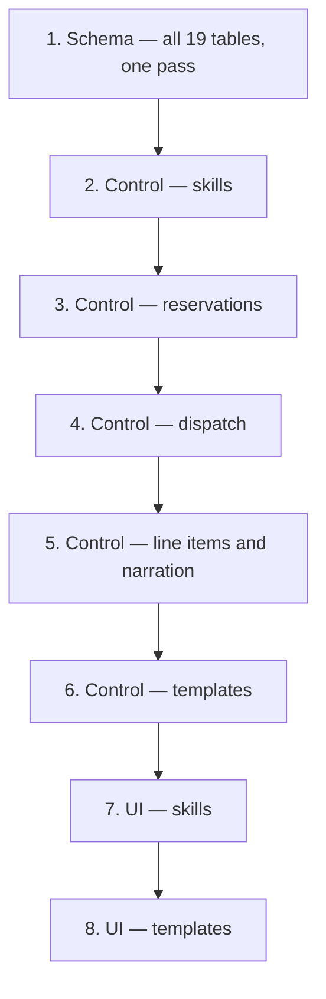

# Handoff — Dispatching Module

**Start here.** You are picking up a fully-specified module that has not been built yet.

---

## 1. What this is

A rebuild of the dispatching module from a legacy Flask application into this Django project.
The design work is finished. Every structural decision is settled and recorded. Nothing has been
written to `app/` yet.

**It is not a port.** The data and control layers are rebuilt from these documents. Only the
*screens* are ported, and only their layout.

---

## 2. Read in this order

### 2.1 Design — the specification

| Order | Document | Why |
| ---: | :--- | :--- |
| 1 | [index.md](index.md) | Orientation and the decision list |
| 2 | [2_dispatch.md](2_dispatch.md) | The spine. Everything else attaches to it |
| 3 | [3_asset_reservations.md](3_asset_reservations.md) | The biggest change from legacy |
| 4 | [4_dispatch_line_items.md](4_dispatch_line_items.md) | Depends on reservations having moved |
| 5 | [1_dispatch_templates.md](1_dispatch_templates.md) | Revisioning — the most redesigned part |
| 6 | [5_roles_and_permissions.md](5_roles_and_permissions.md) | Personas, permission groups, endpoint scoping |
| 7 | [model_diagram.md](model_diagram.md) | The whole shape, as diagrams. Fastest sanity check |
| 8 | [design_drift.md](design_drift.md) | **Non-negotiable before touching a legacy file** |

### 2.2 Build — what to do

| Phase | Document |
| :--- | :--- |
| 1 | [build_phase_1_models.md](build_phase_1_models.md) — 19 tables, one schema pass |
| 2 | [build_phase_2_control_layer.md](build_phase_2_control_layer.md) — every verb, guard, policy |
| 3 | [build_phase_3_ui.md](build_phase_3_ui.md) — templates and skills screens only |

Each names its legacy reference files by full path, with a per-file verdict.

### 2.3 Reference — consult, do not follow

| Document | Use for |
| :--- | :--- |
| [application_map.md](application_map.md) | All 93 legacy routes with source, template, and a verdict each |
| [models_review.md](models_review.md) | Legacy column-by-column detail. *"What did the old system store?"* |

### 2.4 Do not read

| File | Why |
| :--- | :--- |
| `questionnaire.md` | Every question in it is answered. Reading it re-opens settled decisions |
| `old_application_map.md` | Superseded by `application_map.md`, which has verdicts |
| `initial_prompt.md` | Superseded by the three build plans |

Safe to delete all three. They are kept only for provenance.

---

## 3. The settled decisions

Everything below is decided. **If the code disagrees with this table, the code is wrong.**

| # | Decision |
| ---: | :--- |
| 1 | **A request and a dispatch are one record.** No conversion step, no second table |
| 2 | **A reservation is standalone.** One asset, one window, its own domain and status. The dispatch link is *optional* |
| 3 | **A dispatch is a header with line items.** No "outcome" concept, nothing selected |
| 4 | **Contracts and reimbursements are one expense record**, distinguished by type |
| 5 | **Rejection lives on the dispatch header.** Terminal; resubmission is a new dispatch |
| 6 | **Material needs raise real demands** in the shared hub. No private wish list |
| 7 | **Templates are a lineage plus immutable revision rows.** The manifest belongs to the revision |
| 8 | **Template editing is session-held.** No draft rows. Four edits produce **one** revision |
| 9 | **Everything narrates** onto the dispatch timeline. Milestones up, detail stays down |
| 10 | **Both the dispatch and every reservation are events** (multi-table inheritance) |
| 11 | **Meter readings belong to the asset.** A reservation holds two references |
| 12 | **Exactly one accountable person** per reservation. Crew belongs to the dispatch |
| 13 | **Maintenance holds an asset via a reservation type.** No enforcement either way |
| 14 | **Skills are dispatching-owned**, with expiry retained |
| 15 | **Data Domain replaces major-location.** No location table |

### 3.1 Cut features — do not build

Each looks like an omission. Each is a decision.

| Cut | Note |
| :--- | :--- |
| **Multi-currency** | One organisational currency. No currency field |
| **Asset capability expiry** | Capabilities are has-or-has-not. **User skill expiry is different and stays** |
| **Approval workflows** | Expenses record what happened; they are not requests for permission |
| **Overdue return handling** | A booking past its end date does nothing |
| **Sub-reservations** | Assets moving as one unit of work is a dispatch |
| **Recurring bookings** | Out of scope |
| **Crew or material on a reservation** | That is a dispatch |
| **Counterparty on rental bookings** | Reservation type is a rough consumer label |
| **Template draft rows or draft state** | Drafts live in the session |

---

## 4. Scope

### Pass 1 — this handoff

| | |
| :--- | :--- |
| **Data layer** | The whole module — all 19 tables |
| **Control layer** | The whole module — every verb, guard, policy |
| **UI** | **Dispatch templates** and **skills** only |

The data and control layers are built in full, not just the parts pass 1's screens touch.
Building half a control layer means discovering its shape twice.

### Pass 2 — deferred

The dispatch and reservation portal: queue, review and planning, assignment, calendars, checkout
and return, expenses. **Do not build these, and do not read their legacy templates** — the
concepts drifted furthest there, and reading them invites removed ideas back in.
[build_phase_3_ui.md](build_phase_3_ui.md) §1.2 lists the directories to avoid.

---

## 5. Build sequence

Reservations before dispatch: reservations are the only operational part that works alone, so
they can be finished and verified before anything else exists. Templates last: instantiation
needs a dispatch to instantiate into.

**Any schema change means a full project rebuild, never an incremental migration.**

---

## 6. The ten traps

Ranked by how easily each slips past. Full list in [design_drift.md](design_drift.md) §4.

| # | Trap |
| ---: | :--- |
| 1 | Familiar status words with changed meanings. *Resolved* → **Alternate Resolution** is a narrowing, not a rename |
| 2 | Syncing `requested_assets` from reservations. Looks like a bug fix; destroys the field's purpose |
| 3 | Porting the outcome selector, because every legacy screen has one |
| 4 | Rebuilding the parts wish list instead of raising demands |
| 5 | Adding a currency field back, because the legacy contract page has one |
| 6 | Adding capability expiry, because the legacy capability page has the fields |
| 7 | Persisting template drafts, because legacy edits rows directly |
| 8 | Reading legacy routes where "dispatch" means what is now a **reservation** |
| 9 | Putting crew or material on a reservation, because that is where legacy had them |
| 10 | Building an approval step, because expenses commit money |

---

## 7. Changes to other applications

Dispatching is almost entirely self-contained. **One change is required elsewhere:**

> **Add a reservation event type to the `events` application.** Both the dispatch and every
> reservation are `Event` subclasses, and reservations need their own type value.

Nothing else is needed. Capability expiry was cut precisely so the assets application needs no
changes. Every other reference is outbound to tables that already exist.

---

## 8. Open questions — none of them blocking

Answer as you reach them; none prevents starting.

| Question | Where | Affects |
| :--- | :--- | :--- |
| Who may commit a template revision — same permission as authoring, or separate? | [1](1_dispatch_templates.md) §9.1 | Pass 1. Currently split |
| Should requesters see that a newer revision exists? | [1](1_dispatch_templates.md) §9.2 | Pass 1 polish |
| How long should a session working draft survive? | [1](1_dispatch_templates.md) §9.3 | Pass 1 polish |
| Cross-domain and personal templates | [1](1_dispatch_templates.md) §9.4–9.5 | Additive later |
| Does *Completed* need automatic entry? | [2](2_dispatch.md) §14.1 | Pass 2 |
| Requester visibility of the auto-reserve outcome | [2](2_dispatch.md) §14.2 | Pass 2 |
| No-show handling — automatic or judgement? | [3](3_asset_reservations.md) §14.1 | Pass 2 |
| Can a line item be added after *Completed*? | [4](4_dispatch_line_items.md) §8.1 | Pass 2 |
| Reimbursement payee — always stated, or defaults? | [4](4_dispatch_line_items.md) §8.2 | Pass 2 |
| Should a shop lead see dispatches? | [5](5_roles_and_permissions.md) §6.1 | Pass 2 |

---

## 9. Where the legacy application still rules

Three things, and only three:

| | |
| :--- | :--- |
| **Screen layout and workflow sequence** | The old interface is the UI specification. Reproduce information architecture, never visual style — legacy is Bootstrap, this is Bulma with sharp corners |
| **The dual handover tracks** | Dispatcher-recorded versus user-reported, both kept, neither overwriting the other. Legacy got this right. **Read `checkout_manager.py` before rebuilding it** rather than re-deriving the semantics |
| **Operational vocabulary** | Condition values, personnel roles, rejection categories, dispatch scopes |

Everything else: the design documents are the specification.

Legacy repository root: `/home/cb/REPOS/asset_management/`

---

## 10. Done when

**Phase 1**

- [ ] Reservation event type added to the `events` application
- [ ] All 18 new tables exist; `event_detail_dispatching` replaced
- [ ] Nothing from §3.1 exists
- [ ] Template manifest references the **revision**, not the lineage
- [ ] `requested_assets` carries its warning comment
- [ ] Every rule expressed as a database constraint, not a docstring
- [ ] `python refresh_project.py` completes and re-seeds

**Phase 2**

- [ ] Every guard exists and has tests
- [ ] Dispatch state derived from live line items, never assigned
- [ ] Every line item change narrates in the same transaction
- [ ] Reservation lifecycle works end to end **with no dispatch in the database**
- [ ] Several template edits in one session produce exactly **one** revision
- [ ] A commit against a stale head is refused

**Phase 3**

- [ ] Skills catalogue and per-person certification screens
- [ ] Template list, detail, session draft editor, commit, copy, retire, revision history
- [ ] No assignment in a modal; no card hidden when empty
- [ ] Every screen survives a plain page reload
- [ ] Permission-granted-but-domain-denied resolves 404, not 403
- [ ] Side-by-side screenshots, legacy against new
- [ ] `./venv/bin/python manage.py check` passes

---

## 11. If something here is wrong

These documents were written before any code existed, so some of it will meet reality badly.

**Correct the document, then build.** A build that silently diverges from the specification
leaves the next person with two sources of truth and no way to tell which won. The decisions in
§3 in particular were each argued for a reason — if one is wrong, the reason is worth
understanding before it is reversed.
