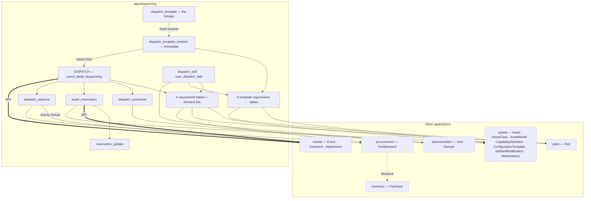
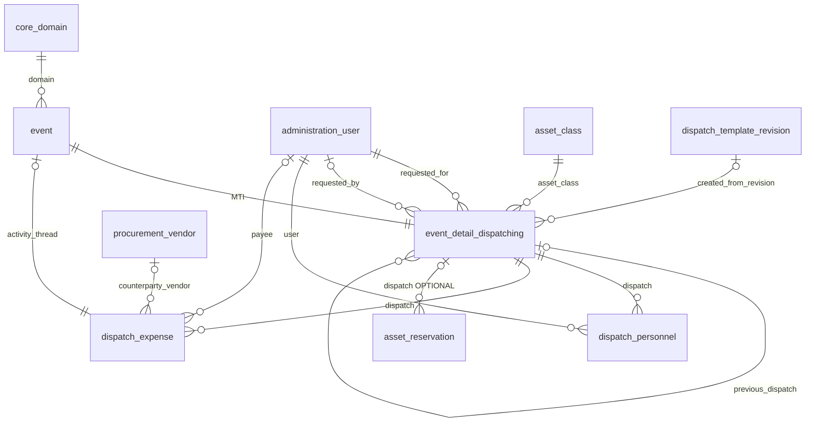
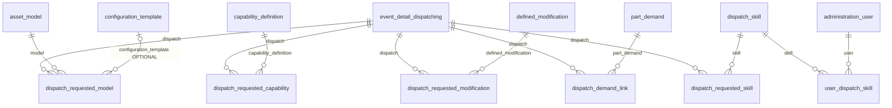
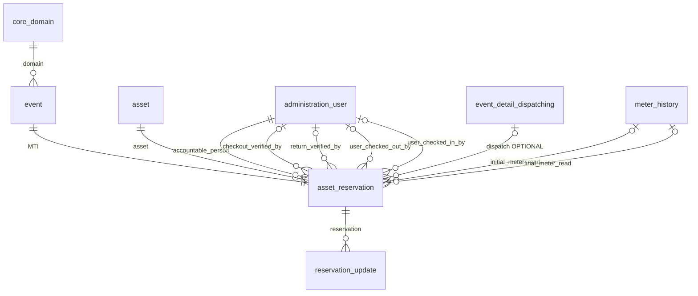
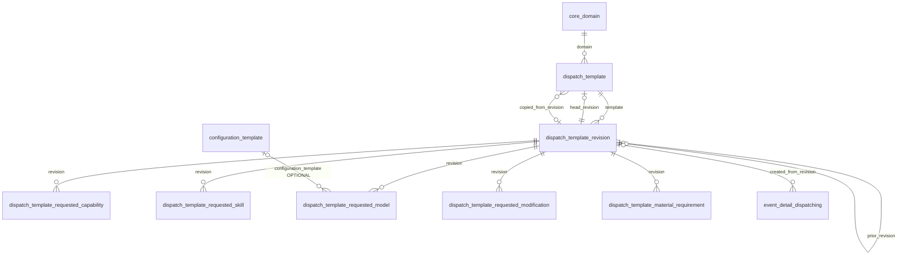
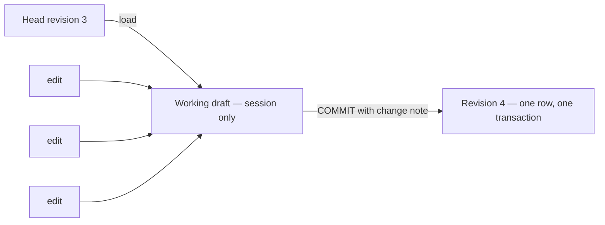
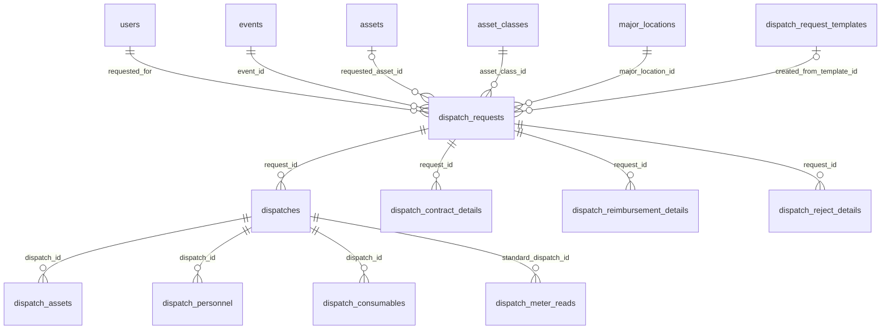
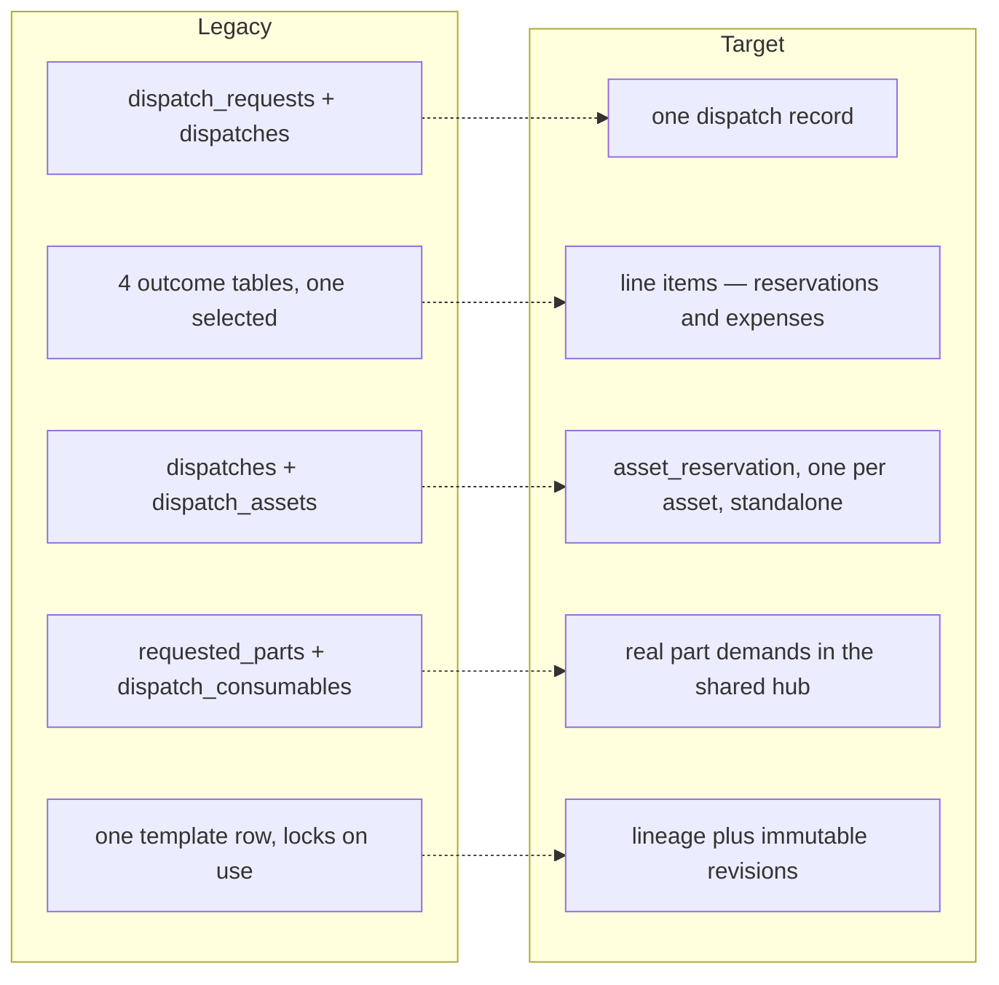
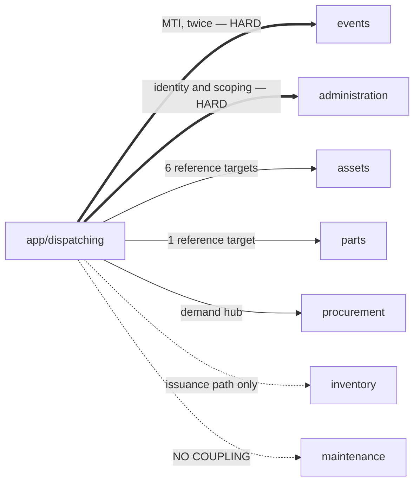

# Model Diagram

The dispatching data model **as it should be built**, plus the legacy model it replaces.

Column detail lives in the design documents; this is about **shape** — what points at what.

---

## 0. How to read these

| Symbol | Meaning |
| :--- | :--- |
| `\|\|--o{` | **Required** reference — the child must have a parent |
| `\|o--o{` | **Optional** reference |
| `\|\|--\|\|` | One-to-one |

Relationship labels are the field name on the child side. Audit fields (`created_by`,
`updated_by`) are present on every table and omitted everywhere — drawing them turns every
diagram into a hairball centred on the user table.

---

## 1. Target — the whole module

**Four things this shows that the legacy model could not:**

1. **Reservations hang off the dispatch by an optional link** — and can exist with none.
2. **Both the dispatch and each reservation are events.** Two `MTI` edges, not one.
3. **Templates are two records** — a lineage and its immutable revisions.
4. **There is no outcome table.** Reservations and expenses are siblings under the header.

---

## 2. Target — the dispatch and its line items

**`requested_assets` is not on this diagram** because it is not a reference. It is a free-form
informational list, written once and never synced. → [2_dispatch.md](2_dispatch.md) §4

**Rejection is not on this diagram** because it is not a record. Reason, category, alternative
suggestion, and resubmission fields sit on `event_detail_dispatching` itself.
→ [2_dispatch.md](2_dispatch.md) §9

---

## 3. Target — requirements

**Material is the odd one.** The other four point at a catalogue. Material points at a **real
demand** in the shared procurement hub, raised the moment the dispatch states the need — not a
private wish list. → [2_dispatch.md](2_dispatch.md) §7

**Configuration template is not its own requirement row.** It rides on `dispatch_requested_model`
as an optional FK, since a configuration means nothing without a model as its subject — there is
no `dispatch_requested_configuration_template` table. → [1_dispatch_templates.md](1_dispatch_templates.md) §6.4

---

## 4. Target — reservations

**Three deliberate shapes here:**

| | |
| :--- | :--- |
| **One asset, one booking** | There is no per-asset line beneath a reservation. The reservation *is* the per-asset record |
| **Two meter references, no meter table** | Meter history belongs to the asset and is written by anything that reads a meter. Dispatching points at the two readings bracketing its booking |
| **Exactly one accountable person** | Crew belongs to the dispatch. The four other user references are handover audit, not accountability |

→ [3_asset_reservations.md](3_asset_reservations.md)

---

## 5. Target — templates

**The manifest hangs off the revision, never the lineage.** That single arrangement is what
makes a revision immutable, and therefore what makes a dispatch's reference to it permanent.

**There are no draft rows.** Editing happens in a session-held working draft; a revision row is
created once, at commit. Four edits produce one revision.
→ [1_dispatch_templates.md](1_dispatch_templates.md) §3.2

---

## 6. Legacy — what is being replaced

Accurate for the old system. Useful when reading legacy code or screens.

### 6.1 Legacy request and outcomes

Legacy also carried an **untyped pointer** — `active_outcome_type` plus `active_outcome_row_id`,
an integer with no foreign key, naming which of four outcome tables held the answer. It cannot
be drawn because the database did not know it was a reference.

### 6.2 The five structural changes

Also gone: `major_locations` (Data Domain does that job), `dispatch_meter_reads` (two references
into asset meter history), `dispatch_capabilities` and `asset_dispatch_capabilities` (already
deprecated in legacy; the assets application owns capabilities).

Full narrative in [design_drift.md](design_drift.md). Column-level detail in
[models_review.md](models_review.md).

---

## 7. Reverse references — the form-versus-wizard input

One reverse reference is a form with a section. Two or more is a wizard.

| Record | Reverse references | Verdict |
| :--- | ---: | :--- |
| **Dispatch** | 5 requirements + demand link + crew + reservations + expenses + self | **Wizard.** Six are pool-attachment, so **no modals** |
| **Template revision** | 6 requirement tables | **Wizard** — but session-backed, committing once |
| **Template lineage** | revisions, head, dispatches raised from it | Mostly read-only cards |
| **Asset reservation** | `reservation_update` only | **Form with sections.** The light path stays light |
| **Dispatch skill** | user certifications, plus two read-only "required by" lists | **Simple registry form** |
| Expense, personnel, all requirement rows | none | Plain forms |

---

## 8. Application dependencies

| Application | Coupling |
| :--- | :--- |
| `events` | **Hard.** Both the dispatch and every reservation are events. Requires adding a reservation event type — the only change dispatching forces on another application |
| `administration` | **Hard.** Users throughout; Data Domain is the scoping axis and also absorbs what major-location used to do |
| `assets` | Medium. Six reference targets. **No changes required** — capability expiry was cut |
| `parts` | Light. One reference target |
| `procurement` | Behavioural. Demands are raised and cancelled through the hub |
| `inventory` | Behavioural only. Stock never moves except through the shared issuance path |
| `maintenance` | **None, deliberately.** A maintenance-type reservation is checked against nothing |

**Every edge is outbound.** Nothing points back into dispatching, so it can be built and later
refactored without touching another application's schema — the one exception being the new
event type.
