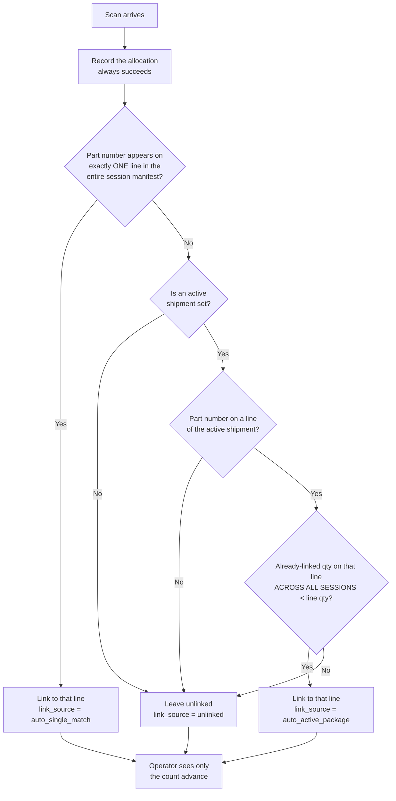
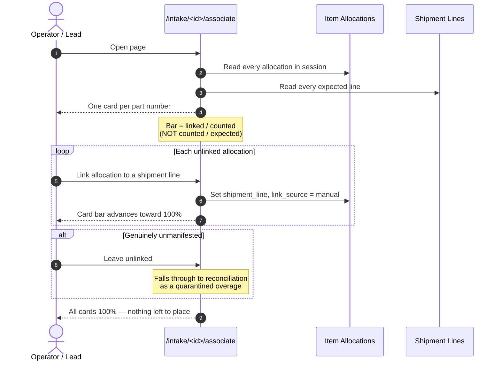
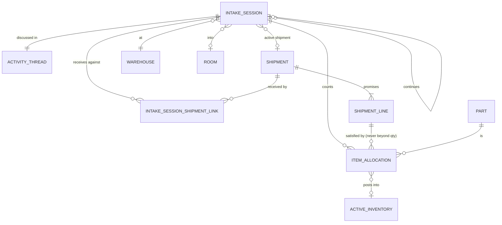

# Intake Portal — Multi-Page Workflow & Data Model

**Status:** proposed — supersedes the single-page `session_detail` surface.

---

## 1. Why this exists

The current intake session page carries the entire receiving process on one
route: scan input, line progress, staged pool, allocation history,
reconciliation, and the commit button. It is unreadable because it asks one
reader to hold five unrelated jobs in their head simultaneously.

The fix is **one page per decision**, because different people make different
decisions at different times. The dock operator counting boxes is not the
person who signs off on a ten-unit shortage with a vendor.

### 1.1 Deliberate convention exception

This project's standing rule is *creation flows are one long scrolling page*
([multi_step_flows.md](../../harness/UX_UI/design_patterns/multi_step_flows.md)).
Intake is an explicit exception. The rule exists because a step chain is
friction when **one person completes the whole thing in one sitting**. Intake
violates that premise three ways:

| Premise of the wizard rule | Intake's reality |
| :--- | :--- |
| One actor | Operator counts, manager disposes — different authority |
| One sitting | A shortage sign-off can wait a day for a vendor call |
| Nobody needs a deep link | A manager needs a URL they can be *sent* |

Handoff-driven processes get addressable URLs. "Scroll to card four" is not a
link. **Do not refactor this back into a wizard.**

### 1.2 Design philosophy

> *"Truth here is a blurry concept. This is just a system for humans to try and
> do their best."*

Hold onto that when a design question gets hard. This system **assists** careful
people; it does not police careless ones. Where a rule would add friction in
order to enforce a precision the physical world cannot deliver anyway, prefer
the looser rule.

Three consequences that recur throughout this document:

- Auto-association fails **silently** rather than blocking an operator (§5.3).
- Discrepancies are never **approved** or **closed**, because the real fix is a
  person walking back to the pallet, not a status change. The system prevents
  what it can, shows the rest, and leaves it visible (§7.1).
- Stock posts **all-or-nothing**, because once stock merges into the pool its
  per-receipt traceability is gone regardless (§4.3).

### 1.3 Vocabulary

**"Package" means shipment.** There is no physical box or carton entity in this
system and none is planned. Where operators say "package," the record is a
`procurement.Shipment`. This document uses **shipment** throughout.

---

## 2. The seven surfaces

| # | Route | Job to be done | Primary actor |
| :-- | :--- | :--- | :--- |
| 1 | `/inventory/intake/create` | Choose which shipments this run receives against | Dock operator |
| 2 | `/inventory/intake/<id>/record` | Get every physical item counted | Dock operator |
| 3 | `/inventory/intake/<id>/associate` | Match what arrived to what the paperwork promised | Operator or lead |
| 4 | `/inventory/intake/<id>/discrepancies` | **Read** what does not match, and why | Manager / buyer |
| 5 | `/inventory/intake/<id>/` | See the whole picture, know what's next, post stock | Anyone |
| 6 | `/inventory/intake/` | Find a session | Anyone |
| 7 | `/inventory/intake/<id>/print` | Paper receipt with barcodes | Anyone |

`/inventory/intake/<id>/` is the canonical URL — review is its default
representation. There is no separate `/view`.

> **Route note:** the print page was originally specified as
> `/inventory/intake/session/8/print`. Every other route in this plan drops the
> `session/` segment, so it is aligned here for consistency.

### 2.1 Page 1 — Create

Unchanged from today's "Start Scan Session" page; it moves from
`/inventory/intake/scan/` to `/inventory/intake/create`.

### 2.2 Page 2 — Record

Stripped to **counting only**. No linking UI, no staged pool, no
reconciliation. The operator's entire mental model here is *"is everything in
the boxes now in the system?"*

- Progress bars aggregate **by part number**, summed across every associated
  shipment. Part A appearing on three shipments is **one bar**.
- An **active shipment** indicator sits prominently on the page (§5).
- Auto-association runs silently behind every scan (§5). The operator is never
  interrupted by it and never sees a linking failure.
- Secret keyboard commands are available in the scan field (§6).

### 2.3 Page 3 — Associate

One card per part number. Inside each card: the shipment lines on one side, the
recorded scans on the other, plus a linking utility.

This is the **allocation portal** in its session-scoped form (§7.3). A line can
never be allocated beyond its quantity (§7.2).

### 2.4 Page 4 — Discrepancy Report

**Read-only.** One card per part number showing what does not match, plus the
shipment graph when the session's closure reaches beyond itself. No sign-off, no
approval, no buttons that change state (§7.4). Links out to the allocation portal
for anything actionable.

### 2.5 Page 5 — Review

Static. Action buttons at the top route to pages 2/3/4/7 and indicate what needs
doing next. Carries the **Approve Session** button (§4.3) and the activity
thread (§8).

### 2.6 Page 6 — Index

Cards, infinite scroll, hand-rolled HTML/CSS. Carries the "waiting on me" filter
that substitutes for notifications (§10, Q6).

### 2.7 Page 7 — Print

See §9.

---

## 3. The two progress bars mean different things

This is the single most important clarification in this document, and it is
worth putting in the page headers verbatim.

**Scenario:** a shipment line expects 50 units of Part A. 25 physically arrive.

| Page | Bar reads | Question it answers |
| :--- | :--- | :--- |
| **Record** | **50%** — 25 counted of 50 expected | *Did it all show up?* |
| **Associate** | **100%** — 25 of 25 counted units are linked | *Did I file it all?* |

The Associate bar measures **clerical completeness against what is physically
present**, not vendor fulfilment. A 100% Associate bar with a 50% Record bar is
a correct, complete, well-filed short shipment — and the shortage is page 4's
problem, not page 3's.

Conflating these two is what made the original page incomprehensible.

**The Associate bar cannot exceed 100%**, because a line can never be
over-allocated (§7.2). Excess simply stays unlinked, and unlinked items are the
allocation portal's business.

---

## 4. Lifecycle — posting stock is not the same as closing paperwork

### 4.1 The insight that reshapes the model

> *After a scan session, a user should be able to stock the items and lock the
> intake records while admin figures out the rest.*

Stock availability and paperwork closure are **independent**. Warehouse staff
need the parts pickable today; the buyer needs a week to argue with the vendor.
Today's single `status` enum (`DRAFT → ACTIVE → RECONCILING → CLOSED`) forces
them to be the same event, which is why the UI could not be made legible.

Association and reconciliation are **abstract, revisitable activities** that can
happen at any point in a session's life. They are not stages in a pipeline.

### 4.2 Two independent axes

| Axis | States | Reversible? |
| :--- | :--- | :--- |
| **Recording** | Open → Locked | Out of scope for now (see §4.5) |
| **Stock posting** | Not posted → Posted | **No.** The only one-way door. |

Paperwork has no lock at all — see §4.4.

### 4.3 The fork at the end of recording

When the operator finishes counting, "Close & Commit" is replaced with an
explicit two-option fork:

1. **Add items to stock now** → locks recording, posts stock, and lands the user
   on the session review page (page 5).
2. **Continue to shipment associations** → locks recording, does **not** post
   stock, and lands the user on page 3.

Either way, recording locks **only when the user explicitly says so.** Nothing
auto-locks.

On page 5, an **Approve Session** button posts stock for sessions that took
option 2. Approval is the deliberate, irreversible act — it is never a side
effect of finishing reconciliation.

**Stock posts all-or-nothing.** There is no partial posting of clean lines while
disputed lines wait. Once stock is posted it merges into the general pool and
loses its per-receipt traceability anyway, so splitting the act would multiply
the state space for no recoverable benefit.

### 4.4 There is no reconciliation lock — deferred

**Decision: drop paperwork locking entirely for this build.**

Cross-session visibility (§5.5) makes a paperwork lock a distributed-state
problem. If someone reopens *their* session and edits an allocation, every other
session's reconciliation review that depended on those numbers is silently
invalidated — so a lock would have to either cascade across sessions or lie.
Both are worse than not having one.

That reasoning was the first step toward removing the approval concept
altogether (§7.1). With nothing to sign off, there is nothing to lock:

- Nothing is ever frozen on the paperwork side.
- No unlock permission is needed, which retires the whole Q7 question.
- Discrepancies stay visible indefinitely rather than being closed out.

**The recording lock and stock posting are unaffected and still very much
wanted.** Once the technician finishes scanning, recording locks and parts move
into inventory. That is the lock that matters operationally, and it is
session-local, so none of the above applies to it.

### 4.5 Corrections are out of scope

People make mistakes and recorded sessions will need after-the-fact editing.
**Deliberately deferred.** For this build:

- Recording locks when the user asks it to, and stays locked.
- If more items need counting, the operator **opens a second session**, which may
  reference the first (§7.4).

---

## 5. Auto-association policy

### 5.1 The active shipment

The record page displays an **active shipment** — one of the session's associated
shipments, set by the operator. It is set by scanning the shipment's barcode
(printable from page 7, §9) or picking it from a list.

Its only job is to break ties. When a part number appears on more than one
shipment in the manifest, the active shipment tells the system which one the
operator is physically standing in front of.

### 5.2 The policy



### 5.3 The governing principle

**Silent non-association is the default and correct outcome.** Auto-linking is a
convenience, not a requirement. The operator is *never* shown a linking failure,
never blocked, and never asked to resolve ambiguity while holding a box.

Everything left unlinked flows to the allocation portal (§7.3), which exists
precisely to handle it. This is the rule that keeps page 2 usable at speed.

The quantity cap in the flowchart above is not an auto-association nicety — it
is the universal over-allocation rule (§7.2) applied here like everywhere else.

### 5.4 Sequence

```mermaid
sequenceDiagram
    autonumber
    actor Op as Dock Operator
    participant P2 as /intake/<id>/record
    participant Matcher as Association Policy
    participant Alloc as Item Allocations

    Op->>P2: Scan shipment barcode (from printout)
    P2->>P2: Set active shipment
    P2-->>Op: Active shipment shown prominently

    loop Every item in that shipment
        Op->>P2: Scan item barcode
        P2->>Alloc: Record allocation (always)

        P2->>Matcher: Which line, if any?
        alt Unique part across whole manifest
            Matcher-->>Alloc: auto_single_match
        else On active shipment AND under line qty
            Matcher-->>Alloc: auto_active_package
        else Anything else
            Matcher-->>Alloc: unlinked (silent)
        end

        P2-->>Op: Count bar advances
        Note over Op: No linking feedback at all —<br/>speed is the priority
    end

    Op->>P2: Scan next shipment barcode
    Note over P2: Active shipment switches;<br/>repeat
```

### 5.5 Cross-session allocations are visible and locked

**This is the most structurally important decision in the document.**

When a session opens, for every shipment line in its manifest the system looks
for allocations against that line **from any other intake session**, and displays
them **dampened grey and locked** — visible, uneditable, and counted.

They appear on:

| Surface | Shown? |
| :--- | :--- |
| Page 2 — Record | **Yes**, dampened/locked in the line context |
| Page 3 — Associate | **Yes**, dampened/locked among the linked records |
| Page 5 — Review summaries | **Yes** |
| Page 7 — Printout | **No** |

They are excluded from the printout because the printout is a working document
for *this* receiving run. Another session's work is not actionable on the dock
and would be noise on paper.

**Locked, not editable.** You can see another session's records but never touch
them — they belong to that session's audit trail and possibly to another
operator's lock state. Read-only across the boundary, editable within it.

#### Why this matters

**1. It makes the second-session policy actually work.** §4.5 says that when
more items need counting, the operator opens a *new* session. Without
cross-session visibility, session 2 opens showing a line at 0% received when
session 1 already took 40 of 50 — the operator sees a phantom total shortage and
either panics or double-counts. With it, session 2 opens showing "40 already
received, 10 outstanding" and the picture is immediately correct. **This decision
is a prerequisite for the second-session policy, not an enhancement to it.**

**2. It makes the auto-association cap correct.** §5.2 auto-links only while
already-linked quantity is under the line quantity. If "already-linked" counted
only *this* session, session 2 would cheerfully auto-link another 50 units onto a
line session 1 already filled — manufacturing an overage out of nothing. The cap
is only meaningful when it counts every session.

**3. It prevents duplicate receiving.** Two clerks, two docks, same purchase
order. Today both count, both link, and the double-count is discovered at
reconciliation. Now the second clerk sees the line already satisfied.

**4. It makes reconciliation honest.** A discrepancy is a property of a
**shipment line**, not of a session. If session 1 received 40 and session 2
received 10 against a line expecting 50, there is no shortage at all — but
session-scoped reconciliation would raise a 10-unit shortage in session 1 and a
40-unit shortage in session 2, and both would be fiction.

**5. The calculations get simpler, not harder.** Every progress figure becomes
one formula — *all live allocations against this line* — instead of two
(`this session's` and `everyone else's`). The session stops being a special case
in the arithmetic and becomes a **display filter over a shipment-line-grain
truth**. That is a smaller, more honest model than the one it replaces.

#### The rule underneath all five

> **The shipment line is the unit of truth. The session is a lens onto it.**

Everything above follows from that single sentence. It is worth putting in the
control layer as a comment.

#### Scope of "other sessions"

Included: any **live** allocation, from any session, linked to the line.
Excluded: cancelled and soft-deleted sessions and allocations.

Allocations from another session that is still **open** are included and counted,
which means a bar can move backwards if that session deletes a row. That is
accepted — see §14 Q19 for whether open-session allocations should be visually
distinguished from posted ones.

---

## 6. Scan-field commands

The scan input accepts reserved command payloads. A barcode scanner is just a
keyboard, so the operator's hands never leave the gun.

| Payload | Action |
| :--- | :--- |
| `CMDXDELETE` | Delete the last recorded allocation. Repeatable — walks backwards through the session's history one row at a time. |
| `CMDXSERIAL` | Open a single-field modal to capture a serial number, applied to the **last recorded allocation** |
| `CMDXQTY1` | Always **add 1** to the last recorded allocation's quantity |
| `CMDXQTY10` | If quantity is 1, **set** it to 10; otherwise **add** 10 |
| `CMDXQTY100` | If quantity is 1, **set** it to 100; otherwise **add** 100 |

### 6.1 Why the quantity commands behave asymmetrically

A scan always creates an allocation of quantity 1. The operator then looks at
what is in their hand and says one of two things:

- *"This is a box of ten"* — the 1 was wrong. **Set** to 10.
- *"Here's another box of ten"* — the 10 was right. **Add** 10.

Quantity 1 is therefore treated as "not yet quantified" rather than as a real
count of one, and the same command reads the operator's intent correctly in both
cases without a second keystroke. `CMDXQTY1` has no such ambiguity to resolve, so
it always increments.

**There are no reduce commands.** Over-counting is corrected by editing the row
by hand, or by walking `CMDXDELETE` backwards. A one-keystroke way to silently
decrement a count is a way to lose stock without a trace, and the recovery path
is not symmetric with the mistake.

### 6.2 A serial number means quantity 1

**Invariant:** an allocation carrying a serial number always has quantity
exactly 1. A serial identifies one physical object; a quantity of 5 against one
serial is meaningless.

This should be a **database constraint**, not just a convention —
`serial_number = '' OR quantity = 1`.

Two consequences for the commands:

- **All `CMDXQTY*` commands are refused** on a serialised allocation, with a
  clear message. This is a data-corruption path, not a preference.
- **`CMDXSERIAL` forces quantity to 1** on the allocation it is applied to. If
  the operator had already run `CMDXQTY10`, capturing a serial is a contradiction
  and must be refused rather than silently resolved.

### 6.3 Rules

- The `CMDX` prefix is a **reserved namespace**. Matching is exact, whole-payload,
  and case-sensitive — a real barcode that merely *contains* `CMDX` is never
  treated as a command.
- Commands only work while recording is open. On a locked session they are
  ignored like any other input.
- Every command produces **loud confirmation** in the live region. These are the
  one place in the record flow where silence would be dangerous — deleting the
  wrong row must be visible immediately.
- `CMDXSERIAL`'s popup is a single-field capture, which is exactly what the
  [modals guide](../../harness/UX_UI/design_patterns/modals.md) permits a modal
  to be used for.

**Worth doing at the same time:** print these four commands as barcodes on a
card taped to the workstation. Then they are scannable, not typed, and the
feature costs the operator nothing to learn.

---

## 7. Passive resolution

### 7.1 There is no approval step

**Reconciliation approval is eliminated.** No sign-off, no acceptance, no
resolution types, no reconciliation tables, no propagation across sessions.
Nobody ever declares a discrepancy "handled."

Instead the system prevents the one thing it can prevent, surfaces everything
else, and gives people a good tool to fix what they choose to fix:

| Old approach — active | New approach — passive |
| :--- | :--- |
| Manager signs off each discrepancy | Nothing to sign |
| Over-allocation detected and reviewed | **Over-allocation is impossible** (§7.2) |
| Excess quarantined pending disposition | Excess stays unlinked; the allocation portal makes it easy to place (§7.3) |
| Page 4 is a decision surface | Page 4 is a **report** (§7.4) |

**This does kick the can down the road**, and that is accepted. Discrepancies
are never formally closed — they remain visible until someone chooses to act.
What the system guarantees is that they are never *hidden* and never *invalid*.

**Everything is a live mirror.** Discrepancies are derived fresh on every read,
across all sessions (§5.5). Nothing is stored, so nothing can drift, and there
is now nothing to invalidate when a link changes.

### 7.2 Over-allocation is impossible

**Hard rule:** the sum of live allocations linked to a shipment line may never
exceed that line's quantity. Enforced on every write path — auto-association
(§5.2), manual linking on page 3, and the allocation portal (§7.3).

This is the decision that lets approval be deleted. The most damaging
discrepancy — a line claiming more received than was ever ordered — simply
cannot be created, so nobody needs to review it after the fact.

**Consequences:**

- Excess physical stock **stays unlinked**. That is its terminal state, not a
  pending task. Unlinked means quarantined in the intake room.
- The Associate progress bar (§3) now reaches 100% and stops, by construction.
- The operator gets a clear message when a line is full: *"This line is fully
  allocated (50/50). The remaining 5 units stay unlinked as excess."* Not an
  error — an explanation.

**Implementation notes:**

- This is an aggregate across rows, so it cannot be a simple database
  `CheckConstraint`. It belongs in the control layer, and the line must be
  locked for update while the sum is checked and the write applied.
- The rule is enforced **at write time**, not as a standing invariant. If
  procurement later reduces a line's quantity below what is already allocated,
  the existing rows stand. That is a report on page 4, not a violation to fix.

### 7.3 The allocation portal

Unlinked items are placed through an **allocation portal** — a linking surface
whose whole job is to make *received quantity* meet *unmet shipment-line
quantity* with as little effort as possible.

**Two entry points, one surface:**

| Route | Default scope |
| :--- | :--- |
| `/inventory/intake/<id>/associate` | This session's unlinked items and its shipments' lines |
| `/inventory/intake/allocate` | Every unlinked item and every unmet line the user may see |

Same template, same logic, different default scope, with a control to widen or
narrow. Building two separate linking UIs would be a mistake — this is one job.

**Why the global scope matters:** excess counted in session 1 can fill a
shortage discovered in session 2. Without a way to reach across sessions, that
stock sits quarantined forever while somebody re-orders parts already on the
shelf. The portal is the tool that makes passive resolution actually work
rather than merely tolerable.

**What it shows:** unlinked allocations on one side, unmet lines on the other,
matched by part number, with remaining quantity on each. Assignment happens
in-page per the project's assignment-card convention — never in a modal.

### 7.4 Page 4 is a report, not a workflow

The reconciliation screen survives, with every control removed. It shows:

- Every shipment line whose allocated quantity differs from expected.
- Whether that is a shortage, an overage of unlinked stock, or rejected units —
  all derived, never chosen.
- The shipment graph, when the current session's closure reaches beyond itself
  (see the [graph closure note](tech_debt/intake_shipment_graph_closure.md)).
- Links out to the allocation portal for anything actionable.

**No buttons that change state.** A user reads it, and if something needs doing,
they go and do it somewhere that is honestly named for the doing.

The page is named **Discrepancy Report**, and its route is
`/inventory/intake/<id>/discrepancies`. "Reconcile" is a verb, and the page no
longer supports one — a route that promises an action it does not offer is a
small lie repeated on every visit.

### 7.5 Continuation sessions

An intake session may reference an earlier session it continues. The user
searches for and selects the prior session.

**This is display-only.** Nothing in the system reads it, aggregates across it,
or validates against it. It exists so a human reading session #12 can see it
followed session #8. Do not build logic on it.

### 7.6 Rejection reasons go to the activity thread

There is **no per-allocation rejection-reason column.** When an item is marked
rejected, `IntakeNarrator` writes a comment onto the session's activity thread,
prefixed with the line identifier as plain text.

Nothing parses that prefix. It is a human breadcrumb, deliberately unstructured,
and can be promoted to a real column later if it turns out to matter.

---

## 8. Activity thread

Every intake session carries an **activity thread** — comments and file
attachments, chronological, visible on the review page.

This is not new machinery. `events.ActivityThread` already provides exactly this
and is already attached this way by `Asset.documentation` (a `OneToOne` created
alongside the parent record by its factory). Intake reuses the same pattern.

The thread carries both human comments and `IntakeNarrator` machine comments
(§7.6).

**Why it matters here:** the process spans multiple people and multiple days.
The vendor conversation, the photo of the crushed box, and the credit-memo
reference all need somewhere to live that is attached to *this receipt*. Without
it, that context lives in email and is lost.

---

## 9. The printable receipt

### 9.1 Why paper

People still want paper. A clerk walking a dock wants a sheet on a clipboard,
and a second human-readable record of what was received is worth having even
when the system already knows.

### 9.2 Hard requirements

**Route:** `/inventory/intake/<id>/print`

- **Pure view.** No navigation, no breadcrumb, no sidebar, no links of any kind.
  This page is not part of the application chrome — it is a document.
- **A single Print button, top right**, which opens the browser's print dialog.
- **Print CSS hides that button** (`@media print { display: none }`). Nothing but
  the document survives to paper.
- **Intake session barcode** at the top.
- **Every shipment gets its own barcode.**
- **Parts listed under each shipment.**
- **Pen-and-paper columns** on every part line: *Qty Accepted*, *Qty Rejected*,
  *Total Qty* — printed as blank ruled boxes.

### 9.3 Two print modes

The sheet serves two different moments, so it has two modes on the one route:

| Mode | Lists | Printed when |
| :--- | :--- | :--- |
| **Pick sheet** | Expected shipment lines, quantities blank | Before counting — a clipboard checklist to carry to the dock |
| **Receipt** | Recorded allocations with actual quantities | After counting — a record of what happened |

Both carry the barcodes and the pen-and-paper boxes. On the pick sheet the boxes
are for tallying; on the receipt they are for annotating corrections.

**Layout:** one continuous document, with items **grouped under their shipment**.
Each shipment's barcode heads its group. No forced page break per shipment — the
grouping gives the structure, and a continuous sheet wastes less paper on
sessions covering many small shipments.

### 9.4 Barcode encoding

**Code 128**, encoding a **prefixed token** rather than a bare integer:

| Object | Encoded value |
| :--- | :--- |
| Intake session | `INTAKE-8` |
| Shipment | `SHIP-142` |

The prefix costs nothing and prevents an entire class of mistake: a bare `8`
scanned into the item field is indistinguishable from a quantity or a short SKU
and will be silently mis-recorded. `INTAKE-8` is self-identifying — the scan
handler knows immediately that it was pointed at the wrong field, and can say so.

**Barcodes render on the printout only.** No barcode appears anywhere in the web
UI. Scanning a computer screen does work, and people will discover that, but it
is not the intended way of working and the system should not invite it. Paper is
the scannable surface; the screen is the working surface.

Setting the active shipment on page 2 is therefore done either by scanning the
printout or by picking from a list (§5.1).

### 9.5 The pen-and-paper columns are not inputs

The system does **not** read, validate, enforce, or reconcile anything written
in those boxes. They exist so a human can tick a clipboard. If the paper and the
system disagree, the system is not aware there was a disagreement.

State this on the sheet itself so nobody assumes otherwise.

### 9.6 The closed loop worth noticing

The shipment barcodes on this printout are what the operator scans to set the
**active shipment** on page 2 (§5.1). Print the sheet, carry it to the dock,
scan the shipment header off the paper, then scan the items under it.

Paper and scanner reinforce each other instead of competing.

---

## 10. Sequence diagrams

### 10.1 Clean receipt — the common path

Most receipts are clean. This path never shows pages 3 or 4.

```mermaid
sequenceDiagram
    autonumber
    actor Op as Dock Operator
    participant P1 as /intake/create
    participant P2 as /intake/<id>/record
    participant P5 as /intake/<id>/
    participant Stock as Active Inventory

    Op->>P1: Select warehouse + shipments
    P1-->>Op: Session created (recording OPEN)

    loop Every physical item
        Op->>P2: Scan barcode
        P2-->>Op: Counted; auto-linked where unambiguous
        P2-->>Op: Part-number bar advances (counted / expected)
    end

    Op->>P2: Finish — choose "Add items to stock now"
    P2->>P2: Lock recording
    P2->>Stock: Post stock
    Stock-->>P2: Posted
    P2-->>Op: Redirect to review page
    P5-->>Op: Session complete — nothing outstanding
```

### 10.2 The fork at end of recording

```mermaid
sequenceDiagram
    autonumber
    actor Op as Dock Operator
    participant P2 as /intake/<id>/record
    participant P3 as /intake/<id>/associate
    participant P5 as /intake/<id>/
    participant Stock as Active Inventory

    Op->>P2: Finish recording

    alt Option 1 — Add items to stock now
        P2->>P2: Lock recording
        P2->>Stock: Post stock (irreversible)
        P2-->>Op: Redirect to review page
        Note over P5: Paperwork still open;<br/>admin resolves later
    else Option 2 — Continue to associations
        P2->>P2: Lock recording
        Note over Stock: Nothing posted yet
        P2-->>Op: Redirect to associate page
        Note over P5: "Approve Session" on page 5<br/>posts stock when ready
    end
```

### 10.3 Association



### 10.4 Discrepancy report and passive resolution

```mermaid
sequenceDiagram
    autonumber
    actor Mgr as Manager / Buyer
    participant P4 as /intake/<id>/discrepancies
    participant Portal as Allocation Portal
    participant Alloc as Item Allocations

    Mgr->>P4: Open page
    P4->>Alloc: Compute discrepancies live (all sessions)
    P4-->>Mgr: One card per part number + graph if closure is wide

    Note over P4: Every figure derived — shortage,<br/>unlinked excess, rejected.<br/>Read-only. No buttons that change state.

    alt Nothing worth doing
        Note over Mgr: Leave it. Discrepancies stay visible<br/>until someone chooses to act.
    else Unlinked stock can be placed
        Mgr->>Portal: Follow the link
        Portal->>Alloc: Link unlinked qty to unmet line qty
        Note over Alloc: Refused if it would push the line<br/>past its quantity (§7.2)
        Portal-->>Mgr: Placed; report recomputes on next read
    end

    Note over Mgr: Nothing is ever "signed off".<br/>There is no approval step at all.
```

### 10.5 The two-actor handoff — full picture

```mermaid
sequenceDiagram
    autonumber
    actor Op as Dock Operator
    actor Mgr as Manager
    participant Session as Intake Session
    participant Thread as Activity Thread
    participant Stock as Active Inventory

    Op->>Session: Create, count everything
    Op->>Session: Finish — "Add items to stock now"
    Session->>Stock: Post stock
    Note over Stock: Parts pickable immediately

    Op->>Thread: "Box 3 arrived crushed, photos attached"

    Note over Op,Mgr: ── handoff, possibly days ──

    Mgr->>Session: Find it via "waiting on me" filter
    Session-->>Mgr: Stock posted; discrepancies outstanding
    Mgr->>Session: Place remaining unlinked stock via the portal
    Mgr->>Session: Read the discrepancy report
    Mgr->>Thread: "Vendor credited the 10 short units — ref CR-8841"
    Session-->>Mgr: Nothing to sign. The shortage stays visible.
```

---

## 11. The data model, explained

### 11.1 In plain language

**Three** tables carry intake. Read them as a sentence:

> An **Intake Session** is one receiving run. It is **linked to** one or more
> **Shipments**. Each physical thing counted becomes an **Item Allocation**,
> which optionally points at the **Shipment Line** it satisfies.

That is the whole model.

| Table | One row is | Grain |
| :--- | :--- | :--- |
| `IntakeSession` | One receiving run | Per run |
| `IntakeSessionShipmentLink` | "This run receives against that shipment" | Run × shipment |
| `ItemAllocation` | One counted unit or batch | Per physical count event |

### 11.2 Everything about discrepancies is derived

There is no discrepancy table, no reconciliation table, and no acceptance table.
A discrepancy is not a record — it is **the difference between two numbers you
already have**:

| Question | Answer |
| :--- | :--- |
| Is this line short? | `sum(allocations to line) < line.quantity` |
| Is there excess? | Allocations for this part with `shipment_line = NULL` |
| How much was rejected? | `sum(allocations to line where condition = rejected)` |
| Who needs to look? | Nobody is assigned. It is simply visible. |

Two earlier design pressures disappeared together:

- **Netting across vendors** was the original reason for a two-level
  reconciliation structure — a shortage on Vendor A's shipment cancelling an
  overage on Vendor B's for the same part. With allocations linked per
  shipment line and never over-allocated, there is nothing to net. The
  arithmetic is per line and cannot be summed into a lie.
- **Storing a decision** was the reason for the acceptance row. There are no
  decisions now (§7.1).

Page 4 still presents **one card per part number**, because that is how a human
thinks. That grouping is a view, computed at render time.

### 11.3 Entity relationships



### 11.4 State, as it should be recorded

Today a single `status` column does three jobs. Replace the *meaning* with two
explicit facts, each an event stamp rather than an enum position:

| Fact | Columns | Semantics |
| :--- | :--- | :--- |
| Recording closed | `recording_locked_at`, `recording_locked_by` | Non-null ⇒ page 2 is read-only |
| Stock posted | `stock_posted_at`, `stock_posted_by` | Non-null ⇒ irreversible; parts are live |

There is no third stamp — paperwork does not lock (§4.4).

`status` survives as a coarse display label maintained by the control layer, but
these stamps are the authority. The advantage is that every lock answers *who*
and *when*, which an enum never could.

`RECONCILING` leaves `IntakeSessionStatus` — there is no such stage any more.
`closed_at` conflates "stock posted" with "paperwork done" and is retired in
favour of the two stamps above.

---

## 12. Proposed schema changes

### 12.1 `IntakeSession` — additions

| Column | Type | Why |
| :--- | :--- | :--- |
| `recording_locked_at` / `_by` | datetime / FK User, nullable | Explicit recording lock (§4.3) |
| `stock_posted_at` / `_by` | datetime / FK User, nullable | The irreversible act, separated from paperwork |
| `activity_thread` | OneToOne → `events.ActivityThread` | Comments + files (§8) |
| `active_shipment` | FK → `procurement.Shipment`, nullable | Tie-breaker for auto-association (§5.1). Stored, not ephemeral, so it survives F5 and is visible to anyone on the page. |
| `continues_session` | FK → self, nullable | Display-only continuation reference (§7.4) |

### 12.2 `IntakeSession` — retirements

| Column | Why |
| :--- | :--- |
| `closed_at` | Conflates stock posting with paperwork closure |
| `has_unlinked_allocations` | Under the new flow, unlinked is *normal* mid-recording, so this flag is true almost always and signals nothing. Either drop it or only compute it at recording-lock time. |

### 12.3 `ItemAllocation` — additions

| Column | Type | Why |
| :--- | :--- | :--- |
| `link_source` | enum: `auto_single_match` / `auto_active_package` / `manual` / `unlinked` | Page 2 now auto-links. Audit must be able to tell a machine guess from a human decision — and to tell the *confident* guess (unique match) from the *contextual* one (active shipment). Today's `intake_method` records how the *count* was captured, not how the *link* was decided. |
| `linked_at` / `linked_by` | datetime / FK User, nullable | Who filed it, and when. `updated_at`/`updated_by` get clobbered by any later edit. |
| `raw_payload` | char, blank | The literal barcode string. Today it is parsed into part + serial and discarded. When someone disputes a receipt, the raw scan is the evidence — and it costs nothing to keep. |
| `notes` | text, blank | "Box crushed", "label unreadable, keyed by hand" |

### 12.4 `ItemAllocation` — new constraint

```
serial_number = '' OR quantity = 1
```

A serial identifies one physical object (§6.2). Enforce it in the database, not
only in the control layer.

### 12.5 Reconciliation tables — deleted, nothing replaces them

**Drop** `PartReconciliationSession` and `PartReconciliationLine`. **Add
nothing.**

Everything they stored is now derived at render time (§11.2): expected,
allocated and rejected quantities, resolution type, the part-number grouping,
and the sign-off itself. Intake goes from five tables to three.

### 12.6 The over-allocation rule

Not a column — a control-layer invariant (§7.2):

```
for any ShipmentLine L:  sum(live allocations linked to L) <= L.quantity
```

Enforced on every write path that sets `ItemAllocation.shipment_line`, with the
line locked for update while the sum is checked. It cannot be a database
`CheckConstraint` because it spans rows.

### 12.7 Enum changes

| Enum | Change |
| :--- | :--- |
| `ReconciliationResolutionType` | **Delete entirely** — all five values |
| `ReconciliationStatus` | **Delete** — no status left to track |
| `IntakeSessionStatus` | Remove `RECONCILING` (§11.4) |
| `AllocationLinkSource` | New — see `link_source` above |

### 12.8 Explicitly **not** added

| Considered | Verdict |
| :--- | :--- |
| Any reconciliation / acceptance table | No. Approval is eliminated (§7.1). |
| Per-allocation rejection reason | No column. Narrator comment on the activity thread instead (§7.6). |
| Physical box / carton entity | No. "Package" means shipment (§1.3). |
| Human-readable session code | No. The printed `INTAKE-8` barcode token (§9.4) covers the "say it out loud, write it on a pallet" problem without a new column. |
| Stored discrepancy totals | No. Computed live (§11.2). |

---

## 13. Resolved decisions

| # | Question | Decision |
| :-- | :--- | :--- |
| Q1 | Human-readable session reference | Solved by the printable barcode receipt (§9) rather than a code column |
| Q2 | Reconciliation totals: snapshot or mirror | **Live mirrors throughout.** Nothing about discrepancies is stored at all (§11.2) |
| Q3 | Cross-session visibility | **Show other sessions' allocations, dampened and locked**, on pages 2/3/5 but not the printout (§5.5). Continuation FK also added, display-only (§7.5) |
| Q4 | Per-item rejection reason | Narrator comment on the activity thread, line id prefixed as text (§7.6) |
| Q5 | Resolution types | **Deleted**, along with the entire approval concept (§7.1) |
| Q6 | Manager awareness | No notifications. The page 6 filter is sufficient. |
| Q7 | Unlock authority | **Moot** — paperwork locking is deferred entirely (§4.4) |
| Q8 | Partial stock posting | **No.** All-or-nothing (§4.3) |
| Q9 | Print route shape | `/inventory/intake/<id>/print`, aligned with every other route |
| Q10 | Reconciliation record timing | **Moot** — no rows are ever written (§11.2) |
| Q11 | Barcode symbology | **Code 128**, prefixed token — `INTAKE-8`, `SHIP-142` (§9.4) |
| Q12 | Print sheet scope | **Two modes** — pick sheet and receipt (§9.3) |
| Q13 | `CMDXQTY` semantics | Set-if-1, else add. Plus `CMDXQTY1` (always +1). No reduce commands. (§6.1) |
| Q14 | Barcodes on screen | **Printout only.** Screen-scanning works but is not the way of working (§9.4) |
| Q15 | Concurrent operators | **Ignore for now.** Not designed for, not defended against. |
| Q16 | `CMDXSERIAL` target | Last recorded allocation. Serial forces quantity to 1 (§6.2) |
| Q17 | `CMDXDELETE` depth | **Walks backwards continuously**, one row per invocation (§6) |
| Q18 | Quantity commands on serialised parts | **Refused** (§6.2) |
| Q19 | Open vs posted cross-session shading | **No.** One treatment — two shades is over-complicated. |
| Q20 | Reconciliation tables | **All deleted.** Nothing replaces them (§12.5) |
| Q21 | Pick sheet pagination | One continuous document, **grouped by shipment** (§9.3) |
| Q22 | Paperwork locking | **Deferred entirely.** Cross-session edits make it a distributed-state problem (§4.4) |
| Q23 | Acceptance propagation scope | **Moot** — there is no acceptance to propagate (§7.1) |
| Q24 | Reconciliation approval | **Eliminated.** Replaced by an over-allocation ban plus the allocation portal (§7) |

---

## 14. Open questions

**None blocking.** Every question raised during design is resolved in §13.

---

## 15. Explicitly out of scope

- **Shipment graph closure** — sessions sharing shipments couple transitively, so
  reconciliation completeness is a connected-component property, not a session
  property. Acknowledged tech debt with a warning-only mitigation on page 5:
  [tech_debt/intake_shipment_graph_closure.md](tech_debt/intake_shipment_graph_closure.md).
- **Paperwork locking of any kind** (§4.4). Deferred deliberately — the
  cross-session invalidation problem is real and unanswered.
- Editing a locked recording session (§4.5). Deferred to a later build.
- Concurrent operators on one session (Q15).
- Box/carton-level tracking (§1.3).
- Notifications of any kind (Q6).
- RMA queue mechanics beyond stamping the disposition.
- Any system reading of the pen-and-paper columns (§9.5).
- Any logic built on `continues_session` (§7.5).
- Quantity-reduce scan commands (§6.1) — over-counts are corrected by hand.
- Any approval, sign-off, or formal closure of a discrepancy (§7.1).
- Any guarantee that a discrepancy ever gets resolved — only that it stays
  visible and stays accurate (§7.1).
