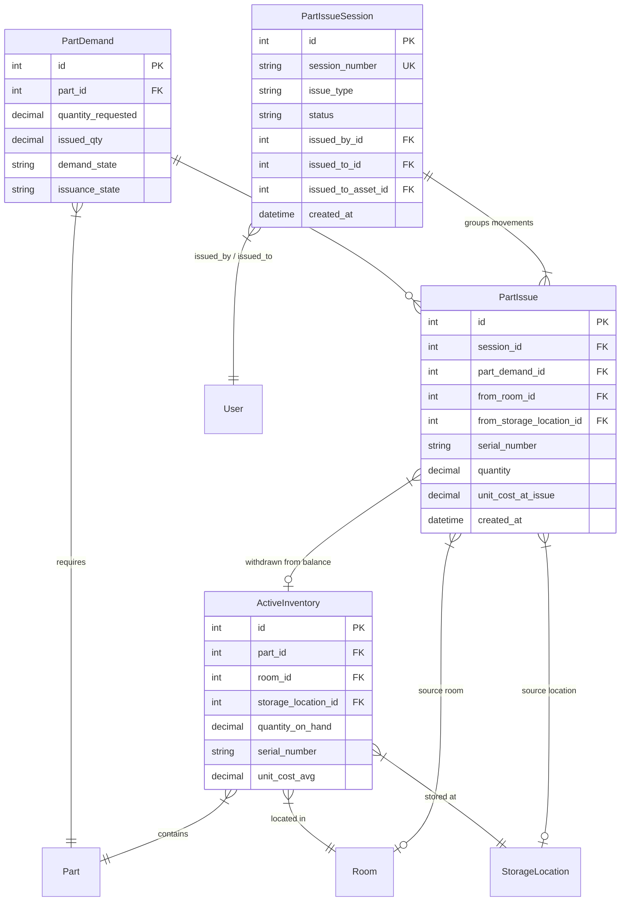
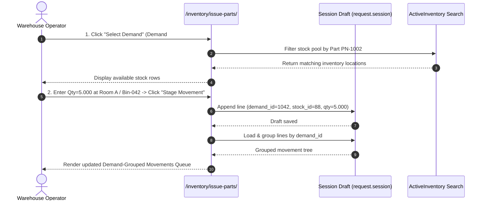
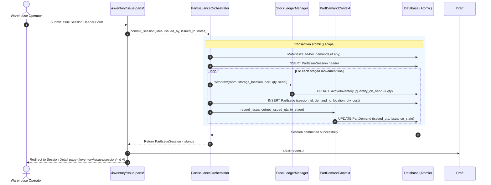

# Part Issuance Workflow Kit — Demand-Driven Movement Staging & Session Commit

**Status:** Proposed — Supersedes automatic location-based queuing in `/inventory/issue-parts/`.

---

## 1. Executive Summary & Problem Review

### 1.1 The Problem with the Current System
The legacy `/inventory/issue-parts/` portal attempted to automate stock assignment by auto-queuing stock balances based on location or auto-matching the first available stock row (`_first_matching_stock`) as soon as a demand or stock balance was clicked. 

This approach proved confusing to warehouse operators for three primary reasons:
1. **Implicit Location Assignment:** Stock rows were automatically picked by the system without explicit operator verification of physical shelf/bin contents.
2. **Flat Queue Rendering:** Staged items were presented in a flat, un-grouped list, obscuring which physical stock movements were servicing which specific `PartDemand`.
3. **Loss of Operational Intent:** Operators start physical part fulfillment by asking: *"What part demand am I fulfilling, where is the inventory located, and how many units am I pulling from that bin?"* Auto-queuing bypassed this mental model.

### 1.2 The New Concept Vision
The updated workflow kit re-establishes a **demand-driven, explicit staging model**. An operator performs part issuance through five structured steps:

```
[ Step 1: Select Part Demand ] 
         │
         ▼
[ Step 2: Locate Physical Stock Balance ]
         │
         ▼
[ Step 3: Stage Part Movement Qty ]
         │
         ▼
[ Step 4: Review Demand-Grouped Movements Queue ]
         │
         ▼
[ Step 5: Complete Session Header & Generate Part Movements ]
```

---

## 2. System Architecture & Conceptual Data Model

### 2.1 Domain Entities

| Entity | Application | Role in Issuance |
| :--- | :--- | :--- |
| `PartDemand` | `procurement` | The underlying material requirement (quantity requested, issued_qty, requested_by, asset/event context). |
| `ActiveInventory` | `inventory` | Physical stock balance at a specific `Warehouse` / `Room` / `StorageLocation` (quantity on hand, serial number, unit cost). |
| `PartIssueSession` | `inventory` | The issuance transaction header (`session_number`, `issued_by`, `issued_to`, `issued_to_asset`, `issue_type`, `issue_reason`). |
| `PartIssue` | `inventory` | The immutable movement line linking a `PartIssueSession`, `PartDemand`, and source location (`from_room`, `from_storage_location`, `quantity`, `serial_number`, `unit_cost_at_issue`). |
| `StockLedgerManager` | `inventory` | Control layer manager enforcing write funneling and negative stock protection on `ActiveInventory`. |

### 2.2 Relational Entity Diagram



---

## 3. Detailed 5-Step Workflow Specification

### Step 1: User Selects a Part Demand
- The operator browses or searches the **Open Demands Pool** (`/inventory/issue-parts/` upper pane or search bar).
- Search filters allow filtering by generic query (`dq`), demand state (`REQUIRED`, `APPROVED`), priority, domain, or part number.
- Alternatively, the operator can stage an **Ad-hoc Requirement** (describing a part and quantity when no prior purchase/maintenance demand exists in the system).
- Clicking **"Select Demand"** locks the active target context to that `PartDemand`.

### Step 2: User Finds Inventory Location with Matching Stock
- Selecting a demand automatically populates/filters the **Inventory Stock Pool** to display physical balances matching that demand's `part_number`.
- The operator views available stock across locations, showing:
  - Warehouse & Room name
  - Storage Location code / Bin identifier
  - Available Quantity on Hand (`quantity_on_hand`)
  - Serial Number (if tracked)
  - Unit Cost

### Step 3: User Selects Quantity to Stage Part Movement
- On the selected inventory location row, the operator inputs the **Staging Quantity** (e.g. 5 units out of 20 available) and clicks **"Stage Movement"**.
- This creates a **Staged Movement Line** in the session draft in `request.session`:
  - `demand_id`: ID of the targeted Part Demand (or ad-hoc spec)
  - `active_inventory_id`: ID of the physical source stock balance
  - `quantity`: Quantity to be moved from this location
  - `location_display`: Human-readable location string (e.g., "Main Warehouse -> Room B -> Bin 14")

### Step 4: Display Demand-Grouped Part Movements Queue
Below the selection controls, the **Part Movements Queue** renders, **grouped by Part Demand**.

#### Visual Hierarchy:
```
┌────────────────────────────────────────────────────────────────────────────────────────┐
│ Demand Group: Demand #1042 — PN-1002 (O-Ring Seal, 1/2")                               │
│ Requested: 10.000 | Previously Issued: 2.000 | Staged in Queue: 8.000 | Status: SATISFIED │
├────────────────────────────────────────────────────────────────────────────────────────┤
│  [Source Location]                [Bin]      [Serial]  [Qty Staged]  [Actions]         │
│  Main Warehouse -> Room A         BIN-042    -         5.000         [Edit Qty] [Remove]│
│  Overflow Hangar -> Room C        BIN-108    -         3.000         [Edit Qty] [Remove]│
└────────────────────────────────────────────────────────────────────────────────────────┘
┌────────────────────────────────────────────────────────────────────────────────────────┐
│ Demand Group: Ad-Hoc Requirement — PN-5089 (Hydraulic Fluid 1L)                       │
│ Requested: 2.000 | Staged in Queue: 2.000 | Target Domain: Avionics                     │
├────────────────────────────────────────────────────────────────────────────────────────┤
│  Main Warehouse -> Room B         BIN-011    -         2.000         [Edit Qty] [Remove]│
└────────────────────────────────────────────────────────────────────────────────────────┘
```
- Each group header displays total requested qty vs. total staged qty in the current queue.
- If total staged qty < remaining requested qty, an **"UNMET DEMAND (Short by X)"** indicator is displayed.
- Individual movement lines can be edited for quantity or removed without clearing the whole queue.

### Step 5: Complete Issue Session Header Form & Generate Movements
At the bottom of the portal, the operator completes the **Issue Session Header Form**:
- **Issue Type:** `FOR_PART_DEMAND`, `DIRECT_TO_USER`, or `DIRECT_TO_ASSET`
- **Issued To User:** Recipient technician/personnel
- **Issued To Asset:** Target asset/equipment (optional)
- **Issue Reason & Notes:** Narrative text explaining operational context

Clicking **"Generate & Commit Issuance Session"**:
1. Opens an atomic transaction (`transaction.atomic()`).
2. Materializes any ad-hoc demands into real `PartDemand` records.
3. Creates a `PartIssueSession` header record.
4. Generates `PartIssue` movement records for each staged line, recording `part_demand_id`, `from_room`, `from_storage_location`, `quantity`, `serial_number`, and `unit_cost_at_issue`.
5. Executes `StockLedgerManager.withdraw()` to update physical `ActiveInventory` balances.
6. Calls `PartDemandContext.record_issuance()` to update net issued quantities and transition demand issuance states (`ISSUED` / `PARTIALLY_ISSUED`).
7. Clears the session draft and redirects to `/inventory/issues/session/<id>/` for printable receipt & review.

---

## 4. Sequence Diagrams

### 4.1 Movement Staging Sequence (Session Draft)



### 4.2 Session Commit & Movement Generation Sequence



---

## 5. Draft State Schema & Control Layer Specifications

### 5.1 Session Draft Storage Format
The session draft is stored in `request.session["issuance_draft_<user_id>"]` as a list of dictionary items:

```json
[
  {
    "demand_id": 1042,
    "adhoc_demand": null,
    "active_inventory_id": 88,
    "quantity": "5.000",
    "issued_to_id": 14,
    "issued_to_asset_id": null,
    "notes": "Staged for Main Engine Service"
  },
  {
    "demand_id": 1042,
    "adhoc_demand": null,
    "active_inventory_id": 102,
    "quantity": "3.000",
    "issued_to_id": 14,
    "issued_to_asset_id": null,
    "notes": "Supplemental pull from Hangar C"
  }
]
```

### 5.2 Demand Grouping Helper Contract
To support the grouped UI rendering, `issuance_draft.py` provides `enrich_grouped_by_demand(request)`:

```python
def enrich_grouped_by_demand(lines: list[dict]) -> list[dict]:
    """Group enriched draft lines by PartDemand (or ad-hoc requirement).
    
    Returns a list of demand group dictionaries:
    [
        {
            "demand": PartDemand or None,
            "adhoc": dict or None,
            "part": Part,
            "requested_qty": Decimal,
            "previously_issued_qty": Decimal,
            "total_staged_qty": Decimal,
            "remaining_unmet_qty": Decimal,
            "movements": [ enriched_line_1, enriched_line_2, ... ]
        },
        ...
    ]
    """
```

---

## 6. Structural Invariants & Business Rules

1. **Explicit Movement Association:** Every `PartIssue` movement record generated at commit time must reference a valid source location (`active_inventory_id` -> `from_room`, `from_storage_location`).
2. **Atomic Execution:** `PartIssueSession` header creation, `PartIssue` line insertion, `ActiveInventory` stock withdrawal, and `PartDemand` state updates occur inside a single `transaction.atomic()` block. If any single line fails (e.g. insufficient stock), the entire session rolls back.
3. **No Phantom Demands:** Ad-hoc demands are materialized only during session commit inside the atomic transaction. Canceling or clearing a draft deletes ad-hoc specifications without leaving orphaned `PartDemand` database rows.
4. **Negative Stock Barrier:** `ActiveInventory.quantity_on_hand` can never drop below zero. Attempting to stage or commit a movement exceeding available stock triggers `InsufficientStockError`.
5. **Session Draft Persistence:** The draft survives full page reloads (F5) and tab navigation so operators can search multiple warehouse rooms without losing staged movements.

---

## 7. Comparison: Legacy vs. Proposed Workflow Kit

| Dimension | Legacy System | Proposed Workflow Kit |
| :--- | :--- | :--- |
| **Queuing Focus** | Automatic, stock location first | Explicit, demand-driven |
| **Stock Selection** | Auto-matched (`_first_matching_stock`) | Manual operator confirmation per shelf/bin |
| **Queue Display** | Flat list of stock lines | Grouped visually by `PartDemand` |
| **Location Traceability** | Implicit | Explicit source location per movement |
| **Commit Action** | Heterogeneous bulk commit | Header form + unified atomic generation |
| **F5 Rule Compliance** | Maintained in session | Maintained in session with grouped view |

