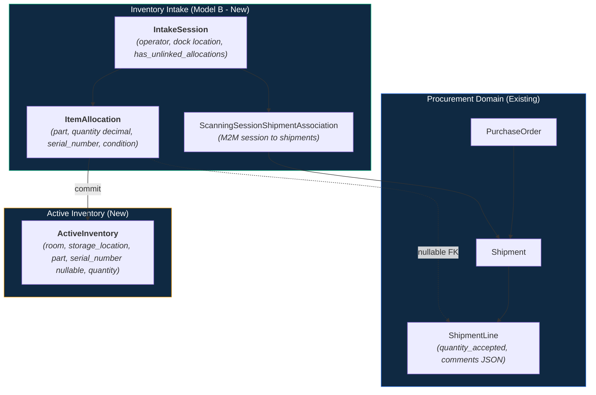

# Inventory Build Kit — Refocused Review & Architecture Decisions

**Scope & Purpose.** This document is the executive review and confirmed architectural decision record for the planned inventory system changes under `inventory_build_kit/`. It reconciles prior planning documents, eliminates legacy application context poisoning, and provides clear specifications for building the inventory intake, active stock, movements, and issuance engines.

---

## 1. Executive Summary & Chosen Architecture

The build kit establishes **Model B (`IntakeSession` + `ItemAllocation`)** as the receiving system architecture. Intake tables **enhance** the procurement shipment models without replacing them, and the PO system remains completely decoupled—reading summaries (`quantity_accepted`) directly from `ShipmentLine`.



---

## 2. Model B Receiving & Relational Grain

### 2.1 Physical Receiving Grain
- **`IntakeSession`**: Represents an operator's active receiving window.
- **`ItemAllocation`**: Logs individual scan events or manual entry allocations.
- **Relationship**: An `IntakeSession` owns many `ItemAllocation` records (`intake_session_id` FK on `ItemAllocation`). Many `ItemAllocation` records reference a single `ShipmentLine` (`shipment_line_id` FK on `ItemAllocation`).

### 2.2 Excess Quantity & Unlinked Allocations
- When physical items arrive without matching shipment line lines or exceed declared totals, `ItemAllocation.shipment_line_id` is set to `NULL`.
- The parent `IntakeSession` sets `has_unlinked_allocations = True`.
- Unlinked allocations reside in intake quarantine as `ActiveInventory` until separate procurement paperwork updates occur.

### 2.3 Partial Fulfillment & Line Splitting
- Partial receipts against expected shipments are handled by **line/session splitting**.
- When a partial receipt is committed, the remaining expected quantity is split to a new open shipment line, closing the received portion cleanly.

---

## 3. Procurement Seam & Auto-Accept Workflow

### 3.1 Seam Architecture (`ShipmentContext.accept_line`)
The PO system has no direct knowledge of intake sessions or item allocations. All writes to `ShipmentLine.quantity_accepted` are executed via an `IntakeCommitOrchestrator` calling `ShipmentContext.accept_line(line, total_accepted_qty, actor, rejection_notes)`.

> [!IMPORTANT]
> Raw `UPDATE` statements against `ShipmentLine` are strictly prohibited. `accept_line` enforces lock recomputation (`is_locked`), event narration history, PO partial receipt status updates, and quantity validation.

```mermaid
sequenceDiagram
    autonumber
    participant Intake as IntakeCommitOrchestrator
    participant Ctx as ShipmentContext
    participant Mgr as ShipmentLineManager
    participant Links as PurchaseOrderShipmentLink
    participant Narr as ShipmentNarrator / Event

    Intake->>Ctx: accept_line(line, quantity_accepted, actor, rejection_notes)
    Ctx->>Mgr: accept(...)
    Mgr->>Mgr: ShipmentLineValidator.check_acceptance (>= 0)
    Mgr->>Links: _recompute_locks -> is_locked = True
    Mgr->>Narr: line_accepted event logged
```

### 3.2 Auto-Accept Package Workflow Portal
> Detailed specification: [auto_intake_workflow_guide.md](file:///home/cb/REPOS/ebams2/inventory_build_kit/inventory_intake_kit/auto_intake_workflow_guide.md)

Manual quantity overrides at dock receiving are eliminated. The standard physical receiving workflow is:
1. Operator enters the Inventory Application and opens **"Auto Intake"**.
2. Fills session header metadata at the top of the portal.
3. Selects an unfulfilled shipment to view its lines, existing allocation counts, and minimum floor limits.
4. Enters target accepted/rejected quantities (enforces monotonic floor rules and shipped quantity caps).
5. Submits, triggering automatic background creation of the `IntakeSession`, incremental delta `ItemAllocation` records, and `ShipmentLine.quantity_accepted` updates.

---

## 4. Key Subsystem Specifications

The following dedicated specification documents resolve discrepancy handling and serialized tracking:

### 4.1 Discrepancy & Reconciliation Grain
> Detailed specification: [overages_shortages_and_reconciliation.md](file:///home/cb/REPOS/ebams2/inventory_build_kit/inventory_intake_kit/overages_shortages_and_reconciliation.md)

- **Grain**: Discrepancies are reviewed by part at `PartReconciliationSession` `(intake_session, part)` and executed per shipment line at child `PartReconciliationLine` `(reconciliation, shipment_line)`.
- **Elimination of Netting**: Child lines prevent vendor shortage/overage netting.
- **Repeat Receipt**: Receipts against a shipment line across multiple sessions are cumulative across closed sessions.

### 4.2 Serialized Inventory Tracking
> Detailed specification: [serialized_inventory_tracking.md](file:///home/cb/REPOS/ebams2/inventory_build_kit/serialized_inventory_tracking.md)

- **`ActiveInventory` Column**: Adds `serial_number` (nullable `CharField`). Un-serialized stock aggregates by `(room, storage_location, part)`, while serialized items maintain individual unit rows (`quantity = 1.000`).
- **Pipeline Propagation**: `serial_number` flows from `ItemAllocation` → `ActiveInventory` → `PartMovement` → `PartIssue`.
- **Part Demands UI Layout**: Part Demand detail view renders full `PartIssue` rows directly (including serial numbers) as an intentional UI anti-pattern for instant visibility.

---

## 5. Data Standards & System Conventions

1. **Table Naming**: Standardized exclusively on `ActiveInventory` for active stock balances. Legacy/alias names (`InventoryItem`, `UnassignedInventory`) are purged.
2. **Decimal Precision**:
   - Hardcoded in code constants (`DECIMAL_PLACES = 3`).
   - All quantity fields across all models use `DecimalField(max_digits=12, decimal_places=3)`. Legacy `IntegerField` fields are removed.
3. **Shipment Line Comments**: Simple JSON comment system stored directly on `ShipmentLine.comments` (`JSONField(default=dict, blank=True)`).
4. **Soft-Delete Cascade**: Deleting/cancelling an `IntakeSession` performs an explicit soft-delete sweep across child `ItemAllocation` and `PartReconciliationSession` rows.
5. **Domain Scoping Boundary**: `IntakeSession` verifies that the operator's effective `Domain` scope matches or covers the `Shipment.domain` before association.

---

## 6. Summary of Confirmed Architectural Decisions

| # | Topic | Confirmed Decision | Location / Spec |
| :--- | :--- | :--- | :--- |
| **1** | **Physical Record Model** | **Model B**: `IntakeSession` (1) → `ItemAllocation` (N) → `ShipmentLine` (1) | `inventory_intake_kit/domain_model.md` |
| **2** | **Procurement Write Seam** | **`ShipmentContext.accept_line`** via `IntakeCommitOrchestrator` | Section 3.1 |
| **3** | **Receiving UI Workflow** | **Auto-accept package portal**; manual overrides removed | Section 3.2 |
| **4** | **Reconciliation Grain** | **`PartReconciliationLine`** per shipment line under parent session | `overages_shortages_and_reconciliation.md` |
| **5** | **Serialized Stock** | **`ActiveInventory.serial_number`** nullable column | `serialized_inventory_tracking.md` |
| **6** | **Part Demands UI** | Full `PartIssue` rows rendered directly with serial numbers | `serialized_inventory_tracking.md` |
| **7** | **Shipment Line Comments** | **`ShipmentLine.comments` JSONField** | `domain_model.md` |
| **8** | **Quantity Data Types** | **`DecimalField(12, 3)`** everywhere; `DECIMAL_PLACES = 3` constant | Section 5 |
| **9** | **Stock Table Name** | **`ActiveInventory`** exclusively | Section 5 |
