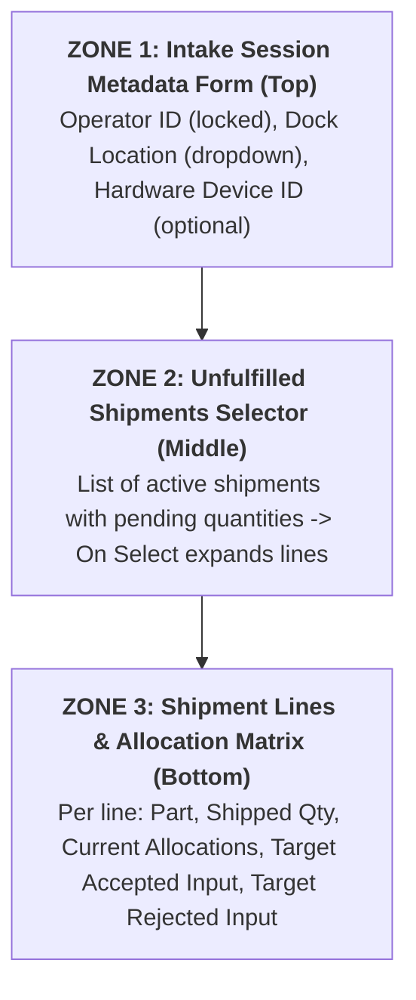
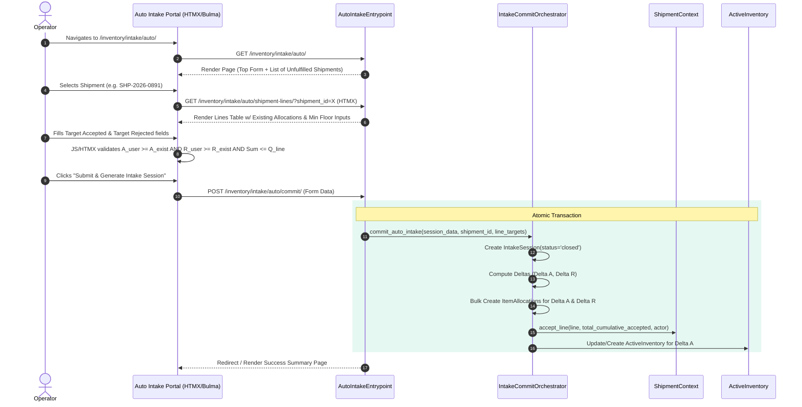

# Auto Intake Workflow & User Interaction Guide

This document specifies the end-to-end user interaction, portal UI layout, delta-calculation rules, and backend execution sequence for the **Auto Intake** portal within the Inventory application.

---

## 1. Overview & Purpose

The **Auto Intake Workflow** enables operators to receive expected package shipments quickly without requiring physical barcode scanning for every single item. From a single portal, the operator inputs session metadata, selects an unfulfilled shipment, views existing allocation lines, specifies target accepted/rejected totals, and submits. 

Behind the scenes, the system automatically creates the `IntakeSession`, computes the required incremental delta allocations, generates the corresponding `ItemAllocation` records, and updates `ShipmentLine.quantity_accepted` via the procurement seam.

---

## 2. Portal UI Layout Architecture

The Auto Intake portal page (`/inventory/intake/auto/`) is structured into three clear vertical zones:



### 2.1 UI Component Mockup & Field Map

```
┌──────────────────────────────────────────────────────────────────────────────────────────────────┐
│  AUTO INTAKE RECEIVING PORTAL                                                                    │
├──────────────────────────────────────────────────────────────────────────────────────────────────┤
│  [1] SESSION METADATA                                                                            │
│  Operator: Jane Doe (User #42)   Dock Location: [ Main Receiving Dock 1 ▾ ]   Device: [ Handheld-02 ]│
├──────────────────────────────────────────────────────────────────────────────────────────────────┤
│  [2] UNFULFILLED SHIPMENT SELECTION                                                              │
│  Search Shipment: [ SHP-2026-0891                 ]                                              │
│  ● SHP-2026-0891 (PO-99201 - Acme Supplies - 3 Open Lines)  ◄ Selected                           │
│  ○ SHP-2026-0894 (PO-99205 - Global Bolts - 1 Open Line)                                         │
├──────────────────────────────────────────────────────────────────────────────────────────────────┤
│  [3] SHIPMENT LINES & ALLOCATION INPUT MATRIX                                                    │
│                                                                                                  │
│  LINE 1: Part # M4-SCREW-50 (Pan Head Screw M4x50mm)                                             │
│  Shipped Qty: 5.000                                                                              │
│  Current Allocations:                                                                            │
│    └─ Alloc #101: 1.000 ACCEPTED (Good) [Session #12]                                           │
│    └─ Alloc #102: 1.000 REJECTED (Damaged) [Session #12]                                         │
│  Total Existing: 1.000 Accepted | 1.000 Rejected (Floor: Min 1.000 Acc / Min 1.000 Rej)         │
│                                                                                                  │
│  Target Accepted Qty: [ 3.000 ] (Min: 1.000)   Target Rejected Qty: [ 2.000 ] (Min: 1.000)       │
│  Delta to generate:  +2.000 Good                Delta to generate:  +1.000 Rejected             │
│  Status: Valid (3 + 2 = 5 <= 5 Shipped Qty Cap)                                                 │
│                                                                                                  │
│  ─────────────────────────────────────────────────────────────────────────────────────────────── │
│  LINE 2: Part # BRG-6204-2RS (Ball Bearing 20mm)                                                │
│  Shipped Qty: 10.000                                                                             │
│  Current Allocations: None (0.000 Accepted | 0.000 Rejected)                                     │
│  Target Accepted Qty: [ 10.000 ] (Min: 0.000)  Target Rejected Qty: [ 0.000 ] (Min: 0.000)       │
│  Delta to generate:  +10.000 Good               Delta to generate:  +0.000 Rejected            │
│                                                                                                  │
│  [ SUBMIT & GENERATE INTAKE SESSION ]                                                            │
└──────────────────────────────────────────────────────────────────────────────────────────────────┘
```

---

## 3. Monotonic Floor & Incremental Delta Logic

To prevent destructive edits and ensure audit integrity, the portal enforces a **Monotonic Increase Rule (Floor Rule)** and a **Quantity Cap Rule**.

### 3.1 Mathematical Definitions

For any given `ShipmentLine` $L$ with shipped quantity $Q_{line}$:

1. **Existing Accepted Balance ($A_{existing}$)**: Sum of quantities for all existing allocations linked to $L$ with `condition = 'good'`.
2. **Existing Rejected Balance ($R_{existing}$)**: Sum of quantities for all existing allocations linked to $L$ with `condition = 'rejected'`.
3. **User Target Accepted ($A_{user}$)**: Value entered in the portal's Target Accepted input field.
4. **User Target Rejected ($R_{user}$)**: Value entered in the portal's Target Rejected input field.

### 3.2 Enforced Constraints

1. **Monotonic Accepted Floor**: $A_{user} \ge A_{existing}$ *(Users CANNOT reduce accepted quantity below existing allocations)*.
2. **Monotonic Rejected Floor**: $R_{user} \ge R_{existing}$ *(Users CANNOT reduce rejected quantity below existing allocations)*.
3. **Shipped Quantity Cap**: $A_{user} + R_{user} \le Q_{line}$ *(Total target quantity cannot exceed line quantity)*.

### 3.3 Incremental Delta Calculation

Upon form submission, the system computes the exact incremental delta for each line:

$$\Delta A = A_{user} - A_{existing}$$
$$\Delta R = R_{user} - R_{existing}$$

- If $\Delta A > 0$: The system creates a new `ItemAllocation` with `condition = 'good'`, `quantity = \Delta A`, and `shipment_line = L`.
- If $\Delta R > 0$: The system creates a new `ItemAllocation` with `condition = 'rejected'`, `quantity = \Delta R`, and `shipment_line = L`.
- If $\Delta A = 0$ and $\Delta R = 0$: No new `ItemAllocation` row is created for that line.

---

## 4. Step-by-Step Worked Examples

### Scenario Setup
- **ShipmentLine**: $Q_{line} = 5.000$.
- **Existing Allocations**: 1.000 Accepted ($A_{existing} = 1$), 1.000 Rejected ($R_{existing} = 1$). Total existing = 2.000.

### Example A: Full Line Completion
- **User Action**: Enters $A_{user} = 3.000$ and $R_{user} = 2.000$.
- **Validation**:
  - $A_{user} (3) \ge A_{existing} (1)$ -> PASS.
  - $R_{user} (2) \ge R_{existing} (1)$ -> PASS.
  - $3 + 2 = 5 \le 5$ ($Q_{line}$) -> PASS.
- **Deltas Calculated**:
  - $\Delta A = 3.000 - 1.000 = +2.000$.
  - $\Delta R = 2.000 - 1.000 = +1.000$.
- **System Outcome**: Creates 2 new `ItemAllocation` rows (+2.000 good, +1.000 rejected). Total cumulative allocations now equal 3 accepted + 2 rejected = 5 (fully received).

### Example B: Partial Addition (Accepted Only)
- **User Action**: Enters $A_{user} = 3.000$ and $R_{user} = 1.000$.
- **Validation**:
  - $A_{user} (3) \ge A_{existing} (1)$ -> PASS.
  - $R_{user} (1) \ge R_{existing} (1)$ -> PASS.
  - $3 + 1 = 4 \le 5$ ($Q_{line}$) -> PASS.
- **Deltas Calculated**:
  - $\Delta A = 3.000 - 1.000 = +2.000$.
  - $\Delta R = 1.000 - 1.000 = 0.000$.
- **System Outcome**: Creates 1 new `ItemAllocation` row (+2.000 good). Total cumulative allocations equal 3 accepted + 1 rejected = 4 (partially received).

### Example C: Invalid Decrease Attempt (Rejected by UI & Backend)
- **User Action**: Enters $A_{user} = 0.000$ and $R_{user} = 1.000$.
- **Validation Failure**: $A_{user} (0) < A_{existing} (1)$.
- **System Outcome**: UI disables submit button and highlights field error: `"Cannot reduce accepted quantity below existing allocation of 1.000."`

---

## 5. User Interaction & Data Flow Diagram


