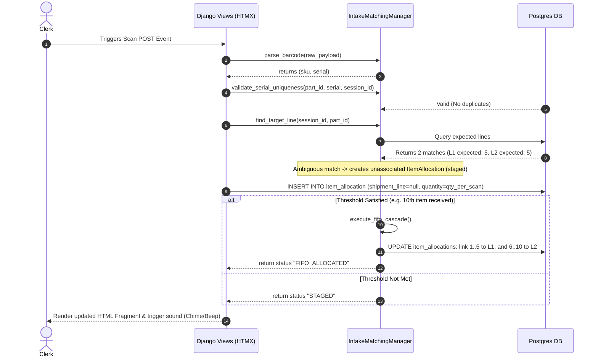
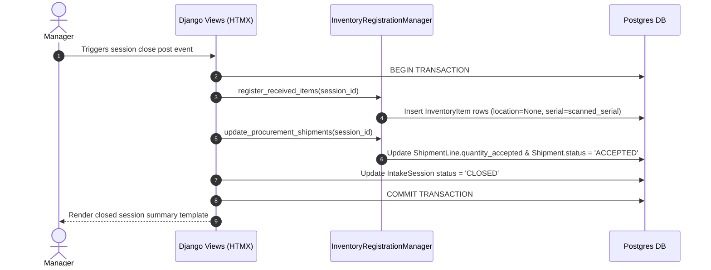

# Control Layer Map: Automated Intake & Blind Receiving

This document maps out the structs, context classes, and managers that define the business logic interfaces and execution paths for the automated intake receiving system.

---

## 1. Domain Structs (DTOs)

These represent the immutable read/write data transfer objects passed through the control layer.

- **`IntakeSessionStruct`**: Carries session metadata (`id`, `operator_id`, `status`, `started_at`, `closed_at`).
- **`ItemAllocationStruct`**: Carries allocation details (`id`, `intake_session_id`, `shipment_line_id`, `part_id`, `quantity`, `serial_number`, `condition`, `intake_method`, `created_at`).
- **`PartReconciliationSessionStruct`**: Carries information about a single part number's discrepancy sub-session (`id`, `intake_session_id`, `part_id`, `status`, `expected_quantity`, `allocated_quantity`, `rejected_quantity`, `resolution_type`, `resolved_by_id`, `resolved_at`, `notes`).
- **`ScanningSessionShipmentAssociationStruct`**: Carries links between session and shipments.

---

## 2. Primary Context Class

### `IntakeContext`
The sole public entrypoint for accessing and mutating the intake domain, called directly by the presentation layer (Django Views).
- **`start_session(operator_id: int, shipment_ids: list[int], dock_location_id: int = None) -> IntakeSessionStruct`**: Initializes the intake session and links expected shipments via `ScanningSessionShipmentAssociation`.
- **`process_scan(session_id: int, raw_payload: str, condition: str = "good") -> ItemAllocationStruct`**: Entrypoint for scan events. Parses payload, fetches part configuration (`qty_per_scan`, `sn_expected`), validates serial duplicate composite keys, and creates an `ItemAllocation` record.
- **`create_manual_allocation(session_id: int, shipment_line_id: int, quantity: Decimal, serial_number: str = None, condition: str = "good") -> ItemAllocationStruct`**: Manually registers a receiving allocation (`intake_method = 'manual'`).
- **`split_allocation(allocation_id: int, good_qty: Decimal, rejected_qty: Decimal) -> list[ItemAllocationStruct]`**: Splits an existing allocation row into two sibling rows (one `good`, one `rejected`).
- **`transition_to_reconciliation(session_id: int) -> list[PartReconciliationSessionStruct]`**: Checks for discrepancies between physical allocations and expectations. Spawns `PartReconciliationSession` records for each discrepant part number and changes session status to `RECONCILING`.
- **`resolve_part_discrepancy(session_id: int, part_id: int, resolution_type: str, notes: str) -> PartReconciliationSessionStruct`**: Sets the reconciliation status to `RESOLVED` for a single part number and applies the chosen resolution (shortage, overage, etc.).
- **`pull_external_allocation(session_id: int, allocation_id: int, target_line_id: int) -> ItemAllocationStruct`**: Moves an unallocated/excess allocation from an external session into the current session, linking it to the specified shortage line.
- **`close_session(session_id: int, notes: str) -> IntakeSessionStruct`**: Enforces that all linked `PartReconciliationSession` records are `RESOLVED`. Locks the session, registers the items into inventory (`location = None`), directly writes to Procurement's `ShipmentLine.quantity_accepted`, and sets the session status to `CLOSED`.

---

## 3. Dedicated Managers

### `IntakeMatchingManager`
Encapsulates the barcode parsing, part specifications evaluation, and algorithmic matching logic.
- **`parse_barcode(raw_payload: str) -> tuple[str, str]`**: Parses SKU and Serial from 1D, 2D, or GS1-128 barcode patterns.
- **`validate_serial_uniqueness(part_id: int, serial: str, session_id: int)`**: Enforces the composite uniqueness check against active inventory and current session allocations.
- **`find_target_line(session_id: int, part_id: int) -> ShipmentLine`**: Queries associated shipments to find the target line to allocate to:
  - If **1-to-1 match**: Returns the target shipment line.
  - If **N-to-M match**: Returns `None` (triggers staging / unassociated).
  - If **No match**: Returns `None` (triggers unmanifested quarantine).

- **`execute_fifo_cascade(session_id: int, part_id: int)`**: Performs atomic allocation updates of staged allocations to the oldest open expected shipment lines once cumulative thresholds are met.

### `IntakeReconciliationManager`
Manages the validation and resolution processing of part-level discrepancy sub-sessions.
- **`generate_reconciliation_tasks(session_id: int)`**: Analyzes shipment lines and allocations in the session, creating a `PartReconciliationSession` for any mismatch (under/over/rejections).
- **`apply_resolution(reconciliation_session_id: int, resolution_type: str)`**: Adjusts allocations, flags shipment line manual overrides, or routes unmanifested overages.

### `InventoryRegistrationManager`
Handles the post-session write-side transactions.
- **`register_received_items(session_id: int)`**: Creates active `InventoryItem` records with `location = None` and the corresponding serial number for each allocation marked as `good`.
- **`update_procurement_shipments(session_id: int)`**: Directly writes summarized allocation counts to `ShipmentLine.quantity_accepted` in Procurement. Sets `Shipment.status = 'ACCEPTED'` if all lines are satisfied.

---

## 4. Key Execution Flows

### Operation A: Physical Barcode Scan (N-to-M Staging / Cascade)

### Operation B: Session Close & Procurement Hand-off

