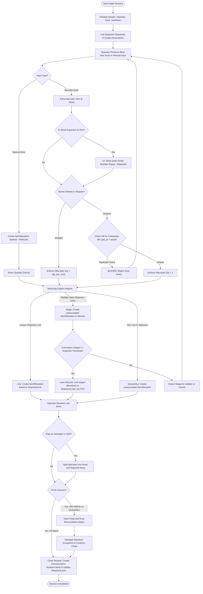
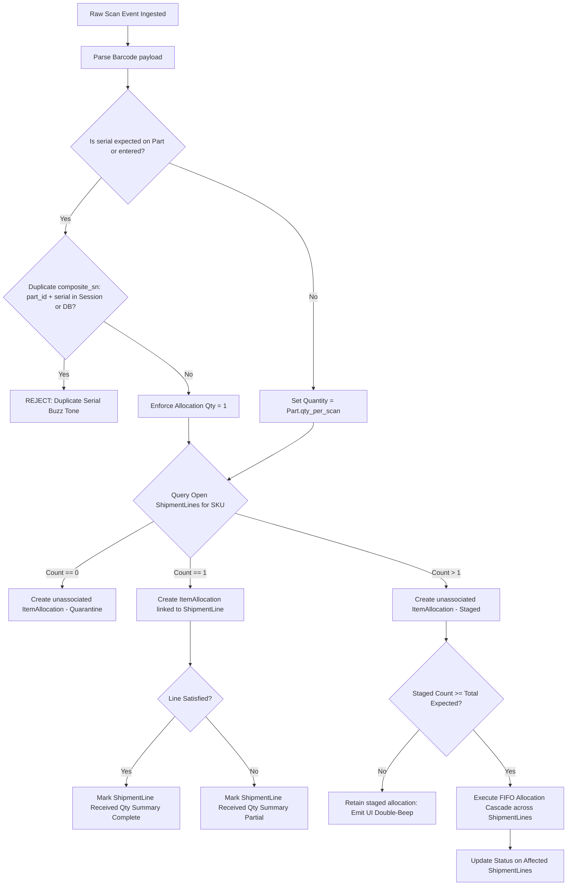
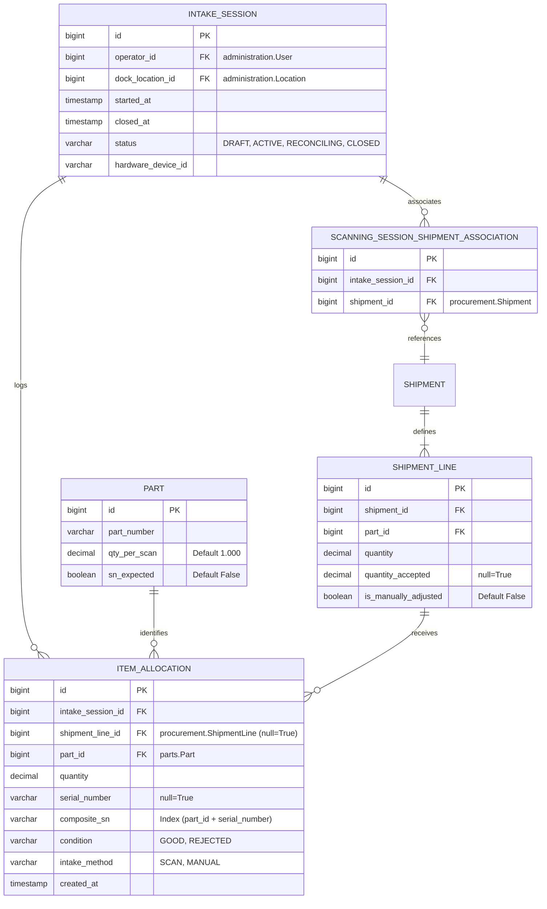

# System Diagrams: Automated Intake & Blind Receiving

This document consolidates all visual architectures, process flows, decision trees, split workflows, and relational schemas for the automated intake receiving system.

---

## 1. System Process Flowchart
This flowchart maps the end-to-end lifecycle of an intake session, from initialization to closing the session.



---

## 2. Scan & Allocation Evaluation Decision Tree
Detailing the logical rules applied by the matching engine (`IntakeMatchingManager`) upon receiving a scan event.



---

## 3. Quality Inspection Split Workflow
This diagram illustrates the user-triggered split action where a clerk manually inspects a batch/line of items and divides them into good and rejected (damaged/defective) quantities.

```mermaid
flowchart TD
    A[Operator opens scanned ItemAllocation in UI] --> B[Click 'Inspect & Split']
    B --> C[Enter Good Quantity Qg]
    C --> D[Enter Rejected/Damaged Quantity Qr]
    
    D --> E{Total Qg + Qr == Scanned Quantity?}
    E -->|No| F[Show validation error: Quantities must balance]
    F --> B
    
    E -->|Yes| G[Submit Split (HTMX POST)]
    G --> H[Server: BEGIN TRANSACTION]
    
    H --> I[Update original ItemAllocation: set quantity = Qg, condition = GOOD]
    H --> J[Create new sibling ItemAllocation: set quantity = Qr, condition = REJECTED]
    
    J --> K[Server: COMMIT TRANSACTION]
    K --> L[Server: Render updated HTML rows showing split breakdown]
    L --> M[UI: Update display table and play confirm tone]
```

---

## 4. Relational Entity-Relationship (ER) Schema
Visualizes the structure of the relational tables and keys used to build the intake receiving models.


