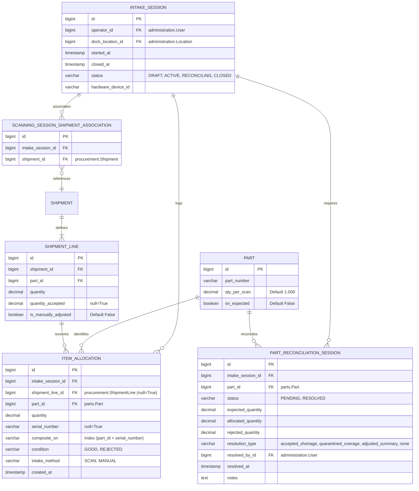

# Domain Model: Automated Intake & Blind Receiving

This document details the database tables, fields, constraints, indexes, and relational schemas proposed for the inventory intake and receiving system.

---

## 1. Relational Entity-Relationship (ER) Diagram

---

## 2. Table Specifications (New Tables)

### Table 1: `intake_session`
Tracks the active receiving run by an operator.
- **`id`**: `BigAutoField` (Primary Key).
- **`operator_id`**: `ForeignKey` to `administration.User` (on_delete=PROTECT).
- **`dock_location_id`**: `ForeignKey` to `administration.Location` (on_delete=PROTECT, null=True).
- **`started_at`**: `DateTimeField` (default=now).
- **`closed_at`**: `DateTimeField` (null=True).
- **`status`**: `CharField(30)` (choices: `draft`, `active`, `reconciling`, `closed`; default=`draft`).
- **`hardware_device_id`**: `CharField(100)` (blank=True).
- **Audit Columns**: `created_at`, `updated_at`, `created_by_id`, `updated_by_id` (via `AuditFieldsMixin`).
- **Soft Delete**: `is_deleted` (via `SoftDeleteMixin`).

*Constraints & Indexes:*
- Index on `(operator_id, status)` for active session lookup.

---

### Table 2: `scanning_session_shipment_associations`
Join table connecting the intake session to the expected shipments.
- **`id`**: `BigAutoField` (Primary Key).
- **`intake_session_id`**: `ForeignKey` to `intake_session` (on_delete=CASCADE, related_name="shipment_associations").
- **`shipment_id`**: `ForeignKey` to `procurement.Shipment` (on_delete=PROTECT).

*Constraints & Indexes:*
- Unique constraint on `(intake_session_id, shipment_id)`.

---

### Table 3: `part_reconciliation_session`
Tracks the resolution of discrepancies for a single part number.
- **`id`**: `BigAutoField` (Primary Key).
- **`intake_session_id`**: `ForeignKey` to `intake_session` (on_delete=CASCADE, related_name="reconciliations").
- **`part_id`**: `ForeignKey` to `parts.Part` (on_delete=PROTECT).
- **`status`**: `CharField(30)` (choices: `pending`, `resolved`; default=`pending`).
- **`expected_quantity`**: `DecimalField(max_digits=12, decimal_places=3)`.
- **`allocated_quantity`**: `DecimalField(max_digits=12, decimal_places=3)`.
- **`rejected_quantity`**: `DecimalField(max_digits=12, decimal_places=3)`.
- **`resolution_type`**: `CharField(50)` (choices: `accepted_shortage`, `quarantined_overage`, `adjusted_summary`, `none`; default=`none`).
- **`resolved_by_id`**: `ForeignKey` to `administration.User` (on_delete=PROTECT, null=True).
- **`resolved_at`**: `DateTimeField` (null=True).
- **`notes`**: `TextField` (blank=True).
- **Audit Columns** & **Soft Delete**.

*Constraints & Indexes:*
- Unique constraint on `(intake_session_id, part_id)`.

---

### Table 4: `item_allocation`
Tracks individual physical scan events or manual entry allocations.
- **`id`**: `BigAutoField` (Primary Key).
- **`intake_session_id`**: `ForeignKey` to `intake_session` (on_delete=CASCADE, related_name="allocations").
- **`shipment_line_id`**: `ForeignKey` to `procurement.ShipmentLine` (on_delete=PROTECT, null=True, blank=True). If null, this allocation is unmanifested (quarantined).
- **`part_id`**: `ForeignKey` to `parts.Part` (on_delete=PROTECT, related_name="intake_allocations").
- **`quantity`**: `DecimalField(max_digits=12, decimal_places=3)`. Defaults to the part's `qty_per_scan` upon scan creation.
- **`serial_number`**: `CharField(200)` (null=True, blank=True).
- **`composite_sn`**: `CharField(400)` (null=True, blank=True, db_index=True). Stored as `f"{part_id}:{serial_number}"` for lookup.
- **`condition`**: `CharField(30)` (choices: `good`, `rejected`; default=`good`).
- **`intake_method`**: `CharField(30)` (choices: `scan`, `manual`; default=`scan`).
- **`created_at`**: `DateTimeField` (default=now).
- **Audit Columns** & **Soft Delete**.

---

## 3. Table Specifications (Modified Existing Tables)

### Table: `parts.Part`
- **`qty_per_scan`**: `DecimalField(max_digits=12, decimal_places=3, default=1.000)`. Configures the count multiplier per barcode scan.
- **`sn_expected`**: `BooleanField(default=False)`. Enforces serial entry UI popup when scanning/logging this part.

### Table: `procurement.ShipmentLine`
- **`comments`**: `JSONField(default=dict, blank=True)`. Simple JSON comment system stored directly on the line without extra tables or relational overhead.

---

## 4. Core Business Validation Constraints

1. **Active Serial Deduplication**:
   If a serial number is provided, the system verifies that the `composite_sn` does not exist in any other `item_allocation` in the current session, or on any active `ActiveInventory` row in the system.
2. **Serial Quantity Cap**:
   If `serial_number` is provided, the allocation quantity is enforced to be exactly `1.000`.
3. **Declared Acceptance Writes**:
   `ShipmentLine.quantity_accepted` is written declared-once per line upon intake session commit via `ShipmentContext.accept_line(line, total_accepted_qty, actor, rejection_notes)`. Overages remain in intake quarantine.
4. **Reconciliation Barrier**:
   The `IntakeSession` cannot move from `RECONCILING` to `CLOSED` if there is any linked `PartReconciliationSession` with `status = 'pending'`.
