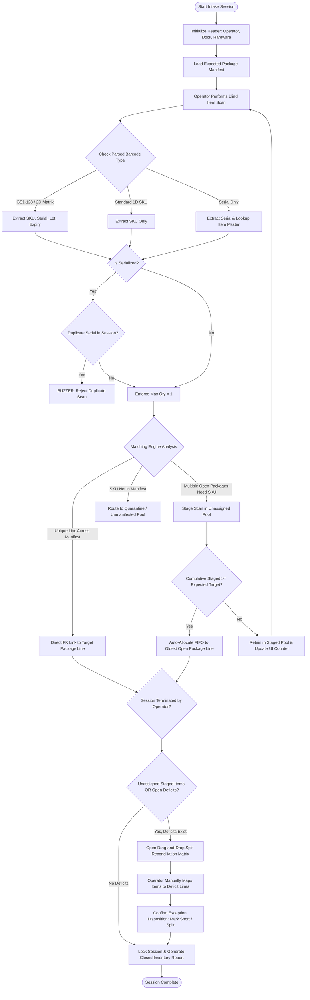
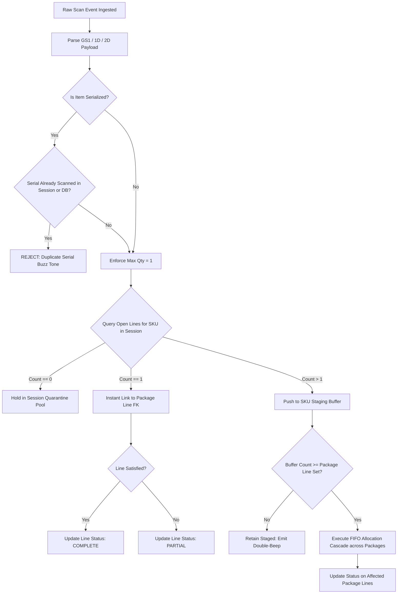
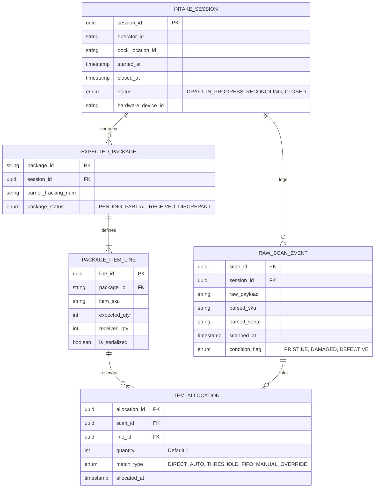

under inventory I want to build an intake application that allows users to start a session scan in items or manually add items then automatically mark things as recieved or rejected as best as possible. 

it should also move the items into the inventory system as no location assigned

this is my initial thoughts
lets fully think out this system with mermaid diagrams user process flows  etc
Automated Intake & Blind Receiving System Architecture
This technical specification details the architecture, decision logic, data models, exception-handling strategies, and workflows for your automated blind intake receiving engine.

1. Approaches for Core Problems & Edge Cases
A. Intake Session Header & Manifest Setup
Contextual Audit Header: Captures session_id, operator_id, dock_bay_location, started_at, hardware_device_id, and status (DRAFT, ACTIVE, RECONCILING, CLOSED).

Expected Package Ingestion: Operators scan or batch-import expected package_ids (and tracking numbers). The system builds an in-memory and database representation of expected BOM lines (sku, expected_qty, received_qty, is_serialized).

B. Blind Scanning & Algorithmic Matching Logic
1-to-1 Unique SKU Match: If exactly one open package line across the active session requires the scanned SKU (e.g., Oil Filter on Package A only), the system immediately links the scan event directly via foreign key and increments received_qty.

N-to-M Ambiguous Multi-Package Staging (FIFO Rule): When multiple packages require the same SKU (e.g., Screws on Package A & B):

The scans are held in an in-memory/session staging buffer (session:{id}:staged:{sku}).

The UI reflects real-time progress (e.g., Staged: 6/10 Screws).

Once the cumulative threshold reaches or exceeds the total expected quantity across open packages, an atomic transaction triggers a First-In, First-Received (FIFO) allocation cascade.

C. Serial Number Enforcement & Idempotency
Strict Max Quantity = 1: Any line marked is_serialized = true enforces an atomic unit count of 1 per scan event.

Duplicate & Collision Prevention: Enforce a database-level uniqueness constraint across (session_id, serial_number) and an active item master lookup to prevent duplicate serial intake.

D. Session Deficit Handling & Manual Drag-and-Drop
If the operator finishes scanning before multi-package thresholds are met (e.g., only 7 of 10 screws received):

The session transitions to RECONCILING.

The UI displays a dual-pane Allocation Matrix:

Left Pane: Unassigned staged scan items.

Right Pane: Unsatisfied package lines.

Operators drag items directly into their chosen package lines, record notes for short-shipments, and submit the final reconciliation.

E. Unmanifested Items, Over-Receipts & Damaged Goods
Quarantine Bucket: Barcodes not matching any open line in the session are routed to an UNMANIFESTED_QUARANTINE log rather than crashing the session.

Damage Modifier: A single hotkey or hardware switch ("Damage Mode") allows operators to scan defective goods directly into an RMA inspection queue.

2. Mermaid Diagrams
Diagram 1: System Process Flowchart


Diagram 2: Scan Evaluation Decision Tree


Diagram 3: Real-Time Sequence Diagram
```mermaid
sequenceDiagram
    autonumber
    actor Operator
    participant Scanner as Handheld / 2D Scanner
    participant UI as Intake Web/Mobile Client
    participant API as Ingestion Engine API
    participant Buffer as Redis Staging Cache
    participant DB as Postgres Relational DB

    Note over Operator, DB: Phase 1: Unique SKU Match (Direct Link)
    Operator->>Scanner: Scans Oil Filter (UPC: 045242)
    Scanner->>UI: Barcode Data Event
    UI->>API: POST /api/v1/sessions/{id}/scan {raw: "045242"}
    API->>DB: SELECT * FROM package_lines WHERE session_id = :id AND sku = 'OIL-FLTR'
    DB-->>API: Returns 1 match (Package PKG-101, needed: 1)
    API->>DB: INSERT INTO item_allocations (scan_id, line_id, qty=1, mode='AUTO')
    DB-->>API: Success (Line Status -> COMPLETE)
    API-->>UI: 200 OK {status: "ALLOCATED", package_id: "PKG-101"}
    UI-->>Operator: Emit High-Tone Chime & Flash Green

    Note over Operator, DB: Phase 2: Ambiguous Multi-Package Staging
    Operator->>Scanner: Scans M4 Screws (Scan #1..#9 of 10 needed across PKG-101 & PKG-102)
    Scanner->>UI: Stream barcode data
    UI->>API: POST /api/v1/sessions/{id}/scan {raw: "SCREW-M4"}
    API->>DB: SELECT * FROM package_lines WHERE session_id = :id AND sku = 'SCREW-M4'
    DB-->>API: Returns 2 matches (PKG-101 needs 5, PKG-102 needs 5; Total: 10)
    API->>Buffer: LPUSH session:{id}:buffer:SCREW-M4 {scan_id}
    Buffer-->>API: Current count: 1..9 (Below Threshold 10)
    API-->>UI: 200 OK {status: "STAGED", staged_count: 9, target_threshold: 10}
    UI-->>Operator: Emit Mid-Tone Double Beep & Increment Staged Badge

    Note over Operator, DB: Phase 3: Threshold Satisfied & FIFO Execution
    Operator->>Scanner: Scans 10th M4 Screw
    Scanner->>UI: Send payload
    UI->>API: POST /api/v1/sessions/{id}/scan {raw: "SCREW-M4"}
    API->>Buffer: LPUSH & INCR count -> Returns 10 (Threshold Satisfied!)
    API->>Buffer: LRANGE session:{id}:buffer:SCREW-M4 0 -1 (Fetch all 10 scan_ids)
    API->>DB: BEGIN TRANSACTION
    API->>DB: Link first 5 scan_ids -> PKG-101 line_id
    API->>DB: Link next 5 scan_ids -> PKG-102 line_id
    API->>DB: COMMIT TRANSACTION
    API->>Buffer: DEL session:{id}:buffer:SCREW-M4
    API-->>UI: 200 OK {status: "FIFO_ALLOCATED", packages: ["PKG-101", "PKG-102"]}
    UI-->>Operator: Emit Triumph Chime & Mark packages COMPLETE
```

Diagram 4: Relational Entity-Relationship (ER) Schema

