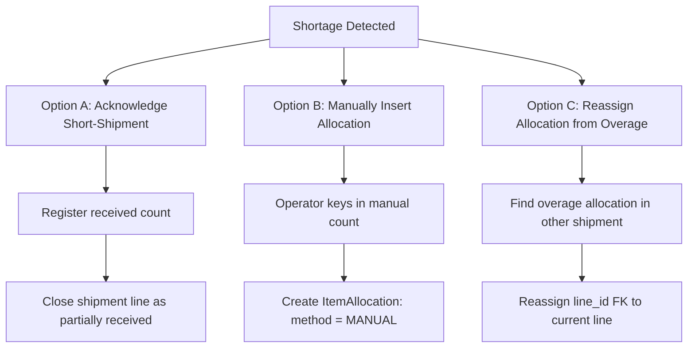
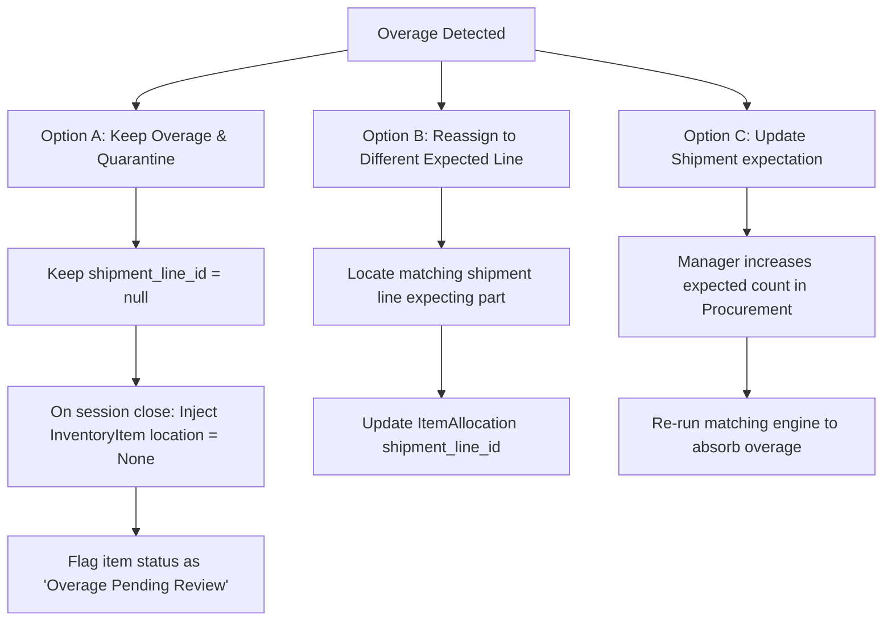
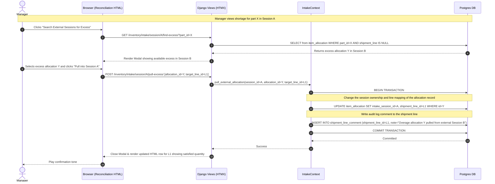
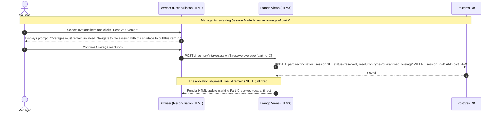

# Guide to Handling Overages, Shortages, & Reassignments

This document describes the operational rules, user screens, and transactional flows for resolving receiving discrepancies (overages and shortages/underages) and reassigning misallocated scans.

---

## 1. Finding Unresolved Sessions: The Reconciliation Hub

Managers need a centralized dashboard to identify sessions blocked by unresolved parts. 

### The Reconciliation Hub Screen (Django View + HTMX)
- **URL**: `/inventory/intake/reconciliations/`
- **Filters**:
  - `status`: Show only sessions in `RECONCILING` status (default).
  - `has_unresolved_parts`: Filter sessions that have at least one `PartReconciliationSession` with `status = 'pending'`.
- **Display**: A list of active/reconciling sessions, displaying:
  - Session ID / Operator / Dock location.
  - Number of unresolved parts (e.g., "3 parts pending resolution").
  - Date started.
- **HTMX Interaction**: Clicking on a session dynamically expands a row or loads the session's focused part-by-part reconciliation list.

---

## 2. Managing Shortages (Underages)

A shortage occurs when the physical allocations count for a part is *less* than the expected count across associated shipments.

### Operational Options

1. **Acknowledge Short-Shipment (Deficit Sign-Off)**:
   - **When to use**: The vendor did not ship enough parts, and no more are coming.
   - **Behavior**: The manager logs `resolution_type = 'accepted_shortage'` on the `PartReconciliationSession`.
   - **Execution**: On session commit, the system updates the Procurement `ShipmentLine.quantity_accepted` to the current good received count. The remaining deficit is permanently logged as a shortage.
2. **Manually Insert Allocation**:
   - **When to use**: The parts were physically received, but the barcode could not be scanned.
   - **Behavior**: The manager clicks "Add Manual Allocation" in the reconciliation view.
   - **Execution**: Inserts a new `ItemAllocation` linked to the target `ShipmentLine` with `intake_method = 'manual'`, raising the count and resolving the shortage.

---

## 3. Managing Overages

An overage occurs when the physical allocations count for a part is *greater* than the expected count, or when a part is scanned that is not expected on any shipment line in the session.

### Operational Options

1. **Keep Overage & Quarantine**:
   - **When to use**: Extra items arrived that we want to keep, but we do not have an order line to associate them with.
   - **Behavior**: The manager resolves the part session as `quarantined_overage`.
   - **Execution**: The extra allocations remain unassociated (`shipment_line_id = null`). On session close, they are registered in the inventory database with `location = None` but marked with a status flag of "Overage Pending Review" for subsequent purchasing adjustments.
2. **Reassign Overage**:
   - **When to use**: The item belongs to a different shipment line that was also received at the dock (or a sibling shipment line).
   - **Behavior**: The manager uses the Reassignment Widget (detailed below).

---

## 4. The Reassignment Widget (HTMX Drag-and-Drop / Form Swap)

If an item was scanned but misallocated (e.g. staged as an overage, or matched to the wrong shipment line), the manager can reassign it.

### Step-by-Step Flow:
1. In the Part Reconciliation workspace, the manager views the list of allocations for that part.
2. The manager clicks "Reassign" next to an allocation (e.g., Scan ID #405).
3. The UI presents a dropdown list of **all active expected shipment lines in this session** (and an option for "Unassociated / Quarantine").
4. The manager selects the correct target line (e.g. `Shipment B - Line 2`) and clicks "Confirm Reassign".
5. **HTMX Request**: Triggers `POST /inventory/intake/allocation/{id}/reassign/` with target line ID.
6. **Backend Execution**:
   - Updates `ItemAllocation.shipment_line_id` to the target line ID.
   - Recalculates the received counts on the affected lines.
   - **Returns**: Updated HTML template fragments for both the source and destination shipment lines, updating the counts on the screen instantly.

---

## 5. Scenario Shortage: Pulling Excess from Another Session

When a part is short in the current session (Session A), the manager can search for and pull in unallocated (excess) allocations from another session (Session B). Upon linking, the system writes an audit comment to the shipment line.

---

## 6. Scenario Overage: Forced External Shortage Pull-in

To prevent data mismatch and maintain strict trace-back direction, when a session (Session B) has an overage, the manager cannot push it to other sessions from here. They are forced to keep it unlinked, prompting the manager of the session with the shortage (Session A) to pull it in.

