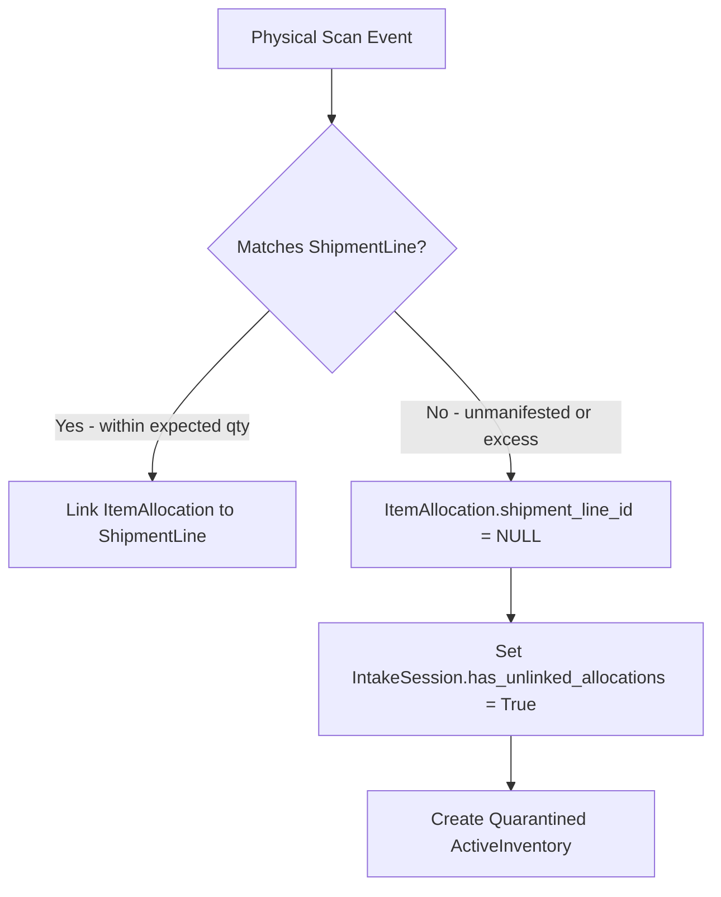
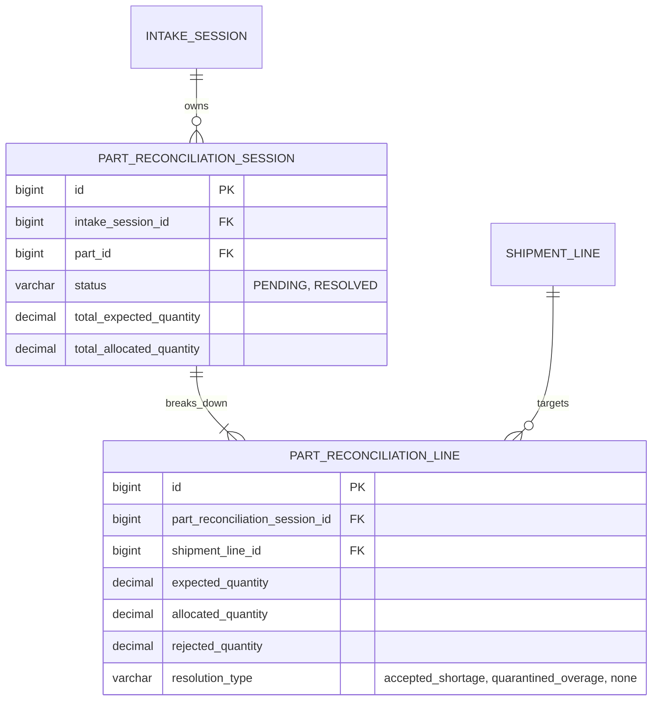

# Intake Overages, Shortages & Reconciliation Grain Specification

This document defines the receiving discrepancy rules (overages, shortages, unmanifested packages) and the exact reconciliation data grain within the intake build kit.

---

## 1. Physical Discrepancy Handling

### 1.1 Unmanifested & Excess Allocations
When physical items arrive at the dock without a matching shipment line or exceeding the expected shipment quantity:

1. **Unmanifested Quarantine**: `ItemAllocation.shipment_line_id` is set to `NULL`.
2. **Session Flagging**: The `IntakeSession` sets `has_unlinked_allocations = True` whenever one or more `ItemAllocation` records remain unlinked to a `ShipmentLine`.
3. **Overage Disposition**: Overages remain quarantined stock (`quarantined_overage`). Intake does **not** perform force-acceptance or rewrite procurement packing slips. Paperwork adjustments are handled as separate, audited procurement actions.
4. **RMA Routing**: Discarded/damaged physical items are logged with `condition = 'rejected'` and populated with `ShipmentLine.rejection_notes`. Direct RMA queue logic is out of scope for intake.

### 1.2 Shortages & Partial Fulfillment
When physical count is less than the expected quantity on a shipment line:

- **Splitting Strategy**: Partial fulfillments are handled by **line/session splitting**. When a session commits with a partial receipt, the system splits the shipment line requirement, closing the received portion and leaving the remaining open balance on a split line.
- **Repeat Receipt**: Receipts against a shipment line across multiple sessions are **cumulative**. `ShipmentContext.accept_line` is called with the cumulative total of accepted allocations across all closed sessions for that line.

---

## 2. Reconciliation Grain Architecture

### 2.1 The Netting Problem
If discrepancy reconciliation is executed purely at `(intake_session, part_id)`, shortages from one vendor shipment will net against overages from another vendor shipment for the same part number. This destroys auditability and prevents calling `accept_line` per `ShipmentLine`.

### 2.2 Parent-Child Reconciliation Structure
To solve netting while maintaining a clean operator review UI:

1. **`PartReconciliationSession` (Parent)**: Keyed on `(intake_session_id, part_id)`. Serves as the operator review grouping ("reconcile M4 screws").
2. **`PartReconciliationLine` (Child)**: Keyed on `(part_reconciliation_session_id, shipment_line_id)`. Tracks per-shipment-line expected, allocated, and rejected counts.

### 2.3 Execution Flow
- Resolution actions (e.g., `accepted_shortage`, `quarantined_overage`) are declared on `PartReconciliationLine`.
- Upon resolving all child lines, the parent `PartReconciliationSession.status` becomes `RESOLVED`.
- At session commit, `IntakeCommitOrchestrator` iterates over child lines and invokes `ShipmentContext.accept_line` per line with the cumulative sum.

---

## 3. Package Auto-Accept Portal Workflow

> Detailed specification: [auto_intake_workflow_guide.md](file:///home/cb/REPOS/ebams2/inventory_build_kit/inventory_intake_kit/auto_intake_workflow_guide.md)

Manual item-by-item overrides are removed from dock entry points. Instead:

1. Operator opens the Inventory Application and navigates to the **Auto Intake** portal.
2. Fills `IntakeSession` metadata fields at the top of the page.
3. Selects the target unfulfilled `Shipment`.
4. Reviews existing allocation lines ($A_{existing}$ accepted, $R_{existing}$ rejected) and enters new target totals.
5. The system validates floor limits ($A_{user} \ge A_{existing}$, $R_{user} \ge R_{existing}$) and line caps, computes deltas, and automatically generates `IntakeSession` and delta `ItemAllocation` rows in a single atomic transaction.
