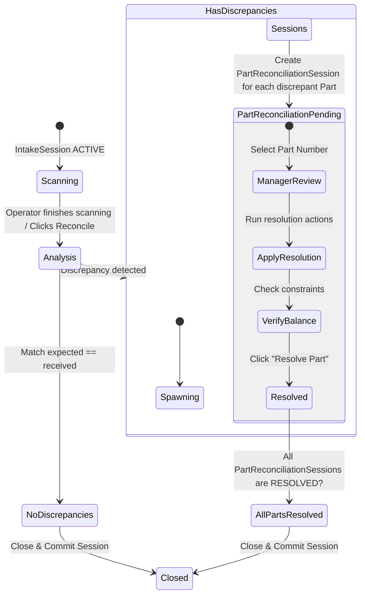
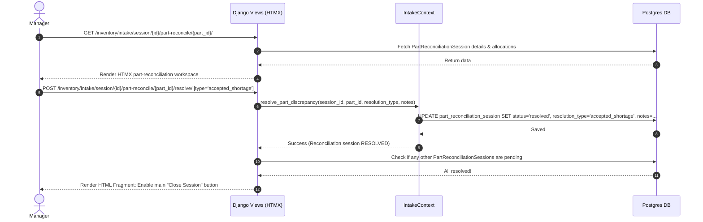

# Part-Level Reconciliation & Deficit Review Workflow

This document details the isolated part-level reconciliation engine. In order to handle discrepancies (deficits, overages, and rejections) methodically without overwhelming operators, the system isolates each discrepant part number into its own **Part Reconciliation Session**. The main intake session cannot be closed until every part-level session is resolved.

---

## 1. Architectural Concept & State Flow

When an intake session scanning phase ends and discrepancies exist, the system automatically spawns a `PartReconciliationSession` record for each part number that has a mismatch between expected shipment quantities and physical allocations (including overages and damaged/rejected states).



---

## 2. Database Model Addition

To track these individual audits, we add a new table to the domain model:

### Table: `part_reconciliation_session`
Tracks the review and disposition of a single part number's discrepancy.
- **`id`**: `BigAutoField` (Primary Key).
- **`intake_session_id`**: `ForeignKey` to `intake_session` (on_delete=CASCADE, related_name="reconciliations").
- **`part_id`**: `ForeignKey` to `parts.Part` (on_delete=PROTECT).
- **`status`**: `CharField(30)` (choices: `pending`, `resolved`; default=`pending`).
- **`expected_quantity`**: `DecimalField` (Total expected across associated shipment lines in this session).
- **`allocated_quantity`**: `DecimalField` (Total good physical items allocated).
- **`rejected_quantity`**: `DecimalField` (Total items scanned but rejected as damaged).
- **`resolution_type`**: `CharField(50)` (choices: `accepted_shortage`, `force_accepted_overage`, `quarantined_overage`, `rma_disposition`, `adjusted_summary`).
- **`resolved_by_id`**: `ForeignKey` to `administration.User` (on_delete=PROTECT, null=True).
- **`resolved_at`**: `DateTimeField` (null=True).
- **`notes`**: `TextField` (blank=True).
- **Audit Columns** & **Soft Delete**.

*Constraints:*
- Unique constraint on `(intake_session_id, part_id)` to ensure only one reconciliation session exists per part per run.

---

## 3. Part-Level Reconciliation User Experience (HTMX Split-Screen)

For a selected part reconciliation session, the user is presented with a focused interface:

```
+----------------------------------------------------------------------------------+
| PART RECONCILIATION: SKU: SCREW-M4 (Hex Bolt M4)                                 |
| Status: PENDING | Expected: 100 | Good Allocated: 90 | Damaged/Rejected: 2       |
+-----------------------------------------------------+----------------------------+
| LEFT PANEL: PHYSICAL Reality                        | RIGHT PANEL: EXPECTED Lines|
| (All Scans & Manual Inputs in Session)              | (Shipment Manifest Lines)  |
|                                                     |                            |
| [Scan #101] Qty: 50  | Good     [Mapped -> Line A]  | [Shipment Line A]          |
| [Scan #102] Qty: 40  | Good     [Mapped -> Line B]  | Expected: 50 | Received: 50|
| [Scan #103] Qty: 2   | Rejected [Unmapped - RMA]    |                            |
| [Scan #104] Qty: 8   | Good     [Staged - Unmapped] | [Shipment Line B]          |
|                                                     | Expected: 50 | Received: 40|
|                                                     | (Deficit: 10 units)        |
+-----------------------------------------------------+----------------------------+
| MANAGER ACTIONS:                                                                 |
| [ Acknowledge Shortage (L2) ]  [ Map Staged to Line B ]  [ Move Overage to Quarantine ] |
|                                                                                  |
| Resolution Notes: [ Vendor shorted us 10 units on box. Acknowledging.         ]  |
|                                                                                  |
|                                                     [ Click to Resolve Part SKU ]|
+----------------------------------------------------------------------------------+
```

---

## 4. Reconciliation Action Types

A manager can apply several explicit resolutions inside a part reconciliation session:

### Action A: Map Staged Allocations
- **Scenario**: Scans were staged because they were ambiguous (multiple expected shipment lines).
- **Behavior**: The manager drags a staged allocation (e.g. Scan #104) and drops it onto an unsatisfied Shipment Line (Line B).
- **Execution**: The system updates `ItemAllocation.shipment_line_id` to link it to the selected shipment line.

### Action B: Acknowledge Shortage (Deficit Sign-off)
- **Scenario**: Expected quantity is 100, but only 90 arrived. The vendor simply did not send enough.
- **Behavior**: The manager confirms they wish to accept the short-shipment.
- **Execution**:
  - The system logs `resolution_type = 'accepted_shortage'` on the `PartReconciliationSession`.
  - Upon final session close, the Procurement `ShipmentLine.quantity_accepted` will be written as `90.000` (creating a deficit of 10 in Procurement records).

### Action C: Overage Quarantine
- **Scenario**: We received 105 units, but only 100 were expected.
- **Behavior**: The manager decides to quarantine the extra 5 units.
- **Execution**:
  - The 5 unallocated allocations remain unlinked to any `ShipmentLine` (`shipment_line_id = null`).
  - Upon session close, the `InventoryRegistrationManager` registers these 5 units into inventory with `location = None`, but flags them as "Quarantined/Overage" for subsequent manager disposition.

### Action D: Defective Split Resolution
- **Scenario**: Out of 100 items, 2 were scanned/marked as rejected.
- **Behavior**: The manager resolves the rejected items.
- **Execution**:
  - The 2 rejected allocations are linked to the shipment line to record physical arrival, but are marked `condition = 'rejected'`.
  - On session close, these are registered in inventory with `location = None` but placed into a defective warehouse status (or RMA bin), and the corresponding shipment line received count is NOT incremented (unless vendor terms require paying for damaged goods).

---

## 5. Control Layer Sequence


