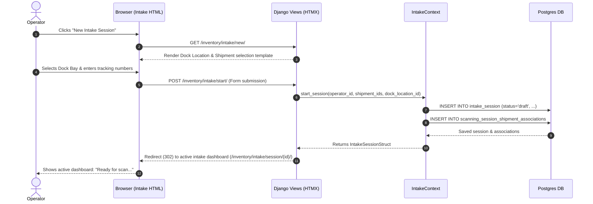
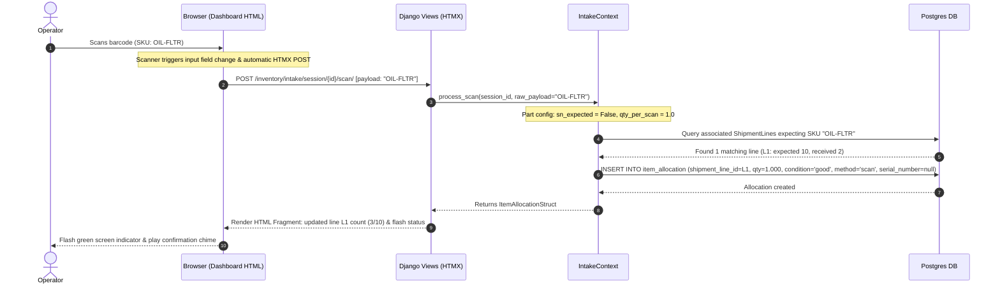
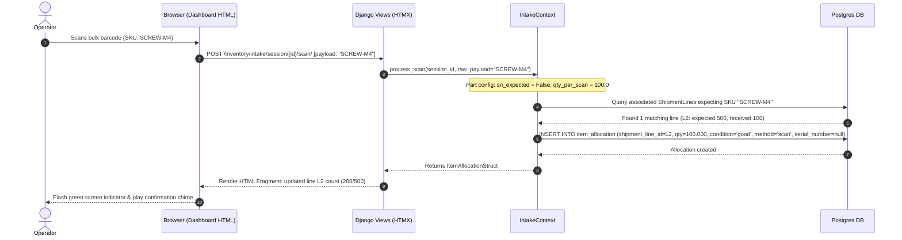
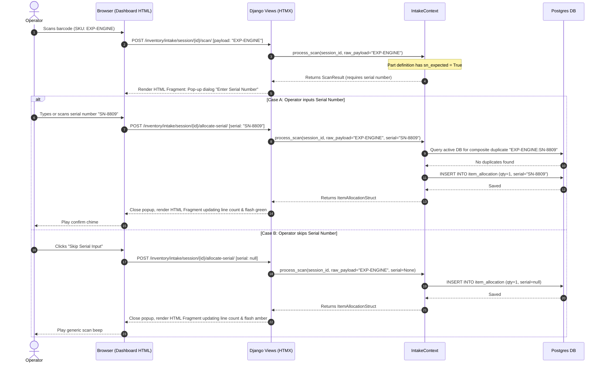
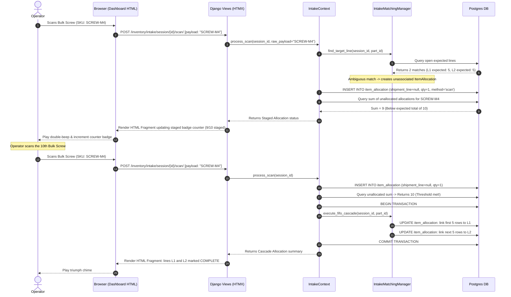
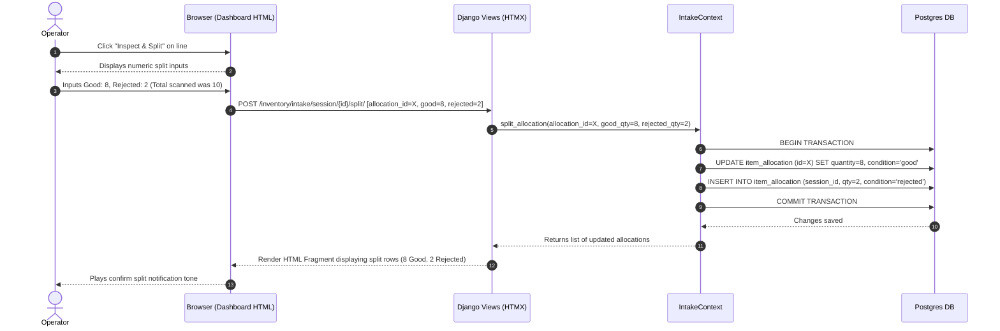
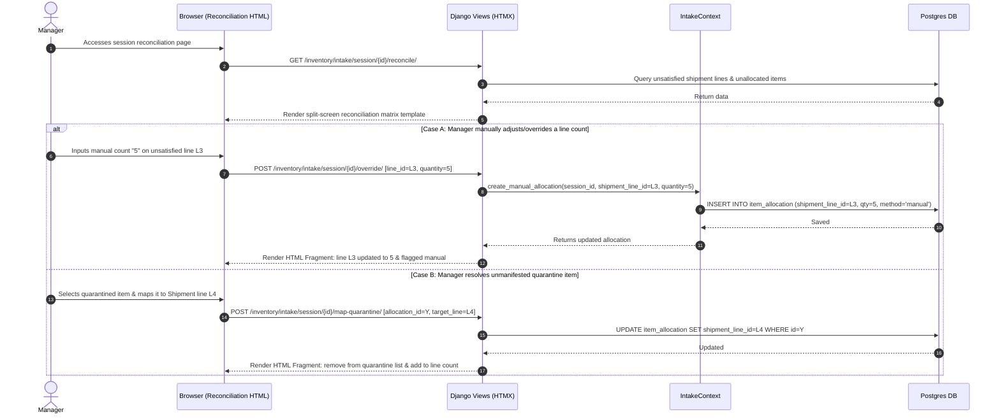
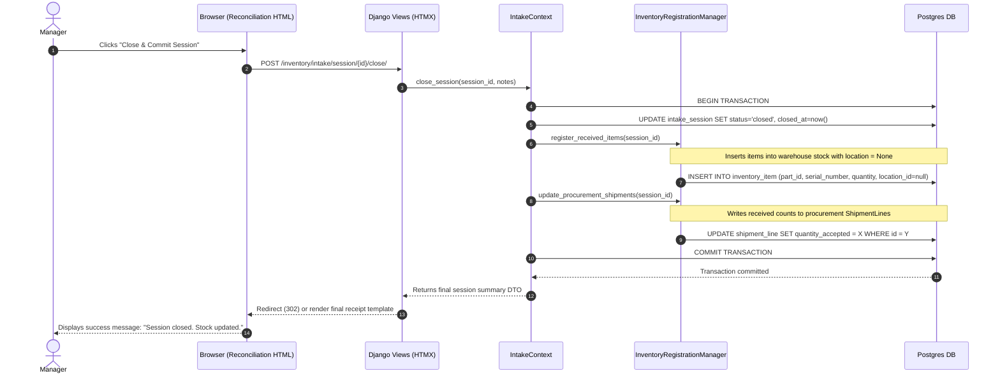

# User-Perspective Sequence Diagrams: Automated Intake & Blind Receiving

This document details the step-by-step interactive sequences for all primary user workflows in the automated intake receiving system. Each diagram illustrates how the Operator/Manager interacts with the HTMX frontend, and how it delegates to Django Views, the Control Layer (`IntakeContext`), and Postgres.

---

## Workflow 1: Start/Resume Intake Session
The operator starts a receiving run at the dock, selecting expected shipments.

---

## Workflow 2: Happy Path A — Scanning Non-Serialized Item (Quantity = 1)
*This is the default receiving behavior.* The operator scans a standard item that does not track serial numbers, expecting a quantity increment of 1.

---

## Workflow 3: Happy Path B — Scanning Bulk Non-Serialized Item (Quantity = qty_per_scan)
The operator scans a bulk package (e.g. box of screws) where the part definition has a default quantity multiplier (e.g., 100) and does not track serial numbers.

---

## Workflow 4: Barcode Scanning with Serial Number Prompt (Skipped or Entered)
Scanning a part configured with `sn_expected = True`.

---

## Workflow 5: Barcode Scanning with N-to-M Ambiguous Staging & FIFO Cascade
Scanning bulk items expected on multiple associated shipment lines.

---

## Workflow 6: Quality Inspection & Split Allocation
The operator splits a scanned line/allocation into good and rejected quantities in the UI.

---

## Workflow 7: Session Reconciliation & Deficit Review (Manual Adjustments)
The manager reconciles unsatisfied lines, short-shipments, or quarantined items.

---

## Workflow 8: Session Close & Committing to Inventory
The manager locks the session, executing physical stock injection and procurement hand-off.

