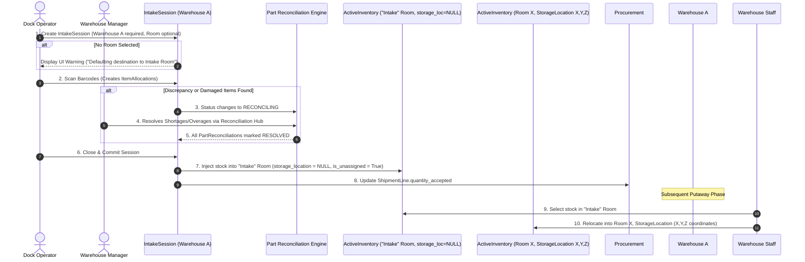

# Intake Engine Integration (`inventory_intake_kit` + `ebams2`)

This document integrates the **Automated Intake & Blind Receiving System** (`inventory_intake_kit`) with the **`ebams2` Warehouse Topography & Inventory Engine**.

---

## 1. Executive Summary & Architecture Synthesis

The `inventory_intake_kit` defines the automated, blind-receiving intake engine used at physical dock locations. In `ebams2`, this intake engine operates at the **Warehouse** level before putaway moves stock into specific **Rooms** and **3D Storage Locations** (X, Y, Z coordinates).

```
┌─────────────────────────────────────────────────────────────────────────┐
│                      PROCUREMENT APP (`app/procurement/`)               │
│                                                                         │
│  Shipment (Vendor claim) ──► ShipmentLine (Expected part & qty)          │
└────────────────────────────────────┬────────────────────────────────────┘
                                     │
                                     │ (Matched via ScanningSessionShipmentAssociation)
                                     ▼
┌─────────────────────────────────────────────────────────────────────────┐
│                      INVENTORY INTAKE ENGINE                            │
│                    (`app/inventory/models/intake/`)                     │
│                                                                         │
│  IntakeSession (Requires Warehouse)                                     │
│     │                                                                   │
│     ├─► ItemAllocation (Physical dock scans: part, barcode, serial, qty) │
│     │                                                                   │
│     └─► PartReconciliationSession (Part-level shortage/overage engine)  │
└────────────────────────────────────┬────────────────────────────────────┘
                                     │
                                     │ (Session Close Commit)
                                     ▼
┌─────────────────────────────────────────────────────────────────────────┐
│                   INVENTORY WAREHOUSE & STOCK ENGINE                    │
│                      (`app/inventory/models/`)                          │
│                                                                         │
│  UnassignedInventory (Warehouse level, location = None)                 │
│     │                                                                   │
│     │ (Putaway Workflow)                                                │
│     ▼                                                                   │
│  ActiveInventory (Room + StorageLocation X, Y, Z coordinates)           │
└─────────────────────────────────────────────────────────────────────────┘
```

---

## 2. Core Intake Entities & Schema Integration

### 1. `IntakeSession` (`inventory_intake_sessions`)
- **Required Warehouse**: Every session **must** reference a `Warehouse` (`warehouse_id = models.ForeignKey('inventory.Warehouse', on_delete=models.PROTECT)`).
- **Session Lifecycle**: `DRAFT` ──► `ACTIVE` ──► `RECONCILING` ──► `CLOSED`.
- **Operator & Dock Info**: Captures `operator_id`, `started_at`, `closed_at`, and `hardware_device_id`.

### 2. `ScanningSessionShipmentAssociation`
- Join table associating an `IntakeSession` with one or more expected `procurement.Shipment` records.
- Enables multi-shipment blind receiving in a single physical dock session.

### 3. `ItemAllocation` (`inventory_item_allocations`)
- Records each barcode scan event or manual intake count.
- **Fields**:
  - `intake_session_id` (FK to `IntakeSession`)
  - `shipment_line_id` (FK to `procurement.ShipmentLine`, `null=True` for unmanifested/overage items)
  - `part_id` (FK to `parts.Part`)
  - `quantity` (Decimal, default from `Part.qty_per_scan`)
  - `serial_number` & `composite_sn` (`f"{part_id}:{serial_number}"`)
  - `condition`: `GOOD` vs `REJECTED` (damaged/defective)
  - `intake_method`: `SCAN` vs `MANUAL`
- **Validation**: Enforces strict serial uniqueness (`composite_sn`) and serial quantity cap (enforces `quantity = 1.000` when `serial_number` is populated).

### 4. `PartReconciliationSession` (`inventory_part_reconciliations`)
- Triggered when expected vs. allocated counts diverge, or when rejected items are scanned for a part number.
- **Resolution Types**:
  - `accepted_shortage`: Manager signs off on vendor short-shipment.
  - `quarantined_overage`: Extra items kept without PO match (retained as unassigned stock).
  - `force_accepted_overage`: Manager forces overage approval into Procurement.
  - `rma_disposition`: Damaged/rejected items sent to RMA process.
- **Cross-Session Excess Pulling**: Manager of Session A (shortage) can search and pull unassociated excess `ItemAllocation` records from Session B (overage), updating `shipment_line_id` and logging an audit comment.
- **Reconciliation Barrier**: `IntakeSession` cannot move from `RECONCILING` to `CLOSED` until all `PartReconciliationSession` items are marked `status = 'RESOLVED'`.

---

## 3. Direct Answers to Design Review Open Questions

The `inventory_intake_kit` directly resolves the open questions raised in `shipment_and_intake_design_review.md`:

| # | Question from Design Review | Resolution Provided by `inventory_intake_kit` |
| :--- | :--- | :--- |
| **1** | *Who performs the shipment ↔ package match, and when?* | **Algorithmic Matching Engine & Session Associations**: Dock operators open an `IntakeSession` and link 1+ expected `Shipment` records via `ScanningSessionShipmentAssociation`. As barcodes are scanned, `ItemAllocation` automatically binds to matching `ShipmentLine` records (1-to-1 or FIFO N-to-M). |
| **2** | *Who resolves a box that spans multiple orders?* | **Part Reconciliation Engine & Reassignment Widget**: Misallocated or multi-order allocations are resolved part-by-part in the Reconciliation Hub (`/inventory/intake/reconciliations/`) via HTMX drag-and-drop / dropdown reassignments. |
| **3** | *What happens to an intake line with no shipment match at all?* | **Unmanifested Quarantine Allocation**: `ItemAllocation.shipment_line_id` is set to `null`. It is flagged as an overage/unmanifested item and routed to `PartReconciliationSession` with `quarantined_overage` disposition. |
| **4** | *Can an unmarked receipt stay permanently unaccounted-for by paperwork?* | **Yes (Unassigned Inventory)**: On session close, unmanifested items transition into `UnassignedInventory` (at the Warehouse level, `location = None`) flagged as "Overage Pending Review." They remain valid physical stock while awaiting purchasing adjustment. |
| **5** | *Exact stage list for intake/routing axis.* | **Intake Status Sequence**: `DRAFT` ──► `ACTIVE` (scanning in progress) ──► `RECONCILING` (discrepancy resolution barrier) ──► `CLOSED` (transactional commit to `UnassignedInventory` & `ShipmentLine.quantity_accepted`). |
| **6** | *Review queue design and priority.* | **Reconciliation Hub Dashboard**: Filters sessions by `status = RECONCILING` and `has_unresolved_parts = True`, displaying pending part counts and severity flags. |

---

## 4. Operational Handoff: Dock Intake to Putaway


