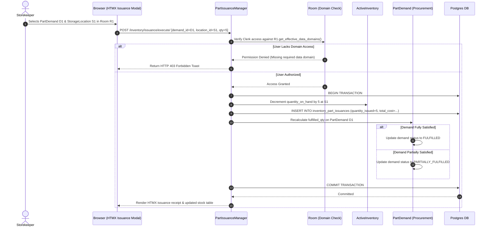

# Part Issuances Architecture & Demand Integration

This document details the process flows, data models, domain authorization gates, and demand graph updates for issuing inventory parts in `ebams2`.

---

## 1. Process Overview & Demand Integration

Part Issuance is the process of removing stock from physical storage to fulfill an authorized demand or operational requirement. In `ebams2`, issuances integrate directly with Procurement's **`PartDemand`** and **`DemandGraph`** engine.

```
┌────────────────────────────────────────────────────────┐
│             PROCUREMENT DEMAND SYSTEM                  │
│  PartDemand (Created for Maintenance, Event, Asset)    │
└───────────────────────────┬────────────────────────────┘
                            │
                            │ Fulfills Demand
                            ▼
┌────────────────────────────────────────────────────────┐
│             INVENTORY PART ISSUANCE ENGINE             │
│                 (`PartIssuance`)                       │
├────────────────────────────────────────────────────────┤
│ 1. Validate User Domain Access against Room            │
│ 2. Verify Available Quantity in ActiveInventory        │
│ 3. Decrement ActiveInventory at StorageLocation        │
│ 4. Transactionally Update Demand & DemandGraph Status  │
└────────────────────────────────────────────────────────┘
```

---

## 2. Data Model: `PartIssuance` (`inventory_part_issuances` table)

```python
class PartIssuance(UserCreatedBase):
    """Tracks parts issued from ActiveInventory to fulfill demands or direct requests."""
    __tablename__ = 'inventory_part_issuances'

    issuance_number = models.CharField(max_length=100, unique=True)
    
    # Source Stock Location
    active_inventory = models.ForeignKey('inventory.ActiveInventory', on_delete=models.PROTECT, related_name='issuances')
    room = models.ForeignKey('inventory.Room', on_delete=models.PROTECT)
    storage_location = models.ForeignKey('inventory.StorageLocation', on_delete=models.PROTECT, null=True)
    
    # Part & Quantity
    part = models.ForeignKey('parts.PartDefinition', on_delete=models.PROTECT)
    quantity_issued = models.DecimalField(max_digits=12, decimal_places=4)
    unit_cost_at_issue = models.DecimalField(max_digits=12, decimal_places=4)
    total_cost = models.DecimalField(max_digits=12, decimal_places=4) # quantity_issued * unit_cost_at_issue

    # Demand & Recipient Linkage (At least one must be set)
    part_demand = models.ForeignKey('procurement.PartDemand', on_delete=models.PROTECT, null=True, blank=True, related_name='issuances')
    issued_to_asset = models.ForeignKey('assets.Asset', on_delete=models.SET_NULL, null=True, blank=True, related_name='received_part_issuances')
    issued_to_user = models.ForeignKey('auth.User', on_delete=models.SET_NULL, null=True, blank=True, related_name='received_part_issuances')

    # Issue Classification
    issue_type = models.CharField(
        max_length=30,
        choices=[
            ('FOR_PART_DEMAND', 'Fulfill Part Demand'),
            ('DIRECT_TO_ASSET', 'Direct Issue to Asset'),
            ('DIRECT_TO_USER', 'Direct Issue to User')
        ]
    )

    # Audit & Personnel
    issued_by = models.ForeignKey('auth.User', on_delete=models.PROTECT, related_name='executed_issuances')
    issue_date = models.DateTimeField(default=timezone.now)
    issue_notes = models.TextField(blank=True)
```

---

## 3. Sequence Diagram: Issuance Fulfillment Workflow



---

## 4. Domain Access Control & Authorization Gates

To protect sensitive inventory, part issuances enforce a strict **Two-Tier Access Gate**:

1. **Functional Authorization**: The issuing user must possess the Django permission `inventory.can_issue_parts`.
2. **Row-Level Domain Scoping**: The issuing user's session data domains must cover all **effective Data Domains** of the source `Room`:

$$\text{Effective Domains} = \text{Warehouse.data\_domains} \setminus \text{Room.excluded\_data\_domains}$$

> **Security Rule**: If a user attempts to issue parts from a Room whose effective domains include a domain the user does not belong to (e.g. Restricted Avionics domain), the transaction is immediately rejected before touching database stock levels.
