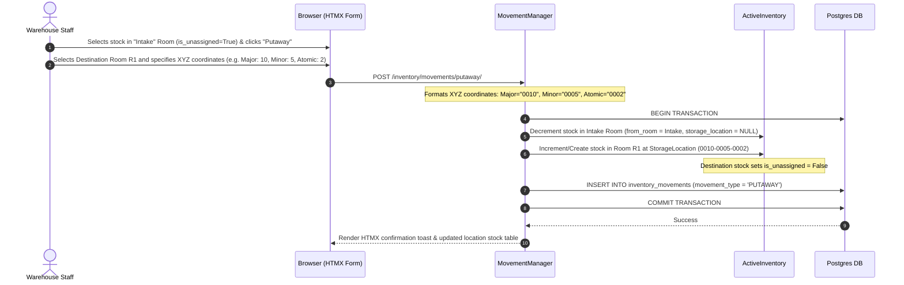

# Part Movements Architecture & Workflows

This document details the process flows, data models, state transitions, and business rules governing physical part movements within and between warehouses in `ebams2`.

---

## 1. Process Overview & Movement Classification

Part movements track every physical relocation of inventory stock. There are four primary types of movements:

1. **Putaway Movement**: Relocating newly intaken stock from the Warehouse's protected **`Intake` Room** (`storage_location = NULL`, `is_unassigned = True`) into a designated storage **`Room`** and **`StorageLocation`** (XYZ coordinates, `is_unassigned = False`).
2. **Inter-Room Transfer**: Transferring stock between two rooms within the same Warehouse (e.g., from Main Storage Room to Electronics Bay).
3. **Inter-Warehouse Transfer**: Relocating stock from a Room in Warehouse A to the `Intake` Room in Warehouse B.
4. **Bin Adjustment / Re-location**: Moving stock between storage locations within the same Room.

```mermaid
flowchart TD
    DockIntake[Intake Session Commit] --> IntakeRoom[Target Warehouse 'Intake' Room\nstorage_location = NULL, is_unassigned = True]
    
    IntakeRoom -->|1. Putaway Movement| StorageRoom[Destination Room\nStorageLocation: XYZ Coordinates, is_unassigned = False]
    
    StorageRoom -->|2. Inter-Room Transfer| RoomB[Room B (Same Warehouse)]
    StorageRoom -->|3. Bin Adjustment| BinB[Storage Location B (Same Room)]
    StorageRoom -->|4. Inter-Warehouse Transfer| WarehouseBIntake[Warehouse B 'Intake' Room]
```

---

## 2. Storage Location XYZ Coordinate Formatting Rule

To avoid rigid schema constraints while maintaining clean visual alignment, XYZ coordinates (`major_coord`, `minor_coord`, `atomic_coord`) are stored as **Strings (`CharField`)** with flexible formatting:

### Auto-Formatting & Padding Rules:
- **Numeric Inputs**: If a user inputs a numeric value for a coordinate (e.g. `10`, `25`, `100`), the system automatically formats it as a **4-digit zero-padded string**:
  - `10` ──► `"0010"`
  - `25` ──► `"0025"`
  - `100` ──► `"0100"`
- **No Truncation Rule**: If a user inputs a string longer than 4 digits (e.g. `"12345"`, `"AISLE-A12"`, or `"RACK-99999"`), the system **must not truncate** the value and saves it exactly as entered.

```python
def format_xyz_coordinate(value: str) -> str:
    """Formats coordinate strings: 4-digit zero-pads numbers without truncating longer strings."""
    if not value:
        return ""
    clean_val = str(value).strip()
    if clean_val.isdigit():
        if len(clean_val) < 4:
            return clean_val.zfill(4) # e.g. "10" -> "0010"
        return clean_val # e.g. "12345" remains "12345"
    return clean_val # Non-numeric strings remain unchanged
```

---

## 3. Data Model: `PartMovement` (`inventory_movements` table)

```python
class PartMovement(UserCreatedBase):
    """Logs all physical inventory stock movements and transfers."""
    __tablename__ = 'inventory_movements'

    movement_number = models.CharField(max_length=100, unique=True)
    part = models.ForeignKey('parts.PartDefinition', on_delete=models.PROTECT, related_name='movements')
    quantity = models.DecimalField(max_digits=12, decimal_places=4)
    
    movement_type = models.CharField(
        max_length=40,
        choices=[
            ('PUTAWAY', 'Putaway from Intake Room'),
            ('INTER_ROOM', 'Inter-Room Transfer'),
            ('INTER_WAREHOUSE', 'Inter-Warehouse Transfer'),
            ('BIN_ADJUSTMENT', 'Bin Adjustment'),
            ('CYCLE_COUNT_ADJUSTMENT', 'Cycle Count Adjustment')
        ]
    )

    # Source Location
    from_warehouse = models.ForeignKey('inventory.Warehouse', on_delete=models.PROTECT, related_name='movements_from')
    from_room = models.ForeignKey('inventory.Room', on_delete=models.PROTECT, related_name='movements_from')
    from_storage_location = models.ForeignKey('inventory.StorageLocation', on_delete=models.PROTECT, null=True, blank=True)

    # Destination Location
    to_warehouse = models.ForeignKey('inventory.Warehouse', on_delete=models.PROTECT, related_name='movements_to')
    to_room = models.ForeignKey('inventory.Room', on_delete=models.PROTECT, related_name='movements_to')
    to_storage_location = models.ForeignKey('inventory.StorageLocation', on_delete=models.PROTECT, null=True, blank=True)

    # Audit & Context
    moved_by = models.ForeignKey('auth.User', on_delete=models.PROTECT)
    movement_date = models.DateTimeField(default=timezone.now)
    notes = models.TextField(blank=True)
```

---

## 4. Sequence Diagram: Putaway Workflow (Intake Room ──► Storage Room)



---

## 5. Security & Domain Access Verification During Movements

When moving stock into a target `Room`, the system verifies that the executing user possesses authorization for the destination room's **effective Data Domains**:

$$\text{Effective Domains} = \text{Warehouse.data\_domains} \setminus \text{Room.excluded\_data\_domains}$$

If the user lacks access to any effective domain on the destination room, the movement is blocked with a `PermissionDenied` exception.
