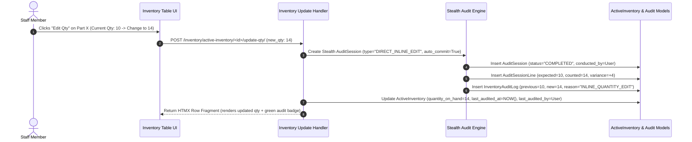
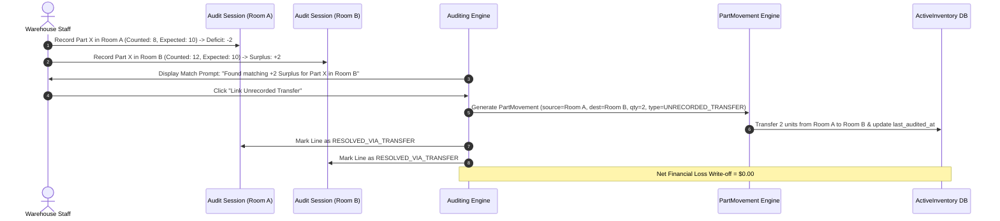

# Problem Statement & System Architecture: Inventory Auditing & Discrepancy Tracking

> **Document Status**: Active Architecture & Process Specification  
> **Purpose**: Defines the streamlined, session-based **Inventory Auditing Engine** (`AuditSession`) for `ebams2`. Replaces complex sign-off/approval workflows with a direct **Record of Truth** system that mirrors Dock Intake (`IntakeSession`) mechanics and supports stealth audit generation on direct row edits.

---

## 1. Executive Summary & Paradigm Shift

### The Pivot: No Approval Gates, Pure Record of Truth
Rather than building a complex financial write-off engine with multi-level manager approvals, threshold locks, and sign-off queues, `ebams2` handles inventory variances as a direct **Record of System Truth**:

- **Physical Reality Prevails**: When staff conduct an inventory count or edit stock inline, physical ground truth immediately updates system records upon session completion.
- **Immutable Audit Trail**: All adjustments auto-generate an unalterable audit log entry (`InventoryAuditLog`) capturing the delta (`variance_qty`), operator, location snapshot, and timestamps.
- **Unified UI/UX Pattern**: The Inventory Auditing flow directly mirrors Dock Intake (`IntakeSession`), allowing staff to open an **`AuditSession`**, scan/count items in a room, review auto-calculated discrepancies, and commit changes seamlessly.
- **Direct Row Edit Audit Capture**: Editing a quantity on an inventory row inline automatically triggers a **stealth single-item audit session** in the background, ensuring 100% audit log compliance.
- **Audit Recency Tracking**: Every `ActiveInventory` record tracks `last_audited_at` and `last_audited_by` to highlight stale inventory during cycle planning.

---

## 2. Parallel UI & Session Architecture

The Inventory Auditing application is designed to be the exact operational twin of the Dock Intake Receiving engine, while supporting stealth background audit creation for direct inline edits.

```mermaid
flowchart TD
    subgraph DockIntake["Dock Intake Application (Procurement ──► Inventory)"]
        D1[Start IntakeSession] ──► D2[Scan Packages / Serials] ──► D3[Reconcile PO Lines] ──► D4[Commit Session ──► Inject Stock into Intake Room]
    end

    subgraph InventoryAuditing["Inventory Auditing Application (Physical ──► System Record)"]
        A1[Start AuditSession] ──► A2[Scan / Input Room Stock] ──► A3[Auto-Calculate Discrepancies] ──► A4[Commit Session ──► Update ActiveInventory + Log Audit]
    end

    subgraph StealthAudit["Inline Edit Audit (Direct Inventory Row Qty Change)"]
        S1[User edits Qty on ActiveInventory Row] ──► S2[Auto-create Single-Line Stealth AuditSession] ──► S3[Commit InventoryAuditLog] ──► S4[Update last_audited_at & last_audited_by]
    end

    style DockIntake fill:#1e293b,stroke:#3b82f6,color:#fff
    style InventoryAuditing fill:#1e293b,stroke:#10b981,color:#fff
    style StealthAudit fill:#1e293b,stroke:#f59e0b,color:#fff
```

---

## 3. End-to-End Audit Session Process Flow

```mermaid
flowchart TD
    Start([User Initiates Audit Session]) ──► SelectLocation[Select Warehouse & Room / Storage Location]
    SelectLocation ──► SessionOpen[Create AuditSession - Status: OPEN]
    
    SessionOpen ──► CountLoop[Count / Scan Items on Shelf]
    CountLoop ──► EnterQty[Record Part SKU + Physical Counted Qty]
    
    EnterQty ──► SystemSnapshot[System fetches ActiveInventory expected_qty]
    SystemSnapshot ──► CalcDelta["Calculate Delta: variance_qty = counted_qty - expected_qty"]
    
    CalcDelta ──► CheckDelta{Variance Qty?}
    CheckDelta ──►|variance_qty == 0| Match[Status: MATCHED - No inventory change]
    CheckDelta ──►|variance_qty > 0| Surplus[Status: SURPLUS_FOUND - Found Stock]
    CheckDelta ──►|variance_qty < 0| Deficit[Status: DEFICIT_MISSING - Missing Stock]
    
    Match ──► MoreItems{More Items to Count?}
    Surplus ──► CheckUnrecorded{Matching Deficit in another Room?}
    Deficit ──► CheckUnrecorded
    
    CheckUnrecorded ──►|Yes| LinkTransfer[Link as Unrecorded Transfer ──► Auto-Creates PartMovement]
    CheckUnrecorded ──►|No| LogLine[Add AuditSessionLine]
    LinkTransfer ──► LogLine
    
    LogLine ──► MoreItems
    MoreItems ──►|Yes| CountLoop
    MoreItems ──►|No| FinalizeSession[User Clicks Finalize Audit Session]
    
    FinalizeSession ──► AtomicCommit[Atomic DB Transaction: Update ActiveInventory + Commit AuditLog]
    AtomicCommit ──► UpdateAuditTS[Stamp ActiveInventory: last_audited_at & last_audited_by]
    UpdateAuditTS ──► SessionClosed[Session Status: COMPLETED]
    SessionClosed ──► End([Audit Complete])
```

---

## 4. Direct Row Edit (Stealth Single-Row Audit Session)

When a user edits an `ActiveInventory` row quantity directly from the inventory table UI:



---

## 5. Unrecorded Transfer Auto-Resolution Engine

When staff physically move stock between rooms without logging a transfer, it manifests as a **Deficit in Room A** and a **Surplus in Room B**.



---

## 6. Data Model Architecture (including `ActiveInventory` Audit Fields)

```mermaid
erDiagram
    Warehouse ||--o{ ActiveInventory : contains
    Room ||--o{ ActiveInventory : contains
    StorageLocation ||--o? ActiveInventory : stores
    Part ||--o{ ActiveInventory : tracks

    Warehouse ||--o{ AuditSession : contains
    Room ||--o{ AuditSession : targets
    User ||--o{ AuditSession : conducts
    
    AuditSession ||--|{ AuditSessionLine : contains
    Part ||--o{ AuditSessionLine : references
    StorageLocation ||--o? AuditSessionLine : maps_to
    
    AuditSessionLine ||--o? PartMovement : generates_transfer
    AuditSessionLine ||--o{ InventoryAuditLog : commits_to

    ActiveInventory {
        bigint id
        fk part_id
        fk warehouse_id
        fk room_id
        fk storage_location_id
        integer quantity_on_hand
        datetime last_audited_at "UPDATED ON AUDIT / INLINE EDIT"
        fk last_audited_by_id "UPDATED ON AUDIT / INLINE EDIT"
    }

    AuditSession {
        bigint id
        string session_number UK
        fk warehouse_id
        fk room_id
        string session_type "FULL_ROOM_AUDIT | SPOT_CHECK | DIRECT_INLINE_EDIT"
        string status "DRAFT | OPEN | COMPLETED | CANCELLED"
        fk conducted_by_id
        datetime started_at
        datetime completed_at
    }

    AuditSessionLine {
        bigint id
        fk session_id
        fk part_id
        fk storage_location_id
        integer expected_qty
        integer counted_qty
        integer variance_qty
        string discrepancy_type "MATCHED | SURPLUS_FOUND | DEFICIT_MISSING"
        string resolution_type "DIRECT_ADJUSTMENT | UNRECORDED_TRANSFER"
        fk linked_movement_id
    }

    InventoryAuditLog {
        bigint id
        string audit_number UK
        fk audit_session_line_id
        fk part_id
        fk room_id
        integer previous_qty
        integer new_qty
        integer variance_qty
        string reason_code
        datetime recorded_at
    }
```

---

## 7. Key Operational Rules

1. **Audit Recency Tracking**:
   - Every `ActiveInventory` row tracks `last_audited_at` and `last_audited_by`.
   - Inventory views support filtering by "Stale Inventory" (e.g. `last_audited_at < 30 days ago` or `last_audited_at IS NULL`).
2. **Stealth Single-Row Audit Execution**:
   - Direct inline edits on `ActiveInventory.quantity_on_hand` automatically wrap inside a stealth single-line `AuditSession` (`session_type="DIRECT_INLINE_EDIT"`).
   - Zero bypasses of the `InventoryAuditLog` table are permitted in the control layer.
3. **Session Scope**:
   - An `AuditSession` is scoped to a specific **`Warehouse`** and optional **`Room`**.
   - Multiple users can contribute counts to the same active `AuditSession` simultaneously.
4. **Zero-Lag Inventory Updates**:
   - When the user clicks **Finalize Audit Session**, `ActiveInventory.quantity_on_hand` updates immediately to match `counted_qty`.
