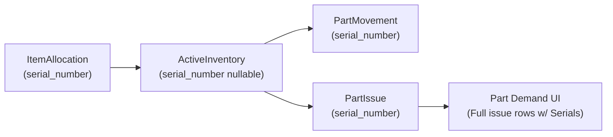

# Serialized Inventory Tracking Specification

This document details the architecture and model specifications for tracking serialized inventory across its entire lifecycle: from physical dock intake, to `ActiveInventory` storage, inter-location movements, part issuance, and Part Demands UI integration.

---

## 1. Lifecycle Tracking Architecture

---

## 2. Model & Field Specifications

### 2.1 Dock Intake (`ItemAllocation`)
- **`serial_number`**: `CharField(max_length=200, null=True, blank=True)`.
- **`composite_sn`**: `CharField(max_length=400, null=True, blank=True, db_index=True)`. Formatted as `f"{part_id}:{serial_number}"`.
- **Constraint**: If `serial_number` is present, `quantity` MUST equal `1.000`.

### 2.2 Active Inventory (`ActiveInventory`)
- **`serial_number`**: `CharField(max_length=200, null=True, blank=True)`.
- **Row Grain**:
  - **Non-Serialized Stock**: `serial_number = NULL`. Multiple units of the same part in the same room/storage location aggregate into a single `ActiveInventory` balance row.
  - **Serialized Stock**: `serial_number = 'SN123'`. Each serialized unit forms a distinct row pointing to its room/storage location with `quantity = 1.000`.
- **Unique Constraint**: `UniqueConstraint(fields=['room', 'storage_location', 'part', 'serial_number'], name='unique_active_inventory_item')`.

### 2.3 Part Movements (`PartMovement`)
- **`serial_number`**: `CharField(max_length=200, null=True, blank=True)`.
- When transferring serialized stock between locations/rooms:
  - The movement row specifies the `serial_number`.
  - The orchestrator validates that `ActiveInventory` has a unit matching `(source_room, source_location, part, serial_number)`.
  - The target location gains a new `ActiveInventory` row with `serial_number`.

### 2.4 Part Issuances (`PartIssue`)
- **`serial_number`**: `CharField(max_length=200, null=True, blank=True)`.
- Recorded by `PartIssuanceOrchestrator` when issuing stock to satisfy a `PartDemand`.

---

## 3. UI Specification: Part Demands Detail View

### 3.1 Deliberate UI Anti-Pattern
On the **Part Demand detail view** (`app/inventory/templates/inventory/part_demands/detail.html`):

> [!NOTE]
> **Deliberate UI Anti-Pattern**: Rather than hiding fulfillment history behind an aggregated progress bar, the UI will directly render the complete list of **full Part Issue rows** as an un-nested table directly inside the demand view. If serial numbers were captured upon issuance, each row prominently displays its assigned `serial_number`.

### 3.2 UI Layout Structure

| Issue Date | Issued By | Qty Issued | Serial Number | Source Location | Recipient Asset |
| :--- | :--- | :--- | :--- | :--- | :--- |
| 2026-08-16 14:30 | j.doe | 1.000 | `SN-88392-A` | Warehouse A / Bin 12 | Asset #104 |
| 2026-08-16 14:31 | j.doe | 1.000 | `SN-88392-B` | Warehouse A / Bin 12 | Asset #104 |
| 2026-08-16 15:00 | m.smith | 5.000 | *N/A (Bulk)* | Warehouse B / Rack 2 | Asset #104 |

This provides immediate, zero-click visibility into exact physical unit allocations for technicians and logistics managers.
