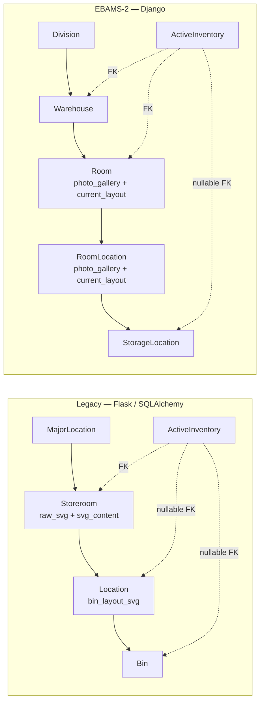

# Storeroom Designer — Legacy vs EBAMS-2 Data Model

Source of truth for the legacy side: `/home/cb/REPOS/asset_management/app/data/inventory/`.
Source of truth for the new side: `app/inventory/models/topography/` and
`app/inventory/models/stock/active_inventory.py`.

## 1. Tier mapping

The legacy app has **four** tiers; EBAMS-2 has **five**. The extra tier is at the
top: legacy `MajorLocation` was a flat site list, where EBAMS-2 puts a `Division`
above the `Warehouse` so warehouses roll up into the org hierarchy that
authorization already uses.

| Legacy tier | Legacy table | EBAMS-2 tier | EBAMS-2 table |
| :--- | :--- | :--- | :--- |
| — | — | Division | `core_division` |
| MajorLocation | `major_locations` | **Warehouse** | `inventory_warehouse` |
| **Storeroom** | `storerooms` | **Room** | `inventory_room` |
| **Location** | `locations` | **RoomLocation** (XY) | `inventory_room_location` |
| **Bin** | `bins` | **StorageLocation** (Z) | `inventory_storage_location` |
| ActiveInventory | `active_inventory` | ActiveInventory | `inventory_active_inventory` |

The legacy "storeroom designer" is therefore an EBAMS-2 **Room** designer.
"Warehouse" in this port is a genuinely new tier, not a rename of `Storeroom`.

## 2. Storeroom → Room

| Legacy `Storeroom` | EBAMS-2 `Room` | Note |
| :--- | :--- | :--- |
| `room_name` | `room_name` | Same. Now unique **per warehouse** (`uniq_room_warehouse_name`); legacy had no uniqueness at all. |
| `address` | — | Moved **up** to `Warehouse.address`. A room does not have its own street address. |
| `major_location_id` | `warehouse_id` | |
| `raw_svg` (TEXT) | — | **Dropped deliberately.** FD-25: only sanitized SVG is ever stored or rendered, so keeping the unsanitized original is a liability, not a feature. |
| `svg_content` (TEXT) | `current_layout` → `events.Attachment` | Layouts are now files in the events gallery, not a TEXT column. Uploading a new one **versions** rather than overwrites — `photo_gallery` keeps every prior layout. |
| — | `photo_gallery` → `events.FileSet` | New: layout history. |
| — | `description` | New. |
| `is_active` | `is_active` + `deleted_at` (`SoftDeleteMixin`) | |
| — | `is_intake_room`, `is_deletable`, `is_renamable` | New: FD-14's protected Intake Room, provisioned by `WarehouseFactory` alongside the warehouse. Legacy had no equivalent — unassigned stock had nowhere structural to live. |
| — | `excluded_domains` (M2M) | New: row-level authorization. Legacy storerooms were visible to anyone with the `supply` module role. |

## 3. Location → RoomLocation

| Legacy `Location` | EBAMS-2 `RoomLocation` | Note |
| :--- | :--- | :--- |
| `location` (free text, e.g. `"3-1"`, `"Shelf A"`) | `major_coord` + `minor_coord` | **Structural change.** The identifier is now a coordinate pair, not a free-text label. |
| `display_name` | `display_code` (derived) | Computed on write by `coordinate_adaptor`, zero-padded to four characters — `"3-1"` becomes `"0003-0001"`. Never hand-set. |
| `svg_element_id` | — | **Dropped.** Legacy stored a DB id back into the SVG and rewrote the file to match (`postprocess_svg`). EBAMS-2 matches on the shape's `inkscape:label` **by value**, so the file is never rewritten and nothing has to stay in sync. |
| `bin_layout_svg` (TEXT) | `current_layout` → `events.Attachment` | Same change as Room. |
| — | `photo_gallery` → `events.FileSet` | New. |
| — | `is_active` | New — retire instead of delete. |
| *(no uniqueness — explicitly noted in legacy source)* | `Unique(room, major_coord, minor_coord)` | **Tightened.** Legacy deliberately allowed duplicate location identifiers in a storeroom, which made "which shelf 3-1?" unanswerable. |

## 4. Bin → StorageLocation

| Legacy `Bin` | EBAMS-2 `StorageLocation` | Note |
| :--- | :--- | :--- |
| `bin_tag` (free text) | `atomic_coord` | Z coordinate, zero-padded on write. |
| — | `display_code` | Full `XXXX-YYYY-ZZZZ` path, derived. Legacy computed `full_path` as a Python property on every read. |
| `svg_element_id` | — | Dropped, as above. |
| `location_id` | `room_location_id` | |
| `Unique(location_id, bin_tag)` | `Unique(room_location, atomic_coord)` | Same rule. |
| — | `is_active` | New — retire instead of delete. |

## 5. ActiveInventory

This is where the two models differ most, and it is why the deletion rules had to
change.

| Legacy | EBAMS-2 | Note |
| :--- | :--- | :--- |
| `storeroom_id` **NOT NULL**, `location_id` NULL, `bin_id` NULL | `warehouse` + `room` NOT NULL, `storage_location` NULL | Legacy tracked stock at three separate levels via three nullable FKs on a `BinPrototype` mixin. EBAMS-2 collapses this: stock hangs off a `StorageLocation`, or off the Intake Room with `storage_location = NULL` and `is_unassigned = True`. |
| `Unique(part, storeroom, location, bin)` | `Unique(room, storage_location, part, serial_number)` | Serial number is part of the key now. |
| `quantity_on_hand` FLOAT | `DecimalField(12, 3)` | FD-8 — money and quantities are never floats. |
| no serial tracking | `serial_number` (`''`, never NULL — FD-12) | |
| `Bin.location` FK: `cascade='all, delete-orphan'` | `StorageLocation.stock` FK: `on_delete=PROTECT` | **The important one.** In the legacy schema, deleting a `Location` cascaded its `Bin`s out of existence; the inventory rows pointing at those bins were only protected by a hand-written `count()` check in `StoreroomContext.remove_location`. EBAMS-2 makes the database itself refuse. |
| — | `is_unassigned`, `last_audited_at`, `last_audited_by` | New. |

## 6. Behavioural rules that changed

| Rule | Legacy | EBAMS-2 (this port) | Where enforced |
| :--- | :--- | :--- | :--- |
| Delete a storeroom | `db.session.delete()` — hard, cascading to every location and bin. Guarded only by an inventory `count()`. | **No hard delete.** `is_active = False`, reversible from the same edit page. | `TopographyManager.deactivate_warehouse` / `deactivate_room` |
| Delete a location | Hard delete, cascading its bins. Blocked only if `ActiveInventory.location_id` rows existed. | Retire (`is_active = False`), blocked if **any bin underneath** holds stock. | `RoomLocationPolicy.check_deactivate` |
| Delete a bin | Hard delete, **no inventory check at all** — `LocationContext.remove_bin` had none. | Retire, blocked while the bin holds stock. | `StorageLocationPolicy.check_deactivate` |
| Upload a replacement layout | Silently additive: new labels became new locations, existing ones were updated, and locations the new SVG no longer mentions were left dangling with no warning. The build page's own label read *"Delete Current locations and bins and upload new"*. | Reconciliation screen (matched / unmatched / orphaned). **An upload whose shapes drop a stock-holding location is rejected outright** — nothing archived, `current_layout` untouched. | `LayoutReconciliationPolicy.check_room_orphans` / `check_room_location_orphans` |
| Create locations from an upload | Automatic, all-or-nothing. | Never automatic — the operator ticks which unmatched shapes to create. | `SvgReconciliationStruct` + the builder page |
| SVG storage | Raw **and** processed markup in TEXT columns; the processed copy had JavaScript injected into it. | Sanitized file in the events gallery; interactivity is injected at render time as HTMX attributes, never persisted. | `RoomSvgAdapter` |
| Authorization | `@require_any_module_role('supply')` on the index; several write routes had only `@login_required`. | Every write behind `inventory.can_manage_topography`; every read row-scoped by `RoomDomainPolicy`. | `inventory_access.require_manage_topography` |

## 7. Known data-shape gotcha

Legacy layout SVGs label their shapes with **unpadded** codes (`1-1`, `5-2`).
EBAMS-2 matches shape labels against `RoomLocation.display_code`, which is
**padded** (`0001-0001`, `0005-0002`), and FD-29 requires an exact match. A legacy
SVG imported as-is therefore reconciles as all-unmatched: every shape shows up in
the "create these?" bucket rather than binding to the existing location.

Two ways out, neither of which is in this port's scope:

1. Relabel the shapes in Inkscape to the padded form (correct, one-time, per file).
2. Add a normalization pass in `RoomSvgAdapter.extract_shape_codes` that pads
   numeric-looking segments before comparison. This weakens FD-29's exact-match
   rule and should be a deliberate decision, not a quiet convenience.

The dev seed's `Spatial Map Demo` room reproduces this exactly, and is a useful
place to see it.
