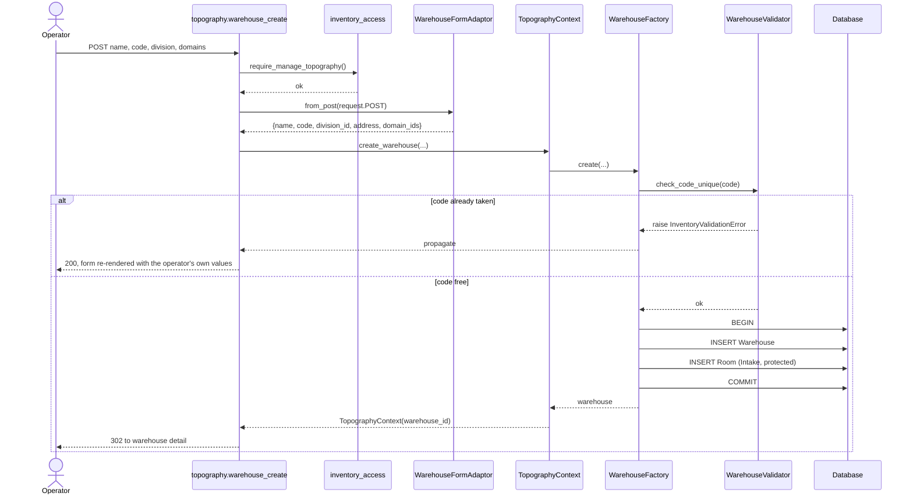
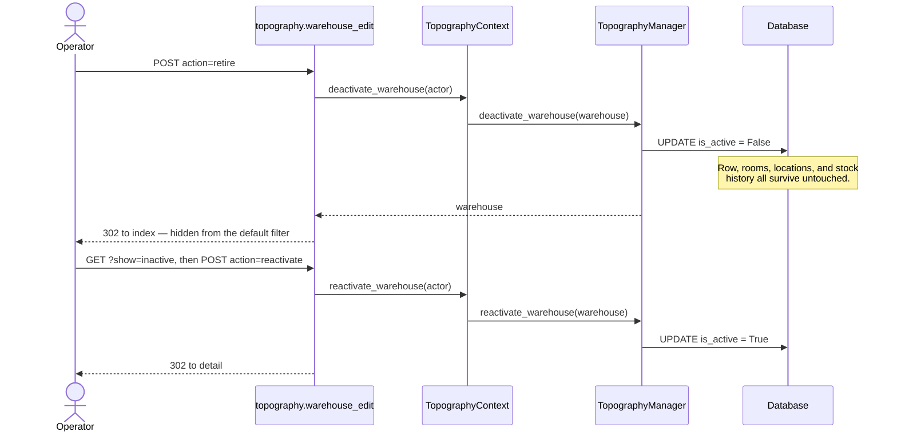
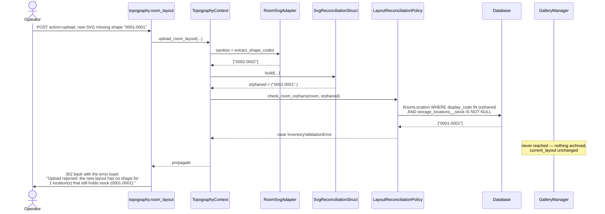
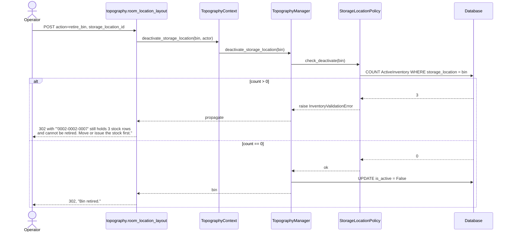
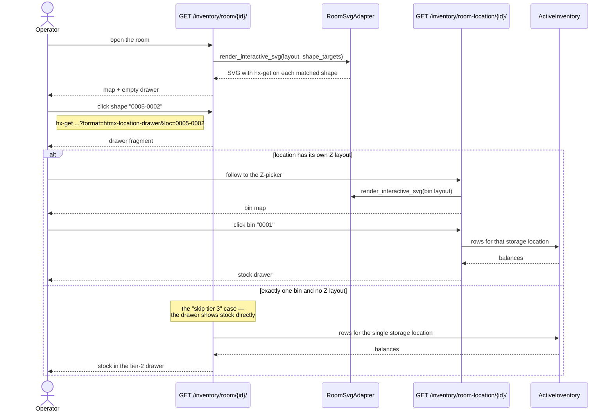

# Storeroom Designer — Port Sequence Diagrams

Actors are the real collaborators, not abstractions: the entrypoint is
`app/inventory/presentation_layer/entrypoints/topography.py`, the context is
`TopographyContext`, and every guard named here is a real class in
`app/inventory/control_layer/guards/`.

## 1. Create a warehouse

The one thing worth noticing: the Intake Room is not a second step the operator
can forget. `WarehouseFactory` creates both rows inside one transaction, so a
`Warehouse` without an Intake Room is not a state the control layer can produce
(FD-14).



## 2. Retire a warehouse — the soft delete

The legacy `storeroom_delete` route called `db.session.delete()` and took the
storeroom's whole location/bin tree with it. Nothing in this port does that.



## 3. Upload a room layout — the happy path

Reconciliation never writes. It reports three buckets, and only the operator's
explicit "create selected" turns unmatched shapes into rows.

```mermaid
sequenceDiagram
    actor Op as Operator
    participant EP as topography.room_layout
    participant Ctx as TopographyContext
    participant Svg as RoomSvgAdapter
    participant Pol as LayoutReconciliationPolicy
    participant Rec as SvgReconciliationStruct
    participant Gal as GalleryManager
    participant Sess as request.session

    Op->>EP: POST action=upload, svg_file
    EP->>Ctx: upload_room_layout(room_id, file, actor)
    Ctx->>Svg: check_upload_size(bytes)
    Ctx->>Svg: sanitize(raw)
    Note over Svg: strips script / foreignObject / on* handlers /<br/>external hrefs, and the Inkscape `svg:` prefix
    Svg-->>Ctx: sanitized markup
    Ctx->>Svg: extract_shape_codes(group="locations")
    Svg-->>Ctx: ["0001-0001", "0002-0002"]
    Ctx->>Rec: build(shape_codes, existing_codes)
    Rec-->>Ctx: matched / unmatched_shapes / orphaned
    Ctx->>Pol: check_room_orphans(room, orphaned)
    Pol-->>Ctx: ok — no orphan holds stock
    Ctx->>Gal: add_image(sanitized file)
    Note over Gal: archived as a new version;<br/>the previous layout stays in photo_gallery
    Gal-->>Ctx: attachment set as current_layout
    Ctx-->>EP: reconciliation
    EP->>Sess: store reconciliation draft
    EP-->>Op: 302 back to the builder, reconciliation card visible

    Op->>EP: POST action=create_selected, unmatched_code[]
    EP->>Ctx: bulk_add_room_locations(coordinates)
    Ctx-->>EP: created rows
    EP->>Sess: pop draft
    EP-->>Op: 302, "Created N location(s)."
```

## 4. Upload a layout that would orphan stock — **rejected**

This is the rule the port adds. The check runs **before** `_archive_layout`, so a
rejected upload leaves `current_layout` pointing at the layout that was already
there. There is no half-applied state to clean up.



## 5. Retire a bin — allowed vs refused

The legacy `LocationContext.remove_bin` had no inventory check whatsoever; only
the location-level delete did. This port checks at both tiers, so retiring the
parent is not a way around the child rule.



Note the interaction with `StockLedgerManager.withdraw`: it **deletes** a balance
row the moment it reaches zero, so "a row exists" and "stock lives here" are the
same statement. A bin becomes retirable the instant its last unit is issued or
moved — no stale zero-quantity rows block it forever.

## 6. Drill down through the three tiers (read path, unchanged by this port)

Included for orientation — this is the legacy build page's "location viewer →
bin viewer" flow as it exists in EBAMS-2, where each tier is its own canonical
URL with a `format=` fragment rather than one page holding both viewers.


