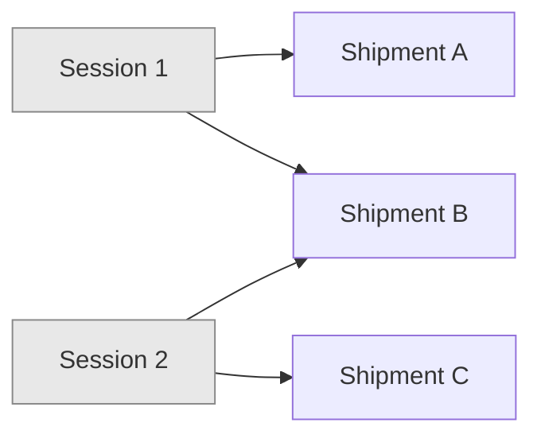
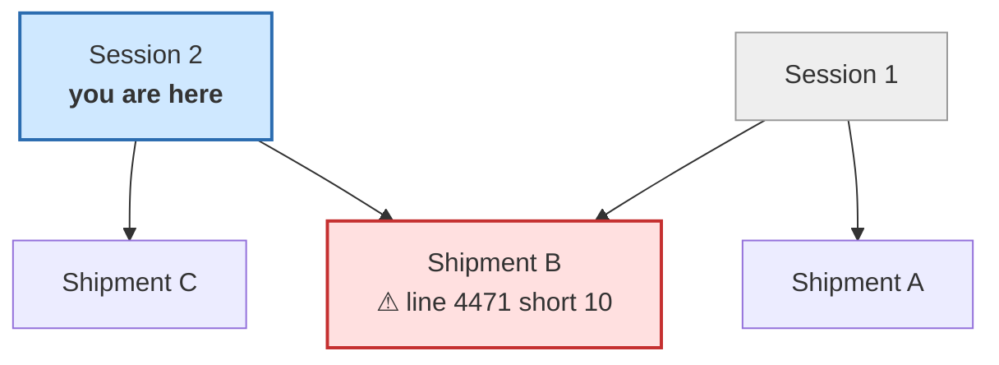

# Intake Shipment Graph Closure

**Status:** acknowledged tech debt. **Deferred deliberately.** Build everything
in [intake_portal_workflow.md](../intake_portal_workflow.md) as specified; this
document exists so the problem is written down, bounded, and cheap to pick up
later.

---

## 1. The problem

Sessions and shipments form a **bipartite graph**. A session that receives
against two shipments creates an edge between them. Those edges are transitive,
so shipments become coupled to shipments that no single session ever touches.

**The minimal case:**

- Shipments **A**, **B**, **C**
- Session **1** receives against **A** and **B**
- Session **2** receives against **B** and **C**

Nothing links A to C. But B is in both sessions, so:

- To know whether **B** is fully received, you must look at both sessions.
- To know whether **session 1** is complete, you need B — which needs session 2
  — which needs C.
- **A and C are transitively coupled** through two hops of shared work.

The unit of truth is not the session. It is the **connected component**.

## 2. Why this exists

Cross-session allocations are visible and counted (§5.5), so a session's numbers
depend on other sessions. That was the right call, and the graph is its price.

**The root mismatch:** *completeness is judged per **session**, while truth is
scoped to a **shipment line**.* Every symptom below follows from that one
sentence.

### 2.1 How much this shrank

An earlier draft of this note was considerably more alarming. Two later
decisions in the main spec removed most of the danger:

| Decision | Effect on this problem |
| :--- | :--- |
| **Over-allocation is impossible** (§7.2) | The worst symptom — a line claiming more received than ordered — **cannot occur at all** |
| **Reconciliation approval eliminated** (§7.1) | No sign-off propagates anywhere, so nothing is silently restamped across sessions |

What remains is purely a **completeness and visibility** question: *"to be sure
this session's picture is whole, whose work must I also look at?"* Nothing can go
wrong because of it. Somebody can merely be under-informed.

That is a much smaller problem than the one this document was opened for.

---

## 3. What this does NOT affect

This is important — the problem is narrower than it looks, and nothing in
phases 1 or 2 needs to change.

### 3.1 Recording (page 2) — unaffected

The operator focuses on what is physically in front of them. Part shows 50 of 50
counted, bar reads 100%, done. The graph is irrelevant to counting: you count
what is in the box.

### 3.2 Association (page 3) — unaffected

The user assigns links so each shipment line's quantity is satisfied. That is a
per-line judgement and needs no closure. Cross-session visibility (§5.5) already
shows them what other sessions took against the same line, which is all they
need to link correctly.

### 3.3 Over-allocation cannot happen

The main spec bans it outright (§7.2): the sum of live allocations linked to a
shipment line may never exceed that line's quantity, enforced on every write
path with the line locked for update.

So the scenario this document was originally opened to worry about — *"every
once in a while they will be over stock and this will need to be fixed
somehow"* — **is now unreachable.** Excess stays unlinked, which is a terminal
state, not a defect.

**What the graph buys you is blast radius, not correctness.** It answers *"who
else is affected by this?"*, never *"is something wrong?"* Nothing can be wrong.

Hold onto that distinction. It is what makes the deferral safe.

---

## 4. Mitigation for this build — show the graph

The **Discrepancy Report** (page 4) is the only surface that changes, and only to
**inform**. It has no controls at all (§7.4), so there is nothing here to gate.

### 4.1 Trigger

When the report loads, compute the connected component of the current session —
the transitive closure over shared shipments.

> **If the closure contains shipments or sessions beyond the current session's
> own, render the graph.** Otherwise render nothing; most sessions are an
> isolated component and nobody should ever see this.

### 4.2 What is rendered

A mermaid diagram of the component, with the current session marked and any
shipment carrying an unresolved discrepancy flagged.

Alongside it, in plain language:

> *This session shares shipment B with session 1. Shipment B line 4471 is short
> 10 units, and session 1 depends on the same line. Shipment A is reachable
> through session 1 even though this session never touches it.*

### 4.3 What the reader can do

**Nothing, here.** The page is a report. If something is actionable, the reader
follows the link to the allocation portal and places stock (§7.3).

That is consistent with the project's stated philosophy: *truth here is a blurry
concept; this is a system for humans to try and do their best.* The system's job
is to make sure a person saw the whole picture — not to make them acknowledge it,
and not to overrule them.

### 4.4 Cost

Small. One closure traversal on one page load, one aggregate per line in the
component, and a rendered diagram. No schema, no writes, no migration.

---

## 5. Proposed real solutions

Three options, worst to best.

### Option 1 — Report at component grain

Make the connected component the explicit unit of the discrepancy report.
Compute it, name it, report against it.

**Verdict: no.** It is honest to the current model but the model is what is
wrong. It introduces a runtime-computed entity with unstable membership — the
component changes shape whenever anyone creates a session — and users would have
to reason about a grouping that has no physical counterpart on the dock. It
solves the symptom by making the symptom a first-class concept.

### Option 2 — Make the overlap impossible

**A shipment may be linked to at most one *open* session at a time.**

The graph collapses to a forest of single-session stars. Closure becomes depth 1
and the problem disappears by construction.

**Verdict: good cheap mitigation, compatible with everything already decided.**

- It matches the world already assumed: concurrent operators are explicitly out
  of scope (Q15), and two people receiving the same shipment simultaneously is a
  double-count risk regardless.
- It does not conflict with the second-session policy (§4.5), because
  exclusivity applies only to *open* sessions — once session 1 locks recording,
  the shipment is released.
- Cost: one uniqueness rule and a clear error message on page 1.

The downside is that it forbids something people may legitimately want later
(two docks, one large shipment), so it is a constraint, not a cure.

### Option 3 — Move the discrepancy report to the shipment (recommended)

**The report stops living on sessions. It lives on shipments.**

The main spec already establishes the principle:

> *The shipment line is the unit of truth. The session is a lens onto it.*

Discrepancies are already computed from all allocations regardless of session
(§5.5), and allocations are already capped per line (§7.2). **The report is the
only thing still pinned to a session, and it is the one thing that reads purely
from lines.**

Align the grain and the graph problem does not get solved — it **stops
existing**:

- Read shipment A. Read B. Read C. Each independently complete.
- No closure is ever needed, because you never ask "is this session's picture
  whole?" — you ask "what is outstanding on this shipment?", and that is
  answerable from the shipment alone.

**Shape of the change:**

| Today | After |
| :--- | :--- |
| `/inventory/intake/<id>/discrepancies` | `/inventory/shipment/<id>/discrepancies` |
| Report groups by part within a session | Report groups by line within a shipment |
| Session review asks "is my picture whole?" | Session review links out to each shipment's report |

**Verdict: this is the real fix.** It deletes concepts rather than adding them —
the closure traversal and the graph diagram both become unnecessary. It is also
the smaller system.

**Why not do it now:** it moves a page out of the intake app and into shipment
territory, which touches the procurement seam and reopens navigation questions
that are settled for this build. It is a clean second pass, not a change to make
mid-flight.

**Note how cheap this became.** With approval eliminated, the report is
stateless — no rows to migrate, no decisions to re-home. Option 3 is now little
more than moving a read-only page to a different URL and regrouping it.

---

## 6. Recommendation

| Phase | Action |
| :--- | :--- |
| **This build** | §4 graph on the discrepancy report. Read-only. No behavior change, no schema change. |
| **Next** | Option 2 — one-open-session-per-shipment. Cheap, contained, removes most real-world instances. |
| **Eventually** | Option 3 — move the discrepancy report to shipment grain. Retires the closure traversal, the graph, and this document. |

---

## 7. Revisit triggers

Pick this up when any of these becomes true:

- The graph in §4 renders **often** in real use, rather than rarely.
- Someone asks for two people to receive one shipment at the same time
  (which forecloses Option 2 and forces Option 3).
- A shortage is found to have been fillable all along from unlinked stock nobody
  knew about — meaning the allocation portal's global scope (§7.3) is not
  surfacing enough, and closure awareness would have helped.

---

## 8. Related

- [intake_portal_workflow.md](../intake_portal_workflow.md) — the main spec.
  Relevant sections: **§5.5** cross-session visibility (the cause), **§7.1**
  passive resolution, **§7.2** the over-allocation ban, **§7.3** the allocation
  portal, **§7.4** the discrepancy report.

### 8.1 Why this note is worth keeping despite shrinking

The problem is now cosmetic — a reader may be under-informed, nothing more. But
the *shape* of it is a permanent property of letting sessions share shipments,
and it will come back the moment anyone proposes re-adding a session-scoped
notion of "done." Keep the note so that proposal arrives with its counterargument
already written.
