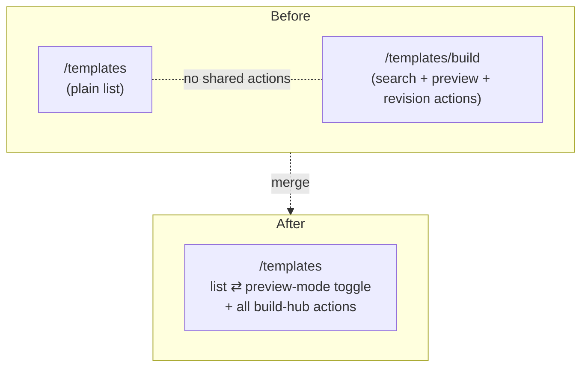
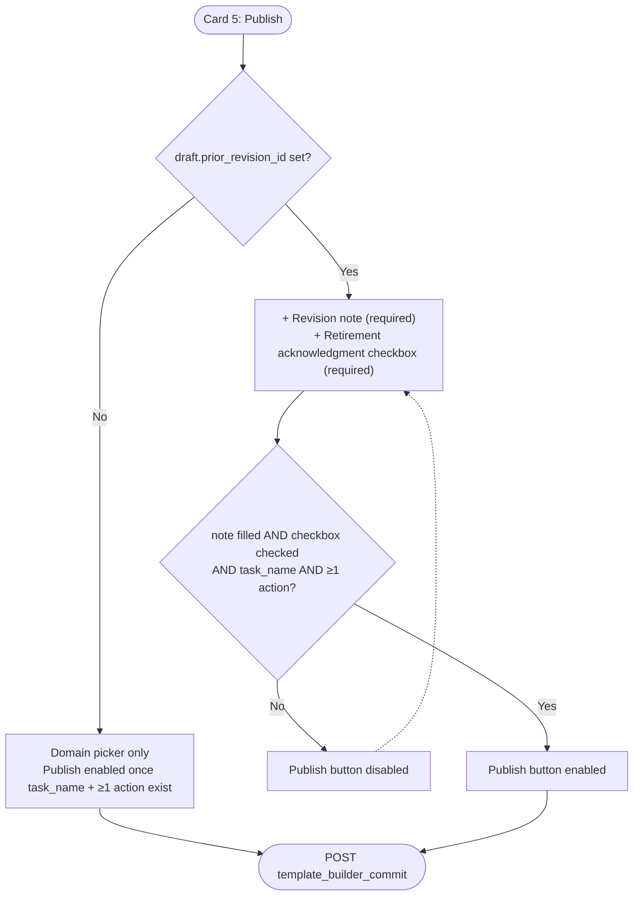
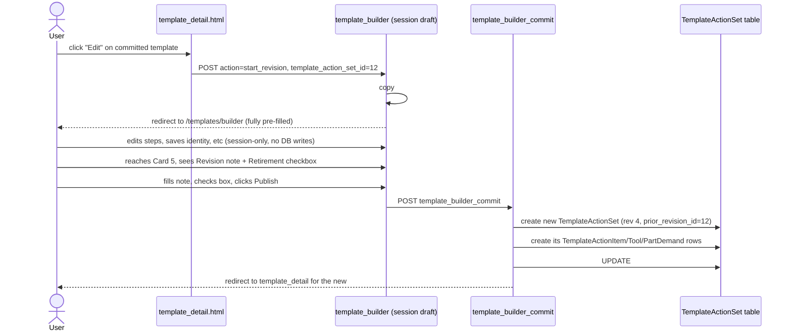
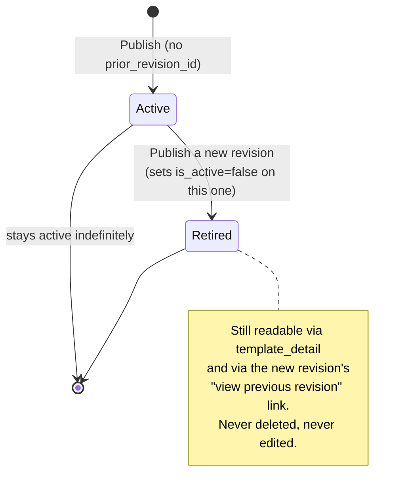

# Template Revision Workflow — Proposal

Status: **proposal, not yet built.** This document exists so the revision
model and the `/templates/build` → `/templates` merge can be reviewed before
any code changes.

## 1. Problem statement

Two separate gaps prompted this:

1. `template_build_hub` (`/maintenance/templates/build`) duplicates most of
   what `template_index` (`/maintenance/templates`) already does — search,
   filter, a template list — plus a preview pane and the "start a
   revision/copy" actions. Keeping both is two staging pages for one job.
   **Decision: retire `/templates/build`, fold its actions into
   `/templates`.**
2. The revision model (`prior_revision` chain, `is_active` retirement) is
   built and works when a draft is explicitly seeded via `start_revision`
   — but there is **no "Edit" action anywhere on a committed template**
   (`template_detail.html` only offers activate/deactivate). Nothing in the
   Publish step distinguishes "this is a normal new template" from "this
   publish will retire an existing one," beyond a passive sentence. That gap
   is the second half of this document.

## 2. What already exists (no change needed here)

- `TemplateActionSet.prior_revision` — self-FK, plus a `revision` string
  counter. [template_action_set.py](../app/maintenance/models/templates/template_action_set.py)
- `TemplateBuilderSessionAdapter.start_revision()` — copies a committed
  template's full contents (metadata, asset class, models, every action item
  with its tools and part demands) into a fresh session draft, sets
  `prior_revision_id`, bumps `revision`.
- `commit()` — on publish, if `prior_revision_id` is set, the old
  `TemplateActionSet` is flipped `is_active=False`. Never deleted, never
  mutated in place.
- There is **no** endpoint that mutates a committed template's steps
  directly — the only writes against a committed `TemplateActionSet` are
  `toggle_active` and `move_asset_models` (tags, not content). So "committed
  templates are immutable content-wise" is already true; it's just not
  exposed as an explicit "Edit" action yet.

This means the revision *mechanics* don't need new code — what's missing is
(a) an entry point that calls `start_revision` from the template's own detail
page, and (b) a Publish-time step that treats "this draft will retire an
existing template" as a deliberate, confirmed decision instead of a passive
note.

## 3. Target: merge `/templates/build` into `/templates`

`template_index` gains:

- A **preview mode toggle**. Off (default) = today's dense list. On = your
  original ask: filters card full-width at top, then a 1/2 filtered-list /
  1/2 preview split below. Clicking a row loads its full action set into the
  preview pane (header info, then the full ordered action-tool-part list),
  with the action buttons at the top of the preview, not the bottom — this
  matches how `_build_hub_results.html` already renders it.
- The build hub's action set, relocated into the preview pane's button row:
  **View**, **Edit** (→ starts a revision), **Copy** (→ starts an
  independent draft), **Create maintenance event from this template**. The
  last one needs no new verb — `create_assign` already accepts
  `?template=<id>` and pre-fills the search-dropdown + step preview from it
  ([create_assign_views.py:79-90](../app/maintenance/presentation_layer/entrypoints/create_assign_views.py#L79)). The preview-pane button is just a link to
  `?template={{ selected.pk }}`.
- The "Create new template from scratch" / "Resume draft" / "proto action"
  buttons currently sitting on the build hub move to `template_index`'s page
  header actions, always visible regardless of preview-mode state.
- **Multiple revisions stay visible in the list, distinguished visually
  instead of filtered out.** Today the `active` filter can hide retired
  templates entirely; the list should default to showing every revision in
  a chain, with any template that has a `subsequent_revisions` entry (i.e.
  it isn't the newest link in its own chain) rendered dampened — reduced
  opacity plus a soft-yellow left border or tag, distinct from the existing
  red/warning "Inactive" tag (a template can be inactive without being
  superseded, e.g. manually deactivated — that stays warning-colored; a
  superseded-by-revision template gets the dampened/yellow treatment). The
  `active` filter dropdown stays as an option for narrowing, but "all
  revisions, newest highlighted" is the default view.

`template_build_hub`, `build_hub.html`, `_build_hub_results.html`, and the
`template_build_hub` URL/view are deleted. Four templates currently link to
it and need repointing to `template_index`: `base.html` sidebar,
`hub.html`, `proto/index.html` ("Back to build"), and
`create_assign/portal.html`. Not doing this yet — flagging it as the actual
implementation checklist for when this proposal is approved.

## 4. The Publish-as-revision workflow

This is the part that isn't designed yet. Proposal below.

### 4.1 Entry points into a revision draft

There are exactly two ways a session draft ends up with `prior_revision_id`
set, and they should be the *only* two ways:

1. **Edit**, from `template_detail.html` on a committed template — new
   button, calls `start_revision` the same way the build-hub preview's
   button does today.
2. **New revision of this template**, from the `/templates` preview pane —
   same call, different jumping-off point.

"Copy" is a third, deliberately separate path: also seeds the builder from
an existing template's contents, but does **not** set `prior_revision_id`
and resets `revision` to blank/`"1"` — a fully independent template with no
lineage. This needs a new adapter method, `start_copy()`, mirroring
`start_revision()` minus the two lineage fields. Not built yet.

### 4.2 Why "editing" must mean "drafting a revision," never an in-place write

**Why:** a maintenance plan or event can already be running against a
template's committed steps. Rewriting those steps in place would silently
change what a technician sees mid-job. Chaining through `prior_revision`
instead means every plan/event keeps pointing at the exact step set it was
built against, and the *new* template only affects work created after it.
This is already how `commit()` behaves — the proposal below just gives it a
front door and makes the consequence explicit to the user at publish time,
rather than a passive footnote.

### 4.3 Proposed Publish card behavior

Today, Card 5 ("Publish") is identical whether or not the draft is a
revision — only a grey helper sentence changes. Proposal: when
`draft.prior_revision_id` is set, the card grows two required fields before
the Publish button is enabled:

- **Revision note** (required, free text) — "what changed in this
  revision?" Distinct from the auto-incrementing `revision` counter; this is
  a human-readable changelog line, not a version number. Stored on the new
  `TemplateActionSet` (needs a field — see §5 open questions).
- **Retirement acknowledgment** (required checkbox) — "I understand
  publishing will retire template #{{ prior_revision_id }} — it will no
  longer be selectable for new plans, but existing plans/events built from
  it are unaffected. To make the previous revision searchable again you must
  find it and manually re-set it as active." Must be checked before Publish
  submits. This is a confirmation, not a new permission gate — same actor,
  same request, just making the consequence a deliberate click instead of
  implicit, and telling the user up front that retirement is reversible by
  hand (via `template_toggle_active`) rather than permanent.

The rest of the card (domain picker, task-name/action-step validation)
stays as-is.

### 4.4 End-to-end sequence, Edit → Publish

### 4.5 Lifecycle across multiple revisions

### 4.6 Revision note on the template header

`template_detail.html`'s "Template Information" card gains a **Revision
note** row, populated from the new `revision_note` field (§5.1). It is only
shown when the template is **not** the newest link in its chain — i.e.
`template.subsequent_revisions.exists()` is true. "Newest" is computed, not
stored: no extra boolean column needed, since the chain itself (via
`subsequent_revisions`) already answers the question. The note explains why
this specific revision was superseded, so it's only useful once something
superseded it — the newest revision has nothing to explain yet.

### 4.7 Viewing the chain from `template_detail`

Currently `template_detail.html` shows the `revision` number but not the
chain itself. Proposal: add a small "Revision history" block — walk
`prior_revision` backward and `subsequent_revisions` forward from the
current template, rendered as a flat list of links with their revision
number, active/retired tag, and (once §4.3 lands) the revision note. This is
new template/context work, not just a URL change — `TemplateMaintenanceContext`
would need a `revision_chain` property.

## 5. Decisions

1. **Revision note lives on `TemplateActionSet`** as a new nullable text
   field, `revision_note`. Schema change → full `refresh_project.py`, not
   incremental.
2. **"Copy" gets its own adapter method**, `start_copy()` — mirrors
   `start_revision()` but never sets `prior_revision_id` and resets
   `revision`. Reusing `start_revision()` and nulling the field client-side
   was rejected: a forged POST could leave `prior_revision_id` set.
3. **Preview-mode toggle is a URL query param** (e.g. `?preview=1`),
   consistent with this app's `format=` convention and the F5 rule.
4. **"Create maintenance event from template" needs no new verb.**
   `create_assign` already accepts `?template=<id>` and pre-fills from it —
   see §3. The preview-pane button just links to
   `/maintenance/create-assign?template=<id>`.
5. Still open: should retiring a template (`is_active=False` on
   publish-as-revision) also warn if the template is currently referenced by
   an **in-progress** maintenance plan, or is "existing plans are
   unaffected, only new selection is blocked" sufficient? Current design
   assumes the latter — flagging in case that assumption is wrong.

## 6. Summary of what changes, once approved

| Area | Change |
| :--- | :--- |
| `template_build_hub` view/URL/templates | Deleted |
| `template_index` | Gains `?preview=1` toggle, list/preview split, relocated action buttons, dampened/yellow styling for superseded revisions (list no longer hides them by default) |
| `template_detail.html` | Gains "Edit" button (→ `start_revision`), revision-chain block, and a Revision note row (shown only when not the newest revision) |
| `TemplateBuilderSessionAdapter` | Gains `start_copy()` |
| `template_builder.html` Card 5 | Gains conditional revision-note + acknowledgment fields (with the manual-reactivation sentence) when `prior_revision_id` is set |
| `TemplateActionSet` | Gains `revision_note` field → schema change → full reset |
| 4 templates linking to `template_build_hub` | Repointed to `template_index` |
