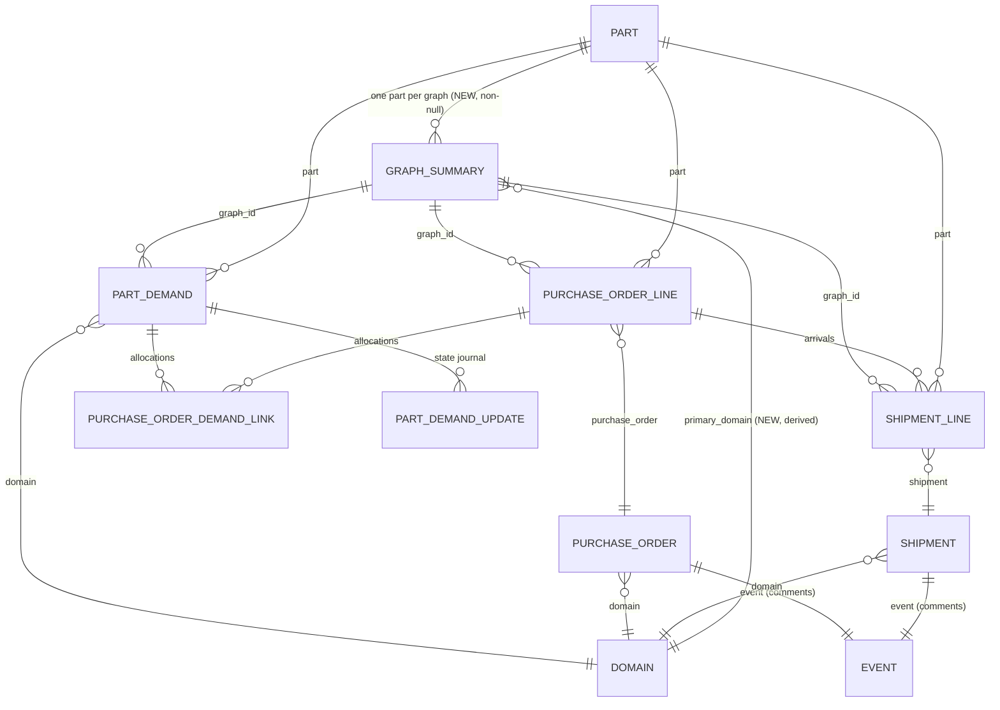

# Model Diagram — Demand Graph Surfaces

The kit-wide at-a-glance map. Per-phase `data_relational_plan.md` files break this down in detail; when
they or `decisions.md` disagree with this page, **they win** and this page is corrected.

**This kit adds no new tables.** It adds columns to two existing tables (`GraphSummary` and `PartDemand`) and three new enums.
Everything else on this page is existing structure, shown because the new columns are meaningless without it.

---

## Entity relationships



**Reading the two new edges.** `PART → GRAPH_SUMMARY` and `DOMAIN → GRAPH_SUMMARY` both point *into* the
graph. Procurement referencing parts and administration is the existing permitted direction; neither points
back (questionnaire R6).

---

## `GraphSummary` — the full column set after this kit

| Column | Status | Written by | Meaning |
| :--- | :--- | :--- | :--- |
| **Identity and scope** | | | |
| `part` | **NEW** — FK, non-null | `recalculate()` | The one part every member shares. Asserted, not tolerated-if-mixed. |
| `primary_domain` | **NEW** — FK | `recalculate()` | Scoping guard for search. Most common by PO line, with a fallback chain. |
| **Demand side** | | | |
| `demand_qty` | existing | `recalculate()` | Σ `quantity_requested` across member demands |
| **Purchasing side (PO commitments)** | | | |
| `po_qty_allocated` | **NEW** | `recalculate()` | Σ `quantity_allocated` over active links to member PO lines |
| `po_qty_purchased` | **NEW** | `recalculate()` | Σ allocations on lines whose PO reached `Placed`+ |
| `po_imbalance_state` | **NEW** — enum | `recalculate()` | `POImbalanceState` — *are demands committed to orders?* |
| **Shipment side (actual arrivals)** | | | |
| `shipment_qty_allocated` | **NEW** | `recalculate()` | Σ allocations on shipment lines |
| `shipment_qty_accepted` | **NEW** | `recalculate()` | Σ `quantity_accepted` on shipment lines — the arrival figure |
| `shipment_imbalance_state` | **NEW** — enum | `recalculate()` | `ShipmentImbalanceState` — *did we receive what we ordered?* |
| **Workflow progression** | | | |
| `linear_status` | **NEW** — enum | `recalculate()` | `LinearStatus` — *where in the end-to-end pipeline?* |
| `error_code` | **NEW** — text, nullable | `recalculate()` | Human-readable error if end-state doesn't match. |
| **Cached views** | | | |
| `swimlane_diagram` | existing | `recalculate()` | Cached mermaid source |
| **Human state — the only columns `recalculate()` never touches** | | | |
| `resolution_state` | **NEW** — enum | `GraphResolutionManager` | `OPEN` / `RESOLVED` / `ACCEPTED_AS_IS` |
| `manually_flagged` | **NEW** — bool | `GraphResolutionManager` | Default `False` |
| `priority` | **NEW** — enum, nullable | `GraphResolutionManager` | Reuses `DemandPriority` |
| *audit columns* | existing | — | `created_at`, `updated_at`, `created_by`, `updated_by` |

### The one rule that is easy to break

Every column above except the last three is written **exclusively** by `GraphSummaryManager.recalculate()`,
and no caller ever assigns one directly. The three human columns invert that discipline completely. Because
the surrounding convention is so uniform, the exception must be stated in the model docstring — otherwise
the natural assumption ("everything here is derived") silently makes a resolution get wiped on the next
recalculate.

---

## `PartDemand` — the new column

| Column | Status | Written by | Meaning |
| :--- | :--- | :--- | :--- |
| `linear_status` | **NEW** — enum | `PartDemandStateManager` | `LinearStatus` — *where in the pipeline?* Inherited from parent `GraphSummary.linear_status` whenever graph membership changes. |

**Derived from:** parent graph's `linear_status`. When a demand's graph is reassigned (via merge/split), the demand's `linear_status` is refreshed to match the new parent. Independent from the demand's existing four state axes (`demand_state`, `purchasing_state`, `shipment_state`, `issuance_state`).

---

## New enums

Live in `app/procurement/models/graph/enums.py`.

### `POImbalanceState` — PO-side commitment tracking

Answers: *Is the demand fully committed to purchase orders, and are purchases aligned with demand?*

```
DEMAND_EXCEEDS_ALLOCATION          # demand_qty > po_qty_allocated
ALLOCATION_EXCEEDS_PURCHASED       # allocated >= demand, but purchased < demand
PO_QUANTITY_EXCEEDS_DEMAND         # purchased > demand (admin visibility for remediation)
DEMAND_SATISFIED_EXCESS_ALLOCATED  # purchased >= demand, but allocated > purchased
BALANCED                           # purchased >= demand AND allocated == purchased
```

**Constraint:** `po_qty_purchased <= po_qty_allocated` (enforced by application logic).

### `ShipmentImbalanceState` — shipment-side delivery tracking

Answers: *Did we receive what we ordered, and are shipment allocations aligned with PO purchases?* Tracks progress from `po_qty_purchased` through shipment allocation and acceptance.

```
PO_ORDERED_NOT_ALLOCATED_TO_SHIPMENTS # po_qty_purchased > shipment_qty_allocated
SHIPMENT_ALLOCATION_EXCEEDS_PO        # allocated > po_qty_purchased (admin visibility for allocation fixes)
OVER_DELIVERED                        # accepted > po_qty_purchased
PARTIAL_DELIVERY_RECEIVED             # 0 < accepted < po_qty_purchased
SHIPMENTS_ALLOCATED_AWAITING_DELIVERY # allocated > 0 AND accepted == 0
BALANCED                              # accepted >= po_qty_purchased (and none above)
```

### `LinearStatus` — workflow progression

Answers: *Where in the end-to-end pipeline?*

```
UNLINKED                   # no allocations on either side
PO_ALLOCATED_NOT_PURCHASED # po allocations exist, no purchases yet
PO_PURCHASED_NOT_SHIPPED   # purchases exist, no shipment acceptance yet
PARTIALLY_DELIVERED        # some shipment accepted, some pending
DELIVERED                  # all demanded units accepted
```

**Design note:** Three separate concern axes (PO commitment, shipment delivery, overall progression) serve different readers without forcing one workflow's logic onto another. Derivation, precedence rules, and error code logic: [`phase_2_imbalance_model/data_relational_plan.md`](phase_2_imbalance_model/data_relational_plan.md).

---

## Reverse foreign keys

Read by the front-end kit to decide which pages become multi-card wizards (more than one reverse FK a user
would populate in one sitting → wizard).

| Table | Reverse FKs into it | Wizard implication |
| :--- | :--- | :--- |
| `GraphSummary` | `PartDemand.graph`, `PurchaseOrderLine.graph`, `ShipmentLine.graph` | **None.** All three are written by `GraphSummaryManager` as a side effect of other entities' creation. **A user never populates them, and there is no graph create page at all** — a graph is not a thing anyone makes. |
| `Part` | `GraphSummary.part` (new) | None — derived. |
| `Domain` | `GraphSummary.primary_domain` (new) | None — derived. |

> **The load-bearing note for the front-end kit:** despite `GraphSummary` having three reverse FKs, **no
> wizard follows from them**. The usual heuristic reads three reverse FKs as a strong wizard signal and
> would be wrong here. Every graph surface in this kit is a read surface, except for a single small
> resolution control that sets three columns on an existing row.

---

## What this kit deliberately does not add

- **No new tables.** If a phase plan grows one, that is a signal to re-read questionnaire M6 — the read-only
  boundary is what keeps the merge/split problem tractable.
- **No activity thread on `GraphSummary`.** Human narrative lives on the nodes, which are stable and
  user-created; a graph merges and dies without warning (questionnaire M5/M6).
- **No last-activity timestamps.** Declined in M5, with the consequence — no staleness state — accepted
  explicitly in the imbalance study §7.
- **No `quantity_received` distinct from `quantity_accepted`.** Deferred out of kit scope (questionnaire G4).
