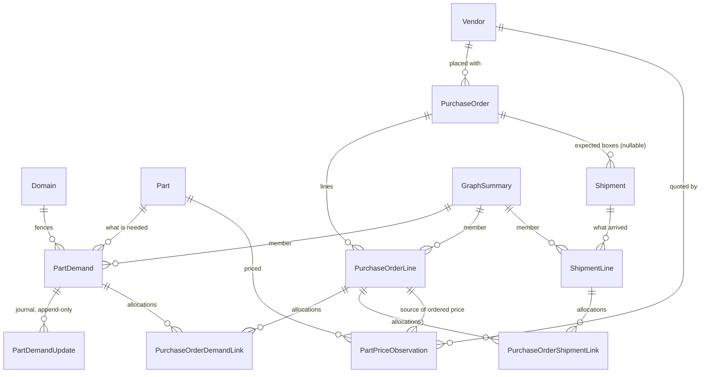

# Domain Model — Procurement

Eleven tables in `app/procurement/models/`, in four groups plus the graph.

Every table carries the house audit columns (`created_at`, `updated_at`,
`created_by_id`, `updated_by_id`); most also carry `deleted_at` for soft delete. Those
are omitted from the field lists below except where the soft-delete behaviour is
load-bearing. Primary keys are `BigAutoField`.

---

## 1. The shape of it



Read left to right, the spine is:

```
PartDemand  ──(PurchaseOrderDemandLink)──  PurchaseOrderLine  ──(PurchaseOrderShipmentLink)──  ShipmentLine
   a need              a claim                  a purchase                a claim                 a box's contents
```

Both joins are **many-to-many and quantity-carrying**. Neither is a restricted view of
either side; each row carries attributes belonging to the pairing alone. Those two
tables are where nearly all of the application's difficulty lives, and both of the
adjacent system documents are largely about them.

`GraphSummary` sits orthogonally: every one of the three spine entities carries a
direct `graph_id` FK to it, so cluster-wide numbers are a `WHERE graph_id = X` and
never a traversal.

---

## 2. Demand group

### `part_demand` — PartDemand

The hub. A material need moving from request through approval, purchasing, shipping,
and hand-off. **The rest of the codebase knows only `PartDemand.id`** — consumer apps
(Maintenance, Dispatching, Inventory) own their own link tables pointing *inward*;
there is never a pointer outward.

| Field | Type | Notes |
| :--- | :--- | :--- |
| `part_id` | FK → parts.Part | what is needed |
| `domain_id` | FK → administration.Domain | **mandatory.** Who is meant to receive it; the data fence |
| `quantity_requested` | Decimal | what was asked for |
| `notes`, `priority`, `needed_by`, `expected_cost` | | `priority`: low/medium/high/critical, intrinsic to the need |
| `requested_by_id` | FK → User, null | who raised it |
| `demand_state` | choice, default `projected` | axis 1 — approval |
| `purchasing_state` | choice, default `""` | axis 2 — money. **blank is a real value**, not missing data |
| `shipment_state` | choice, default `request_not_sent` | axis 3 — physical location |
| `issuance_state` | choice, default `not_issued` | axis 4 — hand-off |
| `linear_status` | choice, default `unlinked` | the glanceable pipeline label, **copied down from the parent graph** |
| `purchased_qty` | Decimal, default 0 | derived: sum of active allocations |
| `issued_qty` | Decimal, default 0 | supplied by Inventory; procurement cannot compute it |
| `source_module` | choice: maintenance / dispatching / general | display convenience only, **never a source of truth for origin** |
| `serial_number_tracking_required` | bool | |
| `graph_id` | FK → GraphSummary, null | cluster membership |

### `part_demand_update` — PartDemandUpdate

One row per transition on any of the four axes. **Append-only** — never updated, never
deleted, never soft-deleted, hence audit columns without the soft-delete mixin.

| Field | Notes |
| :--- | :--- |
| `part_demand_id` | FK |
| `dimension` | which axis: demand / purchasing / shipment / issuance |
| `stage`, `previous_stage` | blank `previous_stage` = an initializing row |
| `actor_id` | FK → User, null when derived |
| `is_system_generated` | bool — the system moved it, not a person |
| `notes` | narrated sentence, plus any fail-open reason |
| `flagged_for_review` | bool — the guard could not decide and let it through |

This table exists because the legacy hub gave one dimension real audit columns and the
other three none. One uniform journal for all four axes removes that choice.

---

## 3. Purchasing group

### `vendor` — Vendor

`name`, `code` (null), `website` (null), `is_active`. **Deliberately no relationship to
parts or manufacturing** — a vendor may resell parts it does not make, or sell nothing
part-related at all.

### `purchase_order` — PurchaseOrder

A commercial order placed with a vendor. **A peer of PartDemand, never nested under
it** — a PO can exist with zero linked demands, which is how bulk restocking is modeled.

| Field | Notes |
| :--- | :--- |
| `po_number`, `vendor_po_id`, `vendor_contact` | our number, their number, their person |
| `vendor_id`, `domain_id` | |
| `status` | draft / placed / partially_received / received / cancelled |
| `approval_state` | `""` (unsubmitted) / pending_approval / approved / denied / cancelled — **a separate axis** |
| `order_date`, `expected_delivery_date` | |
| `shipping_cost`, `tax_amount`, `other_amount`, `total_cost` | `total_cost` is derived and denormalized |
| `event_id` | O2O → events.Event, null — the audit/comment thread |

### `purchase_order_line` — PurchaseOrderLine

| Field | Notes |
| :--- | :--- |
| `purchase_order_id`, `part_id`, `line_number` | |
| `quantity_ordered`, `unit_cost` | |
| `expected_delivery_date`, `notes` | |
| `unit_cost_source`, `unit_cost_confidence`, `unit_cost_asserted_at` | where this price came from |
| `graph_id` | FK → GraphSummary, null |

Three deliberate absences:

- **No line-level status.** The legacy line cascaded status from its header, so header,
  line, and demand each held a partial copy of the same fact and could disagree. A
  line's state is its header's status; arrival progress is physical.
- **No cancelled status either.** Cancelling a line is a soft delete plus a JSON
  snapshot posted as a machine comment on the PO's event.
- **No `is_fake_for_inventory_adjustments`.** A flag making a commercial document
  sometimes not a commercial document was left behind.

**One active line per part per PO** is a *soft* rule enforced in the validator, not a
database constraint — it is about pricing simplicity, not integrity, and a duplicate
that gets through degrades gracefully (arriving lines land unassigned rather than
mis-assigned).

### `purchase_order_demand_link` — PurchaseOrderDemandLink

The demand↔order allocation. A peer join row.

| Field | Notes |
| :--- | :--- |
| `part_demand_id`, `purchase_order_line_id` | one row per pairing; a second is refused |
| `quantity_allocated` | how many of the line's units are claimed for this demand |
| `is_active` | **not** the same as soft-deleted — see below |
| `notes` | |

Two ways of un-linking, kept distinguishable on purpose:

- **de-link** (soft delete) — the buyer changed their mind about the pairing.
- **release** (`is_active = False`) — the PO was cancelled; the pairing was right, the
  order died. Readable as history, and freed for re-allocation.

**There is no `quantity_received` column here.** For a shared line the number does not
exist: three demands on one line, sixty units arrive, the units are fungible and nobody
decided whose they were. Arrival is recorded once, physically, on
`ShipmentLine.quantity_accepted`, and per-demand arrival is *derived* — exact for a
sole-demand line, a "shared demand session" otherwise.

---

## 4. Shipment group

### `shipment` — Shipment

What the vendor actually shipped. Shipments live in procurement, not inventory, because
a shipment in transit is **pre-possession**.

| Field | Notes |
| :--- | :--- |
| `purchase_order_id` | FK, **nullable** — the reactive receiving path |
| `domain_id` | **mandatory** — a PO-less shipment still answers "whose is this" |
| `shipment_number` | ours, generated `SHP-<date>-<hex>` |
| `shipment_id` | **theirs** — what is printed on the label; the receiver's search key |
| `carrier`, `status`, `notes` | |
| `mixed_po_assignments` | bool — drift flag: some line points at a different PO's line |
| `shipped_date`, `expected_arrival_date`, `received_date` | |
| `event_id` | O2O → events.Event |

### `shipment_line` — ShipmentLine

**One physical line item, exactly as the packing slip described it.** A child of one
parent: the shipment it arrived in.

| Field | Notes |
| :--- | :--- |
| `shipment_id`, `part_id` | |
| `quantity` | what the slip said; never rewritten to accommodate paperwork |
| `quantity_accepted` | Decimal, **nullable** — null (uninspected) ≠ 0 (inspected, all rejected) |
| `rejection_notes` | |
| `graph_id` | FK → GraphSummary, null |

No `purchase_order_line` FK and no `split_from`. Both were removed: a line spanning
several orders used to be handled by splitting it into sibling rows, which made the
physical record and the commercial mapping the same column.

### `purchase_order_shipment_link` — PurchaseOrderShipmentLink

The arrival↔order allocation.

| Field | Notes |
| :--- | :--- |
| `shipment_line_id`, `purchase_order_line_id` | |
| `quantity_allocated` | capped so the sum never exceeds the arriving line's quantity |
| `notes` | |

Two absences, each with a reason:

- **No `quantity_accepted`.** Inspection happens once, physically, per arriving line.
  Per-order-line acceptance is derived by allocation share — the single place in the
  entire application where a quantity is divided.
- **No `is_active`**, unlike its demand-side sibling. There is no second kind of
  un-linking here: an allocation between an arrived line and an order line is either
  right or it is a mistake, and a mistake is a soft delete.

The difference between a line's quantity and the sum of its allocations is never a
discrepancy — it is the **unallocated remainder**, a real business state meaning "this
much arrived and nobody has said which order it answers yet."

---

## 5. Pricing group

### `part_price_observation` — PartPriceObservation

| Field | Notes |
| :--- | :--- |
| `part_id`, `vendor_id`, `domain_id` | |
| `unit_cost`, `quantity`, `currency` | quantity is nullable — a price may not be tied to a break |
| `observed_at` | date the fact was true, not the date it was typed |
| `source_type` | part_create / quote / manual / ordered / invoiced / catalog |
| `confidence` | quoted / p10 / p50 / p100 / unknown |
| `is_verified` | bool — the "establish" authority; what everyone else is shown |
| `source_po_line_id` | FK → PurchaseOrderLine, null — set on auto-written `ordered` rows |
| `notes` | |

Append-only in spirit: a price is an observation of a moment, so a newer one is added
rather than an older one edited.

---

## 6. Graph

### `graph_summary` — GraphSummary

One row per connected component of the demand / order-line / arriving-line network.
Materialized, never computed on read.

| Field group | Fields | Notes |
| :--- | :--- | :--- |
| Identity | `part_id`, `primary_domain_id` | derived: the one part every member shares, and the domain the cluster is searchable under |
| Quantities | `demand_qty`, `po_qty_allocated`, `po_qty_purchased`, `shipment_qty_allocated`, `shipment_qty_accepted`, `qty_shipments_in_route`, `qty_shipments_delivered`, `qty_accepted`, `qty_rejected`, `intake_qty_recorded` | all recomputed from member rows |
| Derived status | `linear_status`, `po_imbalance_state`, `shipment_imbalance_state`, `error_code`, `status` | `status` is the legacy label, superseded by `linear_status` |
| Cached render | `swimlane_diagram` | mermaid source, rebuilt on recalculate so the visualizer never builds it per request |
| **Human judgment** | `resolution_state`, `manually_flagged`, `priority` | **written only by GraphResolutionManager; recalculate must never touch them** |

That last row is the one rule in this model that is easy to break. Every other column
here is derived, and the surrounding convention is uniform enough that the natural
assumption ("everything on GraphSummary is derived") would silently wipe a user's input
on the next unrelated allocation.

---

## 7. Relationship rules at a glance

| Relationship | Cardinality | Why it is what it is |
| :--- | :--- | :--- |
| Demand → Part | many-to-one | |
| Demand → Domain | many-to-one, **mandatory** | the data fence; derived from the requester, never picked from a dropdown except by multi-domain users |
| Demand → journal rows | one-to-many, append-only | four initializing rows at creation, one per axis |
| Demand ↔ PO line | **many-to-many, quantity-carrying** | one demand splits across orders; one line answers several demands |
| PO → PO lines | one-to-many | |
| PO → Vendor | many-to-one | |
| PO → Shipments | one-to-many, **nullable** | a box can arrive before its paperwork |
| Shipment → lines | one-to-many | |
| Shipment line ↔ PO line | **many-to-many, quantity-carrying** | one box's line answers several orders |
| Any spine entity → GraphSummary | many-to-one | maintained automatically; nobody sets it |
| Price observation → Part / Vendor / Domain | many-to-one each | |
| Consumer apps → Demand | inward FK only | procurement holds no pointer outward, ever |

---

## 8. Creation side effects

| Creating this | Also creates | Fails the creation if it fails? |
| :--- | :--- | :--- |
| PartDemand | four initializing journal rows; a fresh single-member GraphSummary | yes — same transaction |
| PurchaseOrderLine | a fresh single-member GraphSummary (if unlinked) | yes |
| ShipmentLine | a fresh single-member GraphSummary (if unlinked); an auto-allocation to the header PO's matching line | graph: yes. Auto-allocation: **no** — no match means unallocated, not refused |
| PurchaseOrderDemandLink | a graph **merge** of the two sides' clusters; a `purchased_qty` refresh; a demand auto-approval (default on) | yes |
| PurchaseOrderShipmentLink | a graph merge | yes |
| Shipment | an events.Event thread; a mixed-assignment flag refresh; shipment_state propagation to demands | Event: yes. Propagation refusals: **no** — reported, not raised |
| Placing a PurchaseOrder | one `ordered` price observation per line; propagation to every linked demand | observations: yes. Propagation refusals: **no** |

## 9. Deletion semantics

| Record | Rule |
| :--- | :--- |
| PartDemand | **hard delete only while untouched** (no allocations, no journal rows beyond the four initializers); otherwise soft delete. Never a refusal — a demand is always removable one way or the other. Cross-app protection is free: consumer apps' `PROTECT` FKs raise before the policy is even consulted |
| PurchaseOrderLine | soft delete + JSON snapshot machine comment; releases its demand allocations, which rolls those demands' purchasing state back to unset |
| PurchaseOrder | cancelled through status, not deleted; propagates `cancelled` to linked demands' purchasing axis and leaves the shipment axis alone — what arrived, arrived |
| Shipment | soft delete cascades to every active line |
| ShipmentLine | soft delete; its allocations go with it |
| Either link table | soft delete, which may **split** the graph if it was the only bridge |
| PartDemandUpdate | never deleted. Ever |
