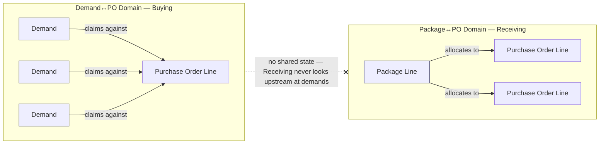
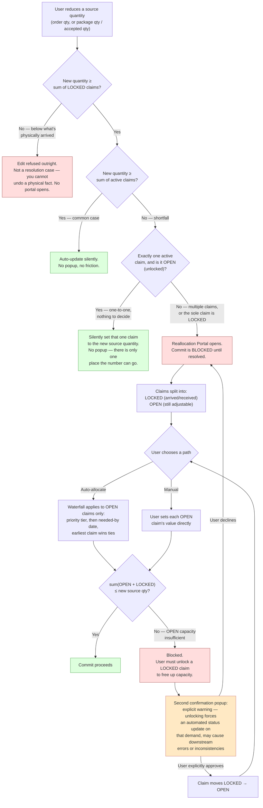
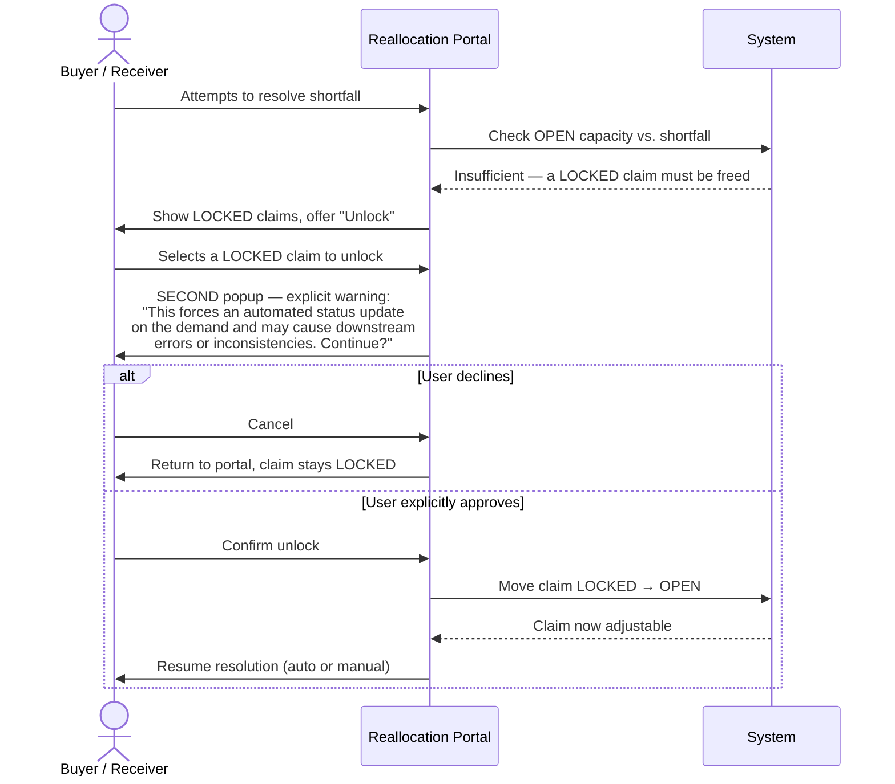
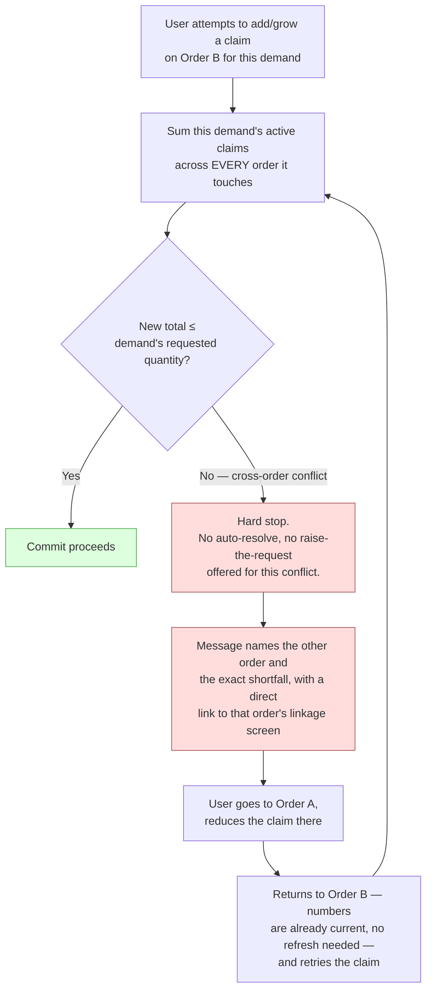

# Reallocation Resolution Portal — Business Process Design

**Status:** Planning session complete. Ready to hand off to the backend persona for
`procurement_current_state_kit`.

**Owner of this concept:** Business Architect planning session, 2026-08-16.

---

## 1. The problem this solves

Today, four facts each live in exactly one place in the system, and every other
screen recalculates its own view of that fact rather than keeping a second copy:

- **Requested** — how much a demand needs.
- **Committed** — how much a purchase order line promises to buy.
- **Claimed** — how much of a commitment a specific demand, or a specific arrived
  package, has staked out for itself.
- **Arrived / Inspected** — how much physically showed up, and how much of that
  passed inspection.

That one-fact-one-place rule is being extended to store **allocated**, **received**,
and **accepted** quantities directly on purchase order lines and on both link
tables (demand-to-order-line, and package-to-order-line). The moment a number is
stored in more than one place, those numbers can disagree — and the case where
they disagree hardest is when a **source quantity shrinks** after other things
have already been claimed against it.

**Example:** A purchase order line is ordered at 100 units. Three demands have
claimed 40, 35, and 25 units against it (summing to exactly 100). The Buyer then
cuts the order line to 70 units. The three claims now sum to more than the order
line provides. Something has to give — and the question this document answers is
**how, and who decides.**

The same shaped problem exists one step downstream: a package line arrives
claiming to answer several order lines. If the amount that actually passes
inspection comes in lower than what was already promised out to those order
lines, the same shortfall-resolution problem exists again — independently.

---

## 2. The five entities involved

| Entity | Business role | What it records today |
|---|---|---|
| **Part Demand** | The need | Quantity requested; how much has been committed to purchase; how much has been handed to the requester |
| **Purchase Order Line** | The commitment to buy | Quantity ordered, unit cost — allocation/receipt/acceptance totals are calculated fresh, not stored |
| **Demand ↔ Order Line Link** | The claim a demand stakes on a commitment | How much of the order line this demand claims |
| **Package Line** | What physically arrived | Quantity shipped; quantity accepted after inspection — the *only* place inspection is recorded |
| **Package Line ↔ Order Line Link** | The claim an arrived package stakes against a commitment | How much of the arrived package is credited to this order line |

This document does not change what these entities *mean*. It defines the
business rule that governs what happens when a number one of them depends on
gets smaller after the fact.

---

## 3. Two independent instances of one pattern — two named domains

The resolution problem happens at two points in the pipeline, and they are
**deliberately kept apart** — Receiving's resolution portal has zero awareness
of demands. Same shape, same rules, completely separate data, completely
separate actors. This document names them the **Demand↔PO Domain** (Buying)
and the **Package↔PO Domain** (Receiving) — plain relationship names, not the
system's unrelated internal "graph" concept, which this document does not use
or mean.



| | Demand↔PO Domain — Buying | Package↔PO Domain — Receiving |
|---|---|---|
| Source quantity | Purchase Order Line's ordered quantity | Package Line's arrived / accepted quantity |
| What claims against it | Demand claims | Order-line claims |
| Actor who resolves | Buyer | Receiver |
| Can one claim-holder (demand / package) touch more than one source? | Yes — a demand can be claimed against several different orders | No — a package line's claims are already fully scoped to itself; there is no second, outside ceiling to worry about |

That last row is why Section 4 below only applies to the Demand↔PO Domain.

---

## 4. Cross-domain visibility — the Demand↔PO Domain's extra dimension

A demand can be claimed against several different orders at once; a package
line cannot have an equivalent "outside" relationship, because its only
ceiling is its own quantity (see the table above). So this section is
**Demand↔PO Domain only** — nothing here changes the Package↔PO Domain.

The gap: everything in this document so far tells the system what to *refuse*
when a demand is already claimed elsewhere. Nothing so far tells the *user*
that before they try the number that gets refused. The system already has to
know a demand's full claim picture to compute that refusal correctly — so it
should show that picture up front, not just enforce it after the fact.

Two places this applies:

1. **The linkage screen's current-links list.** Wherever a demand's active
   claim on an order line is shown, if that demand also carries an active
   claim on a *different* order line, show that inline, right on the row —
   which order, and how much. This is read-only information here; it is not
   editable from this screen. Its only job is to answer "why is this demand's
   remaining headroom smaller than I expected?" before the user ever types a
   number.
2. **The Reallocation Portal, when it opens for a Demand↔PO Domain shortfall.**
   For every demand the portal is resolving, it shows that demand's **full
   set of links** — not only its claim on the order line being resolved, but
   every claim it holds elsewhere too. Claims on *other* orders are shown
   **locked** in this screen — visible for context, never editable, and never
   part of this screen's own shortfall math (that math is still only about
   the local order line's claims, per Section 5). If working out this
   shortfall genuinely depends on freeing capacity that lives on one of those
   other orders, the portal says so plainly and sends the user to that
   order's own screen to resolve it there — it does not pretend to reach
   across and fix it itself.

This "external" lock is **not the same thing** as the arrived/received lock in
Section 5 — that distinction has to stay visible to the user, because the
remedy is completely different for each:

| Lock reason | What it means | How it can be resolved |
|---|---|---|
| **Arrived / received** (Section 5) | Real-world fulfillment already happened against this claim | The two-popup override in Section 6 — a deliberate, confirmed action, on this screen |
| **External** (this section) | The claim belongs to a *different* order entirely | Never resolved on this screen. The user must go to that order's own screen — there is no override here, because this screen has no authority over it |

---

## 5. The core rule

> **A source can never be reduced below what is already LOCKED against it.**
> Locked means physically arrived or received — the system cannot ask a user
> to undo a physical fact, so this isn't a resolution case at all. The
> triggering edit is refused at the source, before the portal is ever
> reached, with a plain explanation of how much is already locked.
>
> **If the source quantity still covers everything already claimed against it,
> update silently.** This is the common case — most reductions still leave
> enough to cover every existing claim.
>
> **If there is only one active claim against the source, and it is unlocked,
> update it silently too.** A one-to-one relationship has no allocation
> decision to make — there is exactly one place the new quantity can go, so
> forcing a resolution screen for it would be friction with nothing to
> resolve. This shortcut does **not** apply if that single claim is locked;
> touching a locked claim is still always a deliberate, confirmed action (see
> Section 6), never an automatic one, no matter how few claims are involved.
>
> **Otherwise — more than one claim, and the source no longer covers them
> all — block the commit** and force deliberate human resolution through the
> Reallocation Portal before the triggering edit is allowed to save.



This math (`LOCKED` and `OPEN`) is always local to the source on screen. In the
Demand↔PO Domain, the portal additionally displays each demand's **external**
claims per Section 4 — visible for context, but they are never part of this
diagram's `LOCKED` bucket and never part of the `sum(OPEN + LOCKED)` check.
They are a third, separate category with no path through this screen at all.

---

## 6. The unlock sequence, in detail

Unlocking a claim is the one action in this whole flow capable of contradicting
a physical fact the system already recorded (something arrived, or was
received). It is therefore the one place deliberate friction is added — every
other part of the portal is built to minimize friction.



---

## 7. Business rules — final

1. **Reallocation order:** priority tier first (Critical → High → Medium → Low),
   then needed-by date within a tier (soonest need protected first). Same
   ordering the Buyer's queue already uses elsewhere in the system.
2. **Locking is earned, not assumed.** A claim starts open. It becomes locked
   the moment real-world fulfillment happens against it — its portion has
   arrived, or been accepted. An order simply being placed does **not** lock
   the demand claims against it; only physical arrival does.
3. **The system never unlocks on its own.** Only a human can, and only through
   the two-popup confirmation sequence in Section 6.
4. **Under-claiming is allowed.** A user may deliberately leave part of the
   source quantity unclaimed — it returns to the open pool for someone to
   claim later. This is a normal, permitted outcome, not an error state.
5. **Over-claiming is never allowed**, at any point, through either the
   auto-allocate or manual path. The ceiling is absolute.
6. **Tie-break on equal priority and equal needed-by:** whichever claim was
   made earliest.
7. **The Demand↔PO Domain and the Package↔PO Domain never share state.** The
   Receiving portal has no awareness of demands and never reaches upstream
   past the order line it is resolving against.
8. **This is a deliberate exception to the platform's normal no-modal-for-
   assignment rule.** Every other assignment flow in this system runs
   in-page, side-by-side. This one is different **on purpose**: its entire job
   is to interrupt and force resolution before a save can proceed, which is
   exactly what a modal is for and an in-page flow is poor at.
   **`# DELIBERATE ANTI-PATTERN`** — flag this explicitly to whoever builds it.
   It is not an oversight to be "fixed" later into the in-page pattern.
9. **A one-to-one relationship never opens the portal.** If a shortfall exists
   but only one active claim stands against the source, and that claim is
   unlocked, the system silently sets it to the new source quantity and moves
   on. There is exactly one place the number can go, so there is no decision
   for a human to make — showing the resolution screen here would be pure
   friction with nothing to resolve. The moment a second claim exists, or the
   sole claim is locked, this shortcut no longer applies and the full portal
   in Section 5 takes over.
10. **A demand's claims on other orders are visible everywhere in the
    Demand↔PO Domain, but editable nowhere except on their own order.** The
    linkage screen shows them inline (Section 4, point 1); the Reallocation
    Portal shows them as a locked, non-editable category distinct from an
    arrived/received lock (Section 4, point 2). Neither ever grants this
    screen authority to change a claim that belongs to a different order —
    that authority exists in exactly one place: the other order's own screen.
    This rule does not apply to the Package↔PO Domain, which has no
    equivalent "outside" relationship to surface.
11. **A source can never be cut below its own locked total.** Locked claims
    represent something that physically already happened; the system does not
    ask a user to undo that. If a reduction would take the source below the
    sum of its LOCKED claims, the edit itself is refused, with a plain
    explanation of how much is locked — the Reallocation Portal never opens
    for this case, because there is no valid outcome the portal could reach.
12. **A reduced or bumped claim puts its demand back in the open buying
    queue automatically, for exactly the shortfall amount.** Whether the
    reduction came from the auto-allocate waterfall, a manual cut, or an
    unlock-and-redistribute, the demand's unmet portion must be visible to
    the Buyer again without anyone having to notice and re-raise it by hand.
13. **No notification is sent to the demand's original requester when their
    claim is changed by someone else's reallocation decision.** Visibility in
    the open buying queue (Rule 12) is the mechanism that surfaces this — a
    separate notification is not required.

---

## 8. Capability Matrix

| Goal / Intent | Necessary Process Capability | Primary Actor | Priority |
|---|---|---|---|
| Never let a claim total exceed its source | Hard validation ceiling, both auto and manual paths | System | Must-have |
| Protect claims with real-world progress from silent reallocation | Lock state, earned by arrival/receipt, never auto-cleared | System | Must-have |
| Resolve shortfalls with minimal effort in the common case | One-click auto-allocate by priority + needed-by waterfall | Buyer / Receiver | Must-have |
| Allow full manual control when the user wants it | Per-claim manual entry, validated against the ceiling | Buyer / Receiver | Must-have |
| Prevent accidental override of a locked/arrived claim | Two-step unlock confirmation with explicit downstream-risk warning | Buyer / Receiver | Must-have |
| Keep Buying and Receiving resolution fully independent | No shared state or cross-step lookups between the two portals | System | Must-have |
| Never present the interruption when it isn't needed | Silent auto-update whenever the source still covers all claims | System | Must-have |
| Never force a decision screen where there is no decision to make | Silent auto-update for a single unlocked claim, even during a shortfall | System | Must-have |
| Catch a demand double-claiming across two different orders | Hard-stop validation summed across every source the demand touches, not just the one on screen | System | Must-have |
| Send the user straight to the actual fix for a cross-order conflict | Refusal message names the other order and links directly to its linkage screen | System | Must-have |
| Never act on a number that could already be wrong | Every allocation screen re-checks the true current total on view and on submit — nothing cached to go stale | System | Must-have |
| Let a Buyer see *why* a demand's headroom is smaller than expected, before they try a number | Inline note on the linkage screen naming the demand's other-order claims (Demand↔PO Domain only) | Buyer | Must-have |
| Give a full, honest picture during resolution without pretending to have authority over it | Reallocation Portal shows a demand's external claims as a distinct, locked, non-editable category (Demand↔PO Domain only) | Buyer | Must-have |
| Never ask a user to undo a physical fact | Source-quantity edit refused outright when it would drop below the sum of LOCKED claims, before the portal ever opens | System | Must-have |
| Never let a shortfall silently disappear from the buying queue | Bumped/reduced demand automatically reappears in the open queue for its unmet amount | System | Must-have |

---

## 9. Goal Alignment Summary

```
User Goal: Give the user the best possible tools to resolve a broken allocation
            with the least friction — and never let the system reach, or let a
            user commit, an impossible state.
Business Process: Order-line-to-demand claiming (Buying), and package-line-to-
                   order-line claiming (Receiving) — two independent instances
                   of the same pattern.
Primary Actors: Buyer (Step A), Receiver (Step B) — never cross into each
                other's step.
Success State: Every claim against a shrunk source is resolved to a value that
               is valid — equal to or less than the new source quantity, never
               more — with locked/arrived claims left untouched unless a human
               deliberately overrides, eyes open.
Constraints: No commit while claims exceed the source. No silent unlock. No
             cross-step reach (Receiving resolution never touches demand
             claims). No reduction below the source's own locked total.
```

---

## 10. Cross-Source Over-Allocation — a different, harder case

Everything above governs a source *shrinking below its own existing claims*.
This is a different shape of conflict entirely: a claim trying to **grow** on
one source while the same demand already carries a claim on a **completely
different** source — one the current screen has no authority to touch or see
inside.

### Example

> A demand needs 10 units total. It already has 5 allocated against
> **Purchase Order A**. The user is now on **Purchase Order B**'s linkage
> screen, trying to add a claim of 7. 5 + 7 = 12 — two more than the demand
> will ever need. Per Section 4, the linkage screen already shows this
> demand's 5-unit claim on Order A inline — so an attentive user sees the
> problem before typing 7. This section is what happens when they don't: they
> type it anyway, or the number changed between the page loading and the
> submit.

### Why this cannot be resolved in place

The Reallocation Portal (Sections 3, 5, and 6) works because every claim it
needs to *adjust* lives on the one source the user is already looking at.
Here, the fix requires reducing a claim that belongs to a **different
commercial document**. No auto-allocate, no waterfall, and no unlock flow on
Order B's screen can touch Order A's claim — offering one would mean either
silently reaching into a record outside the current screen's scope, or
quietly inflating the demand's requested quantity to make the conflict
disappear. Both hide a real double-claim rather than surface it. This is the
same "external means never editable here" boundary Section 4 already draws
for the Reallocation Portal — this section is what enforces that same
boundary at the moment of the attempt itself, not just during a shortfall
resolution.

### The rule

1. **Hard stop, always.** The moment a new or increased claim would push a
   demand's total active claims — summed across *every* source it touches,
   not just the one on screen — beyond its requested quantity, the action is
   refused outright. This is the only remedy: raising the demand's requested
   quantity to paper over the conflict is **not** offered here, even though
   that escape hatch exists elsewhere in the system for other cap conflicts.
   A cross-order double-claim is a real inconsistency between two commercial
   documents, and it should be seen and corrected as one, not absorbed
   silently.
2. **Name the conflict and hand over the way out.** The refusal explains the
   numbers in plain terms (*"this demand already has 5 allocated to Purchase
   Order A; only 5 more is available"*) and includes a direct link to that
   other order's linkage screen, so the user can go make the reduction
   themselves.
3. **No cached numbers, anywhere in this system, ever.** Because a demand's
   total commitment can change from any order it's linked to — not only the
   one currently open — every screen that shows or acts on that total (the
   order header's allocation summary, and the Reallocation Portal itself)
   always reflects the true current state at the moment it's viewed and at
   the moment an action is submitted. There is no "stale until refreshed"
   state to design around, and therefore no refresh step for the user to
   remember — the numbers are never behind reality in the first place.



**This section does not apply to the Package↔PO Domain.** A package line has
no equivalent "outside" relationship to conflict with — its only ceiling is
its own arrived/accepted quantity, and every claim against it is already
local to that one package line (see the table in Section 3). There is no
second, different package a claim could be double-counted against, so there
is nothing for this section's hard-stop rule to catch on the Receiving side.
The Package↔PO Domain's own capacity check is already fully covered by
Section 5's core rule.

---

## 11. Build Handoff Brief

This section is the acceptance checklist for whoever builds this — a
business-rule contract to build against, not a technical design. Schema,
control-layer, and screen design are explicitly **out of scope** for this
document; that translation is the next step (Section 12).

### Scope

**In scope:** the Demand↔PO Domain (Buying) and the Package↔PO Domain
(Receiving) — resolving what happens when a source quantity a claim depends
on shrinks, and refusing a claim that would double-count a demand across two
orders.

**Out of scope:** anything about how a demand or order line reaches
`issued`/received/inspected status outside of this shortfall-resolution
concern; anything about how quantities are priced or costed; any change to
who is allowed to place, approve, or cancel an order.

### Rule checklist (every rule this build must satisfy)

- [ ] A source quantity edit that would drop below the sum of its own
      **LOCKED** claims is refused outright, before any portal opens (§5, §7.11).
- [ ] A source quantity edit that still covers every active claim updates
      silently — no popup (§5).
- [ ] A source quantity edit that leaves exactly one active claim, and that
      claim is unlocked, updates that one claim silently — no popup, even
      though it's technically a shortfall (§5, §7.9).
- [ ] Any other shortfall (two or more claims, source no longer covers them
      all) blocks the commit and opens the Reallocation Portal (§5).
- [ ] The Portal splits claims into LOCKED and OPEN; only OPEN claims are
      ever touched by auto-allocate or manual entry (§5).
- [ ] Auto-allocate orders the cut by priority tier (Critical → High → Medium
      → Low), then needed-by date within a tier, then earliest-claimed as the
      final tie-break (§7.1, §7.6).
- [ ] Manual entry allows under-claiming (leaving part of the source
      unclaimed) but never allows the total to exceed the new source quantity
      (§7.4, §7.5).
- [ ] Unlocking a LOCKED claim requires the two-popup sequence: portal
      selection, then a **separate** confirmation carrying the explicit
      downstream-risk warning, before the claim becomes adjustable (§6).
- [ ] The system never unlocks a claim on its own, under any condition (§7.3).
- [ ] **Demand↔PO Domain only:** the linkage screen shows, inline on each
      demand-claim row, whether that demand has active claims on other
      orders, and which ones (§4, point 1).
- [ ] **Demand↔PO Domain only:** the Reallocation Portal shows each affected
      demand's full claim picture — local claims (editable per the rules
      above) plus external claims from other orders, shown locked and
      non-editable, clearly distinguished from an arrived/received lock
      (§4, point 2; §7.10).
- [ ] **Demand↔PO Domain only:** creating or growing a claim that would push
      a demand's total active claims — summed across every order it touches —
      beyond its requested quantity is refused outright. No auto-resolve, no
      "raise the requested quantity" offered for this case (§10).
- [ ] That refusal names the conflicting order and the exact numbers, and
      links directly to that order's linkage screen (§10).
- [ ] **Package↔PO Domain is explicitly exempt** from the previous two
      checklist items — a package line has no equivalent outside relationship
      (§3, §10 closing note).
- [ ] Every screen that shows or acts on a demand's or package's total
      commitment reflects the true current state at the moment it's viewed
      and at the moment an action is submitted — no cached number that can go
      stale (§10, point 3).
- [ ] A claim reduced by any path (waterfall, manual, or unlock-and-redistribute)
      causes its demand to reappear in the open buying queue automatically,
      for exactly the unmet amount (§7.12).
- [ ] No notification is sent to the demand's original requester when their
      claim changes via someone else's reallocation — queue visibility is
      sufficient (§7.13).
- [ ] The Reallocation Portal is built as a modal/full-screen interrupt by
      deliberate design choice, not the platform's usual in-page assignment
      pattern (§7.8 — `# DELIBERATE ANTI-PATTERN`).

### Acceptance scenarios (plain-language test cases)

1. **Common case, no friction:** Order line cut from 100 to 90; claims total
   80. Update happens with no popup.
2. **One-to-one shortcut:** Order line cut from 50 to 30; exactly one
   unlocked claim of 50 exists. That claim silently becomes 30. No popup.
3. **Waterfall in action:** Order line cut from 100 to 70; three unlocked
   claims (Critical/soonest, Medium, Low/latest) total 100. Auto-allocate
   fully protects the Critical claim, then the Medium claim, and the Low
   claim absorbs the entire cut.
4. **Locked claim protected:** Same as #3, but the Low claim is already
   locked (arrived). Auto-allocate cannot reduce it; the shortfall has
   nowhere to go, and the portal must surface that rather than silently
   failing or silently touching the locked claim.
5. **Deliberate unlock:** Continuing #4, the user chooses to unlock the
   locked claim. The second confirmation popup appears with the downstream-
   risk warning; only after explicit approval does the claim become
   adjustable.
6. **Below-locked refusal:** Order line has 80 units locked (arrived) across
   its claims. Buyer attempts to cut the order to 60. The edit is refused
   before any portal opens.
7. **Cross-order refusal:** Demand needs 10, already has 5 locked-or-open on
   Order A. User attempts to claim 7 on Order B. Refused outright, message
   names Order A and the shortfall, links to Order A's screen. No "raise the
   request" option appears.
8. **Proactive visibility prevents #7:** Before attempting the claim in
   scenario #7, the user viewing Order B's linkage screen already sees "5
   already claimed on Order A" against this demand.
9. **Bumped demand resurfaces:** Following scenario #3, the Low-priority
   demand's shortfall amount appears again in the open buying queue without
   any manual re-entry.
10. **Package side stays independent:** A package line's accepted quantity
    drops below what's already allocated to two order lines. The same
    portal shape (LOCKED/OPEN, auto/manual) applies, entirely self-contained
    to that package line — no demand, and no other package, is ever
    consulted or shown.

---

## 12. Next step

This design is complete from a business-process standpoint, including the
build handoff checklist above. The next step is **not** a technical plan from
this persona — schema, control-layer, and screen design belong to the
backend persona's process. Hand this document to `/kit-builder` to open (or
extend) `procurement_current_state_kit`, using this document as the source of
business rules the technical starter kit is built from.
