# Work Summary & System Orientation — 2026-06-07

**Audience:** a new designer or engineer joining this project — written so a CS
sophomore or a fresh graduate can read it cold and know where everything lives,
why it is shaped that way, and where to plug in next. **No code in this
document** — only the names of objects, how they talk to each other, and the
workflows they carry out. Open the named files when you want the detail.

**Scope of this review.** Two bodies of work dominate the recent history:

1. The **Asset Control Layer** (`app/assets/control_layer/`) — the brain behind
   assets, planned in `asset_control_layer_starter_kit/`.
2. The **Detail Extensions framework** (`app/detail_extensions/`) — a pluggable
   system for bolting extra "details" onto assets and models, planned in
   `extensions_migration_kit/`.

This document does three things: (A) explains the system to a newcomer, (B)
reviews whether what was built matches the project's stated architecture, and
(C) proposes the next set of **domain objects** worth introducing — chiefly
read-model *structs* that cluster related rows for a screen.

---

## Part 1 — The system in one breath

This is a **server-rendered Django application for managing physical assets**
(vehicles, equipment) across an organization. Think of a city fleet: trucks,
their makes/models, who owns them, what each one can do, how each is configured,
what's happened to each over time, and extra paperwork like smog tests and
registrations.

There is **no JavaScript single-page app**. Pages are HTML rendered by Django,
styled with **Bulma**, and made interactive in small ways with **HTMX**. The
guiding rule (the "F5 rule"): every page must work with a plain browser refresh;
HTMX only layers convenience on top.

The codebase is deliberately **predictable**. Once you learn the shape of one
sub-application, you can navigate all of them, because they all share the same
folder layout and the same naming vocabulary. That predictability is the single
most important thing to internalize first.

---

## Part 2 — The architecture as a mental model

### 2.1 Layered sub-applications

Every app under `app/` (assets, detail_extensions, events, administration, …) is
cut into the **same four layers**. Dependencies only ever point **downward** — an
upper layer may call a lower one, never the reverse.

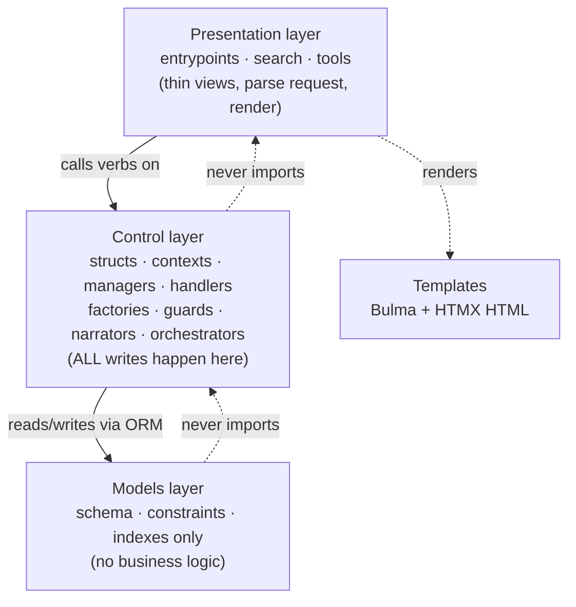

Three rules carry most of the weight:

- **Reads vs. writes are not symmetric.** A small read (≤2 tables) may live in a
  view. **Every write** — create, update, delete, link/unlink — must flow through
  the control layer. There is no "this write is small enough to do inline."
- **Models hold schema, never behavior.** Constraints, indexes, and audit columns
  only. Any rule about *when* or *how* something may change lives in the control
  layer. Intentional exceptions are tagged with a literal `# DELIBERATE
  ANTI-PATTERN` comment so they're greppable.
- **Endpoints are thin.** A view parses the request, calls one control-layer
  object, and returns a response. Page density and HTMX fragments are selected by
  a single `?format=` query parameter, never by parallel URLs.

### 2.2 The suffix vocabulary — read a filename, know the class

Class names end in a **fixed set of suffixes**. The suffix tells you the class's
role *before you open the file*. This is the project's navigational superpower.

| Suffix | Role — what it is responsible for |
| :--- | :--- |
| **Struct** | A **read model**: load one thing's rows, expose `to_dict()`. Never mutates. |
| **Context** | The **front door** for working with one entity by id. Loads a Struct, exposes domain verbs, delegates to managers. |
| **Factory** | Stateless **creation** of a root entity (no parent). |
| **Handler** | A **single complex step** or command. |
| **Manager** | A **stable sub-area** of a Context (e.g. "everything about meters"). |
| **Guard** (`*_guard.py`) | A gate: **Policy** (may this happen?), **Validator** (are inputs/invariants valid?), or **StateMachine** (is this transition legal?). |
| **Narrator** | Produces **human-facing text** — audit lines, event titles. |
| **Adaptor** | Maps raw HTTP/form payloads into **clean structured inputs**. |
| **Orchestrator** | Coordinates **multiple steps across boundaries** in one transaction. |

A typical new feature is built by walking this list top to bottom: a Struct to
read it, a Context to expose verbs, a Manager/Handler for behavior, a Guard to
protect it, a Narrator for its audit text, an Adaptor at the HTTP edge, and a
thin route to call it.

> **First thing to learn as a newcomer:** when you open any file, look at the
> class suffix. It is a contract. A `*Struct` will never write to the database; a
> `*Manager` will never render HTML; a `*_guard` only says yes/no.

---

## Part 3 — The core domain (the nouns)

Before the clever machinery, learn the handful of core entities. Everything else
hangs off these.

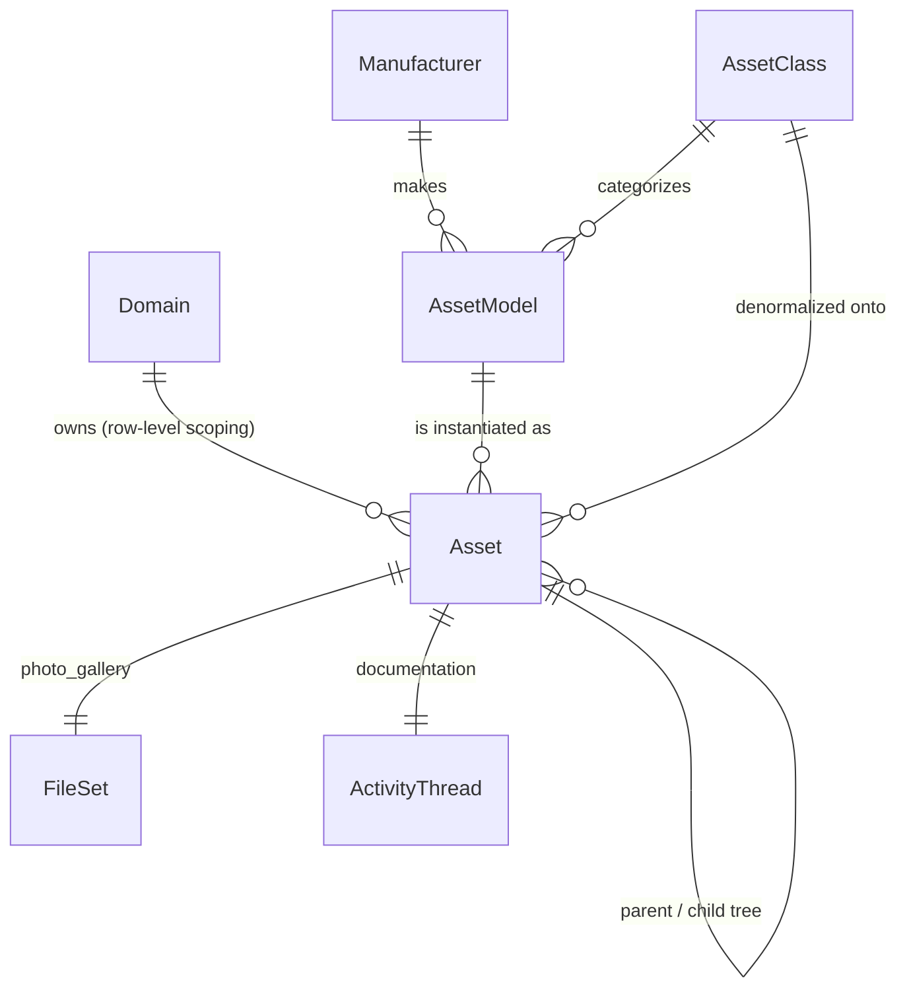

- **Domain** — an organizational unit. It is the backbone of **authorization**:
  users see rows in their domains. (Defined in the `administration` app.)
- **Manufacturer → AssetModel → Asset** is the central spine. A *Manufacturer*
  makes *AssetModels* (a "make/model"); each physical *Asset* is one instance of a
  model. (In the old Flask app these were `MakeModel` and `core`; they were
  renamed during the migration.)
- **AssetClass** — a broad category (e.g. "Vehicle"). It sits on the *model*, but
  is **denormalized down onto every Asset** for query speed and integrity — one of
  the few `# DELIBERATE ANTI-PATTERN` spots, kept in sync by
  `ModelAssetClassPropagationHandler`.
- **Asset hierarchy** — assets form a tree: every asset knows its `parent_asset`,
  its `root_asset`, and its `depth_from_root`. Managed by `AssetHierarchyManager`.
- **Meters** — four numeric readings per asset (`meter1`–`meter4`), with history
  rows; managed by `MeterManager`, recorded via `MeterHistory`.

Four larger capabilities are built **on top of** this core, each its own slice of
the control layer:

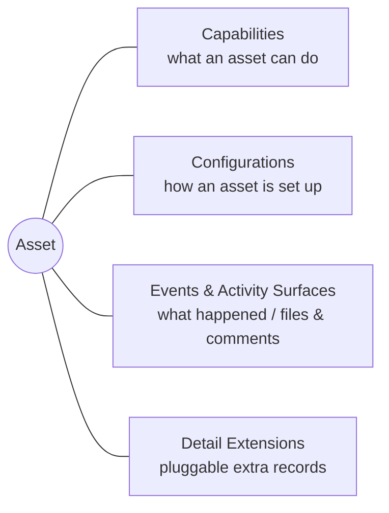

The rest of this document walks each of these four, plus the creation workflow
that ties them together.

---

## Part 4 — Workflow: creating an asset (the spine)

This is the single most important workflow to understand, because it is the
**seam** every other subsystem plugs into. It is coordinated by
`AssetCreationOrchestrator` (in `control_layer/orchestrators/`) — the literal
embodiment of the project's "explicit over magical" principle.

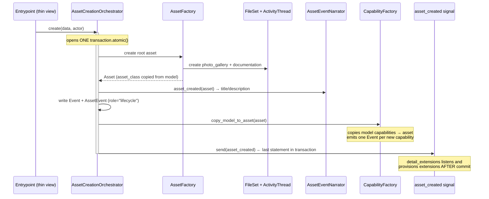

Key ideas a newcomer should take from this diagram:

1. **One transaction, named steps.** The orchestrator does not "discover" work to
   do; it *names* each step in order. If any step fails, the whole creation rolls
   back. Adding a new create-time side effect means editing this one method on
   purpose — a visible, greppable cost (decision **D1**).
2. **Threads are created first, never lazily.** Every asset is born with two
   *activity surfaces* (see Part 6): a `FileSet` photo gallery and an
   `ActivityThread` for documentation.
3. **The last line is a signal, not a method call.** This is the hinge of the
   whole extensions design — explained in Part 7.

> ⚠️ **Status note (see Part 9):** this orchestrator is **built and internally
> complete but not yet wired to a live view.** The asset web pages still render
> from `mock_data.py`. The brain is built; the buttons aren't connected to it
> yet.

---

## Part 5 — Capabilities (a copy-on-create cascade)

A **capability** is something an asset can do (e.g. "tow", "refrigerate"). They
are defined once and **cascade down three levels** at creation time, so each
level can be tuned without re-typing the ones above it.

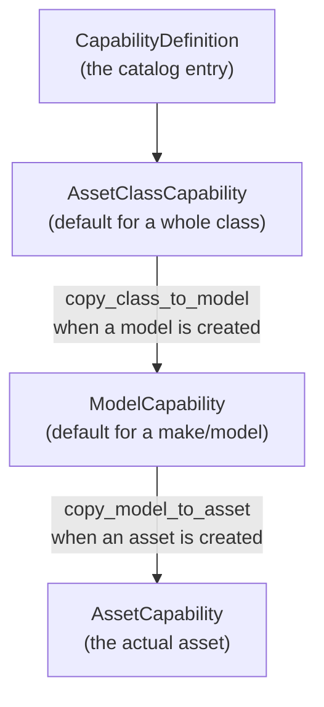

`CapabilityFactory` owns the two copy steps. Both are **idempotent** (re-running
never duplicates rows — guaranteed by unique constraints), and the asset-level
copy **emits an Event per new capability** so the asset's timeline records where
each capability came from. Assignment rules are gated by
`CapabilityAssignmentValidator`.

The point of the cascade: set "all Vehicles can be registered" once at the class
level, and every model and asset beneath inherits it automatically — but a
specific model or asset can still diverge.

---

## Part 6 — Events and Activity Surfaces (one table, three faces)

This is the most conceptually surprising part of the system, and worth slowing
down for. **One physical database table — `event` — backs three different
"surfaces,"** distinguished by a `thread_type` column and exposed through three
proxy classes:

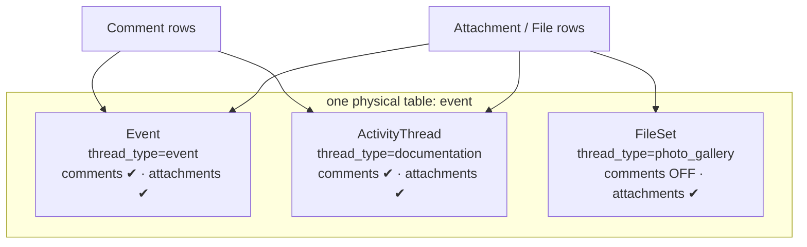

Why one table? Over 90% of rows are real events; splitting threads into their own
table would force a JOIN on every event read for three shared columns. So the
team accepted a **deliberate anti-pattern**: non-event rows store sentinel values
in the event-only fields. This is documented loudly in `event.py`.

The crucial design decision (**D3**) is **behavior is bound to the class, not to
flags passed by callers.** You never construct a thread by remembering to pass
`allow_comments=False`. Instead you choose the *class* — `FileSet` — and its
`save()` forces comments off. A miswired "commentable photo gallery" is now
**impossible to construct**. Each proxy also has its own manager
(`FamilyThreadManager`) that only ever sees its own `thread_type`, so the three
families never leak into each other.

How this connects to assets: every asset's `photo_gallery` is a `FileSet`, its
`documentation` is an `ActivityThread`, and its life story is a series of `Event`
rows linked through the `AssetEvent` join table (each link tagged with a `role`
like `lifecycle`, `capability`, or `configuration`). `AssetEventNarrator` writes
the human-readable title and description for each.

> Why a join table (`AssetEvent`) instead of an `asset_id` column on `event`?
> Decision **D6**: it leaves room for one event to span several assets (a shared
> maintenance action). A denormalized pointer is noted as a *future* performance
> option, not built yet.

---

## Part 7 — Detail Extensions (the framework, and the crown jewel)

This is the most architecturally ambitious piece, and the one a new designer is
most likely to extend. Read this section twice.

### 7.1 The problem it solves

Different assets need different extra records: a vehicle needs a *registration*
and *smog records*; a model needs *emissions* and *spec* info. The naive approach
hard-codes each of these into the asset code. That makes assets **depend on every
detail type** — the opposite of what you want. Adding a new detail type would mean
editing the core.

The goal (decisions **D4 → D7 → D8**): make each detail a **self-contained,
pluggable unit**, and make the assets app **completely ignorant** that extensions
even exist. You should be able to add a whole new detail type without touching a
single file in `app/assets/`.

### 7.2 The inverted dependency — the heart of it

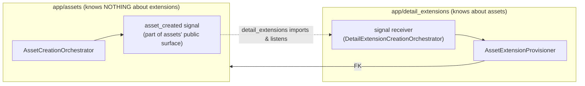

The dependency points **one way only**: `detail_extensions → assets`. Assets emits
a signal (announcing "I made an asset"); it does **not** know who, if anyone, is
listening. The extensions app listens and reacts. A signal is part of the
*emitter's* public surface ("things I announce"), so defining and sending it
creates **zero** dependency on extensions (decision **E3**).

You can verify the guarantee mechanically: `grep -r detail_extensions app/assets`
returns nothing. That's the whole point made testable.

### 7.3 Provisioning — eventual, idempotent, isolated

When is the extra paperwork actually created? **After** the asset commits, in a
**separate** transaction (decision **D8/E3**):

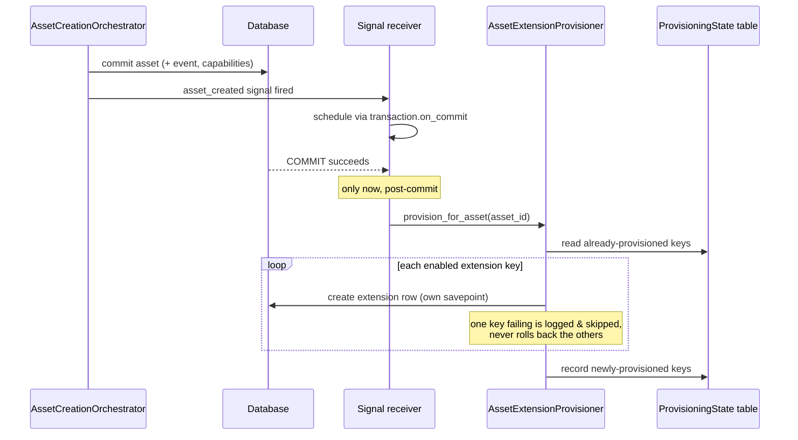

Three safety properties to understand:

- **Eventual, not atomic.** A broken extension must *never* prevent an asset from
  being created. The asset is valid standing alone; extensions catch up after.
- **Idempotent.** A small state table (`AssetExtensionProvisioningState`, one row
  per asset, holding a JSON list of provisioned keys) records what's done. Re-runs
  and backfills fill only the gaps. This state lives in `detail_extensions`, **not**
  on the asset table (decision **E7**) — completing the ignorance goal.
- **Per-key isolation.** Each extension provisions inside its own savepoint, so one
  misbehaving extension can't poison its siblings.

### 7.4 The four moving parts of the framework

To add or understand an extension, learn these four roles. They live centrally in
`detail_extensions/base/` and `registry.py`; each concrete extension (e.g.
`smog_record/`, `vehicle_registration/`) is a thin vertical slice.

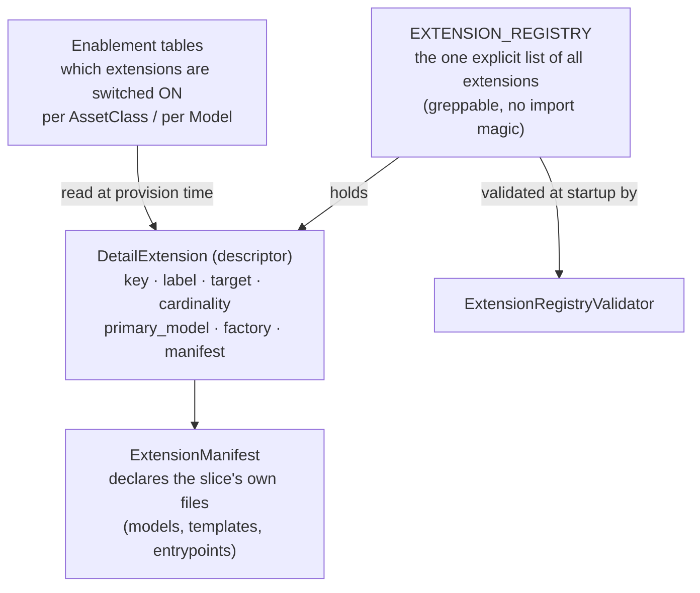

- **Descriptor (`DetailExtension`)** — a small declarative class per extension. It
  states the extension's `key`, what it attaches to (`target`: asset or model),
  whether an owner may have one row or many (`cardinality`: ONE_TO_ONE /
  ONE_TO_MANY), its primary table, and its factory. **Behavior is bound to this
  class, not passed by callers** — the same principle as the activity surfaces.
- **Manifest (`ExtensionManifest`)** — each extension lists its own files. This
  makes a slice self-describing and is the precondition for an extension to one day
  "graduate" into its own Django app (decision **E5**).
- **Registry** — a single hand-written Python list of descriptor classes. Discovery
  is **explicit**, not import-time auto-registration, so the full set is greppable
  (decision **D1/E2**). The registry is **distinct from enablement**: the registry
  is *code* ("which extensions exist"); enablement is *data* ("which apply where").
- **Enablement tables** — three tables of pure on/off switches:
  `DetailExtensionsByAssetClass`, `DetailExtensionsByModel`,
  `ModelDetailExtensionsByAssetClass`. Cardinality is **not** stored here — it lives
  on the descriptor (decision **D5**), so an extension can't be accidentally single
  in one place and repeating in another.

### 7.5 The route grammar (the per-extension URL contract)

The framework owns a single router (`extension_router.py`) that derives every
extension's URLs from its descriptor. The owner-type segment (`asset` vs `model`,
`assets` vs `models`) is **derived from the descriptor's `target`** — an extension
never hardcodes it. The grammar (decision **E6**):

```
/detail_extensions/configuration/                          assignment landing
/detail_extensions/configuration/<extension-key>/          assign to classes/models
/detail_extensions/<extension-key>/                        summary / index      [body deferred]
/detail_extensions/<extension-key>/<assets|models>/        search               [body deferred]
/detail_extensions/<extension-key>/<asset|model>/<id>/     owner detail         [body deferred]
/detail_extensions/<extension-key>/<asset|model>/<id>/<row-id>/  single row     [body deferred]
/detail_extensions/<asset|model>/<id>/?format=htmx-panel   aggregate 360 panel  [contract]
```

The router validates the key, checks that the owner-type segment matches the
descriptor's target, checks enablement, then **dispatches to the extension's own
entrypoint module if it declared one, or to a shared placeholder template if not.**
The *config UI* (assigning extensions to classes/models) is **fully built**; each
extension's *page body* is intentionally a placeholder for now.

### 7.6 The 360 panel — how assets shows extensions without importing them

The asset detail page never imports an extension. It HTMX-includes a panel by URL
(`/detail_extensions/<asset_id>/?format=htmx-panel`). The
`AssetExtensionsStruct` walks the registry, gathers every asset-target
extension's rows into one `{key: [rows]}` map, and the panel renders a card per
extension. **Add a new extension → a new card appears, with no edit to assets.**

---

## Part 8 — How a request flows end to end (putting it together)

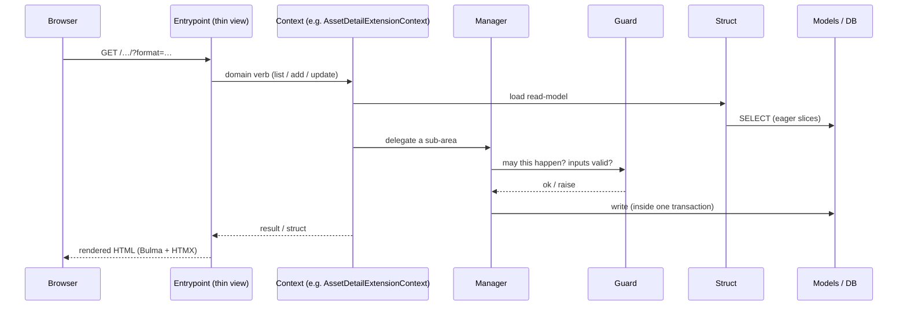

The shape is always the same: **view → context → (struct to read · manager+guard
to write) → models**. If you remember only one picture, remember this one.

---

## Part 9 — Status review: does the build match the architecture?

Overall: **yes, strongly.** The control layer is a faithful, disciplined
realization of the stated architecture. The suffix vocabulary is used correctly
and consistently; writes are confined to the control layer; the dependency
inversion between assets and extensions actually holds; and the decision log
(`D1`–`D8`, `E1`–`E8`) maps cleanly onto the code that exists. This is unusually
coherent for in-progress work.

A few things a newcomer (and the owner) should know before extending it:

| # | Finding | Why it matters | Suggested action |
| :-- | :--- | :--- | :--- |
| 1 | **Presentation layer for assets is still mock.** The asset list/detail/create views render from `mock_data.py` and don't persist. The orchestrator, factory, capability cascade, and extension provisioning are **built but unwired** — no live view calls `AssetCreationOrchestrator` yet. | The "brain" is complete but the "buttons" aren't connected. A newcomer reading the views first would wrongly conclude nothing works. | A clear next phase: wire entrypoints → adaptors → orchestrator, retire `mock_data.py`. |
| 2 | **`AssetHandler` is dead code.** `control_layer/handlers/asset_handler.py` is superseded by `AssetFactory` (its own docstring says so) and is imported nowhere. | Two creation paths invites drift; a newcomer may copy the wrong one. | Delete `asset_handler.py`. |
| 3 | **Router enablement check is loose, with one real bug.** In `extension_router._is_enabled_for_owner`, the asset-target branch filters `DetailExtensionsByModel` by `model_id=owner_id` where `owner_id` is an **asset** id, not a model id. The comments already admit the check is a "practical proxy." | A 1:1 asset extension could 404 (or pass) incorrectly at the owner-detail slot. | Resolve the owner's actual `asset_class_id` / `model_id` and reuse the provisioner's enablement logic (see Part 10, object #6). |
| 4 | **Enablement resolution is duplicated.** `AssetExtensionProvisioner._enabled_keys` and the router both compute "which extensions apply to this owner," differently. | Two sources of truth for the same question. | Extract one shared resolver (Part 10, #6). |
| 5 | **Heavy Asset/Model symmetry is hand-duplicated.** Two structs, two managers, two provisioners, two contexts, two enablement-by-class tables — asset-flavored and model-flavored — are near-mirror images. | More surface to keep in sync; a change must be made twice. | Consider an owner-parameterized base (Part 10, #7). Acceptable as-is, but worth a conscious decision. |

None of these are architectural violations — they're the normal rough edges of a
build that prioritized getting the control layer right first.

---

## Part 10 — Opportunities for new domain objects

The owner specifically asked about **structs that cluster related rows together
for a context**. The system has exactly one rich example today
(`AssetExtensionsStruct`, which unions heterogeneous extension rows). Here are the
highest-value structs and helpers that don't exist yet. Each would replace
ad-hoc multi-query assembly in a future view with one named, testable read model.

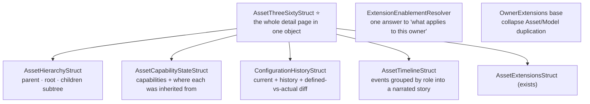

1. **`AssetThreeSixtyStruct` (highest value).** The asset detail page needs the
   base asset *plus* its capabilities, current configuration, recent events, meter
   readings, and children. Today that's many separate reads scattered across a
   view. A single 360 struct — composing the smaller structs below — would give the
   detail page one read model and one obvious place to optimize queries. This is
   the natural companion to the still-to-be-built real asset detail view (Finding
   #1).

2. **`AssetTimelineStruct`.** Cluster an asset's `AssetEvent` + `Event` rows,
   grouped by `role` (lifecycle / capability / configuration), into a chronological,
   already-narrated story. The narration logic exists (`AssetEventNarrator`); what's
   missing is a read model that gathers and orders it for the page.

3. **`AssetCapabilityStateStruct`.** The cascade (class → model → asset) is created
   correctly, but nothing reads it back as a *picture*: which capabilities does this
   asset have, and at which level was each one set or overridden? A struct that joins
   the three capability tables for one asset answers the most natural support
   question ("why does this truck have/lack capability X?").

4. **`ConfigurationHistoryStruct`.** Configurations already allow many-per-asset
   with "latest wins." A struct that returns the current config, the prior history,
   and the **defined-vs-actual modification diff** would turn several manager queries
   into one read model — and is a precondition for a usable configuration screen.

5. **`AssetHierarchyStruct`.** `AssetHierarchyManager` can *change* the tree, but
   there is no read model that returns an asset's subtree (root, ancestors,
   children, depth) for rendering. A small struct here unblocks any tree/breadcrumb
   UI.

6. **`ExtensionEnablementResolver` (a guard/struct, fixes Findings #3 & #4).** One
   object that answers "given this owner, which extension keys apply?" — used by
   *both* the provisioner and the router. This removes the duplicated logic and the
   asset-id-vs-model-id bug in one move. Small, high-leverage.

7. **An owner-parameterized extensions base (addresses Finding #5).** The
   asset-vs-model split currently doubles four classes. Because the descriptor
   already abstracts `target` and `owner_field`, a single generic
   `OwnerExtensionsStruct` / `OwnerExtensionsManager` parameterized by target could
   collapse the mirror pairs. This is a judgment call — the duplication is currently
   *legible*, so weigh clarity against the cost of keeping two copies in sync.

**Priority for a newcomer's first contribution:** #6 (small, fixes a real bug,
teaches the enablement model) then #1+#2 (high visible value, teaches the whole
read path). Save #7 for after you've felt the duplication firsthand.

---

## Part 11 — Glossary (the words that recur)

- **Domain** — an org unit; the unit of row-level authorization.
- **Asset / AssetModel / AssetClass / Manufacturer** — the core spine: a physical
  thing, its make/model, its broad category, its maker.
- **Activity surface** — one of `Event`, `ActivityThread`, `FileSet`; three faces
  of the single `event` table.
- **Capability** — something an asset can do; cascades class → model → asset.
- **Configuration** — how an asset is set up; assigned from a `ConfigurationTemplate`.
- **Extension (detail extension)** — a pluggable extra record type attached to an
  asset or model, unknown to the assets app.
- **Descriptor / Manifest / Registry / Enablement** — the four parts of the
  extension framework: what an extension is / its files / the list of all of them /
  which are switched on where.
- **Provisioning** — creating an owner's enabled extension rows, post-commit and
  idempotently.
- **Orchestrator** — the explicit, single-transaction create-time coordinator.
- **`# DELIBERATE ANTI-PATTERN`** — a greppable tag marking an intentional rule
  break (denormalized `asset_class`, the single `event` table).

---

## Part 12 — If you're new, read in this order

1. This document, Parts 2–3 (architecture + core nouns).
2. `docs/Architecture.md` and `docs/Architecture/patterns/oop_control_patterns.md` — the
   suffix vocabulary, authoritative.
3. `app/assets/control_layer/orchestrators/asset_creation_orchestrator.py` — the
   spine workflow, then follow its calls outward.
4. `app/events/models/event.py` — the one-table-three-surfaces pattern.
5. `asset_control_layer_starter_kit/decisions.md` and
   `extensions_migration_kit/decisions.md` — **why** the system is shaped this way;
   every non-obvious choice is justified there (`D1`–`D8`, `E1`–`E8`).
6. `app/detail_extensions/` — start at `registry.py`, then `base/`, then one
   concrete slice (`smog_record/`), then the provisioner and router.

The decisions logs are the real treasure. When something in the code looks
strange, there is almost always a `D#`/`E#` entry explaining the trade-off that
produced it. Read the reasoning before you "fix" the surprise.
