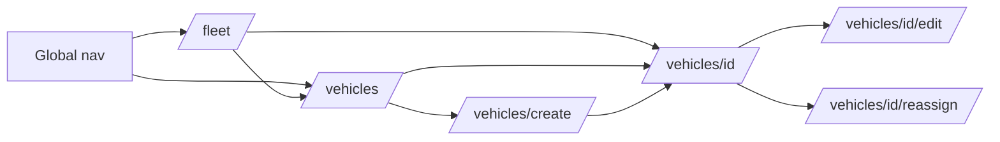

# How to Map Navigation

**Role & Objective:**
You are acting as an Information Architect. Produce `navigation_map.md` — the edge list of the application. The route skeleton gives you nodes; this document gives you *edges*, and proves there are no orphans.

**This is a hard gate.** The front-end kit is not finished until every route is reachable, or the developer explicitly waives a specific orphan in writing.

---

## Why this exists

A flat page list always looks complete. It is the single most reliable way to ship an application with a screen nobody can get to. A page inventory cannot tell you that the "Reassign Vehicle" portal has no link pointing at it — only an edge list can.

The failure is asymmetric: an orphan route costs almost nothing to find here, and is expensive and embarrassing to find after the templates are written.

---

## Instructions

1. **Declare the named entry points first.** These are the roots of the graph — the places a user arrives without following an in-app link:

   | Entry point | Meaning |
   | :--- | :--- |
   | Global navigation | Persistent nav bar / sidebar items |
   | Landing route | Where a user lands after login |
   | External deep link | Emailed or bookmarked URLs, notification targets |

   A route reachable *only* by typing a URL is an orphan. Say so.

2. **Build the edge list.** Every edge is `source route → target route`, plus the **trigger** (the link, button, or row click that carries the user) and the **condition** if the edge only exists for some roles or some record states.

3. **Compute inbound counts.** For each route in `route_skeleton.md`, count inbound edges. Zero inbound edges and not a declared entry point = **orphan**.

4. **Check the return path.** Every route a user can enter should have an obvious way back — breadcrumb, cancel, or a parent link. A route with inbound edges and no outbound edges is a dead end; flag it. Dead ends are sometimes correct (a terminal confirmation), but they must be deliberate.

5. **Draw the graph.** A Mermaid `graph LR` covering all routes. Group by cluster (entity or portal) with `subgraph`. Keep the edge labels short; the table carries the detail.

6. **Check role-conditional reachability.** A route reachable only by an Admin, whose only inbound link sits on a page Admins never visit, is an orphan *for the role that needs it*. Cross-reference `functionality_and_roles.md`: for each role, is every route that role needs reachable by that role?

---

## Gate report

End the document with an explicit verdict. Do not bury it.

```markdown
## Gate: navigation reachability

**Status:** FAIL — 2 orphans

| Route | Issue |
| :--- | :--- |
| `/vehicles/<id>/reassign` | No inbound edge. Expected from vehicle detail. |
| `/reports/utilization` | Reachable only by direct URL; not in global nav. |

**Dead ends (advisory):** `/vehicles/<id>/archive-confirm` — terminal by design, confirmed.
```

If the status is FAIL, say so at the top of the kit README too, and do not proceed to the Flask stager.

---

## Example Scenario: Asset Management Application



| From | To | Trigger | Condition |
| :--- | :--- | :--- | :--- |
| `/fleet` | `/vehicles` | "View all vehicles" button | — |
| `/vehicles` | `/vehicles/<id>` | Row click | — |
| `/vehicles/<id>` | `/vehicles/<id>/reassign` | "Reassign" action button | Fleet Manager only; vehicle not archived |

---

## Required Output Format

A single markdown document, `navigation_map.md`, containing:

1. **Named entry points** — table.
2. **Navigation graph** — Mermaid.
3. **Edge list** — table of from / to / trigger / condition.
4. **Inbound count per route** — table, orphans marked.
5. **Per-role reachability check** — one short paragraph or table per role.
6. **Gate verdict** — PASS or FAIL with the specific failures listed.
